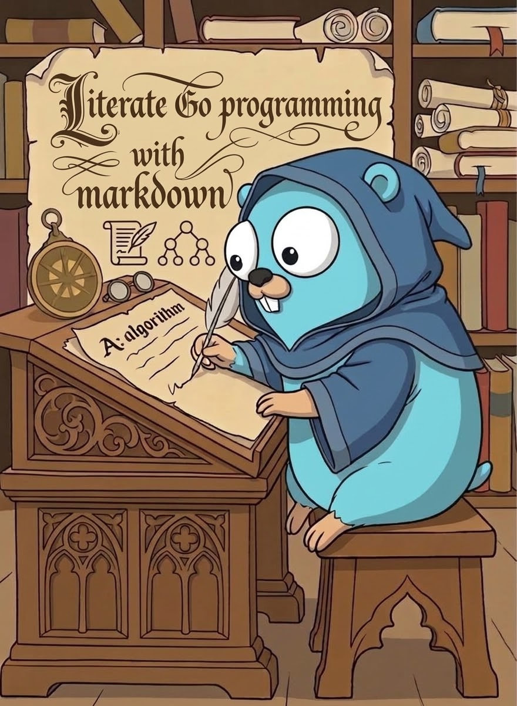

# litgo

Literate programming for Go. Write a program as Markdown; litgo tangles it to
source, weaves it to a page, and runs it with every compiler error pointing at
the Markdown.

litgo is written in itself: [litgo.lit.md](litgo.lit.md) is the whole program
and its documentation. Every other file here is generated from it.



## Install

```sh
go install github.com/tlehman/litgo@latest
```

## Use

```sh
litgo run    prog.lit.md   # tangle, compile, run
litgo check  prog.lit.md   # type-check without writing anything
litgo tangle prog.lit.md   # write prog.go
litgo weave  prog.lit.md   # write prog.pdf (needs pandoc and typst)
```

The PDF's Mermaid diagrams are drawn by mermaid.js if `mmdc` is installed
(`npm install -g @mermaid-js/mermaid-cli`), and as box-character text if not.

Start from [examples/worker_pool.lit.md](examples/worker_pool.lit.md).

## Neovim

Renders LaTeX and Mermaid in the buffer, lines up the columns of Markdown
tables, shows type errors under the code as you type (`litgo lsp`), and adds
`:TangleCompileAndRun`, `:Untangle`, `:RenameChunk`, `:Tangle`, `:Weave`.

With [gopls](https://go.dev/gopls/) installed (on `$PATH`, in `$GOPATH/bin`, or
by Mason), a Go block is a Go buffer: completion, hover, go to definition,
references, rename and signature help work across blocks and chunks, because
`litgo lsp` asks gopls about the tangled program and translates the answers
back to the Markdown. On a chunk reference the same keys navigate, preview and
rename the chunk.

```lua
{
  "tlehman/litgo",
  build = "go build -o bin/litgo .",
  event = { "BufReadPre *.lit.md", "BufNewFile *.lit.md" },
  opts = {},
}
```

When a run finishes, the output panel takes the cursor so that `q` closes it
and hands the window back; a run that ends at an error puts the cursor on the
error instead (`run.focus`, `run.jump`).

nvim-cmp and blink.cmp pick the server up by themselves. Without one of those,
the plugin turns Neovim's own completion popup on (`lsp.completion`: `"auto"`
by default, or `true`/`false` to decide it yourself).

A completion plugin offers the same sources everywhere in the buffer, so in a
Go block you also get Markdown snippets and words from the prose.
`require("litgo").in_go_block()` says whether the cursor is in a Go block,
which is all blink.cmp needs to leave them out:

```lua
sources = {
  default = function()
    if require("litgo").in_go_block() then
      return { "lsp", "path" }
    end
    return { "lsp", "path", "snippets", "buffer" }
  end,
}
```

## Hack

Edit `litgo.lit.md`, never the generated files.

```sh
go build -o bin/litgo .      # bootstrap from the committed sources
bin/litgo run litgo.lit.md   # tangle, vet, test, rebuild bin/litgo
```
