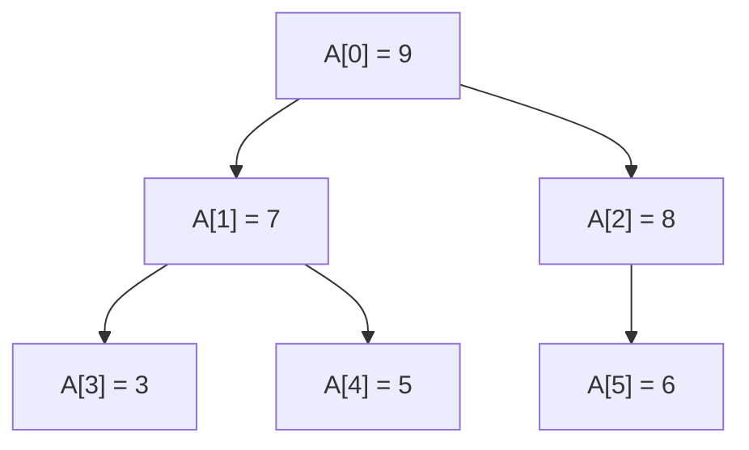

<!-- tangler: go -->
<!-- package: main -->
<!-- imports: fmt -->

# A tree in an array, and a queue in a circle

Two data structures that are nothing but integers and a slice, which is what
makes them good first subjects for a proof: a binary heap, which is a tree
with no pointers in it, and a ring buffer, which is a queue with no end.

Everything here is proved by `litgo prove`, in the notation of
[VeGo](https://arxiv.org/abs/2608.22630). What "proved" means for a data
structure comes in three kinds, and each shows up below:

* **The shape is right.** The arithmetic that finds a parent or a child really
  does describe a tree: children know their parent, nobody is their own
  ancestor, no index falls off the slice.
* **The invariant means something.** From "every node is at most its parent",
  which is a local fact, it follows that the root is the maximum, which is a
  global one. That step is an induction, and a loop is how an induction is
  written.
* **The operations keep the invariant.** Whatever state a ring buffer is in,
  if it was a valid one before `Push`, it is a valid one after.



## The shape of the tree

The tree is in the numbering. Node $i$ has its children at $2i+1$ and $2i+2$,
and so its parent at $\lfloor (i-1)/2 \rfloor$. Three one-line functions, and
their contracts say that they fit together.

```go
//@ Requires i >= 0
func Left(i int) (c int) { return 2*i + 1 }
//@ Ensures Parent(c) = i ^ c > i

//@ Requires i >= 0
func Right(i int) (c int) { return 2*i + 2 }
//@ Ensures Parent(c) = i ^ c = Left(i) + 1

//@ Requires i > 0
func Parent(i int) (p int) { return (i - 1) / 2 }
//@ Ensures 0 <= p < i
//@ Ensures i = Left(p) v i = Right(p)
```

`Parent(Left(i)) = i` needs the verifier to know that $2i/2 = i$ and that
$(2i+1)/2 = i$ too, which is what rounding down means. A function that is one
`return` of one expression can be used inside a formula, where it stands for
that expression, so the contracts can talk about each other.

`0 <= p < i` is the important one. It says a parent's number is smaller than
its child's. So walking upwards always makes progress, there are no cycles,
and every walk ends at node 0. That is what makes this numbering a *tree*.

## The heap property

A max-heap is a tree in which no node is larger than its parent. As a
predicate over the whole slice:

```go
//@ Predicate Heap(A) ::= Forall k in [1, |A|) : A[Parent(k)] >= A[k]
```

Checking it is a loop over the nodes that have a parent. The contract is an
*if and only if*: `true` means it is a heap, and `false` means it is not, which
is the half people forget to promise.

```go
func IsHeap(A []int) (ok bool) {
	//@ Invariant 1 <= i
	//@ Invariant Forall k in [1, i) : k < |A| -> A[Parent(k)] >= A[k]
	//@ Variant |A| - i
	for i := 1; i < len(A); i++ {
		if A[Parent(i)] < A[i] {
			return false
		}
	}
	return true
}
//@ Ensures ok <-> Heap(A)
```

Nobody wrote that `A[Parent(i)]` is inside the slice. The verifier works it
out from `1 <= i < len(A)` and the meaning of division, or refuses the
function.

## From local to global: the root is the maximum

The heap property only compares a node with its parent. That the root beats
*every* node follows by climbing: if $A[j] \ge A[i]$ and $j$ is not the root,
then $A[\mathrm{Parent}(j)] \ge A[j] \ge A[i]$, and the parent is closer to
the root.

```go
//@ Requires Heap(A) ^ 0 <= i < |A|
func Depth(A []int, i int) (d int) {
	j := i
	//@ Invariant 0 <= j <= i ^ A[j] >= A[i] ^ d >= 0
	//@ Variant j
	for j > 0 {
		j = Parent(j)
		d++
	}
	return d
}
//@ Ensures d >= 0 ^ A[0] >= A[i]
```

The function counts how deep node `i` is. Its proof is the interesting part:
the invariant carries `A[j] >= A[i]` up the tree, and when the loop ends `j`
is 0. The `Variant` is `j` itself, which shrinks because `Parent(j) < j`. So
the same contract proves that the climb is correct and that it ends.

That was one node. For all of them at once, the induction goes over the
numbering instead of up a path: if the root beats every node below `k`, it
beats `Parent(k)`, which beats `k`.

```go
//@ Requires Heap(A) ^ |A| > 0
func Max(A []int) (m int) {
	//@ Invariant 1 <= k <= |A| ^ A[0:k) <= A[0]
	//@ Variant |A| - k
	for k := 1; k < len(A); k++ {
		//@ Assert A[Parent(k)] <= A[0]
	}
	return A[0]
}
//@ Ensures A[:] <= m ^ m in A[:]
```

This loop does nothing. (The `Assert` is the step of the induction, written
out for the reader. The prover finds it without being told.) The loop is there
because it is the proof: VeGo has no ghost
code, so an induction has to be a loop that could run, and this one runs. It
costs a pass over the slice to return `A[0]`, which a real heap would not pay,
and the honest way to use it is as a lemma, once, in a test. It is worth
seeing anyway, because it shows what a loop invariant *is*: the induction
hypothesis, with the loop as the induction.

## One step of sifting down

Repairing a heap means swapping a node with its larger child. Choosing that
child is where the off-by-one errors live, because a node can have two
children, one, or none.

```go
//@ Requires i >= 0 ^ Left(i) < |A|
func LargerChild(A []int, i int) (c int) {
	c = Left(i)
	if Right(i) < len(A) && A[Right(i)] > A[c] {
		c = Right(i)
	}
	return c
}
//@ Ensures (c = Left(i) v c = Right(i)) ^ c < |A| ^ Parent(c) = i
//@ Ensures A[c] >= A[Left(i)] ^ (Right(i) < |A| -> A[c] >= A[Right(i)])
```

Go stops evaluating `&&` at the first `false`, and the verifier knows it, so
`A[Right(i)]` is only obliged to be in range when `Right(i) < len(A)` has just
been checked. Swap the two halves of that condition and the proof fails at the
index.

The swap itself is `A[i], A[c] = A[c], A[i]`, and that is where this verifier
stops: it does not follow writes into a slice, because another slice may share
the array. So `main` below does the swapping, unproved, with the proved
function telling it where.

## A queue in a circle

A ring buffer is three integers and a slice: where the oldest element is, how
many there are, and how much room. Its invariant is what makes those three
numbers a queue.

```go
//@ Predicate Ring(head, size, room) ::= room > 0 ^ 0 <= head < room ^ 0 <= size <= room
```

Every operation has the same contract in outline: *given a valid ring, here is
a slot inside the buffer, and a valid ring again*. The parameters cannot
change, being integers passed by value, so the new state comes back as
results.

```go
//@ Requires Ring(head, size, room) ^ size < room
func Push(head, size, room int) (slot, h, s int) {
	return (head + size) % room, head, size + 1
}
//@ Ensures 0 <= slot < room ^ Ring(h, s, room) ^ s = size + 1

//@ Requires Ring(head, size, room) ^ size > 0
func Pop(head, size, room int) (slot, h, s int) {
	return head, (head + 1) % room, size - 1
}
//@ Ensures 0 <= slot < room ^ Ring(h, s, room) ^ s = size - 1
```

`size < room` and `size > 0` are the two ways to misuse a queue, and they are
now the caller's problem, in writing. A caller that is itself verified has to
prove them:

```go
//@ Requires Ring(head, size, room) ^ size < room
func PushThenPop(head, size, room int) (h, s int) {
	_, h, s = Push(head, size, room)
	_, h, s = Pop(h, s, room)
	return h, s
}
//@ Ensures Ring(h, s, room) ^ s = size
```

`Pop` is legal there because `Push` promised `s = size + 1`, which is more
than zero. Take that out of `Push`'s contract and this function stops
verifying, though `Push` itself still does: a contract is everything a caller
gets to know.

## Running it

```go
func main() {
	A := []int{9, 7, 8, 3, 5, 6}
	fmt.Println("IsHeap:", IsHeap(A), " Max:", Max(A), " Depth of node 5:", Depth(A, 5))

	// Replace the root and sift it down, one proved step at a time.
	A[0] = 1
	for i := 0; Left(i) < len(A); {
		c := LargerChild(A, i)
		if A[i] >= A[c] {
			break
		}
		A[i], A[c] = A[c], A[i]
		i = c
	}
	fmt.Println("after sifting 1 down:", A, " IsHeap:", IsHeap(A))

	buf := make([]int, 3)
	head, size := 0, 0
	for _, x := range []int{10, 20, 30} {
		var slot int
		slot, head, size = Push(head, size, len(buf))
		buf[slot] = x
	}
	var slot int
	slot, head, size = Pop(head, size, len(buf))
	fmt.Println("popped", buf[slot])
	slot, head, size = Push(head, size, len(buf))
	buf[slot] = 40
	fmt.Println("buffer:", buf, " head:", head, " size:", size)
}
```

## Things to break

* In `Parent`, return `i / 2`. `Left` still verifies. `Right` does not, nor
  does `Parent` itself, nor `LargerChild`: the tree has lost its right
  children, and everything that relied on them says so.
* In `Depth`, climb with `j = j - 1`. It still ends, and the invariant is not
  maintained, because the node before `j` is no relation of it.
* In `LargerChild`, test `A[Right(i)] > A[c]` first. The index is no longer
  known to be in range.
* In `Push`, drop the `% room`. The slot escapes the buffer.
