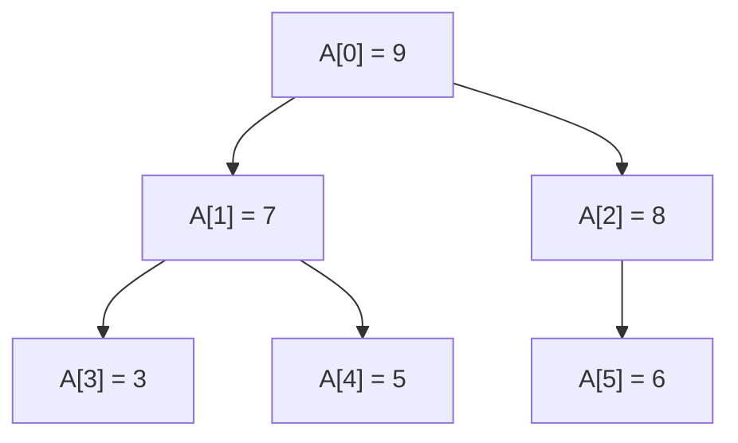

<!-- tangler: go -->
<!-- package: main -->
<!-- imports: fmt -->

# A tree in an array, and a queue in a circle

A binary heap is a tree with no pointers in it. A ring buffer is a queue with
no end. Both are nothing but integers and a slice, which makes them perfect
first subjects for a proof.

Everything here is proved by `litgo prove`, in the notation of
[VeGo](https://arxiv.org/abs/2608.22630). For a data structure, "proved" comes
in three flavors, and you'll meet all of them below:

* **The shape is right.** The arithmetic that finds a parent or a child really
  does describe a tree. Children know their parent, nobody is their own
  ancestor, and no index falls off the end of the slice.
* **The invariant means something.** "Every node is at most its parent" is a
  local fact. "The root is the maximum" is a global one. Getting from one to
  the other is an induction, and in code, an induction is a loop.
* **The operations keep the invariant.** If a ring buffer was valid before
  `Push`, it is valid after. Whatever state it was in.



## The shape of the tree

There are no pointers. The tree lives in the numbering. Node $i$ has its
children at $2i+1$ and $2i+2$, so its parent is at $\lfloor (i-1)/2 \rfloor$.
That's three one-line functions, and their contracts say they fit together.

```go
//@ Requires i >= 0
func Left(i int) (c int) { return 2*i + 1 }
//@ Ensures Parent(c) = i ^ c > i

//@ Requires i >= 0
func Right(i int) (c int) { return 2*i + 2 }
//@ Ensures Parent(c) = i ^ c = Left(i) + 1

//@ Requires i > 0
func Parent(i int) (p int) { return (i - 1) / 2 }
//@ Ensures 0 <= p < i
//@ Ensures i = Left(p) v i = Right(p)
```

For `Parent(Left(i)) = i`, the verifier has to know that $2i/2 = i$ and also
that $(2i+1)/2 = i$ (that's what rounding down means). A function whose whole
body is one `return` of one expression can be used inside a formula, where it
stands for that expression. That's how the contracts get to talk about each
other.

`0 <= p < i` is the one that matters. A parent's number is smaller than its
child's. So every step upward makes progress, there are no cycles, and every
walk ends at node 0. That is what makes this numbering a *tree*.

## The heap property

A max-heap is a tree where no node is larger than its parent. Here it is as a
predicate over the whole slice:

```go
//@ Predicate Heap(A) ::= Forall k in [1, |A|) : A[Parent(k)] >= A[k]
```

Checking it is a loop over every node that has a parent. The contract is an
*if and only if*. `true` means it's a heap, and `false` means it isn't, which
is the half people forget to promise.

```go
func IsHeap(A []int) (ok bool) {
	//@ Invariant 1 <= i
	//@ Invariant Forall k in [1, i) : k < |A| -> A[Parent(k)] >= A[k]
	//@ Variant |A| - i
	for i := 1; i < len(A); i++ {
		if A[Parent(i)] < A[i] {
			return false
		}
	}
	return true
}
//@ Ensures ok <-> Heap(A)
```

Notice what nobody wrote: that `A[Parent(i)]` is inside the slice. The
verifier works that out from `1 <= i < len(A)` and the meaning of division. Or
it refuses the function.

## From local to global: the root is the maximum

The heap property only ever compares a node with its parent. So how do we know
the root beats *every* node? By climbing. If $A[j] \ge A[i]$ and $j$ is not
the root, then $A[\mathrm{Parent}(j)] \ge A[j] \ge A[i]$, and the parent is one
step closer to the top.

```go
//@ Requires Heap(A) ^ 0 <= i < |A|
func Depth(A []int, i int) (d int) {
	j := i
	//@ Invariant 0 <= j <= i ^ A[j] >= A[i] ^ d >= 0
	//@ Variant j
	for j > 0 {
		j = Parent(j)
		d++
	}
	return d
}
//@ Ensures d >= 0 ^ A[0] >= A[i]
```

The function counts how deep node `i` is, but the proof is the interesting
part. The invariant carries `A[j] >= A[i]` up the tree like a torch, and when
the loop ends, `j` is 0. The `Variant` is `j` itself, which shrinks because
`Parent(j) < j`. One contract proves the climb is correct *and* that it ends.

That was one node. For all of them at once, the induction runs over the
numbering instead of up a path. If the root beats every node below `k`, it
beats `Parent(k)`, which beats `k`.

```go
//@ Requires Heap(A) ^ |A| > 0
func Max(A []int) (m int) {
	//@ Invariant 1 <= k <= |A| ^ A[0:k) <= A[0]
	//@ Variant |A| - k
	for k := 1; k < len(A); k++ {
		//@ Assert A[Parent(k)] <= A[0]
	}
	return A[0]
}
//@ Ensures A[:] <= m ^ m in A[:]
```

This loop does nothing. (The `Assert` is the step of the induction, written
out for you. The prover finds it without being told.) The loop is there
because the loop *is* the proof. VeGo has no
ghost code (code that exists only for the proof and never runs), so an
induction has to be a loop that could run, and this one runs. It costs a whole
pass over the slice to return `A[0]`, which no real heap would pay, so the
honest way to use it is as a lemma, once, in a test. It's worth seeing anyway,
because it shows what a loop invariant *is*: the induction hypothesis, with the
loop as the induction.

## One step of sifting down

You repair a heap by swapping a node with its larger child. Picking that child
is where the off-by-one errors live, because a node can have two children, or
one, or none.

```go
//@ Requires i >= 0 ^ Left(i) < |A|
func LargerChild(A []int, i int) (c int) {
	c = Left(i)
	if Right(i) < len(A) && A[Right(i)] > A[c] {
		c = Right(i)
	}
	return c
}
//@ Ensures (c = Left(i) v c = Right(i)) ^ c < |A| ^ Parent(c) = i
//@ Ensures A[c] >= A[Left(i)] ^ (Right(i) < |A| -> A[c] >= A[Right(i)])
```

Go stops evaluating `&&` at the first `false`, and the verifier knows it. So
`A[Right(i)]` only has to be in range once `Right(i) < len(A)` has just been
checked. Swap the two halves of that condition and the proof fails, right at
the index.

The swap itself is `A[i], A[c] = A[c], A[i]`, and that's where this verifier
stops. It doesn't follow writes into a slice, because another slice may share
the same array. So `main` below does the swapping, unproved, with the proved
function telling it where.

## A queue in a circle

A ring buffer is three integers and a slice: where the oldest element sits, how
many elements there are, and how much room there is. The invariant is what
turns those three numbers into a queue.

```go
//@ Predicate Ring(head, size, room) ::= room > 0 ^ 0 <= head < room ^ 0 <= size <= room
```

Every operation has the same contract, in outline: *give me a valid ring, and
I'll give you a slot inside the buffer and a valid ring back*. The parameters
are integers passed by value, so they can't change, and the new state comes
back as results.

```go
//@ Requires Ring(head, size, room) ^ size < room
func Push(head, size, room int) (slot, h, s int) {
	return (head + size) % room, head, size + 1
}
//@ Ensures 0 <= slot < room ^ Ring(h, s, room) ^ s = size + 1

//@ Requires Ring(head, size, room) ^ size > 0
func Pop(head, size, room int) (slot, h, s int) {
	return head, (head + 1) % room, size - 1
}
//@ Ensures 0 <= slot < room ^ Ring(h, s, room) ^ s = size - 1
```

`size < room` and `size > 0` are the two ways to misuse a queue (push onto a
full one, pop from an empty one). Now they are the caller's problem, in
writing. A caller that is verified too has to prove them:

```go
//@ Requires Ring(head, size, room) ^ size < room
func PushThenPop(head, size, room int) (h, s int) {
	_, h, s = Push(head, size, room)
	_, h, s = Pop(h, s, room)
	return h, s
}
//@ Ensures Ring(h, s, room) ^ s = size
```

`Pop` is legal there because `Push` promised `s = size + 1`, which is more
than zero. Delete that promise from `Push`'s contract and this function stops
verifying, even though `Push` itself still does. A contract is everything a
caller gets to know.

## Running it

```go
func main() {
	A := []int{9, 7, 8, 3, 5, 6}
	fmt.Println("IsHeap:", IsHeap(A), " Max:", Max(A), " Depth of node 5:", Depth(A, 5))

	// Replace the root and sift it down, one proved step at a time.
	A[0] = 1
	for i := 0; Left(i) < len(A); {
		c := LargerChild(A, i)
		if A[i] >= A[c] {
			break
		}
		A[i], A[c] = A[c], A[i]
		i = c
	}
	fmt.Println("after sifting 1 down:", A, " IsHeap:", IsHeap(A))

	buf := make([]int, 3)
	head, size := 0, 0
	for _, x := range []int{10, 20, 30} {
		var slot int
		slot, head, size = Push(head, size, len(buf))
		buf[slot] = x
	}
	var slot int
	slot, head, size = Pop(head, size, len(buf))
	fmt.Println("popped", buf[slot])
	slot, head, size = Push(head, size, len(buf))
	buf[slot] = 40
	fmt.Println("buffer:", buf, " head:", head, " size:", size)
}
```

## Things to break

A proof you've never seen fail is hard to trust. So go break things:

* In `Parent`, return `i / 2`. `Left` still verifies. `Right` doesn't, and
  neither does `Parent` itself, or `LargerChild`. The tree has lost its right
  children, and everything that relied on them says so.
* In `Depth`, climb with `j = j - 1`. It still ends, but the invariant breaks,
  because the node before `j` is no relation of it.
* In `LargerChild`, test `A[Right(i)] > A[c]` first. The index is no longer
  known to be in range.
* In `Push`, drop the `% room`. The slot escapes the buffer.
