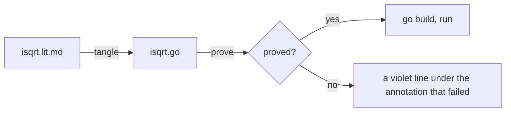

<!-- tangler: go -->
<!-- package: main -->
<!-- imports: fmt -->

# A square root you can trust

The integer square root of $n$ is the largest integer whose square does not
exceed $n$:

$$
r = \lfloor \sqrt{n} \rfloor \quad\Longleftrightarrow\quad r^2 \le n < (r+1)^2
$$

This program finds it by bisection, and it comes with a proof. Not a test that
it gets $\sqrt{17}$ right, but a proof that the inequality on the right holds
for the result of *every* call with $n \ge 0$, that the loop always stops, and
that the division in it can never divide by zero. The proof is written in the
`//@` comments, in the notation of
[VeGo](https://arxiv.org/abs/2608.22630), and `litgo run` checks it before it
compiles anything:

```sh
litgo run   examples/isqrt.lit.md    # prove, then compile, then run
litgo prove examples/isqrt.lit.md    # only prove
```



## The contract

The function promises the defining inequality, and asks for one thing in
return. `Requires` is what the caller owes, `Ensures` is what the function
owes back, and the result has a name, `r`, so that the promise can mention it.

```go
//@ Requires n >= 0
func Isqrt(n int) (r int) {
	// <<bisect>>
}
//@ Ensures r*r <= n ^ n < (r+1)*(r+1)
```

`^` is *and*. The `Ensures` goes under the closing brace, where a conclusion
belongs.

## The loop

Bisection keeps two numbers, one whose square is known to be small enough and
one whose square is known to be too big, and moves one of them to the middle
until they are neighbours.

<!-- chunk: bisect -->
```go
lo, hi := 0, n+1
//@ Invariant 0 <= lo < hi
//@ Invariant lo*lo <= n ^ n < hi*hi
//@ Variant hi - lo
for hi-lo > 1 {
	mid := lo + (hi-lo)/2
	// <<move whichever end the middle can replace>>
}
return lo
```

The sentence above *is* the invariant: `lo*lo <= n ^ n < hi*hi`. A loop
invariant is something true before the loop and true again after each time
round, and the verifier checks exactly those two things. It is true before,
because $0 \le n$ and $n < (n+1)^2$. Then the verifier forgets everything it
knew about `lo` and `hi` except the invariant, goes round once, and has to get
the invariant back.

<!-- chunk: move whichever end the middle can replace -->
```go
if mid*mid <= n {
	lo = mid
} else {
	hi = mid
}
```

Whichever branch runs, the test it just made is word for word the half of the
invariant it has to restore, so that part is immediate. The other line of the
invariant, `0 <= lo < hi`, needs the middle to be strictly between the ends,
and that is where the loop condition earns its keep: `hi - lo > 1` means
`(hi-lo)/2` is at least 1 and less than `hi - lo`.

The same fact proves that the loop stops. The `Variant` is a quantity that is
never negative while the loop runs and gets smaller on every round. Here it is
the width of the interval, and both branches narrow it.

After the loop the verifier knows the invariant and that the condition is
false. From `lo < hi` and not `hi - lo > 1` it follows that `hi = lo + 1`, and
putting that into `n < hi*hi` gives the `Ensures`. Nobody had to say so: those
few lines of arithmetic are what the prover is for.

## What the proof does not say

The integers of the proof are the integers of mathematics. Go's `int` has 64
bits, and `(n+1)*(n+1)` overflows long before `n` runs out of them. For
$n < 3 \cdot 10^9$ the two agree; beyond that, the theorem is about a program
this one only resembles. VeGo makes the same simplification, and it is the
kind of thing worth knowing about a proof before leaning on it.

## Running it

`main` has no annotations, so the verifier leaves it alone: a program can be
proved one function at a time.

```go
func main() {
	for _, n := range []int{0, 1, 2, 15, 16, 17, 1_000_000, 2_147_395_599} {
		fmt.Printf("isqrt(%d) = %d\n", n, Isqrt(n))
	}
}
```

## Breaking it

The quickest way to believe a verifier is to lie to it. Change `lo = mid` to
`lo = mid + 1`, which looks like the usual bisection and is wrong here, and
run it again:

```text
isqrt.lit.md:61:1: error: Invariant is not maintained by the body of the loop at line 64: 0 <= lo < hi
isqrt.lit.md:62:1: error: Invariant is not maintained by the body of the loop at line 64: lo*lo <= n ^ n < hi*hi
litgo: proved 0 of 1 annotated functions in isqrt.lit.md (11 obligations, 79 ms)
litgo: not proved, so not run (--no-prove runs it anyway)
```

Both complaints are right. `(mid+1)*(mid+1) <= n` is not what the test
established, and `mid + 1` can be `hi` itself, which leaves the interval
empty. In the editor the two lines are violet rather than red, because the
program still compiles: it is the argument that is broken, not the syntax.

Or weaken the loop condition to `hi-lo > 0`, and the verifier points at the
`Variant`: with an interval of width one the middle is `lo`, nothing moves,
and the loop never ends. A test would have hung. The proof just says no.
