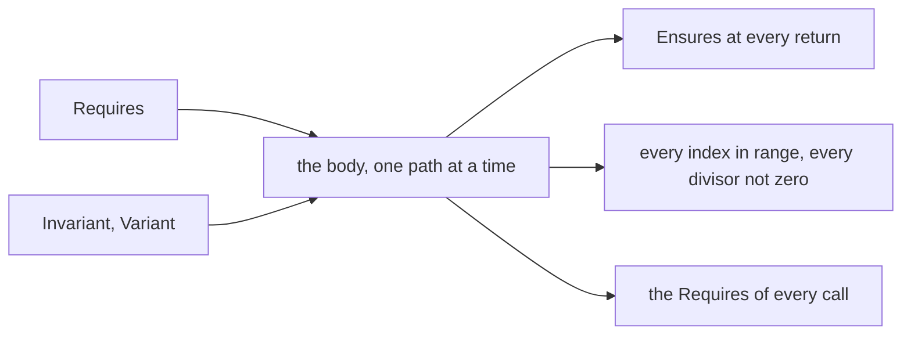

<!-- tangler: go -->
<!-- package: main -->
<!-- imports: fmt -->

# VeGo in litgo: a tutorial

[VeGo](https://arxiv.org/abs/2608.22630) (Verified Go, by Tina Massoudi and
Chris Dutchyn) is a way of writing down what a Go function promises, and why
its loops are right, in comments that start with `//@`. The program stays
ordinary Go. litgo reads the comments and proves them, or tells you which one
it could not prove and for which line of code.

This document is a tour of every annotation litgo checks, one small function
at a time. Every function here is proved each time the document is run:

```sh
litgo prove examples/vego-tutorial.lit.md   # prove, and list what was proved
litgo run   examples/vego-tutorial.lit.md   # prove, then compile and run
litgo check examples/vego-tutorial.lit.md   # chunks, syntax, types, proofs
```

In Neovim the annotations are violet and their formulas are typeset, so that
`^` reads ∧, `<=` reads ≤ and `Forall` reads ∀ until the cursor is on the line,
where you get back what you typed. Anything the verifier has to say about them
is violet too, as you type. A red line means the compiler will not take the
program. A violet line means the program runs and has not been shown to keep
its word.

The best way to read this is to break things. Change a `<` to a `<=` in any
block and see what the verifier says.



## A contract

`Requires` is what the caller owes. `Ensures` is what the function owes back.
`Requires` goes above the function and `Ensures` directly under its closing
brace, which is where a conclusion belongs. The result needs a name, so that
the `Ensures` has something to call it.

```go
//@ Requires x > 0 ^ y > 0
func AddPositives(x, y int) (sum int) {
	return x + y
}
//@ Ensures sum > x ^ sum > y
```

Without the `Requires` this is false (try `0` and `0`), and the verifier says
so: *Ensures is not proved for the return at line 50*.

A function without annotations is not looked at. So a program can be proved a
function at a time, and `main` below is left alone.

One thing to know before your editor surprises you: gofmt rewrites `//@` in a
doc comment as `// @`, and puts a blank line above an `Ensures`. litgo reads
both spellings and looks upward past the blank line, so formatting on save
changes how a contract looks and not what it means.

## The language of formulas

| | |
|:--|:--|
| `^`  `v`  `~` | and, or, not |
| `->`  `<-`  `<->` | implies, is implied by, if and only if |
| `=`  `<>`  `<`  `<=`  `>`  `>=` | comparisons. They chain: `0 <= i < n`. Go's `==` and `!=` are accepted too. |
| `+`  `-`  `*`  `/`  `%` | integer arithmetic; `/` and `%` are Go's, which round towards zero |
| `len(A)`, `A[i]` | the length and the elements of a slice of integers |
| `s.Len` | an integer or boolean field of a struct |
| `Forall k in [a, b) : P` | for every integer `k` with `a <= k < b` |
| `Exists k in [a, b] : P` | for some `k` with `a <= k <= b` |
| `Unique k in (a, b) : P` | for exactly one `k` with `a < k < b` |
| `Z`, `[0, ...)` | all integers; an interval without an upper end |
| `A[a:b) <= m` | every element of that range of `A` is at most `m` |
| `m in A[a:b)`, `m = A[a:b)` | some element of the range is `m` |
| `x'` | `x` after an assignment, where `x` is before it |

The length of a slice is usually written the way mathematicians write it,
`|A|`, and that is how the rest of this tutorial writes it. Go's own `&&`,
`||` and `!` are accepted for *and*, *or* and *not*.

A formula that is too long for a line goes on in the next `//@` comment, if
its line ends in something that cannot end a formula: an operator, say.

## Safety comes for free

Some obligations are not written by anybody, because the code implies them.
Every index has to be inside its slice, and every divisor has to be different
from zero. This function needs its `Requires` for no other reason:

```go
//@ Requires 0 <= i ^ i < |A| ^ d <> 0
func ElementOver(A []int, i, d int) (q int) {
	return A[i] / d
}
//@ Ensures q * d + A[i] % d = A[i]
```

Take away `i < |A|` and the complaint is at the `A[i]` itself: *the index may
be out of range*. Go stops evaluating `&&` and `||` early, and the verifier
knows that, so `i < len(A) && A[i] > 0` is fine with nothing said about `i`.

The `Ensures` shows that the prover knows what division means: a quotient and
a remainder add up.

```go
//@ Requires n >= 0
func Halve(n int) (h int) {
	return n / 2
}
//@ Ensures 2*h <= n ^ n < 2*h + 2
```

## Loops

Nobody knows how often a loop goes round, so the verifier does not try to
follow it. It asks for an **invariant**: a formula that is true when the loop
is reached and true again after every round. It proves those two things, and
after the loop the invariant, together with the loop condition being false, is
everything it knows.

A **variant** is for termination: an integer expression that is not negative
while the loop runs and that every round makes smaller. A loop without one is
still proved correct *if* it ends, and gets a warning that says so.

```go
//@ Requires n >= 0 ^ d > 0
func Divide(n, d int) (q, r int) {
	r = n
	//@ Invariant n = q*d + r ^ r >= 0
	//@ Variant r
	for r >= d {
		q, r = q+1, r-d
	}
	return q, r
}
//@ Ensures n = q*d + r ^ 0 <= r < d
```

Read the invariant against the `Ensures`. They differ only in `r < d`, and
that is exactly the loop condition being false. Finding an invariant is mostly
this: take the postcondition and weaken it until it is true before the loop
starts.

`Requires d > 0` is there for the variant. With `d = 0` the loop would run
forever, and the verifier notices: *Variant is not shown to decrease*.

The two annotations may also stand at the end of the loop's body, which is
where VeGo's own examples tend to put them.

### Counted loops, `range`, `continue`

The counter of a `for` loop is in scope for the invariant.

```go
//@ Requires n >= 0
func SumTo(n int) (s int) {
	//@ Invariant 0 <= i <= n + 1 ^ 2*s = i*(i-1)
	//@ Variant n + 1 - i
	for i := 0; i <= n; i++ {
		s += i
	}
	return s
}
//@ Ensures 2*s = n*(n+1)
```

That is Gauss's formula, with the division multiplied away. Notice that
nothing here is linear, and the proof goes through anyway, because
`(i+1)*i` and `i*i + i` are the same polynomial.

A `range` loop always ends, so it needs no variant. Its counter runs from `0`
to the length, and the verifier knows that without being told. `continue`
jumps to the end of the round, where the invariant is due as usual. The call
of `fmt.Println` is let through because all it is handed are numbers and a
string, so it cannot change anything the proof is about.

```go
func Count(A []int, x int) (n int) {
	//@ Invariant 0 <= n <= i
	for i, a := range A {
		if a != x {
			continue
		}
		n++
		fmt.Println("  found", x, "at", i)
	}
	return n
}
//@ Ensures 0 <= n <= |A|
```

### `break`, and what cannot happen

A `break` leaves the loop with whatever is known at that point. The invariant
is not assumed there, since the round was not finished.

`Exsures` is the negative of `Ensures`. It describes a state that no return
may be in, which is sometimes the more natural thing to say: *it never
happens that a position is returned and the element there is not `x`*.

```go
func Find(A []int, x int) (at int) {
	at = -1
	//@ Invariant 0 <= i <= |A| ^ at = -1
	//@ Invariant x <> A[0:i)
	//@ Variant |A| - i
	for i := 0; i < len(A); i++ {
		if A[i] == x {
			at = i
			break
		}
	}
	return at
}
//@ Ensures at = -1 v 0 <= at < |A|
//@ Ensures at = -1 -> Forall k in [0, |A|) : A[k] <> x
//@ Exsures at >= 0 ^ A[at] <> x
```

## Quantifiers, ranges and predicates

`x <> A[0:i)` in the last example was a quantifier in disguise: *`x` differs
from every element of `A` from `0` up to but not including `i`*. The ends of a
range are written like the ends of an interval, `[` or `]` for an end that is
included and `(` or `)` for one that is not. An order comparison with a range
holds for all of its elements; `=` and `in` hold for some element.

```go
//@ Requires |A| > 0
func Max(A []int) (m int) {
	m = A[0]
	//@ Invariant 1 <= i <= |A|
	//@ Invariant A[0:i) <= m ^ m in A[0:i)
	//@ Variant |A| - i
	for i := 1; i < len(A); i++ {
		if A[i] > m {
			m = A[i]
		}
	}
	return m
}
//@ Ensures A[:] <= m ^ m in A[:]
```

Both halves of that `Ensures` matter. `A[:] <= m` by itself is satisfied by
returning a billion. A contract that is too weak is proved just as happily as
a good one, and it is the reader who has to notice.

A `Predicate` gives a formula a name. It is not a function and is never run;
using it means its body. This one also shows a formula going on in the next
line, after the `:`.

```go
//@ Predicate Sorted(A) ::= Forall i in [0, |A|) :
//@   Forall j in [i, |A|) : A[i] <= A[j]

//@ Predicate Between(lo, x, hi) ::= lo <= x ^ x <= hi
```

## Calls

A call is where verification is modular. The caller never looks inside the
callee: it proves the callee's `Requires`, and what it learns about the result
is the callee's `Ensures`, and nothing else.

```go
//@ Requires Between(0, x, 10)
func Twice(x int) (r int) {
	return x + x
}
//@ Ensures r = double(x) ^ Between(0, r, 20)

//@ Requires Between(1, k, 5)
func UseTwice(k int) (r int) {
	return Twice(k) + Twice(k+5)
}
//@ Ensures r = 4*k + 10
```

Make that `Between(1, k, 6)` and the second call is refused: *this call does
not establish what Twice requires*.

`double` in that `Ensures` is a Go function. A function whose whole body is
`return` and one expression can be used in a formula, where it means that
expression. It is a way to give the contract a vocabulary that the program
shares.

```go
func double(x int) int { return 2 * x }
```

## Recursion

Recursion is induction. Inside `Triangle`, the call `Triangle(n-1)` is known
by the contract being proved: that is the induction hypothesis, and using it is
sound as long as the induction is well-founded. `Measure` is what makes it so:
an expression that is not negative and is smaller at every recursive call.
`BaseCase` marks where the induction starts, and the verifier checks that no
recursive call can be reached once it has held. `InductionHypothesis` states,
and proves, what makes the recursive call legal.

```go
//@ Requires n >= 0
//@ Measure n
func Triangle(n int) (t int) {
	//@ BaseCase n = 0
	if n == 0 {
		return 0
	}
	//@ InductionHypothesis n - 1 >= 0
	return n + Triangle(n-1)
}
//@ Ensures 2*t = n*(n+1)
```

Write `Triangle(n)` instead and the contract would still "follow" from itself.
The `Measure` is what catches it: *Measure is not shown to get smaller in the
recursive call*.

## Assertions and primes

`Assert` is a claim about the state at one point. It is proved there, and
known from there on, so it doubles as a stepping stone when the prover needs
to be led. The word is optional: a bare formula is an assertion.

A primed name is a value *after* an assignment. In a formula that mentions
`x'`, the `x'` is the value now and the plain `x` is the value one assignment
earlier, and with `x''` everything moves one further back. This is the old
trick of swapping two numbers without a third:

```go
func Swap(a, b int) (x, y int) {
	x, y = a, b
	x = x + y
	y = x - y
	x = x - y
	//@ Assert x = a + b ^ x' = b
	//@ y = a
	return x, y
}
//@ Ensures x = b ^ y = a
```

In an `Ensures`, a parameter without a prime is the value the caller passed,
whatever the body has done to its copy since.

## Promises that last: `Preserves`

`Preserves` states something once and has it checked after every assignment
until the block ends. A loop inside that block may assume it, so it does not
have to be repeated in the invariant.

```go
//@ Requires amount >= 0
func Transfer(from, to, amount int) (f, t int) {
	f, t = from, to
	//@ Preserves f + t = from + to
	//@ Invariant 0 <= moved <= amount ^ f = from - moved
	//@ Variant amount - moved
	for moved := 0; moved < amount; moved++ {
		f, t = f-1, t+1
	}
	return f, t
}
//@ Ensures f + t = from + to ^ f = from - amount
```

No money is created or destroyed. The parallel assignment is the point: `f--`
followed by `t++` would break the promise for the length of one statement, and
the verifier would say which one.

## The escape hatch: `Axiom`

The prover is complete for nothing. Its arithmetic is linear, with products
treated as unknowns about which it knows a few facts, and the cube of a
number is past what it knows. `Axiom` tells it, and it believes you without
proof. That is exactly as dangerous as it sounds, so every `Axiom` is reported
as a warning, every time.

```go
//@ Requires x >= 0
func Cube(x int) (c int) {
	//@ Axiom x*x*x >= 0
	return x * x * x
}
//@ Ensures c >= 0
```

## All of it at once: binary search

The most famous loop with a bug in it. The invariant says that everything to
the left of `lo` is too small and everything from `hi` on is too big, and
`Sorted` is what lets one comparison with `A[mid]` speak for a whole half of
the slice.

```go
//@ Requires Sorted(A)
func Search(A []int, x int) (at int, found bool) {
	lo, hi := 0, len(A)
	//@ Invariant 0 <= lo <= hi <= |A|
	//@ Invariant A[0:lo) < x ^ x < A[hi:|A|)
	//@ Variant hi - lo
	for lo < hi {
		mid := lo + (hi-lo)/2
		if A[mid] == x {
			return mid, true
		} else if A[mid] < x {
			lo = mid + 1
		} else {
			hi = mid
		}
	}
	return 0, false
}
//@ Ensures found -> 0 <= at < |A| ^ A[at] = x
//@ Ensures ~found -> x <> A[:]
```

Four things are proved here, and only two of them were written down: if
`found`, then `at` is a position of `x`; if not, `x` is nowhere in `A`; and,
unasked, `A[mid]` is always inside the slice, and the loop ends. Try
`lo = mid` (it loops forever, and the `Variant` says so), `hi = mid - 1` (it
skips an element, and the invariant is not maintained), or drop the
`Requires` (and nothing about the halves follows).

## What is left out

litgo's checker is its own, because the paper's `vegop` has not been
published, and it is deliberately smaller than what the paper describes.

* **The fragment.** Integers, booleans, slices of integers that are read and
  not written, integer and boolean fields of structs, `if`, `for`, `range`,
  `break`, `continue`, `return`, and calls of annotated functions. An
  annotated function that uses anything else is reported as *not verified*,
  with the line that was too much. It is never silently passed.
* **No writes through a slice or a pointer.** `A[i] = x` may change another
  slice that shares the array, and a proof that did not notice would prove
  something false. So sorting is out, for now.
* **Not Go, so not here.** VeGo's `.vgo` dialect has `while`, `skip` and
  functions inside functions. A litgo block is Go, where `for cond {}`, an
  empty statement and a second function say the same.
* **Read but not checked.** `Property`, and contracts on interface methods.
  They get a warning rather than silence.
* **The integers are mathematical.** Overflow is not modelled, here or in the
  paper.
* **"Not proved" is not "false".** The prover never calls a false thing
  proved, and it sometimes fails to prove a true one. The cure is usually a
  stronger invariant or an `Assert` on the way.

## Running it

```go
func main() {
	fmt.Println("AddPositives(2, 3) =", AddPositives(2, 3))
	fmt.Println("ElementOver({7, 9}, 1, 2) =", ElementOver([]int{7, 9}, 1, 2))
	fmt.Println("Halve(7) =", Halve(7))
	q, r := Divide(17, 5)
	fmt.Println("Divide(17, 5) =", q, r)
	fmt.Println("SumTo(100) =", SumTo(100))
	A := []int{1, 3, 3, 7, 9, 12}
	fmt.Println("Count(A, 3):")
	fmt.Println("  =", Count(A, 3))
	fmt.Println("Find(A, 7) =", Find(A, 7))
	fmt.Println("Max(A) =", Max(A))
	fmt.Println("UseTwice(2) =", UseTwice(2))
	fmt.Println("Triangle(10) =", Triangle(10))
	x, y := Swap(1, 2)
	fmt.Println("Swap(1, 2) =", x, y)
	f, t := Transfer(10, 0, 4)
	fmt.Println("Transfer(10, 0, 4) =", f, t)
	fmt.Println("Cube(3) =", Cube(3))
	at, found := Search(A, 9)
	fmt.Println("Search(A, 9) =", at, found)
}
```
