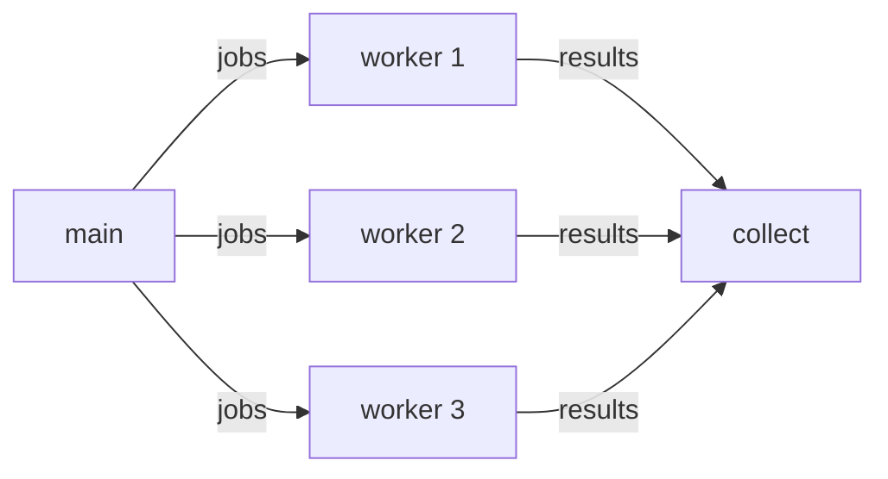
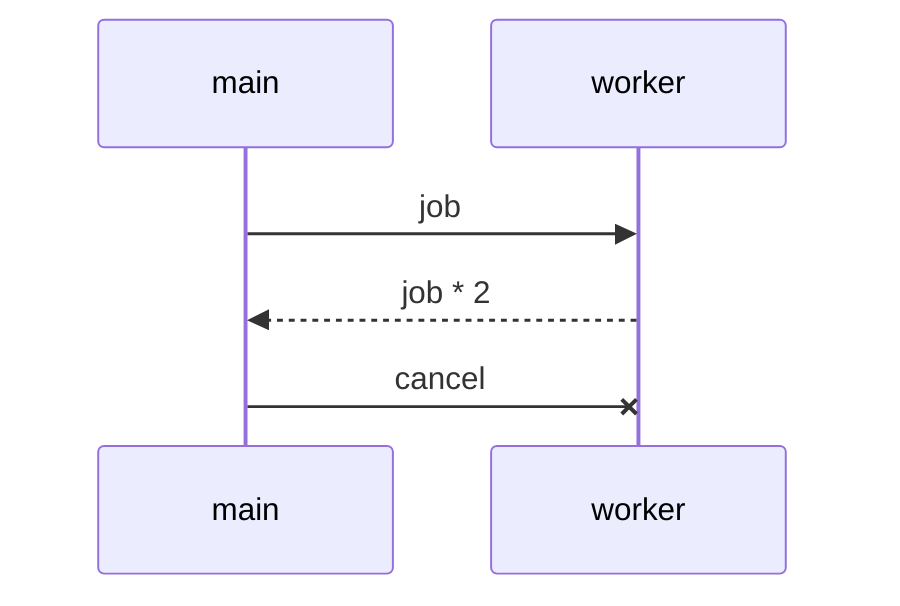

<!-- tangler: go -->
<!-- package: main -->
<!-- imports: context, fmt, sync, time -->
<!-- tangler-exclude: ^\s*// NOTE.*$ -->

# Worker pool in Go

A pool of $n$ workers processes $m$ jobs concurrently. The jobs travel through
a channel, and the context is cancellable, so we can stop early and still keep
the partial results.

If every job costs $t$ seconds, the pool finishes in about

$$
T(n, m) = \left\lceil \frac{m}{n} \right\rceil \cdot t
$$

instead of the $m \cdot t$ a single goroutine would need: a speed-up of
$\frac{m t}{T} \approx n$ for as long as $n \le m$.



## The shape of the program

The whole program fits on one screen, because each step is a named chunk that
is explained further down. Chunks are spliced in *textually*, so they see
`ctx`, `jobs`, `results` and `wg` exactly as if they had been written here.

```go
// <<the worker>>

func main() {
	// <<set up a cancellable context>>

	n, m := 3, 10
	jobs := make(chan int, m)
	results := make(chan int, m)
	var wg sync.WaitGroup

	// <<spawn the workers>>
	// <<feed the jobs>>
	// <<close results once the workers are done>>
	// <<collect the results>>
}
```

## The worker

A worker drains `jobs` until the channel closes or the context is cancelled,
whichever comes first. Doubling stands in for real work.

<!-- chunk: the worker -->
```go
func worker(ctx context.Context, id int, jobs <-chan int, results chan<- int, wg *sync.WaitGroup) {
	defer wg.Done()
	for job := range jobs {
		select {
		case <-ctx.Done():
			return
		default:
			// NOTE: this line is dropped by the tangler-exclude directive.
			time.Sleep(20 * time.Millisecond)
			results <- job * 2
		}
	}
}
```



## Cancellation

The deadline is a tiny chunk of its own: an expression, interpolated inline.

<!-- chunk: set up a cancellable context -->
```go
ctx, cancel := context.WithCancel(context.Background())
defer cancel()
time.AfterFunc(/*<<the deadline>>*/, cancel)
```

Long enough for roughly half of the jobs.

<!-- chunk: the deadline -->
```go
50 * time.Millisecond
```

## Spawn, feed, collect

<!-- chunk: spawn the workers -->
```go
for i := 0; i < n; i++ {
	wg.Add(1)
	go worker(ctx, i, jobs, results, &wg)
}
```

The channel is buffered with room for all $m$ jobs, so feeding never blocks.

<!-- chunk: feed the jobs -->
```go
for i := 0; i < m; i++ {
	jobs <- i
}
close(jobs)
```

<!-- chunk: close results once the workers are done -->
```go
go func() {
	wg.Wait()
	close(results)
}()
```

Ranging over `results` ends when the channel closes, which happens after the
last worker returns — whether it ran out of jobs or was cancelled.

<!-- chunk: collect the results -->
```go
done := 0
for r := range results {
	fmt.Println(r)
	done++
}
fmt.Printf("%d of %d jobs finished\n", done, m)
```
