<!-- run: go vet ./... && go test ./... && go build -o bin/litgo . -->

# litgo: literate Go

litgo is a literate programming tool for Go, and this document is litgo's own
source. Every source file in the repository (the Go module, its tests, the
Neovim plugin) gets tangled out of the Markdown you are reading. The only file
written by hand is the README.

In a literate program the code is written for a human reader first. You put the
code in whatever order explains it best, in pieces small enough to talk about
one at a time, and a tool puts the pieces back in the order the compiler wants.
litgo does three things with a document like that:

* **tangle** it into source files,
* **weave** it into a PDF or a web page for reading, with typeset math and
  drawn diagrams,
* **run** it, and translate every compiler error, vet warning, test failure and
  panic back to a line and column in the Markdown, so you never have to leave
  the document to see what went wrong.

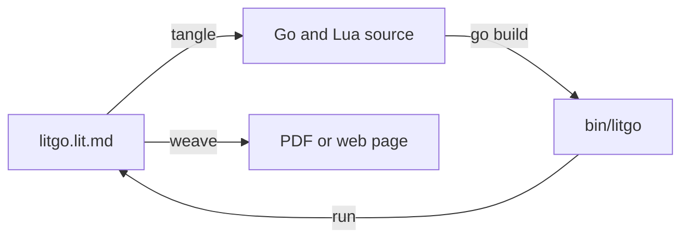

litgo is developed using the loop at the bottom of that picture. The generated
sources are committed to the repository, so a fresh clone builds with nothing
but Go, and after that litgo rebuilds itself:

```sh
go build -o bin/litgo .        # stage 1, from the committed sources
bin/litgo run litgo.lit.md     # tangle, vet, test, rebuild bin/litgo
```

`litgo run` does what the `run:` directive on the first line of this document
says. If you tangle this document with the binary it produces, you get back
exactly the sources that binary was built from. That fixed point is how we know
the bootstrap works.

<!-- file: go.mod -->

litgo only depends on the standard library.

```gomod
module github.com/tlehman/litgo

go 1.24
```

<!-- file: .gitignore -->

```gitignore
/bin/
*.pdf
*.html
*.woven.md
/examples/*.go
```

## The format

A `.lit.md` file is ordinary Markdown. Everything litgo needs goes in HTML
comments, which a Markdown renderer hides, and in code comments, which keep the
code valid for syntax highlighters and formatters. Here is a small complete
program:

````markdown
<!-- package: main -->
<!-- imports: fmt -->

# Hello

```go
func main() {
	// <<greet>>
}
```

The greeting gets a section of its own.

<!-- chunk: greet -->
```go
fmt.Println("hello,", /*<<whom>>*/)
```

<!-- chunk: whom -->
```go
"world"
```
````

Unnamed code blocks in the file's language get written out in the same order
they appear in the `.lit.md` document, and named blocks only show up where they
are referenced. You name a block by putting a `chunk:` directive above it. You
reference it with a comment that contains nothing but the chunk's name in
double angle brackets. A line comment on a line by itself splices the chunk in
at that indentation, and a block comment splices it into the middle of a line.

Splicing is plain text substitution, on purpose. A chunk is not a function, so
it can see every name that is in scope at the place where it lands. Idiomatic
Go has a lot of big statements (a `for` around a `select` around an `if`, with
a `defer` on top), and you can't turn their parts into functions without
passing half the local variables around. With a chunk you can move one part
somewhere else and explain it there, and the program stays exactly the same.

These are the directives:

| Directive | Meaning |
|---|---|
| `file: path` | Starts writing another file. The unnamed blocks in the language of its extension go into it. |
| `package: name` | Gives the current file a package clause. |
| `imports: a, b, alias c` | Gives the current file an import block. |
| `chunk: name` | Names the next block. Blocks with the same name get concatenated. |
| `notangle` | The next block is only an illustration and is left out of the program. |
| `verbatim` | In the next block, text that looks like a reference is treated as plain text. |
| `tangler-exclude: regexp` | Drops the source lines that match. |
| `tangler: lang`, `output: path` | Set the language and path of the default file. The defaults are `go` and `name.go` for `name.lit.md`. |
| `run: command` | The command `litgo run` runs after tangling. Without it, `litgo run` builds and runs the default file. |

litgo never reformats the code it tangles. Each output line comes from one
source line, so any position in the output can be traced back exactly.

# The document model

<!-- file: internal/lit/doc.go -->
<!-- package: lit -->
<!-- imports: fmt, path/filepath, regexp, strings -->

Package `lit` implements the format. It parses documents, tangles them while
keeping a source map, and computes the structural edits that an editor asks
for. All line and column numbers in this package are 0-based, and columns count
bytes. That matches what the Go compiler and Neovim use, once you subtract one
from theirs.

Problems can come from the document's structure, the Go parser, the compiler,
or the running program. Wherever a problem comes from, it ends up as a `Diag`
that points into the `.lit.md` file. The severity values are the same ones
`vim.diagnostic` uses.

```go
// Severity of a diagnostic, matching vim.diagnostic.severity.
const (
	SevError   = 1
	SevWarning = 2
	SevInfo    = 3
)

// Diag is a problem located in a .lit.md source file.
type Diag struct {
	File     string `json:"file,omitempty"`
	Line     int    `json:"line"`
	Col      int    `json:"col"`
	EndCol   int    `json:"end_col,omitempty"`
	Severity int    `json:"severity"`
	Message  string `json:"message"`
	Source   string `json:"source"`
}
```

A directive is an HTML comment on a line by itself. litgo keeps the column
where the directive's value starts, because errors can point into directives
too. For example, an unused import gets reported on its entry in the `imports:`
line.

```go
// Directive is a `<!-- key: value -->` line outside of any code fence.
type Directive struct {
	Key      string
	Value    string
	Line     int
	ValueCol int // byte column where Value starts
}

// Import is one entry of an `imports:` directive.
type Import struct {
	Alias string
	Path  string
	Line  int
	Col   int // column of the entry within the directive line
	Len   int
}
```

A document writes one or more files. There is always a default file named after
the document, and every `file:` directive starts another one. `package:` and
`imports:` apply to whichever file is current.

```go
// File is one tangled output. A document always has a default file, named
// after the document; each `file:` directive starts another.
type File struct {
	Path    string // as written; relative paths are relative to the document
	Lang    string
	Line    int // line of the file directive, -1 for the default file
	Package string
	PkgDir  *Directive
	Imports []Import
}
```

A block remembers which file was current when it appeared, its chunk name if it
has one, and which lines its fences are on. If a fence is indented inside a
list, that indentation gets stripped from the block's content.

```go
// Block is a fenced code block.
type Block struct {
	Lang      string
	File      *File  // the file being written when the block appears
	Chunk     string // chunk name; "" means a root block
	ChunkLine int    // line of the chunk directive, -1 if none
	NoTangle  bool
	Verbatim  bool // text that looks like a reference is just text
	Open      int  // line of the opening fence
	Close     int  // line of the closing fence (len(Lines) if unterminated)
	Strip     int  // fence indentation, stripped from each content line
}

// First and Last content lines (Last is inclusive; Last < First if empty).
func (b *Block) First() int { return b.Open + 1 }
func (b *Block) Last() int  { return b.Close - 1 }

// Doc is a parsed .lit.md document.
type Doc struct {
	Path       string
	Lines      []string
	Directives []Directive
	Blocks     []*Block
	Files      []*File // Files[0] is the default file

	Run      string
	Excludes []*regexp.Regexp
	Diags    []Diag
}
```

## Recognising the syntax

The Markdown side needs two regular expressions. The directive pattern is
anchored at both ends and matches its value lazily, so the value can contain
`-->` itself. An exclude pattern for HTML comments needs that.

The reference patterns accept the comment syntax of three language families:
C-like (`//`, `/* */`), Lua and SQL (`--`, `--[[ ]]`) and the shell family
(`#`). The patterns capture the comment opener, so that renaming a chunk can
put the same opener back.

```go
var (
	directiveRe = regexp.MustCompile(`^\s*<!--\s*([A-Za-z][A-Za-z0-9-]*)\s*(?::\s*(.*?))?\s*-->\s*$`)
	fenceRe     = regexp.MustCompile("^( {0,3}|\t*)(```+|~~~+)\\s*([^\\s`]*)(.*)$")

	// RefLineRe matches a whole-line chunk reference: a line comment holding
	// nothing but <<name>>, in the comment syntax of C-like languages, of Lua
	// and SQL, or of the shell family.
	RefLineRe = regexp.MustCompile(`^(\s*)(//|--|#)\s*<<\s*(.+?)\s*>>\s*$`)
	// RefInlineRe matches an inline chunk reference: a block comment.
	RefInlineRe = regexp.MustCompile(`(/\*|--\[\[)\s*<<\s*(.+?)\s*>>\s*(\*/|\]\])`)
)

var knownDirectives = map[string]bool{
	"tangler": true, "package": true, "imports": true, "tangler-exclude": true,
	"output": true, "file": true, "run": true, "chunk": true, "notangle": true, "verbatim": true,
}
```

A file's extension decides its language, and the fences of its blocks have to
say that language. This table covers the extensions that don't match the
language name.

```go
// languages maps a file extension to the fence language of the blocks that
// belong in such a file. Anything else uses the extension itself.
var languages = map[string]string{
	".mod": "gomod", ".md": "markdown", ".py": "python", ".rb": "ruby", ".rs": "rust",
	".js": "javascript", ".ts": "typescript", ".yml": "yaml", ".bash": "sh",
}

func langOf(path string) string {
	ext := strings.ToLower(filepath.Ext(path))
	if l, ok := languages[ext]; ok {
		return l
	}
	if ext == "" {
		return strings.ToLower(filepath.Base(path)) // Makefile → makefile
	}
	return ext[1:]
}
```

litgo writes comments as well as reading them. It writes a marker at the top of
each generated file, and `:Untangle` writes a reference where the code used to
be.

```go
// Comments describes how a language writes the comments that carry chunk
// references and the generated-code marker.
type Comments struct{ Line, Open, Close string }

// CommentsFor returns the comment syntax of a fence language. Languages litgo
// does not know get no marker and no reference syntax of their own.
func CommentsFor(lang string) Comments {
	switch lang {
	case "go", "gomod", "c", "cpp", "java", "javascript", "typescript", "rust", "swift", "kotlin", "zig", "css", "typ", "typst":
		return Comments{"//", "/*", "*/"}
	case "lua":
		return Comments{"--", "--[[", "]]"}
	case "sql", "haskell":
		return Comments{Line: "--"}
	case "sh", "bash", "zsh", "fish", "python", "ruby", "yaml", "toml", "makefile", "make", "dockerfile", "nix", "gitignore":
		return Comments{Line: "#"}
	}
	return Comments{}
}

// NormName canonicalises a chunk name: trimmed, inner whitespace collapsed.
func NormName(s string) string { return strings.Join(strings.Fields(s), " ") }
```

## Parsing

Parsing is one pass over the lines. `Parse` never fails, because a document
that is being edited is usually broken somewhere, and the editor still wants
results for the rest of it.

```go
// Parse reads a .lit.md document. Errors land in Diags.
func Parse(path string, src []byte) *Doc {
	text := strings.ReplaceAll(string(src), "\r\n", "\n")
	text = strings.TrimSuffix(text, "\n")
	d := &Doc{Path: path}
	if text != "" || len(src) > 0 {
		d.Lines = strings.Split(text, "\n")
	}
	cur := &File{Lang: "go", Line: -1}
	d.Files = []*File{cur}

	var pending *Directive // chunk directive awaiting its block
	noTangle, verbatim := false, false
	for i := 0; i < len(d.Lines); i++ {
		line := d.Lines[i]
		if m := fenceRe.FindStringSubmatch(line); m != nil {
			// <<record a code block and skip past it>>
			continue
		}
		if m := directiveRe.FindStringSubmatchIndex(line); m != nil {
			key := strings.ToLower(line[m[2]:m[3]])
			if knownDirectives[key] {
				// <<record a directive>>
				continue
			}
		}
		// <<prose cancels directives that were waiting for a block>>
	}
	if pending != nil {
		d.diag(pending.Line, 0, SevWarning,
			fmt.Sprintf("chunk directive %q is not followed by a code block", NormName(pending.Value)))
	}
	return d
}
```

A fence closes at the next line that is made of the same fence character and is
at least as long. That is how a four-backtick block can hold three-backtick
fences, and how this document can hold its own example. Any `chunk:`,
`notangle` or `verbatim` directives that were waiting get attached to this
block.

<!-- chunk: record a code block and skip past it -->
```go
b := &Block{Lang: strings.ToLower(m[3]), File: cur, Open: i, ChunkLine: -1, Strip: len(m[1])}
b.Lang = strings.Trim(b.Lang, "{}.")
marker := m[2]
b.Close = len(d.Lines)
for j := i + 1; j < len(d.Lines); j++ {
	t := strings.TrimSpace(d.Lines[j])
	if strings.HasPrefix(t, marker) && strings.Trim(t, marker[:1]) == "" {
		b.Close = j
		break
	}
}
if b.Close == len(d.Lines) {
	d.diag(i, 0, SevWarning, "code fence is never closed")
}
if pending != nil {
	b.Chunk, b.ChunkLine = NormName(pending.Value), pending.Line
}
b.NoTangle, b.Verbatim = noTangle, verbatim
pending, noTangle, verbatim = nil, false, false
d.Blocks = append(d.Blocks, b)
i = b.Close
```

Directives that attach to the next block are held until that block shows up.
`file:` changes the current file. The rest configure the document or the
current file.

<!-- chunk: record a directive -->
```go
dir := Directive{Key: key, Line: i, ValueCol: m[3]}
if m[4] >= 0 {
	dir.Value, dir.ValueCol = line[m[4]:m[5]], m[4]
}
d.Directives = append(d.Directives, dir)
switch key {
case "chunk":
	if NormName(dir.Value) == "" {
		d.diag(i, 0, SevError, "chunk directive needs a name")
	} else {
		p := dir
		pending = &p
	}
case "notangle":
	noTangle = true
case "verbatim":
	verbatim = true
case "file":
	if p := strings.TrimSpace(dir.Value); p == "" {
		d.diag(i, 0, SevError, "file directive needs a path")
	} else {
		cur = &File{Path: p, Lang: langOf(p), Line: i}
		d.Files = append(d.Files, cur)
	}
default:
	d.apply(&d.Directives[len(d.Directives)-1], cur)
}
```

Blank lines are allowed between a directive and its block, but prose is not. A
`chunk:` directive followed by a paragraph names nothing, and litgo warns about
it instead of silently naming some later block.

<!-- chunk: prose cancels directives that were waiting for a block -->
```go
if strings.TrimSpace(line) != "" {
	if pending != nil {
		d.diag(pending.Line, 0, SevWarning, fmt.Sprintf("chunk directive %q is not followed by a code block", NormName(pending.Value)))
	}
	pending, noTangle, verbatim = nil, false, false
}
```

```go
func (d *Doc) diag(line, col, sev int, msg string) {
	d.Diags = append(d.Diags, Diag{Line: line, Col: col, Severity: sev, Message: msg, Source: "litgo"})
}

// apply handles the directives that configure the document or the file
// currently being written.
func (d *Doc) apply(dir *Directive, cur *File) {
	switch dir.Key {
	case "tangler":
		d.Files[0].Lang = strings.ToLower(strings.TrimSpace(dir.Value))
	case "output":
		d.Files[0].Path = strings.TrimSpace(dir.Value)
	case "package":
		cur.Package = strings.TrimSpace(dir.Value)
		cur.PkgDir = dir
	case "run":
		d.Run = strings.TrimSpace(dir.Value)
	case "tangler-exclude":
		re, err := regexp.Compile(dir.Value)
		if err != nil {
			d.diag(dir.Line, dir.ValueCol, SevError, "bad tangler-exclude pattern: "+err.Error())
			return
		}
		d.Excludes = append(d.Excludes, re)
	case "imports":
		// Entries are comma separated; each is `path` or `alias path`.
		off := 0
		for _, part := range strings.Split(dir.Value, ",") {
			entry := strings.TrimSpace(part)
			col := dir.ValueCol + off + strings.Index(part, entry)
			off += len(part) + 1
			if entry == "" {
				continue
			}
			imp := Import{Line: dir.Line, Col: col, Len: len(entry)}
			f := strings.Fields(entry)
			imp.Path = strings.Trim(f[len(f)-1], `"`)
			if len(f) > 1 {
				imp.Alias = f[0]
			}
			cur.Imports = append(cur.Imports, imp)
		}
	}
}
```

## Files, blocks and chunks

OutPath is where a file is written. The default file is named after 
the document: name.lit.md tangles to name.go.

```go
func (d *Doc) OutPath(f *File) string {
	dir := filepath.Dir(d.Path)
	if f.Path != "" {
		if filepath.IsAbs(f.Path) {
			return f.Path
		}
		return filepath.Join(dir, f.Path)
	}
	base := filepath.Base(d.Path)
	base = strings.TrimSuffix(base, ".md")
	base = strings.TrimSuffix(base, ".lit")
	ext := f.Lang
	if ext == "" {
		ext = "txt"
	}
	return filepath.Join(dir, base+"."+ext)
}
```

There are two ways a block can take part in tangling. It either gets written
straight into its file, or it is a chunk. A chunk can be in any language,
because where it ends up depends on who references it.

```go
// IsRoot reports whether the block is written straight into its file: it is
// unnamed and in the file's language.
func (b *Block) IsRoot() bool { return b.Chunk == "" && !b.NoTangle && b.Lang == b.File.Lang }

// Tangled reports whether the block takes part in tangling, as a root block
// or as a chunk.
func (b *Block) Tangled() bool { return !b.NoTangle && (b.Chunk != "" || b.IsRoot()) }

// BlockAt returns the block whose fences or content include the line.
func (d *Doc) BlockAt(line int) *Block {
	for _, b := range d.Blocks {
		if line >= b.Open && line <= b.Close {
			return b
		}
	}
	return nil
}
```

```go
// Ref is one use of a chunk.
type Ref struct {
	Name   string
	Line   int
	Col    int // start of the reference syntax
	EndCol int
	Inline bool
	Indent string
	Open   string // comment opener as written, reused when the reference is renamed
	Close  string
}

// Text spells a reference to name in the same comment syntax.
func (r Ref) Text(name string) string {
	if r.Inline {
		return r.Open + "<<" + name + ">>" + r.Close
	}
	return r.Open + " <<" + name + ">>"
}

// RefsIn lists the chunk references on one source line.
func RefsIn(line string, lineNo int) []Ref {
	if m := RefLineRe.FindStringSubmatchIndex(line); m != nil {
		return []Ref{{Name: NormName(line[m[6]:m[7]]), Line: lineNo, Col: m[3], EndCol: len(strings.TrimRight(line, " \t")),
			Indent: line[m[2]:m[3]], Open: line[m[4]:m[5]]}}
	}
	var out []Ref
	for _, m := range RefInlineRe.FindAllStringSubmatchIndex(line, -1) {
		out = append(out, Ref{Name: NormName(line[m[4]:m[5]]), Line: lineNo, Col: m[0], EndCol: m[1], Inline: true,
			Open: line[m[2]:m[3]], Close: line[m[6]:m[7]]})
	}
	return out
}

// refs lists the references a block makes; a verbatim block makes none.
func (d *Doc) refs(b *Block, line int) []Ref {
	if b.Verbatim {
		return nil
	}
	return RefsIn(d.Lines[line], line)
}
```

`Chunks` is the index that everything else uses: tangling, the checks for
unused and undefined chunks, renaming, and navigation in the editor.

```go
// Chunk gathers every block sharing a name, plus all references to it.
type Chunk struct {
	Name   string
	Blocks []*Block
	Refs   []Ref
}

// Chunks indexes named chunks in document order. References to undefined
// chunks appear as entries with no Blocks.
func (d *Doc) Chunks() []*Chunk {
	byName := map[string]*Chunk{}
	var order []*Chunk
	get := func(name string) *Chunk {
		c := byName[name]
		if c == nil {
			c = &Chunk{Name: name}
			byName[name] = c
			order = append(order, c)
		}
		return c
	}
	for _, b := range d.Blocks {
		if b.Tangled() && b.Chunk != "" {
			c := get(b.Chunk)
			c.Blocks = append(c.Blocks, b)
		}
	}
	for _, b := range d.Blocks {
		if !b.Tangled() {
			continue
		}
		for i := b.First(); i <= b.Last(); i++ {
			for _, r := range d.refs(b, i) {
				c := get(r.Name)
				c.Refs = append(c.Refs, r)
			}
		}
	}
	return order
}
```

# Tangling

<!-- file: internal/lit/tangle.go -->
<!-- package: lit -->
<!-- imports: fmt, go/parser, go/scanner, go/token, path/filepath, sort, strings -->

Tangling produces output lines, and for every line it records where the bytes
came from. A line that was spliced together from a host line and an inline
chunk has several segments, and an error column gets looked up in those
segments.

```go
// Seg says that Len bytes of an output line starting at OutCol came from
// (SrcLine, SrcCol) of the literate source. Via lists the reference lines the
// text was interpolated through, outermost first.
type Seg struct {
	OutCol, Len     int
	SrcLine, SrcCol int
	Via             []int
}

// OutLine is one line of tangled output.
type OutLine struct {
	Text string
	Segs []Seg
}

// Output is one tangled file. Its first Header lines are the ones litgo
// generates: the marker, the package clause, the imports.
type Output struct {
	File   *File
	Path   string
	Lines  []OutLine
	Header int
}

// Result of tangling one document.
type Result struct {
	Doc   *Doc
	Files []*Output
	Diags []Diag
}
```

Every file litgo writes starts with a marker in that language's comment syntax,
and litgo refuses to overwrite a file that doesn't have the marker. This
matters because the first thing a new user does is run
`litgo tangle pool.lit.md` next to a hand-written `pool.go`.

```go
// generatedMarker is the text of the first line of every file litgo writes,
// after the comment leader; tangle refuses to overwrite files that lack it.
const generatedMarker = " Code generated by litgo from "

// Generated reports whether file content starts with litgo's marker.
func Generated(content []byte) bool {
	first, _, _ := strings.Cut(string(content), "\n")
	for _, leader := range []string{"//", "--", "#"} {
		if strings.HasPrefix(first, leader+generatedMarker) {
			return true
		}
	}
	return false
}
```

```go
// Tangle expands the document into its output files.
func (d *Doc) Tangle() *Result {
	r := &Result{Doc: d}
	r.Diags = append(r.Diags, d.Diags...)
	t := &tangler{d: d, r: r, chunks: map[string]*Chunk{}, reported: map[string]bool{}}
	for _, c := range d.Chunks() {
		t.chunks[c.Name] = c
	}

	for _, f := range d.Files {
		var body []OutLine
		roots := 0
		for _, b := range d.Blocks {
			if b.File != f || !b.IsRoot() {
				continue
			}
			roots++
			lines := t.block(b, nil, nil)
			if len(lines) == 0 {
				continue
			}
			if len(body) > 0 {
				body = append(body, OutLine{})
			}
			body = append(body, lines...)
		}
		if roots == 0 {
			if f.Line >= 0 {
				r.Diags = append(r.Diags, Diag{Line: f.Line, Severity: SevWarning, Source: "litgo",
					Message: fmt.Sprintf("no unnamed ```%s blocks follow: %s would be empty", f.Lang, f.Path)})
			}
			continue
		}
		out := &Output{File: f, Path: d.OutPath(f), Lines: d.header(f)}
		out.Header = len(out.Lines)
		if len(out.Lines) > 0 && len(body) > 0 {
			out.Lines = append(out.Lines, OutLine{})
		}
		out.Lines = append(out.Lines, body...)
		r.Files = append(r.Files, out)
	}
	if len(r.Files) == 0 {
		r.Diags = append(r.Diags, Diag{Line: 0, Severity: SevWarning, Source: "litgo",
			Message: fmt.Sprintf("no unnamed ```%s blocks: nothing to tangle (chunks are only emitted where referenced)", d.Files[0].Lang)})
	}
	for _, c := range d.Chunks() {
		if len(c.Blocks) > 0 && len(c.Refs) == 0 {
			r.Diags = append(r.Diags, Diag{Line: c.Blocks[0].ChunkLine, Severity: SevWarning, Source: "litgo",
				Message: fmt.Sprintf("chunk ⟨%s⟩ is never used", c.Name)})
		}
	}
	for i := range r.Diags {
		if r.Diags[i].File == "" {
			r.Diags[i].File = d.Path
		}
	}
	return r
}

// header is what litgo writes before the blocks: the generated-code marker
// and, for a file with a package directive, the package clause and imports.
// Header lines map to the directives they came from, so an unused import is
// reported on its entry in the imports directive.
func (d *Doc) header(f *File) []OutLine {
	var h []OutLine
	if leader := CommentsFor(f.Lang).Line; leader != "" {
		h = append(h, OutLine{Text: leader + generatedMarker + filepath.Base(d.Path) + "; DO NOT EDIT."})
	}
	if f.Package == "" {
		return h
	}
	h = append(h, OutLine{}, OutLine{Text: "package " + f.Package,
		Segs: []Seg{{OutCol: 8, Len: len(f.Package), SrcLine: f.PkgDir.Line, SrcCol: f.PkgDir.ValueCol}}})
	if len(f.Imports) > 0 {
		h = append(h, OutLine{}, OutLine{Text: "import ("})
		// <<put the imports in the order gofmt wants>>
		for i, imp := range imports {
			if i > 0 && external(imp) && !external(imports[i-1]) {
				h = append(h, OutLine{})
			}
			text := "\t"
			if imp.Alias != "" {
				text += imp.Alias + " "
			}
			text += `"` + imp.Path + `"`
			// The path between the quotes is the path in the directive.
			h = append(h, OutLine{Text: text, Segs: []Seg{{OutCol: len(text) - 1 - len(imp.Path), Len: len(imp.Path),
				SrcLine: imp.Line, SrcCol: imp.Col + strings.LastIndex(d.Lines[imp.Line][imp.Col:imp.Col+imp.Len], imp.Path)}}})
		}
		h = append(h, OutLine{Text: ")"})
	}
	return h
}
```

The generated files are committed, so they should already be clean under gofmt.
gofmt wants the standard library imports first, then a blank line, then
everything else, with each group sorted. You can recognise a standard library
path because its first element has no dot in it.

<!-- chunk: put the imports in the order gofmt wants -->
```go
external := func(imp Import) bool { return strings.Contains(strings.Split(imp.Path, "/")[0], ".") }
imports := append([]Import{}, f.Imports...)
sort.SliceStable(imports, func(i, j int) bool {
	if a, b := external(imports[i]), external(imports[j]); a != b {
		return b
	}
	return imports[i].Path < imports[j].Path
})
```

Expansion is recursive. It carries the stack of chunk names along so it can
catch a chunk that includes itself, and it carries the stack of reference lines
along so each segment can record them as its `Via`.

```go
type tangler struct {
	d        *Doc
	r        *Result
	chunks   map[string]*Chunk
	reported map[string]bool
}

func (t *tangler) errorAt(ref Ref, msg string) {
	key := fmt.Sprintf("%d:%d:%s", ref.Line, ref.Col, msg)
	if t.reported[key] {
		return
	}
	t.reported[key] = true
	t.r.Diags = append(t.r.Diags, Diag{Line: ref.Line, Col: ref.Col, EndCol: ref.EndCol, Severity: SevError, Message: msg, Source: "litgo"})
}

func (t *tangler) excluded(line string) bool {
	for _, re := range t.d.Excludes {
		if re.MatchString(line) {
			return true
		}
	}
	return false
}

// expand returns the lines of a named chunk.
func (t *tangler) expand(ref Ref, stack []string, via []int) []OutLine {
	for _, s := range stack {
		if s == ref.Name {
			t.errorAt(ref, fmt.Sprintf("chunk ⟨%s⟩ includes itself: %s → %s", ref.Name, strings.Join(stack, " → "), ref.Name))
			return nil
		}
	}
	c := t.chunks[ref.Name]
	if c == nil || len(c.Blocks) == 0 {
		t.errorAt(ref, fmt.Sprintf("chunk ⟨%s⟩ is not defined", ref.Name))
		return nil
	}
	stack = append(append([]string{}, stack...), ref.Name)
	via = append(append([]int{}, via...), ref.Line)
	var out []OutLine
	for _, b := range c.Blocks {
		out = append(out, t.block(b, stack, via)...)
	}
	return out
}
```

References get recognised before excludes are applied, so an exclude pattern
for comments can't swallow a reference.

```go
func (t *tangler) block(b *Block, stack []string, via []int) []OutLine {
	var out []OutLine
	for i := b.First(); i <= b.Last(); i++ {
		raw := t.d.Lines[i]
		strip := 0
		for strip < b.Strip && strip < len(raw) && (raw[strip] == ' ' || raw[strip] == '\t') {
			strip++
		}
		line := raw[strip:]
		refs := t.d.refs(b, i)
		if len(refs) == 1 && !refs[0].Inline {
			indent := refs[0].Indent[min(strip, len(refs[0].Indent)):]
			for _, sub := range t.expand(refs[0], stack, via) {
				out = append(out, indentLine(sub, indent))
			}
			continue
		}
		if t.excluded(line) {
			continue
		}
		if len(refs) == 0 {
			ol := OutLine{Text: line}
			if line != "" {
				ol.Segs = []Seg{{OutCol: 0, Len: len(line), SrcLine: i, SrcCol: strip, Via: via}}
			}
			out = append(out, ol)
			continue
		}
		out = append(out, t.inline(raw, strip, i, refs, stack, via)...)
	}
	return out
}

// inline splices chunks into the middle of a host line. Continuation lines of
// a multi-line chunk inherit the host line's indentation.
func (t *tangler) inline(raw string, strip, lineNo int, refs []Ref, stack []string, via []int) []OutLine {
	hostIndent := raw[strip : len(raw)-len(strings.TrimLeft(raw[strip:], " \t"))]
	cur := OutLine{}
	var out []OutLine
	lit := func(from, to int) {
		if to > from {
			cur.Segs = append(cur.Segs, Seg{OutCol: len(cur.Text), Len: to - from, SrcLine: lineNo, SrcCol: from, Via: via})
			cur.Text += raw[from:to]
		}
	}
	pos := strip
	for _, ref := range refs {
		lit(pos, ref.Col)
		pos = ref.EndCol
		for k, sub := range t.expand(ref, stack, via) {
			if k > 0 {
				out = append(out, cur)
				cur = OutLine{}
				if sub.Text != "" {
					cur.Text = hostIndent
				}
			}
			shift := len(cur.Text)
			for _, s := range sub.Segs {
				s.OutCol += shift
				cur.Segs = append(cur.Segs, s)
			}
			cur.Text += sub.Text
		}
	}
	lit(pos, len(raw))
	return append(out, cur)
}

func indentLine(l OutLine, indent string) OutLine {
	if l.Text == "" || indent == "" {
		return l
	}
	segs := make([]Seg, len(l.Segs))
	for i, s := range l.Segs {
		s.OutCol += len(indent)
		segs[i] = s
	}
	return OutLine{Text: indent + l.Text, Segs: segs}
}
```

```go
// Bytes renders the tangled file.
func (o *Output) Bytes() []byte {
	var sb strings.Builder
	for _, l := range o.Lines {
		sb.WriteString(l.Text)
		sb.WriteByte('\n')
	}
	return []byte(sb.String())
}

// HasErrors reports whether tangling itself failed.
func (r *Result) HasErrors() bool {
	for _, d := range r.Diags {
		if d.Severity == SevError {
			return true
		}
	}
	return false
}
```

## From output positions back to the source

The compiler reports a position like `pool.go:31:14`, and `Map` answers with
the line and column in the Markdown. A column inside indentation that tangling
added doesn't belong to any segment, so it goes to the nearest segment. A
generated line (the header, or a blank line between blocks) goes to the nearest
mapped line above it.

```go
// Map translates a 0-based output position to the literate source. If the
// exact column is not covered, the nearest segment on the line is used; if
// the line is generated, the nearest mapped line above it.
func (o *Output) Map(line, col int) (srcLine, srcCol int, via []int, ok bool) {
	if line < 0 || line >= len(o.Lines) {
		return 0, 0, nil, false
	}
	for l := line; l >= 0; l-- {
		segs := o.Lines[l].Segs
		if len(segs) == 0 {
			continue
		}
		if l != line {
			s := segs[0]
			return s.SrcLine, s.SrcCol, s.Via, true
		}
		best := segs[0]
		for _, s := range segs {
			if col >= s.OutCol && col < s.OutCol+s.Len {
				return s.SrcLine, s.SrcCol + col - s.OutCol, s.Via, true
			}
			if s.OutCol <= col {
				best = s
			}
		}
		if col >= best.OutCol+best.Len {
			return best.SrcLine, best.SrcCol + max(best.Len-1, 0), best.Via, true
		}
		return best.SrcLine, best.SrcCol, best.Via, true
	}
	return 0, 0, nil, false
}
```

Go's own parser takes microseconds on a tangled file, so litgo can report
syntax errors while you type, long before the compiler gets involved.

```go
// SyntaxCheck parses the tangled Go files and reports syntax errors at their
// literate positions. It is fast enough to run on every edit.
func (r *Result) SyntaxCheck() []Diag {
	if r.HasErrors() {
		return nil
	}
	var out []Diag
	seen := map[int]bool{} // the parser cascades; the first error on a line is the real one
	for _, o := range r.Files {
		if o.File.Lang != "go" {
			continue
		}
		fset := token.NewFileSet()
		_, err := parser.ParseFile(fset, o.Path, o.Bytes(), parser.AllErrors|parser.SkipObjectResolution)
		list, _ := err.(scanner.ErrorList)
		for _, e := range list {
			line, col, _, ok := o.Map(e.Pos.Line-1, e.Pos.Column-1)
			if !ok || seen[line] {
				continue
			}
			seen[line] = true
			out = append(out, Diag{File: r.Doc.Path, Line: line, Col: col, Severity: SevError, Message: e.Msg, Source: "syntax"})
			if len(out) >= 20 {
				return out
			}
		}
	}
	return out
}
```

## And from the source to the output

A tool that answers questions about Go (what is this, where is it defined, what
could come next) has to be asked about the tangled file, at the place where the
text under the cursor ended up. `Locate` is `Map` backwards. A chunk that is
used twice gets written twice, and `Locate` returns the first place. The end of
a segment counts as inside it, because that is where the cursor sits while you
are typing a word.

```go
// Locate translates a position in the literate source to the first place
// tangling wrote it.
func (r *Result) Locate(line, col int) (o *Output, outLine, outCol int, ok bool) {
	for _, o := range r.Files {
		for n, l := range o.Lines {
			for _, s := range l.Segs {
				if s.SrcLine == line && col >= s.SrcCol && col <= s.SrcCol+s.Len {
					return o, n, s.OutCol + col - s.SrcCol, true
				}
			}
		}
	}
	return nil, 0, 0, false
}
```

A tool like that also proposes edits to the tangled file, and edits need more
precision than error messages do. `Map` sends a position in generated text to
the nearest source line. That is fine for a diagnostic but it would be a
disaster for a replacement. `Exact` only answers for text that came from the
source. The end of a range is exclusive, so it can touch the end of a segment.
An empty range is an insertion, and it can sit at either end of a segment.

```go
// Exact is Map for the ends of an edit: it fails rather than approximate.
// The end of a range prefers the segment it closes, the start the one it opens.
func (o *Output) Exact(line, col int, end bool) (srcLine, srcCol int, ok bool) {
	if line < 0 || line >= len(o.Lines) {
		return 0, 0, false
	}
	for _, closing := range []bool{end, !end} {
		for _, s := range o.Lines[line].Segs {
			lo, hi := s.OutCol, s.OutCol+s.Len-1
			if closing {
				lo, hi = lo+1, hi+1
			}
			if col >= lo && col <= hi {
				return s.SrcLine, s.SrcCol + col - s.OutCol, true
			}
		}
	}
	return 0, 0, false
}
```

## Two halves of one map

`Map` and `Locate` read the same segments in opposite directions, and
everything the editor does through gopls goes through both: a request goes out
through `Locate` and its answer comes back through `Map`. If the two disagreed
by a column, completion would insert text one character off and a rename would
eat the letter next to the name. So this is the invariant they keep. Call a
byte of the document that tangling wrote somewhere a *tangled character*, $p$,
and a byte of an output file that a segment covers a *written character*, $q$.
Then

$$\mathrm{Map}(\mathrm{Locate}(p)) = p$$

for every tangled character, with no exceptions. Going the other way needs one
qualification, because tangling isn't one-to-one. A chunk that is used twice is
written twice, so two written characters share one source, and `Locate` can
only return one of them. It returns the first, which makes

$$\mathrm{Locate}(\mathrm{Map}(q)) = q$$

true exactly when $q$ is the first copy of its text, and for a later copy it
gives the first copy instead: a different place that holds the same character
from the same source. Asking gopls about the first copy of a chunk while the
cursor is in the chunk is the right question anyway, since the chunk is one
piece of text however many times it is written.

In other words `Locate` is a right inverse of `Map` everywhere, and a left
inverse wherever tangling is one-to-one. Each function also accepts positions
the other never produces, and the invariant says nothing about those:

| Position                           | `Map`                         | `Locate`                 |
|:-----------------------------------|:------------------------------|:-------------------------|
| a tangled or written character     | exact                         | exact, the first copy    |
| a generated line, added indentation | the nearest segment           | never produced           |
| prose, a reference, the markup of a directive | never produced     | fails                    |
| the end of a segment               | the character before, or the chunk spliced in after | the end of the segment |

The last row is the only place where the two overlap and still disagree, and
it's on purpose. The end of a segment isn't a character, it's the gap after the
last one, which is where the cursor sits while a word is being typed. `Locate`
accepts it so that completion works at the end of a line. `Map` has no use for
gaps, because a compiler's column always points at a character, so it sends a
column past the end back to the last character. The function that does invert
`Locate` there is `Exact`, asked for the end of a range. The tests in
[Map and Locate undo each other](#map-and-locate-undo-each-other) check all of
this, character by character.

# Editing structure

<!-- file: internal/lit/edit.go -->
<!-- package: lit -->
<!-- imports: fmt, strings -->

Two edits change a document's structure. Both are computed here instead of in
the editor, so they can be tested and so any editor can offer them. An edit
replaces a range of lines. A list of edits is ordered from the bottom up, so
you can apply them one after another without adjusting any line numbers.

```go
// Edit replaces source lines [Start, End) with Lines. A list of edits is
// ordered bottom-up so an editor can apply them one after another.
type Edit struct {
	Start int      `json:"start"`
	End   int      `json:"end"`
	Lines []string `json:"lines"`
}

// Selection is a region of a document. With EndCol < 0 it is linewise;
// otherwise StartCol is the first selected byte and EndCol the byte just past
// the selection.
type Selection struct {
	StartLine, EndLine int // inclusive
	StartCol, EndCol   int
}

// UntangleResult describes the edits that extract a selection into a chunk.
type UntangleResult struct {
	Name    string `json:"name"`
	Inline  bool   `json:"inline"`
	RefLine int    `json:"ref_line"` // where the reference ends up
	DefLine int    `json:"def_line"` // first code line of the new chunk, after edits
	Edits   []Edit `json:"edits"`
}
```

**Untangle** creates a named chunk from a highlighted region. You should use it 
whenever you are looking at a large block of code and think "this part should be collapsed
and moved to it's own part of the document".

```go
// Untangle moves the selection into a new named chunk at the bottom of the
// document and leaves a reference in its place. Because chunks are spliced in
// textually, the extracted code keeps the lexical scope it had.
func (d *Doc) Untangle(sel Selection, name string) (*UntangleResult, error) {
	if sel.StartLine < 0 || sel.EndLine >= len(d.Lines) || sel.StartLine > sel.EndLine {
		return nil, fmt.Errorf("selection is outside the document")
	}
	b := d.BlockAt(sel.StartLine)
	if b == nil || !b.Tangled() || sel.StartLine < b.First() || sel.EndLine > b.Last() {
		return nil, fmt.Errorf("select lines inside a single tangled code block")
	}
	comments := CommentsFor(b.Lang)
	if comments.Line == "" {
		return nil, fmt.Errorf("litgo does not know how to write a comment in %q, so it cannot leave a reference", b.Lang)
	}

	first, last := d.Lines[sel.StartLine], d.Lines[sel.EndLine]
	inline := sel.EndCol >= 0
	if inline {
		sel.StartCol = min(max(sel.StartCol, 0), len(first))
		sel.EndCol = min(max(sel.EndCol, 0), len(last))
		// A charwise selection that covers whole lines is really linewise.
		if strings.TrimSpace(first[:sel.StartCol]) == "" && strings.TrimSpace(last[sel.EndCol:]) == "" {
			inline = false
		}
		if inline && comments.Open == "" {
			return nil, fmt.Errorf("%s has no block comments, so only whole lines can be untangled", b.Lang)
		}
	}

	var body []string
	var replacement string
	if inline {
		hostIndent := first[:len(first)-len(strings.TrimLeft(first, " \t"))]
		if sel.StartLine == sel.EndLine {
			if sel.EndCol <= sel.StartCol {
				return nil, fmt.Errorf("selection is empty")
			}
			body = []string{first[sel.StartCol:sel.EndCol]}
		} else {
			body = append(body, first[sel.StartCol:])
			for i := sel.StartLine + 1; i < sel.EndLine; i++ {
				body = append(body, strings.TrimPrefix(d.Lines[i], hostIndent))
			}
			body = append(body, strings.TrimPrefix(last[:sel.EndCol], hostIndent))
		}
		if strings.TrimSpace(strings.Join(body, "")) == "" {
			return nil, fmt.Errorf("selection is empty")
		}
	} else {
		body = append(body, d.Lines[sel.StartLine:sel.EndLine+1]...)
		for len(body) > 0 && strings.TrimSpace(body[0]) == "" {
			body = body[1:]
			sel.StartLine++
		}
		for len(body) > 0 && strings.TrimSpace(body[len(body)-1]) == "" {
			body = body[:len(body)-1]
			sel.EndLine--
		}
		if len(body) == 0 {
			return nil, fmt.Errorf("selection is empty")
		}
	}

	name = NormName(name)
	if name == "" {
		name = SuggestName(body, inline)
	}
	name = d.uniqueName(name)

	if inline {
		ref := Ref{Inline: true, Open: comments.Open, Close: comments.Close}
		replacement = first[:sel.StartCol] + ref.Text(name) + last[sel.EndCol:]
	} else {
		indent := commonIndent(body)
		for i, l := range body {
			body[i] = strings.TrimPrefix(l, indent)
			if strings.TrimSpace(l) == "" {
				body[i] = ""
			}
		}
		replacement = indent + Ref{Open: comments.Line}.Text(name)
	}

	// Append the chunk at the bottom, separated by exactly one blank line.
	end := len(d.Lines)
	for end > 0 && strings.TrimSpace(d.Lines[end-1]) == "" {
		end--
	}
	tail := []string{"", "<!-- chunk: " + name + " -->", "```" + b.Lang}
	tail = append(tail, body...)
	tail = append(tail, "```")

	res := &UntangleResult{Name: name, Inline: inline, RefLine: sel.StartLine}
	res.Edits = []Edit{
		{Start: end, End: len(d.Lines), Lines: tail},
		{Start: sel.StartLine, End: sel.EndLine + 1, Lines: []string{replacement}},
	}
	res.DefLine = end + 3 - (sel.EndLine - sel.StartLine)
	return res, nil
}

func (d *Doc) uniqueName(name string) string {
	taken := map[string]bool{}
	for _, c := range d.Chunks() {
		taken[c.Name] = true
	}
	if !taken[name] {
		return name
	}
	for i := 2; ; i++ {
		if n := fmt.Sprintf("%s %d", name, i); !taken[n] {
			return n
		}
	}
}

func commonIndent(lines []string) string {
	indent, seen := "", false
	for _, l := range lines {
		if strings.TrimSpace(l) == "" {
			continue
		}
		ws := l[:len(l)-len(strings.TrimLeft(l, " \t"))]
		if !seen {
			indent, seen = ws, true
			continue
		}
		n := 0
		for n < len(indent) && n < len(ws) && indent[n] == ws[n] {
			n++
		}
		indent = indent[:n]
	}
	return indent
}

// Apply runs bottom-up edits against the document's lines.
func Apply(lines []string, edits []Edit) []string {
	out := append([]string{}, lines...)
	for _, e := range edits {
		next := append([]string{}, out[:e.Start]...)
		next = append(next, e.Lines...)
		out = append(next, out[e.End:]...)
	}
	return out
}
```

**Rename** changes a chunk's name at every definition and every use. This means
the heuristic that named the chunk only has to be good enough to keep you
moving, because a better name is one command away.

```go
// ChunkAt names the chunk a line belongs to: a reference on the line, the
// chunk directive, or the chunk block around it. col < 0 means "anywhere".
func (d *Doc) ChunkAt(line, col int) string {
	if line < 0 || line >= len(d.Lines) {
		return ""
	}
	if b := d.BlockAt(line); b != nil && b.Tangled() {
		if line >= b.First() && line <= b.Last() {
			refs := d.refs(b, line)
			for _, r := range refs {
				if col >= r.Col && col < r.EndCol {
					return r.Name
				}
			}
			if len(refs) > 0 {
				return refs[0].Name
			}
		}
		return b.Chunk
	}
	for _, b := range d.Blocks {
		if b.ChunkLine == line {
			return b.Chunk
		}
	}
	return ""
}

// Rename changes a chunk's name at every definition and every reference.
func (d *Doc) Rename(from, to string) ([]Edit, error) {
	from, to = NormName(from), NormName(to)
	if to == "" {
		return nil, fmt.Errorf("new chunk name is empty")
	}
	if strings.Contains(to, ">>") || strings.Contains(to, "-->") {
		return nil, fmt.Errorf("chunk names cannot contain >> or -->")
	}
	var target *Chunk
	for _, c := range d.Chunks() {
		if c.Name == to && from != to {
			return nil, fmt.Errorf("chunk ⟨%s⟩ already exists", to)
		}
		if c.Name == from {
			target = c
		}
	}
	if target == nil {
		return nil, fmt.Errorf("no chunk named ⟨%s⟩", from)
	}
	changed := map[int]string{}
	get := func(i int) string {
		if s, ok := changed[i]; ok {
			return s
		}
		return d.Lines[i]
	}
	for _, b := range target.Blocks {
		for _, dir := range d.Directives {
			if dir.Line == b.ChunkLine {
				l := d.Lines[dir.Line]
				changed[dir.Line] = l[:dir.ValueCol] + to + l[dir.ValueCol+len(dir.Value):]
			}
		}
	}
	// Rewrite references right-to-left so earlier columns stay valid.
	for i := len(target.Refs) - 1; i >= 0; i-- {
		r := target.Refs[i]
		l := get(r.Line)
		changed[r.Line] = l[:r.Col] + r.Text(to) + l[r.EndCol:]
	}
	var edits []Edit
	for i := len(d.Lines) - 1; i >= 0; i-- {
		if s, ok := changed[i]; ok {
			edits = append(edits, Edit{Start: i, End: i + 1, Lines: []string{s}})
		}
	}
	return edits, nil
}
```

An editor that speaks the Language Server Protocol asks its questions about a
position: what is defined *here*, rename what is *here*. `ChunkAt` is generous
and accepts any line in a chunk's block, which is what a command wants. But
inside a block the thing under the cursor is Go, and questions about it should
be answered by Go tooling. A chunk's name is only *mentioned* in two places: in
a reference, and in the directive that names it.

```go
// Mention is a place where a chunk's name is written. Col and EndCol span
// the name itself.
type Mention struct {
	Chunk       *Chunk
	Ref         bool // in a reference, rather than in the chunk directive
	Line        int
	Col, EndCol int
}

// MentionAt finds the reference or the chunk directive at a position. A
// reference alone on its line owns the whole line.
func (d *Doc) MentionAt(line, col int) *Mention {
	if line < 0 || line >= len(d.Lines) {
		return nil
	}
	name, m := "", &Mention{Line: line}
	if b := d.BlockAt(line); b != nil {
		if !b.Tangled() || line < b.First() || line > b.Last() {
			return nil
		}
		for _, r := range d.refs(b, line) {
			if r.Inline && (col < r.Col || col >= r.EndCol) {
				continue
			}
			text := d.Lines[line][r.Col:r.EndCol]
			open, shut := strings.Index(text, "<<")+2, strings.LastIndex(text, ">>")
			inner := text[open:shut]
			m.Col = r.Col + open + len(inner) - len(strings.TrimLeft(inner, " \t"))
			m.EndCol = r.Col + shut - len(inner) + len(strings.TrimRight(inner, " \t"))
			name, m.Ref = r.Name, true
		}
	} else {
		for _, dir := range d.Directives {
			if dir.Line == line && dir.Key == "chunk" {
				name, m.Col, m.EndCol = NormName(dir.Value), dir.ValueCol, dir.ValueCol+len(dir.Value)
			}
		}
	}
	for _, c := range d.Chunks() {
		if c.Name == name {
			m.Chunk = c
			return m
		}
	}
	return nil
}
```

The other edit a language server asks for is a new import, when it completes a
name from a package the file doesn't import yet. The server proposes a new line
for the `import (` block, but the document has no block like that. litgo
generates it from the `imports:` directive, so the directive is the thing that
gets the new entry.

```go
// AddImport says what to insert, and where, for a file to import one more
// package. It fails for a file without a package directive, which writes
// its own import block.
func (d *Doc) AddImport(f *File, alias, path string) (line, col int, text string, ok bool) {
	entry := strings.TrimSpace(alias + " " + path)
	if n := len(f.Imports); n > 0 {
		last := f.Imports[n-1]
		return last.Line, last.Col + last.Len, ", " + entry, true
	}
	if f.PkgDir == nil {
		return 0, 0, "", false
	}
	return f.PkgDir.Line + 1, 0, "<!-- imports: " + entry + " -->\n", true
}
```

## Naming a chunk

<!-- file: internal/lit/naming.go -->
<!-- package: lit -->
<!-- imports: regexp, strings, unicode -->

If the code starts with a comment, that comment is the author's own summary, so
it becomes the name. Otherwise the shape of the first statement decides.
`for job := range jobs` becomes *for each job in jobs*, `if err != nil` becomes
*handle err*, and a `select` gets named after the channels in its cases.

```go
// SuggestName proposes a chunk name for extracted code. A leading comment is
// the author's own summary, so it wins; otherwise the first statement's shape
// decides. Names read as short phrases: they label intent in the host block.
func SuggestName(code []string, inline bool) string {
	var lines []string
	for _, l := range code {
		if t := strings.TrimSpace(l); t != "" {
			lines = append(lines, t)
		}
	}
	if len(lines) == 0 {
		return "chunk"
	}
	if !inline {
		if n := fromComment(lines); n != "" {
			return clip(n)
		}
	}
	for _, l := range lines {
		if _, ok := commentText(l); ok {
			continue
		}
		var n string
		if inline {
			n = fromExpr(l)
		} else {
			n = fromStmt(l, lines)
		}
		if n != "" {
			return clip(n)
		}
		break
	}
	if inline {
		return "expression"
	}
	return "chunk"
}

// commentText returns the words of a line comment in any of the comment
// syntaxes litgo knows.
func commentText(l string) (string, bool) {
	for _, leader := range []string{"//", "--", "#"} {
		if strings.HasPrefix(l, leader) && !strings.HasPrefix(l, "--[[") && !strings.HasPrefix(l, "#!") {
			return strings.TrimSpace(strings.TrimLeft(l, leader)), true
		}
	}
	return "", false
}

func fromComment(lines []string) string {
	text, ok := commentText(lines[0])
	if !ok || RefLineRe.MatchString(lines[0]) {
		return ""
	}
	if i := strings.IndexAny(text, ".;:!?"); i > 0 {
		text = text[:i]
	}
	words := strings.Fields(text)
	if len(words) == 0 || len(text) < 3 {
		return ""
	}
	if len(words) > 7 {
		words = words[:7]
	}
	// Lower-case a sentence-style first word, but leave identifiers
	// (HTTPServer, wg) alone.
	if w := []rune(words[0]); len(w) > 1 && unicode.IsUpper(w[0]) && unicode.IsLower(w[1]) && strings.ToLower(words[0][1:]) == words[0][1:] {
		w[0] = unicode.ToLower(w[0])
		words[0] = string(w)
	}
	return strings.Trim(strings.Join(words, " "), " ,-")
}
```

```go
var (
	forRangeRe = regexp.MustCompile(`^for\s+(?:(.+?)\s*:?=\s*)?range\s+(.+?)\s*\{?$`)
	forCountRe = regexp.MustCompile(`^for\s+(\w+)\s*:=[^;]*;\s*\w+\s*[<>!]=?\s*([^;]+?)\s*;`)
	forCondRe  = regexp.MustCompile(`^for\s+(.+?)\s*\{?$`)
	ifRe       = regexp.MustCompile(`^if\s+(?:.*;\s*)?(.+?)\s*\{?$`)
	switchRe   = regexp.MustCompile(`^switch\s+(?:.*;\s*)?(.*?)\s*\{?$`)
	caseRecvRe = regexp.MustCompile(`^case\s+.*<-\s*([\w.]+(?:\(\))?)`)
	caseSendRe = regexp.MustCompile(`^case\s+([\w.]+)\s*<-`)
	funcRe     = regexp.MustCompile(`^func\s+(?:\([^)]*\)\s*)?(\w+)`)
	luaFuncRe  = regexp.MustCompile(`^(?:local\s+)?function\s+([\w.:]+)`)
	luaLocalRe = regexp.MustCompile(`^local\s+([\w, ]+?)\s*=`)
	declRe     = regexp.MustCompile(`^(type|var|const)\s+(\w+)`)
	assignRe   = regexp.MustCompile(`^([\w.\[\]*, ]+?)\s*(:=|=|\+=|-=)\s*(.+)$`)
	calleeRe   = regexp.MustCompile(`^&?\*?((?:[A-Za-z_][\w]*\.)*[A-Za-z_]\w*)\s*[({\[]`)
	sendRe     = regexp.MustCompile(`^([\w.]+)\s*<-\s*\S`)
	recvRe     = regexp.MustCompile(`^<-\s*([\w.]+)`)
)

func fromStmt(l string, all []string) string {
	switch {
	case strings.HasPrefix(l, "for"):
		if l == "for {" || l == "for" {
			return "loop forever"
		}
		if m := forRangeRe.FindStringSubmatch(l); m != nil {
			vars := strings.Split(m[1], ",")
			v := strings.TrimSpace(vars[len(vars)-1])
			if v == "" || v == "_" {
				return "loop over " + m[2]
			}
			return "for each " + v + " in " + m[2]
		}
		if m := forCountRe.FindStringSubmatch(l); m != nil {
			return "loop " + m[1] + " to " + m[2]
		}
		if m := forCondRe.FindStringSubmatch(l); m != nil {
			return "loop while " + m[1]
		}
	case strings.HasPrefix(l, "if "):
		if m := ifRe.FindStringSubmatch(l); m != nil {
			cond := m[1]
			if em := regexp.MustCompile(`^(\w*[eE]rr\w*)\s*!=\s*nil$`).FindStringSubmatch(cond); em != nil {
				return "handle " + em[1]
			}
			return "if " + cond
		}
	case strings.HasPrefix(l, "select"):
		var chans []string
		for _, c := range all {
			if m := caseRecvRe.FindStringSubmatch(c); m != nil {
				chans = append(chans, m[1])
			} else if m := caseSendRe.FindStringSubmatch(c); m != nil {
				chans = append(chans, m[1])
			}
		}
		if len(chans) > 3 {
			chans = chans[:3]
		}
		if len(chans) > 0 {
			return "select on " + strings.Join(chans, ", ")
		}
		return "select"
	case strings.HasPrefix(l, "switch"):
		if m := switchRe.FindStringSubmatch(l); m != nil && m[1] != "" {
			if subject, ok := strings.CutSuffix(m[1], ".(type)"); ok {
				if _, after, found := strings.Cut(subject, ":="); found {
					subject = after
				}
				return "type switch on " + strings.TrimSpace(subject)
			}
			return "switch on " + m[1]
		}
		return "switch"
	case strings.HasPrefix(l, "defer "):
		rest := strings.TrimPrefix(l, "defer ")
		if strings.HasPrefix(rest, "func") {
			return "deferred cleanup"
		}
		if m := calleeRe.FindStringSubmatch(rest); m != nil {
			return "defer " + m[1]
		}
	case strings.HasPrefix(l, "go "):
		rest := strings.TrimPrefix(l, "go ")
		if strings.HasPrefix(rest, "func") {
			return "spawn goroutine"
		}
		if m := calleeRe.FindStringSubmatch(rest); m != nil {
			return "spawn " + m[1]
		}
	case strings.HasPrefix(l, "return"):
		rest := strings.TrimSpace(strings.TrimPrefix(l, "return"))
		if rest == "" {
			return "return"
		}
		return "return " + rest
	case strings.HasPrefix(l, "func"):
		if m := funcRe.FindStringSubmatch(l); m != nil {
			return "func " + m[1]
		}
	}
	if m := declRe.FindStringSubmatch(l); m != nil {
		return m[1] + " " + m[2]
	}
	if m := luaFuncRe.FindStringSubmatch(l); m != nil {
		return "function " + m[1]
	}
	if m := luaLocalRe.FindStringSubmatch(l); m != nil {
		return "define " + m[1]
	}
	if m := sendRe.FindStringSubmatch(l); m != nil {
		return "send to " + m[1]
	}
	if m := recvRe.FindStringSubmatch(l); m != nil {
		return "receive from " + m[1]
	}
	if m := assignRe.FindStringSubmatch(l); m != nil {
		var names []string
		for _, n := range strings.Split(m[1], ",") {
			n = strings.TrimSpace(n)
			if n != "_" && n != "err" && n != "ok" && n != "" {
				names = append(names, n)
			}
		}
		rhs := strings.TrimSpace(m[3])
		callee := ""
		if cm := calleeRe.FindStringSubmatch(rhs); cm != nil {
			callee = cm[1]
		}
		switch {
		case len(names) == 0 && callee != "":
			return "call " + callee
		case len(names) == 0:
			return "assign " + strings.TrimSpace(m[1])
		case callee == "make" || callee == "new":
			return callee + " " + strings.Join(names, ", ")
		case strings.HasPrefix(rhs, "func"):
			return "define " + strings.Join(names, ", ")
		case callee != "":
			return strings.Join(names, ", ") + " from " + callee
		case m[2] == ":=":
			return "define " + strings.Join(names, ", ")
		default:
			return "set " + strings.Join(names, ", ")
		}
	}
	if m := calleeRe.FindStringSubmatch(l); m != nil {
		return "call " + m[1]
	}
	return ""
}

func fromExpr(l string) string {
	switch {
	case strings.HasPrefix(l, "func"):
		return "func literal"
	case strings.HasPrefix(l, `"`) || strings.HasPrefix(l, "`"):
		return "string literal"
	}
	if m := calleeRe.FindStringSubmatch(l); m != nil {
		open := l[len(m[0])-1]
		switch {
		case open == '{':
			return m[1] + " literal"
		case open == '[':
			return m[1] + " element"
		case strings.HasSuffix(l, ")") && strings.Count(l, "(") == strings.Count(l, ")"):
			return m[1] + " call"
		}
		return m[1] + " expression"
	}
	if words := regexp.MustCompile(`[A-Za-z_][\w.]*`).FindAllString(l, 3); len(words) > 0 {
		return strings.Join(words, " ") + " expression"
	}
	return ""
}

// clip keeps names short and free of characters that would break the
// reference syntax or the HTML comment that carries the definition.
func clip(s string) string {
	s = strings.NewReplacer(">>", "> >", "<<", "< <", "-->", "->", "*/", "* /").Replace(s)
	s = strings.TrimRight(NormName(s), " {(")
	const limit = 48
	if r := []rune(s); len(r) > limit {
		s = string(r[:limit])
		if cut := strings.LastIndex(s, " "); cut > len(s)/2 {
			s = s[:cut]
		}
		s = strings.TrimRight(s, " ,.(&|") + "…"
	}
	return s
}
```

# What the editor asks

<!-- file: internal/lit/analyze.go -->
<!-- package: lit -->
<!-- imports: fmt, regexp, strings, github.com/tlehman/litgo/internal/latex, github.com/tlehman/litgo/internal/mermaid -->

After every change the editor sends the buffer to litgo and gets back one
answer with everything it needs: what to draw in place of the source, where the
chunks are, and what is wrong.

```go
// Item is something an editor can render in place of, or next to, source text.
type Item struct {
	Kind    string   `json:"kind"` // math, math-block, mermaid, table, chunk-def, chunk-ref, file
	Line    int      `json:"line"`
	Col     int      `json:"col"`
	EndLine int      `json:"end_line"`
	EndCol  int      `json:"end_col"`
	Text    string   `json:"text,omitempty"`  // one-line replacement
	Lines   []string `json:"lines,omitempty"` // block rendering
	Info    string   `json:"info,omitempty"`  // end-of-line annotation
	Name    string   `json:"name,omitempty"`
	Error   string   `json:"error,omitempty"`

	Table *Table `json:"table,omitempty"`
}

// ChunkInfo locates a chunk's definitions and uses for navigation.
type ChunkInfo struct {
	Name string     `json:"name"`
	Defs []ChunkDef `json:"defs"`
	Refs []ChunkUse `json:"refs"`
}

type ChunkDef struct {
	Directive int `json:"directive"`
	First     int `json:"first"` // first code line
	Last      int `json:"last"`  // last code line, inclusive
}

type ChunkUse struct {
	Line   int `json:"line"`
	Col    int `json:"col"`
	EndCol int `json:"end_col"`
}

// Analysis is everything the editor needs after a change.
type Analysis struct {
	Items       []Item      `json:"items"`
	Chunks      []ChunkInfo `json:"chunks"`
	Diagnostics []Diag      `json:"diagnostics"`
	Outputs     []string    `json:"outputs"`
}

// AnalyzeOptions tune rendering.
type AnalyzeOptions struct {
	Upright bool
}
```

```go
// Analyze renders math and diagrams, annotates chunks, and checks the
// document: undefined or unused chunks, cycles, and Go syntax errors.
func (d *Doc) Analyze(o AnalyzeOptions) *Analysis {
	a := &Analysis{Items: []Item{}, Chunks: []ChunkInfo{}, Diagnostics: []Diag{}, Outputs: []string{}}
	res := d.Tangle()
	for _, o := range res.Files {
		a.Outputs = append(a.Outputs, o.Path)
	}
	a.Diagnostics = append(a.Diagnostics, res.Diags...)
	a.Diagnostics = append(a.Diagnostics, res.SyntaxCheck()...)

	inBlock := make([]bool, len(d.Lines))
	for _, b := range d.Blocks {
		for i := b.Open; i <= b.Close && i < len(d.Lines); i++ {
			inBlock[i] = true
		}
		switch b.Lang {
		case "mermaid":
			it := Item{Kind: "mermaid", Line: b.Open, EndLine: min(b.Close, len(d.Lines)-1)}
			lines, err := mermaid.Render(strings.Join(d.Lines[b.First():b.Last()+1], "\n"))
			if err != nil {
				it.Error = err.Error()
				it.Lines = []string{"[mermaid: " + err.Error() + "]"}
			} else {
				it.Lines = lines
			}
			a.Items = append(a.Items, it)
		case "math", "latex", "tex":
			if b.Last() >= b.First() {
				src := strings.Join(d.Lines[b.First():b.Last()+1], "\n")
				a.Items = append(a.Items, Item{Kind: "math-block", Line: b.Open, EndLine: min(b.Close, len(d.Lines)-1),
					Lines: latex.Render(src, latex.Options{Display: true, Upright: o.Upright})})
			}
		}
	}
	a.Items = append(a.Items, d.mathItems(inBlock, o)...)
	a.Items = append(a.Items, d.tableItems(inBlock, o)...)

	for _, f := range d.Files[1:] {
		a.Items = append(a.Items, Item{Kind: "file", Line: f.Line, EndLine: f.Line, EndCol: len(d.Lines[f.Line]), Text: "▸ " + f.Path})
	}

	chunks := d.Chunks()
	for _, c := range chunks {
		info := ChunkInfo{Name: c.Name, Defs: []ChunkDef{}, Refs: []ChunkUse{}}
		for _, b := range c.Blocks {
			info.Defs = append(info.Defs, ChunkDef{Directive: b.ChunkLine, First: b.First(), Last: b.Last()})
		}
		for _, r := range c.Refs {
			info.Refs = append(info.Refs, ChunkUse{Line: r.Line, Col: r.Col, EndCol: r.EndCol})
		}
		a.Chunks = append(a.Chunks, info)
	}
	for _, c := range chunks {
		for i, b := range c.Blocks {
			text := "⟨" + c.Name + "⟩ ≡"
			if i > 0 {
				text = "⟨" + c.Name + "⟩ +≡"
			}
			info := "unused"
			switch n := len(c.Refs); {
			case n == 1:
				info = fmt.Sprintf("← used at line %d", c.Refs[0].Line+1)
			case n > 1:
				var at []string
				for _, r := range c.Refs {
					at = append(at, fmt.Sprint(r.Line+1))
				}
				info = "← used at lines " + strings.Join(at, ", ")
			}
			a.Items = append(a.Items, Item{Kind: "chunk-def", Name: c.Name, Line: b.ChunkLine, EndLine: b.ChunkLine,
				Col: 0, EndCol: len(d.Lines[b.ChunkLine]), Text: text, Info: info})
		}
		for _, r := range c.Refs {
			it := Item{Kind: "chunk-ref", Name: c.Name, Line: r.Line, EndLine: r.Line, Col: r.Col, EndCol: r.EndCol, Text: "⟨" + c.Name + "⟩"}
			if len(c.Blocks) == 0 {
				it.Info = "undefined"
			} else {
				n := 0
				for _, b := range c.Blocks {
					n += b.Last() - b.First() + 1
				}
				it.Info = fmt.Sprintf("→ line %d · %d line%s", c.Blocks[0].First()+1, n, plural(n))
			}
			if r.Inline {
				it.Info = ""
			}
			a.Items = append(a.Items, it)
		}
	}
	return a
}

func plural(n int) string {
	if n == 1 {
		return ""
	}
	return "s"
}
```

## Finding the math

Inline math follows pandoc's rules. The opening `$` has to touch the formula on
its right, and the closing `$` has to touch it on its left and can't be
followed by a digit. That way a sentence about $5 and $10 stays a sentence.

```go
var displayOpenRe = regexp.MustCompile(`^\s*(\$\$|\\\[)`)

// mathItems finds LaTeX in prose: $inline$, \(inline\), and display math in
// $$...$$ or \[...\], on one line or spanning several.
func (d *Doc) mathItems(inBlock []bool, o AnalyzeOptions) []Item {
	var items []Item
	for i := 0; i < len(d.Lines); i++ {
		if inBlock[i] || directiveRe.MatchString(d.Lines[i]) {
			continue
		}
		line := d.Lines[i]
		if m := displayOpenRe.FindStringSubmatch(line); m != nil {
			closer := map[string]string{"$$": "$$", `\[`: `\]`}[m[1]]
			body := strings.TrimSpace(line)[len(m[1]):]
			end := -1
			var src []string
			if rest := strings.TrimSpace(body); strings.HasSuffix(rest, closer) && len(rest) >= len(closer) {
				end, src = i, []string{strings.TrimSuffix(rest, closer)}
			} else if !strings.Contains(body, closer) {
				src = []string{body}
				for j := i + 1; j < len(d.Lines) && j < i+200 && !inBlock[j]; j++ {
					t := strings.TrimSpace(d.Lines[j])
					if strings.HasSuffix(t, closer) {
						src = append(src, strings.TrimSuffix(t, closer))
						end = j
						break
					}
					src = append(src, d.Lines[j])
				}
			}
			if end >= 0 {
				if tex := strings.TrimSpace(strings.Join(src, "\n")); tex != "" {
					items = append(items, Item{Kind: "math-block", Line: i, EndLine: end, EndCol: len(d.Lines[end]),
						Lines: latex.Render(tex, latex.Options{Display: true, Upright: o.Upright})})
				}
				i = end
				continue
			}
		}
		items = append(items, inlineMath(line, i, o)...)
	}
	return items
}

func inlineMath(line string, lineNo int, o AnalyzeOptions) []Item {
	var items []Item
	add := func(start, end int, tex string) {
		tex = strings.TrimSpace(tex)
		if tex == "" {
			return
		}
		text := latex.Render(tex, latex.Options{Upright: o.Upright})[0]
		items = append(items, Item{Kind: "math", Line: lineNo, EndLine: lineNo, Col: start, EndCol: end, Text: text})
	}
	for i := 0; i < len(line); i++ {
		switch c := line[i]; {
		case c == '\\' && i+1 < len(line) && line[i+1] == '(':
			if j := strings.Index(line[i+2:], `\)`); j >= 0 {
				add(i, i+2+j+2, line[i+2:i+2+j])
				i += 2 + j + 1
			}
		case c == '\\':
			i++ // escaped character, including \$
		case c == '`':
			// Skip the code span: a run of n backticks closes at the next run of n.
			n := 1
			for i+n < len(line) && line[i+n] == '`' {
				n++
			}
			if j := strings.Index(line[i+n:], strings.Repeat("`", n)); j >= 0 {
				i += n + j + n - 1
			} else {
				i += n - 1
			}
		case c == '$':
			delim := "$"
			if i+1 < len(line) && line[i+1] == '$' {
				delim = "$$"
			}
			start := i + len(delim)
			if start >= len(line) || line[start] == ' ' || line[start] == '\t' {
				i = start - 1
				continue
			}
			// The closer must hug the formula and not be followed by a digit,
			// so prices like $5 and $10 stay prose.
			for j := start; j < len(line); j++ {
				if line[j] == '\\' {
					j++
					continue
				}
				if !strings.HasPrefix(line[j:], delim) {
					continue
				}
				after := j + len(delim)
				if line[j-1] == ' ' && after < len(line) && line[after] != ' ' {
					break // this $ opens something itself, so ours was a literal dollar
				}
				if line[j-1] == ' ' || (delim == "$" && after < len(line) && line[after] >= '0' && line[after] <= '9') {
					continue
				}
				add(i, after, line[start:j])
				i = after - 1
				break
			}
		}
	}
	return items
}
```

## Finding the tables

A table is a header row, then a rule like `|---|:-:|`, then the rows under it.
The source of a table is hard to read when the cells have different lengths,
because the pipes don't line up. The editor fixes that in place. It leaves
every line where it is and adds spaces in front of the pipes until they line
up.

To do that the editor has to know how wide each cell looks, and that is not
how wide its source is. Math gets drawn as Unicode, and the backticks around
code, the asterisks around emphasis and the address of a link are hidden. So
for each cell litgo says where it is in the line and what its text looks like
once all of that has happened. It also lists the pieces of markup to hide, so
the editor hides exactly what was left out of the text, whether or not it would
have hidden it anyway. The colons in the rule say how each column is aligned.

```go
// Table is what an editor needs to line up the columns of a table in place.
type Table struct {
	Align []string   `json:"align"` // left, right or center, for each column
	Rule  []Cell     `json:"rule"`  // the cells of the rule under the header
	Rows  []TableRow `json:"rows"`  // the header, and then the rows under the rule
}

type TableRow struct {
	Line  int      `json:"line"`
	Cells []Cell   `json:"cells"`
	Hide  [][2]int `json:"hide,omitempty"` // columns of the markup that is not shown
}

// Cell is one cell of a row. From and To are the pipes around it (or the
// ends of the row), Col and EndCol are its text without the spaces around it.
type Cell struct {
	From   int    `json:"from"`
	To     int    `json:"to"`
	Col    int    `json:"col"`
	EndCol int    `json:"end_col"`
	Text   string `json:"text"` // what the reader sees
}

var tableRuleRe = regexp.MustCompile(`^\s*\|?\s*:?-+:?\s*(\|\s*:?-+:?\s*)*\|?\s*$`)

// tableItems finds the tables in prose.
func (d *Doc) tableItems(inBlock []bool, o AnalyzeOptions) []Item {
	var items []Item
	row := func(i int) bool {
		return i < len(d.Lines) && !inBlock[i] && strings.Contains(d.Lines[i], "|") && !directiveRe.MatchString(d.Lines[i])
	}
	for i := 0; i < len(d.Lines); i++ {
		if !row(i) || !row(i+1) || !tableRuleRe.MatchString(d.Lines[i+1]) {
			continue
		}
		t := &Table{Rule: cells(d.Lines[i+1])}
		if len(cells(d.Lines[i])) != len(t.Rule) {
			continue
		}
		for _, r := range t.Rule {
			rule := d.Lines[i+1][r.Col:r.EndCol]
			switch left, right := strings.HasPrefix(rule, ":"), strings.HasSuffix(rule, ":"); {
			case left && right:
				t.Align = append(t.Align, "center")
			case right:
				t.Align = append(t.Align, "right")
			default:
				t.Align = append(t.Align, "left")
			}
		}
		end := i + 1
		for j := i; row(j); j++ {
			if j == i+1 {
				continue
			}
			r := TableRow{Line: j, Cells: cells(d.Lines[j])}
			for c := range r.Cells {
				cell := &r.Cells[c]
				var hide [][2]int
				cell.Text, hide = cellText(d.Lines[j], cell.Col, cell.EndCol, o)
				r.Hide = append(r.Hide, hide...)
			}
			t.Rows = append(t.Rows, r)
			end = j
		}
		items = append(items, Item{Kind: "table", Line: i, EndLine: end, EndCol: len(d.Lines[end]), Table: t})
		i = end
	}
	return items
}

// cells splits a row at its pipes. A pipe with a backslash in front of it is
// part of a cell, and the pipes at the ends of the row are not cells.
func cells(line string) []Cell {
	start, end := 0, len(line)
	for start < end && (line[start] == ' ' || line[start] == '\t') {
		start++
	}
	for end > start && (line[end-1] == ' ' || line[end-1] == '\t') {
		end--
	}
	if start < end && line[start] == '|' {
		start++
	}
	if end > start && line[end-1] == '|' && (end-1 == start || line[end-2] != '\\') {
		end--
	}
	var out []Cell
	from := start
	for i := start; i <= end; i++ {
		if i == end || line[i] == '|' && line[i-1] != '\\' {
			c := Cell{From: from, To: i, Col: from, EndCol: i}
			for c.Col < c.EndCol && line[c.Col] == ' ' {
				c.Col++
			}
			for c.EndCol > c.Col && line[c.EndCol-1] == ' ' {
				c.EndCol--
			}
			out = append(out, c)
			from = i + 1
		}
	}
	return out
}
```

Math is left to `inlineMath`, which the editor draws the same way in a table as
anywhere else. Everything between the formulas is searched for markup. Each
kind of markup is one alternative in the pattern, with a group around the part
that stays visible. What is in the match but outside of the group gets hidden.

```go
var markupRe = regexp.MustCompile("`+([^`]+)`+" + `|\*\*([^*]+)\*\*|\*([^*]+)\*|\[([^\]]+)\]\([^)]*\)|\\(\|)`)

// cellText is line[col:end] the way a reader sees it, and the columns of
// the markup that the reader does not see.
func cellText(line string, col, end int, o AnalyzeOptions) (string, [][2]int) {
	var sb strings.Builder
	var hide [][2]int
	plain := func(from, to int) {
		at := from
		for _, m := range markupRe.FindAllStringSubmatchIndex(line[from:to], -1) {
			for g := 2; g < len(m); g += 2 {
				if m[g] >= 0 {
					sb.WriteString(line[at:from+m[0]] + line[from+m[g]:from+m[g+1]])
					hide = append(hide, [2]int{from + m[0], from + m[g]})
					if m[g+1] < m[1] {
						hide = append(hide, [2]int{from + m[g+1], from + m[1]})
					}
				}
			}
			at = from + m[1]
		}
		sb.WriteString(line[at:to])
	}
	at := col
	for _, m := range inlineMath(line[col:end], 0, o) {
		plain(at, col+m.Col)
		sb.WriteString(m.Text)
		at = col + m.EndCol
	}
	plain(at, end)
	return sb.String(), hide
}
```

## Tests

The sample documents in these tests are full of reference syntax that is only
meant as data. The `verbatim` directive exists for exactly this case.

<!-- file: internal/lit/lit_test.go -->
<!-- package: lit -->
<!-- imports: fmt, os, strings, testing -->
<!-- verbatim -->
```go
const sample = "<!-- package: main -->\n<!-- imports: fmt, os -->\n<!-- tangler-exclude: ^//.*$ -->\n<!-- tangler-exclude: ^<!-- .* -->$ -->\n\n# T\n\n```go\n// dropped\nfunc main() {\n\tfor i := 0; i < 3; i++ {\n\t\t// <<body>>\n\t}\n\tfmt.Println(add(/*<<args>>*/))\n}\n```\n\n<!-- chunk: body -->\n```go\n// Print the index.\nif i > 0 {\n\tfmt.Println(i)\n}\n```\n\n<!-- chunk: args -->\n```go\n1,\n2\n```\n\n```text\nnot code\n```\n"

// program is everything a document tangles to.
func program(d *Doc) string {
	var sb strings.Builder
	for _, o := range d.Tangle().Files {
		sb.WriteString("==> " + o.Path + "\n")
		sb.Write(o.Bytes())
	}
	return sb.String()
}

func TestDirectives(t *testing.T) {
	d := Parse("x.lit.md", []byte(sample))
	if f := d.Files[0]; f.Package != "main" || len(f.Imports) != 2 || f.Imports[1].Path != "os" {
		t.Fatalf("directives: %+v", d)
	}
	if len(d.Excludes) != 2 || d.Excludes[1].String() != "^<!-- .* -->$" {
		t.Fatalf("an exclude pattern containing --> must survive: %v", d.Excludes)
	}
	if got := d.OutPath(d.Files[0]); got != "x.go" {
		t.Errorf("OutPath = %q", got)
	}
}

func TestTangleAndMap(t *testing.T) {
	d := Parse("x.lit.md", []byte(sample))
	res := d.Tangle()
	if res.HasErrors() || len(res.Files) != 1 {
		t.Fatalf("diags: %+v", res.Diags)
	}
	r := res.Files[0]
	out := string(r.Bytes())
	for _, want := range []string{"\t\tif i > 0 {\n\t\t\tfmt.Println(i)\n\t\t}\n", "\tfmt.Println(add(1,\n\t2))\n", "import (\n\t\"fmt\"\n\t\"os\"\n)"} {
		if !strings.Contains(out, want) {
			t.Errorf("output lacks %q:\n%s", want, out)
		}
	}
	if strings.Contains(out, "// dropped") {
		t.Error("tangler-exclude did not drop the top-level comment")
	}
	if strings.Contains(out, "// Print the index.") {
		t.Error("excludes apply to source lines, so a chunk's column-0 comment is dropped too")
	}
	// Every mapped position must point at identical text in the source.
	for ln, l := range r.Lines {
		for _, s := range l.Segs {
			if s.OutCol == 0 && strings.HasPrefix(l.Text, "\t\"") || strings.HasPrefix(l.Text, "package ") {
				continue // generated header lines map to directive values
			}
			got := d.Lines[s.SrcLine][s.SrcCol : s.SrcCol+s.Len]
			if want := l.Text[s.OutCol : s.OutCol+s.Len]; got != want {
				t.Errorf("out line %d: segment maps %q to %q", ln, want, got)
			}
		}
	}
	// The `2` of the inline chunk sits on a continuation line.
	for ln, l := range r.Lines {
		if l.Text == "\t2))" {
			sl, sc, via, _ := r.Map(ln, 1)
			if d.Lines[sl] != "2" || sc != 0 || len(via) != 1 {
				t.Errorf("Map = %d:%d via %v", sl, sc, via)
			}
			if sl, _, _, _ := r.Map(ln, 3); !strings.Contains(d.Lines[sl], "add(") {
				t.Errorf("text after an inline chunk belongs to the host line, got %q", d.Lines[sl])
			}
		}
	}
	if diags := res.SyntaxCheck(); len(diags) != 0 {
		t.Errorf("syntax: %+v", diags)
	}
}

func TestLocateAndExact(t *testing.T) {
	d := Parse("x.lit.md", []byte(sample))
	res := d.Tangle()
	src := 0
	for i, l := range d.Lines {
		if l == "\tfmt.Println(i)" {
			src = i
		}
	}
	o, ol, oc, ok := res.Locate(src, 5)
	if !ok || !strings.HasPrefix(o.Lines[ol].Text[oc:], "Println(i)") {
		t.Fatalf("Locate = %d:%d %v", ol, oc, ok)
	}
	if sl, sc, ok := o.Exact(ol, oc, false); !ok || sl != src || sc != 5 {
		t.Errorf("Exact should undo Locate, got %d:%d %v", sl, sc, ok)
	}
	if _, sc, ok := o.Exact(ol, len(o.Lines[ol].Text), true); !ok || sc != len(d.Lines[src]) {
		t.Errorf("the end of a range may touch the end of the line, got %d %v", sc, ok)
	}
	if _, _, ok := o.Exact(ol, 0, false); ok {
		t.Error("indentation that tangling added came from nowhere")
	}
	if _, _, ok := o.Exact(4, 0, false); ok || o.Lines[4].Text != "import (" {
		t.Errorf("neither did %q", o.Lines[4].Text)
	}
	if _, _, _, ok := res.Locate(5, 0); ok {
		t.Error("prose is not written anywhere")
	}
}
```

## Map and Locate undo each other

The tests above check `Map` and `Locate` at a few chosen positions. The
invariant from [Two halves of one map](#two-halves-of-one-map) is a claim about
every position, so these tests visit every one: each byte of each segment of
each file, in three documents. `sample` has an inline chunk spliced into the
middle of a line, `multi` tangles to several files in several languages, and
`twice` is here for the one thing the others lack, a chunk that is written
twice, at two different depths of indentation.

<!-- verbatim -->
```go
const twice = "<!-- package: main -->\n\n```go\nfunc a() {\n\t// <<step>>\n}\n\n" +
	"func b() {\n\tif true {\n\t\t// <<step>>\n\t}\n}\n```\n\n" +
	"<!-- chunk: step -->\n```go\nprintln(1)\n\nprintln(2)\n```\n"

var roundTrips = map[string]string{"sample": sample, "multi": multi, "twice": twice}

// char is one byte that tangling copied: where it was written, and where from.
type char struct {
	out               *Output
	line, col         int
	srcLine, srcCol   int
	first, segmentEnd bool // the first copy of its source; the last byte of its segment
}

// chars lists every written character of a result, in the order Locate
// searches: file by file, line by line.
func chars(res *Result) []char {
	var all []char
	seen := map[[2]int]bool{}
	for _, o := range res.Files {
		for n, l := range o.Lines {
			for _, s := range l.Segs {
				for k := 0; k < s.Len; k++ {
					src := [2]int{s.SrcLine, s.SrcCol + k}
					all = append(all, char{o, n, s.OutCol + k, src[0], src[1], !seen[src], k == s.Len-1})
					seen[src] = true
				}
			}
		}
	}
	return all
}
```

From the source and back is the half with no exceptions. Wherever a tangled
character was written, and however many times, `Locate` finds a place and `Map`
returns from it to the very byte that was asked about.

```go
func TestMapUndoesLocate(t *testing.T) {
	for name, src := range roundTrips {
		res := Parse("x.lit.md", []byte(src)).Tangle()
		all := chars(res)
		if len(all) == 0 {
			t.Fatalf("%s: nothing was tangled", name)
		}
		for _, c := range all {
			o, line, col, ok := res.Locate(c.srcLine, c.srcCol)
			if !ok {
				t.Errorf("%s: Locate(%d:%d) finds nothing, but it was written at %s:%d:%d", name, c.srcLine, c.srcCol, c.out.Path, c.line, c.col)
				continue
			}
			if sl, sc, _, ok := o.Map(line, col); !ok || sl != c.srcLine || sc != c.srcCol {
				t.Errorf("%s: Map(Locate(%d:%d)) = %d:%d %v", name, c.srcLine, c.srcCol, sl, sc, ok)
			}
		}
	}
}
```

From the output and back, `Map` is exact on every written character, and
`Locate` returns to the same place if that place is the first copy. From a
later copy it returns to the first one, and the test pins down what "the first
one" means: an earlier position whose source is the same byte. The test also
makes sure that `twice` really has later copies and that the other two
documents really don't. Otherwise that branch could pass by never running.

```go
func TestLocateUndoesMap(t *testing.T) {
	for name, src := range roundTrips {
		res := Parse("x.lit.md", []byte(src)).Tangle()
		copies := 0
		for _, c := range chars(res) {
			sl, sc, _, ok := c.out.Map(c.line, c.col)
			if !ok || sl != c.srcLine || sc != c.srcCol {
				t.Errorf("%s: Map(%s:%d:%d) = %d:%d %v, but the segment says %d:%d", name, c.out.Path, c.line, c.col, sl, sc, ok, c.srcLine, c.srcCol)
				continue
			}
			o, line, col, ok := res.Locate(sl, sc)
			same := ok && o == c.out && line == c.line && col == c.col
			switch {
			case !ok:
				t.Errorf("%s: Locate(Map(%s:%d:%d)) finds nothing", name, c.out.Path, c.line, c.col)
			case c.first && !same:
				t.Errorf("%s: Locate(Map(%s:%d:%d)) = %s:%d:%d", name, c.out.Path, c.line, c.col, o.Path, line, col)
			case !c.first:
				copies++
				back, backCol, _, _ := o.Map(line, col)
				earlier := o == c.out && (line < c.line || line == c.line && col < c.col)
				if same || !earlier || back != sl || backCol != sc {
					t.Errorf("%s: from the later copy %d:%d, Locate(Map) = %d:%d, which is not an earlier copy of %d:%d", name, c.line, c.col, line, col, sl, sc)
				}
			}
		}
		if (copies > 0) != (name == "twice") {
			t.Errorf("%s: %d characters are later copies", name, copies)
		}
	}
}
```

Last come the positions outside the invariant, one test for each row of the
table. They are here so that a change to any of them is a decision somebody
makes, and not an accident.

```go
func TestWhereTheInverseStops(t *testing.T) {
	d := Parse("x.lit.md", []byte(sample))
	res := d.Tangle()
	o := res.Files[0]

	// Generated text: Map answers with the nearest thing, so many positions
	// share one answer and Locate can return to at most one of them.
	var body int
	for n, l := range o.Lines {
		if l.Text == "\t\t\tfmt.Println(i)" {
			body = n
		}
	}
	sl, sc, _, _ := o.Map(body, 2) // the first byte of the chunk's own text
	for col := 0; col < 2; col++ { // the indentation tangling put before it
		if l, c, _, ok := o.Map(body, col); !ok || l != sl || c != sc {
			t.Errorf("Map(%d:%d) = %d:%d, want the nearest segment's start %d:%d", body, col, l, c, sl, sc)
		}
	}
	if _, line, col, _ := res.Locate(sl, sc); line != body || col != 2 {
		t.Errorf("Locate returns to the text at %d:2, not the indentation, got %d:%d", body, line, col)
	}

	// Text that isn't tangled: Locate has no answer, and Map never gives one.
	// A position has an answer if it is a tangled character or the gap
	// after one, and those are all the answers there are. Even a directive
	// is only tangled in part: its value is, the markup around it isn't.
	written := map[[2]int]bool{}
	for _, c := range chars(res) {
		written[[2]int{c.srcLine, c.srcCol}] = true
	}
	prose := 0
	for n, l := range d.Lines {
		for col := 0; col <= len(l); col++ {
			want := written[[2]int{n, col}] || written[[2]int{n, col - 1}]
			if _, _, _, ok := res.Locate(n, col); ok != want {
				t.Errorf("Locate(%d:%d) = %v in %q", n, col, ok, l)
			}
			if !want {
				prose++
			}
		}
	}
	if prose == 0 {
		t.Error("the sample has no prose to fail on")
	}

	// The end of a segment: Locate takes it, Map steps back or aside, and
	// Exact is the one that returns.
	for _, c := range chars(res) {
		if !c.segmentEnd || !c.first {
			continue
		}
		oo, line, col, ok := res.Locate(c.srcLine, c.srcCol+1)
		if !ok || oo != c.out || line != c.line || col != c.col+1 {
			t.Errorf("Locate(%d:%d), the end of a segment, = %d:%d %v", c.srcLine, c.srcCol+1, line, col, ok)
			continue
		}
		if l, cc, _, _ := oo.Map(line, col); l == c.srcLine && cc == c.srcCol+1 {
			t.Errorf("Map(%d:%d) returned to the end of a segment; the table under \"Two halves of one map\" is out of date", line, col)
		}
		if l, cc, ok := oo.Exact(line, col, true); !ok || l != c.srcLine || cc != c.srcCol+1 {
			t.Errorf("Exact(%d:%d, end) = %d:%d %v, want %d:%d", line, col, l, cc, ok, c.srcLine, c.srcCol+1)
		}
	}
}
```

## Mentions, problems and edits

<!-- verbatim -->
```go
func TestMentionsAndImports(t *testing.T) {
	d := Parse("x.lit.md", []byte(sample))
	name := func(m *Mention) string {
		if m == nil {
			return ""
		}
		return d.Lines[m.Line][m.Col:m.EndCol]
	}
	if m := d.MentionAt(11, 0); name(m) != "body" || !m.Ref {
		t.Errorf("a reference owns its line: %+v", m)
	}
	if m := d.MentionAt(13, 20); name(m) != "args" || !m.Ref {
		t.Errorf("an inline reference: %+v", m)
	}
	if m := d.MentionAt(13, 3); m != nil {
		t.Errorf("fmt is Go, not a chunk: %+v", m)
	}
	if m := d.MentionAt(17, 0); name(m) != "body" || m.Ref || len(m.Chunk.Refs) != 1 {
		t.Errorf("a chunk directive: %+v", m)
	}
	if m := d.MentionAt(21, 3); m != nil {
		t.Errorf("the inside of a chunk is Go too: %+v", m)
	}
	line, col, text, ok := d.AddImport(d.Files[0], "", "strings")
	if !ok || d.Lines[line][:col]+text != "<!-- imports: fmt, os, strings" {
		t.Errorf("AddImport = %d:%d %q", line, col, text)
	}
}

func TestProblems(t *testing.T) {
	cases := map[string]string{
		"```go\n// <<nope>>\n```\n":                                       "not defined",
		"```go\n// <<a>>\n```\n<!-- chunk: a -->\n```go\n// <<a>>\n```\n": "includes itself",
		"```go\nx\n```\n<!-- chunk: lonely -->\n```go\ny\n```\n":          "never used",
		"<!-- chunk: dangling -->\n\nprose\n":                             "not followed by a code block",
		"<!-- package: main -->\n```go\nfunc main() {\n\tx := \n}\n```\n": "",
	}
	for src, want := range cases {
		r := Parse("p.lit.md", []byte(src)).Tangle()
		diags := append(r.Diags, r.SyntaxCheck()...)
		found := false
		for _, dg := range diags {
			if want != "" && strings.Contains(dg.Message, want) {
				found = true
			}
			if want == "" && dg.Source == "syntax" && dg.Line == 4 && len(diags) == 1 {
				found = true
			}
		}
		if !found {
			t.Errorf("%q: wanted %q in %+v", src, want, diags)
		}
	}
}

func TestUntangleRoundTrip(t *testing.T) {
	d := Parse("x.lit.md", []byte(sample))
	before := program(d)
	find := func(prefix string) int {
		for i, l := range d.Lines {
			if strings.HasPrefix(strings.TrimSpace(l), prefix) {
				return i
			}
		}
		t.Fatalf("no line %q", prefix)
		return -1
	}

	// Linewise: the whole for loop.
	start := find("for i :=")
	res, err := d.Untangle(Selection{StartLine: start, EndLine: start + 2, EndCol: -1}, "")
	if err != nil {
		t.Fatal(err)
	}
	if res.Name != "loop i to 3" {
		t.Errorf("name = %q", res.Name)
	}
	lines := Apply(d.Lines, res.Edits)
	d2 := Parse("x.lit.md", []byte(strings.Join(lines, "\n")))
	if after := program(d2); after != before {
		t.Errorf("linewise untangle changed the program:\n%s\n---\n%s", before, after)
	}
	if lines[res.RefLine] != "\t// <<loop i to 3>>" || !strings.HasPrefix(lines[res.DefLine], "for i :=") {
		t.Errorf("ref %q def %q", lines[res.RefLine], lines[res.DefLine])
	}

	// Charwise: the call inside Println.
	ln := find("fmt.Println(add(")
	col := strings.Index(d.Lines[ln], "add(")
	res, err = d.Untangle(Selection{StartLine: ln, EndLine: ln, StartCol: col, EndCol: len(d.Lines[ln]) - 1}, "")
	if err != nil {
		t.Fatal(err)
	}
	if !res.Inline || res.Name != "add call" {
		t.Errorf("inline=%v name=%q", res.Inline, res.Name)
	}
	d3 := Parse("x.lit.md", []byte(strings.Join(Apply(d.Lines, res.Edits), "\n")))
	if after := program(d3); after != before {
		t.Errorf("charwise untangle changed the program:\n%s", after)
	}

	if _, err := d.Untangle(Selection{StartLine: 5, EndLine: 5, EndCol: -1}, ""); err == nil {
		t.Error("untangling prose must fail")
	}
}

func TestRename(t *testing.T) {
	d := Parse("x.lit.md", []byte(sample))
	before := program(d)
	edits, err := d.Rename("args", "the two operands")
	if err != nil {
		t.Fatal(err)
	}
	text := strings.Join(Apply(d.Lines, edits), "\n")
	if !strings.Contains(text, "add(/*<<the two operands>>*/)") || !strings.Contains(text, "<!-- chunk: the two operands -->") {
		t.Errorf("rename missed something:\n%s", text)
	}
	if after := program(Parse("x.lit.md", []byte(text))); after != before {
		t.Error("rename changed the program")
	}
	if _, err := d.Rename("args", "body"); err == nil {
		t.Error("renaming onto an existing chunk must fail")
	}
	if _, err := d.Rename("ghost", "x"); err == nil {
		t.Error("renaming a missing chunk must fail")
	}
}

func TestSuggestName(t *testing.T) {
	cases := []struct {
		code   string
		inline bool
		want   string
	}{
		{"// Feed jobs into the channel.\nfor i := 0; i < m; i++ {", false, "feed jobs into the channel"},
		{"for job := range jobs {", false, "for each job in jobs"},
		{"for _, v := range xs {", false, "for each v in xs"},
		{"for {", false, "loop forever"},
		{"if err != nil {\n\treturn err\n}", false, "handle err"},
		{"if x, ok := m[k]; ok && x > 3 {", false, "if ok && x > 3"},
		{"select {\ncase <-ctx.Done():\n\treturn\ncase job := <-jobs:", false, "select on ctx.Done(), jobs"},
		{"switch v := x.(type) {", false, "type switch on x"},
		{"defer wg.Done()", false, "defer wg.Done"},
		{"go func() {", false, "spawn goroutine"},
		{"go worker(ctx, i)", false, "spawn worker"},
		{"jobs := make(chan int, m)", false, "make jobs"},
		{"ctx, cancel := context.WithCancel(parent)", false, "ctx, cancel from context.WithCancel"},
		{"data, err := os.ReadFile(p)", false, "data from os.ReadFile"},
		{"_, err = w.Write(b)", false, "call w.Write"},
		{"wg.Wait()", false, "call wg.Wait"},
		{"results <- job * 2", false, "send to results"},
		{"func (s *Server) Serve(l net.Listener) error {", false, "func Serve"},
		{"type Job struct {", false, "type Job"},
		{"return nil, fmt.Errorf(\"x\")", false, "return nil, fmt.Errorf(\"x\")"},
		{"context.WithTimeout(ctx, time.Second)", true, "context.WithTimeout call"},
		{"&http.Server{Addr: addr}", true, "http.Server literal"},
		{"func(a, b int) bool { return a < b }", true, "func literal"},
		{"a + b*c", true, "a b c expression"},
	}
	for _, c := range cases {
		if got := SuggestName(strings.Split(c.code, "\n"), c.inline); got != c.want {
			t.Errorf("SuggestName(%q) = %q, want %q", c.code, got, c.want)
		}
	}
}

func TestAnalyzeExample(t *testing.T) {
	src, err := os.ReadFile("../../examples/worker_pool.lit.md")
	if err != nil {
		t.Skip(err)
	}
	a := Parse("worker_pool.lit.md", src).Analyze(AnalyzeOptions{})
	kinds := map[string]int{}
	for _, it := range a.Items {
		kinds[it.Kind]++
	}
	if kinds["mermaid"] != 2 || kinds["math-block"] != 1 || kinds["math"] < 6 || kinds["chunk-def"] != 7 || kinds["chunk-ref"] != 7 {
		t.Errorf("items: %v", kinds)
	}
	if len(a.Diagnostics) != 0 {
		t.Errorf("diagnostics: %+v", a.Diagnostics)
	}
}

func TestTables(t *testing.T) {
	src := "| Key | Does | Cost |\n|---|:-:|--:|\n| `\\r` | **run** it, see [docs](x) | $x^2$ |\n| a \\| b | short |\n\nnot | a table\n\n```go\n// | a | b |\n// |---|---|\n```\n"
	d := Parse("t.lit.md", []byte(src))
	var tables []Item
	for _, it := range d.Analyze(AnalyzeOptions{}).Items {
		if it.Kind == "table" {
			tables = append(tables, it)
		}
	}
	if len(tables) != 1 || tables[0].Line != 0 || tables[0].EndLine != 3 {
		t.Fatalf("tables = %+v", tables)
	}
	table := tables[0].Table
	var got []string
	for _, r := range table.Rows {
		for _, c := range r.Cells {
			got = append(got, c.Text)
		}
		got = append(got, fmt.Sprint(len(r.Hide)))
	}
	if want := `Key|Does|Cost|0|\r|run it, see docs|𝑥²|6|a | b|short|1`; strings.Join(got, "|") != want {
		t.Errorf("cells = %s, want %s", strings.Join(got, "|"), want)
	}
	if fmt.Sprint(table.Align) != "[left center right]" || len(table.Rule) != 3 {
		t.Errorf("rule = %v %v", table.Align, table.Rule)
	}
	// "| `\r` | **run** it..." : the first cell is between the pipes at 0 and 7.
	if c := table.Rows[1].Cells[0]; c != (Cell{From: 1, To: 7, Col: 2, EndCol: 6, Text: `\r`}) {
		t.Errorf("cell = %+v", c)
	}
	if h := table.Rows[1].Hide; h[0] != [2]int{2, 3} || h[1] != [2]int{5, 6} {
		t.Errorf("the backticks are hidden: %v", h)
	}
}

func TestInlineMathRules(t *testing.T) {
	d := Parse("m.lit.md", []byte("costs $5 and $10, but $x^2$ and `$y$` and \\$z\\$ and \\(a\\)\n"))
	a := d.Analyze(AnalyzeOptions{})
	var got []string
	for _, it := range a.Items {
		got = append(got, it.Text)
	}
	if strings.Join(got, "|") != "𝑥²|𝑎" {
		t.Errorf("math items = %q", got)
	}
}

const multi = "<!-- file: go.mod -->\n```gomod\nmodule example\n```\n\n" +
	"<!-- file: a/a.go -->\n<!-- package: a -->\n<!-- imports: strings, example.com/z, fmt -->\n```go\nfunc A() { fmt.Println(\"a\") }\n```\n\n" +
	"```lua\n-- ignored: not the language of a.go\n```\n\n" +
	"<!-- file: p/init.lua -->\n```lua\nlocal M = {}\n-- <<body>>\nreturn M\n```\n\n" +
	"<!-- chunk: body -->\n```lua\nM.x = f(--[[<<arg>>]])\n```\n\n<!-- chunk: arg -->\n```lua\n42\n```\n\n" +
	"<!-- file: a/a_test.go -->\n<!-- package: a -->\n<!-- verbatim -->\n```go\nconst s = \"f(/*<<not a ref>>*/)\"\n// <<nor this>>\n```\n"

func TestFilesLanguagesVerbatim(t *testing.T) {
	d := Parse("/m/doc.lit.md", []byte(multi))
	res := d.Tangle()
	if len(res.Diags) != 0 {
		t.Fatalf("diags: %+v", res.Diags)
	}
	got := map[string]string{}
	for _, o := range res.Files {
		got[o.Path] = string(o.Bytes())
	}
	want := map[string]string{
		"/m/go.mod":      "// Code generated by litgo from doc.lit.md; DO NOT EDIT.\n\nmodule example\n",
		"/m/a/a.go":      "// Code generated by litgo from doc.lit.md; DO NOT EDIT.\n\npackage a\n\nimport (\n\t\"fmt\"\n\t\"strings\"\n\n\t\"example.com/z\"\n)\n\nfunc A() { fmt.Println(\"a\") }\n",
		"/m/p/init.lua":  "-- Code generated by litgo from doc.lit.md; DO NOT EDIT.\n\nlocal M = {}\nM.x = f(42)\nreturn M\n",
		"/m/a/a_test.go": "// Code generated by litgo from doc.lit.md; DO NOT EDIT.\n\npackage a\n\nconst s = \"f(/*<<not a ref>>*/)\"\n// <<nor this>>\n",
	}
	if len(got) != len(want) {
		t.Errorf("files: %v", got)
	}
	for p, w := range want {
		if got[p] != w {
			t.Errorf("%s:\n%q\nwant\n%q", p, got[p], w)
		}
	}
	for _, o := range res.Files {
		if !Generated(o.Bytes()) {
			t.Errorf("%s lacks the generated marker", o.Path)
		}
	}

	// Untangling Lua leaves a Lua comment and a lua chunk.
	ln := 0
	for i, l := range d.Lines {
		if l == "local M = {}" {
			ln = i
		}
	}
	u, err := d.Untangle(Selection{StartLine: ln, EndLine: ln, EndCol: -1}, "")
	if err != nil {
		t.Fatal(err)
	}
	lines := Apply(d.Lines, u.Edits)
	if lines[ln] != "-- <<define M>>" || lines[len(lines)-3] != "```lua" {
		t.Errorf("ref %q, fence %q", lines[ln], lines[len(lines)-3])
	}
	edits, err := d.Rename("arg", "the answer")
	if err != nil {
		t.Fatal(err)
	}
	if text := strings.Join(Apply(d.Lines, edits), "\n"); !strings.Contains(text, "f(--[[<<the answer>>]])") {
		t.Errorf("rename lost the Lua comment syntax:\n%s", text)
	}
}
```

# Math in a character grid

A terminal can't typeset math, but Unicode gets you a long way.
$\sum_{i=1}^{n} i^2$ has a perfectly readable one-line form, and display math
can be laid out in two dimensions, using box-drawing characters for fraction
bars and brackets:

$$
x = \frac{-b \pm \sqrt{b^2 - 4ac}}{2a}
$$

Package `latex` is a small renderer that turns TeX into text. A
recursive-descent parser builds a tree, and a layout pass turns the tree into
boxes of text.

## The tree

<!-- file: internal/latex/parse.go -->
<!-- package: latex -->
<!-- imports: strings, unicode -->

```go
type kind int

const (
	kChar      kind = iota // literal character(s) from the source
	kSym                   // a Unicode symbol produced by a command
	kGroup                 // {...}
	kScript                // kids[0] is the base; sub/sup hold the scripts
	kFrac                  // kids: numerator, denominator
	kBinom                 // kids: top, bottom
	kSqrt                  // kids: radicand[, index]
	kFont                  // text: font name; kids: content
	kText                  // text: upright literal text
	kOp                    // text: upright operator name (sin, log)
	kLimOp                 // text: operator that takes limits (lim, max)
	kAccent                // text: combining mark; kids: content
	kMatrix                // env + rows
	kLeftRight             // left, right delimiters around kids
	kSpace                 // text: literal spaces
	kBoxed
)

type node struct {
	kind        kind
	text        string
	kids        []*node
	sub, sup    *node
	env         string
	rows        [][]*node
	left, right string
}
```

```go
type parser struct {
	src []rune
	pos int
}

func (p *parser) eof() bool { return p.pos >= len(p.src) }

func (p *parser) peek() rune {
	if p.eof() {
		return 0
	}
	return p.src[p.pos]
}

func (p *parser) skipSpace() {
	for !p.eof() && unicode.IsSpace(p.peek()) {
		p.pos++
	}
}

// command reads the name after a backslash.
func (p *parser) command() string {
	p.pos++ // backslash
	start := p.pos
	for !p.eof() && unicode.IsLetter(p.peek()) {
		p.pos++
	}
	if p.pos == start && !p.eof() {
		p.pos++
	}
	name := string(p.src[start:p.pos])
	if !p.eof() && p.peek() == '*' && len(name) > 1 {
		p.pos++
	}
	return name
}

// peekCommand returns the next command name without consuming it.
func (p *parser) peekCommand() string {
	if p.peek() != '\\' {
		return ""
	}
	save := p.pos
	name := p.command()
	p.pos = save
	return name
}

// rawGroup reads {...} verbatim, for \text and environment names.
func (p *parser) rawGroup() string {
	p.skipSpace()
	if p.peek() != '{' {
		return ""
	}
	p.pos++
	depth, start := 1, p.pos
	for !p.eof() {
		switch p.peek() {
		case '\\':
			p.pos++
		case '{':
			depth++
		case '}':
			depth--
			if depth == 0 {
				s := string(p.src[start:p.pos])
				p.pos++
				return s
			}
		}
		p.pos++
	}
	return string(p.src[start:min(p.pos, len(p.src))])
}
```

Rows and cells are the outermost structure, because `&` and `\\` can show up
bare at the top level of display math as well as inside an environment. A
sequence ends when it reaches something its caller has to handle: a closing
brace, a cell or row separator, `\end`, or `\right`.

```go
// rows parses cells separated by & and rows separated by \\ until a
// terminator: '}' , \end, \right or end of input.
func (p *parser) parseRows() [][]*node {
	rows := [][]*node{{}}
	for {
		cell := &node{kind: kGroup, kids: p.parseSeq()}
		last := len(rows) - 1
		rows[last] = append(rows[last], cell)
		switch {
		case p.peek() == '&':
			p.pos++
		case p.peekCommand() == "\\":
			p.command()
			if p.skipSpace(); p.peek() == '[' { // \\[2pt]
				for !p.eof() && p.peek() != ']' {
					p.pos++
				}
				p.pos++
			}
			rows = append(rows, nil)
		default:
			// Drop a trailing empty row left by a final \\.
			if n := len(rows) - 1; n > 0 && len(rows[n]) == 1 && len(rows[n][0].kids) == 0 {
				rows = rows[:n]
			}
			return rows
		}
	}
}

// parseSeq parses atoms until something a caller must handle.
func (p *parser) parseSeq() []*node {
	var out []*node
	for !p.eof() {
		c := p.peek()
		if c == '}' || c == '&' {
			break
		}
		if c == '\\' {
			if n := p.peekCommand(); n == "\\" || n == "end" || n == "right" {
				break
			}
		}
		if c == '^' || c == '_' {
			p.pos++
			arg := p.parseArg()
			var base *node
			if n := len(out); n > 0 && out[n-1].kind != kSpace {
				base = out[n-1]
				out = out[:n-1]
			} else {
				base = &node{kind: kGroup}
			}
			if base.kind != kScript {
				base = &node{kind: kScript, kids: []*node{base}}
			}
			if c == '^' {
				if base.sup != nil { // x'^2 and friends: concatenate
					arg = &node{kind: kGroup, kids: []*node{base.sup, arg}}
				}
				base.sup = arg
			} else {
				base.sub = arg
			}
			out = append(out, base)
			continue
		}
		if c == '\'' {
			p.pos++
			out = append(out, &node{kind: kSym, text: "′"})
			continue
		}
		if a := p.parseAtom(); a != nil {
			out = append(out, a)
		}
	}
	return out
}

func (p *parser) parseArg() *node {
	p.skipSpace()
	if p.eof() {
		return &node{kind: kGroup}
	}
	if a := p.parseAtom(); a != nil {
		return a
	}
	return &node{kind: kGroup}
}

func (p *parser) delimiter() string {
	p.skipSpace()
	if p.eof() {
		return ""
	}
	if p.peek() == '\\' {
		name := p.command()
		if s, ok := symbols[name]; ok {
			return s
		}
		return ""
	}
	c := p.peek()
	p.pos++
	if c == '.' {
		return ""
	}
	return string(c)
}

func (p *parser) parseAtom() *node {
	c := p.peek()
	switch {
	case c == '{':
		p.pos++
		kids := p.parseSeq()
		if p.peek() == '}' {
			p.pos++
		}
		return &node{kind: kGroup, kids: kids}
	case c == '\\':
		return p.parseCommand()
	case unicode.IsSpace(c):
		p.skipSpace()
		return nil
	case c == '~':
		p.pos++
		return &node{kind: kSpace, text: " "}
	case c == '}' || c == '&':
		return nil
	}
	p.pos++
	return &node{kind: kChar, text: string(c)}
}
```

Commands that take arguments are handled one by one, and everything else gets
looked up in the symbol tables. An unknown command is shown the way it was
written, because in an editor that is more useful than an error.

```go
func (p *parser) parseCommand() *node {
	name := p.command()
	switch name {
	case "frac", "dfrac", "tfrac", "cfrac":
		return &node{kind: kFrac, kids: []*node{p.parseArg(), p.parseArg()}}
	case "binom", "dbinom", "tbinom", "choose":
		return &node{kind: kBinom, kids: []*node{p.parseArg(), p.parseArg()}}
	case "sqrt":
		p.skipSpace()
		var index *node
		if p.peek() == '[' {
			p.pos++
			start := p.pos
			for !p.eof() && p.peek() != ']' {
				p.pos++
			}
			index = parse(string(p.src[start:p.pos]))
			p.pos++
		}
		n := &node{kind: kSqrt, kids: []*node{p.parseArg()}}
		if index != nil {
			n.kids = append(n.kids, index)
		}
		return n
	case "text", "textrm", "mbox", "textit", "textbf", "texttt", "textsf", "operatorname":
		font := fontCommands[name]
		if font == "rm" || font == "" {
			return &node{kind: kText, text: p.rawGroup()}
		}
		return &node{kind: kFont, text: font, kids: []*node{{kind: kText, text: p.rawGroup()}}}
	case "left":
		n := &node{kind: kLeftRight, left: p.delimiter()}
		n.kids = []*node{rowsNode(p.parseRows())}
		if p.peekCommand() == "right" {
			p.command()
			n.right = p.delimiter()
		}
		return n
	case "right": // unmatched
		p.delimiter()
		return nil
	case "begin":
		env := strings.TrimSuffix(p.rawGroup(), "*")
		n := &node{kind: kMatrix, env: env}
		if env == "array" || env == "alignedat" || env == "tabular" {
			n.text = p.rawGroup()
		}
		n.rows = p.parseRows()
		if p.peekCommand() == "end" {
			p.command()
			p.rawGroup()
		}
		return n
	case "end":
		p.rawGroup()
		return nil
	case "overset", "stackrel":
		top, base := p.parseArg(), p.parseArg()
		return &node{kind: kScript, kids: []*node{base}, sup: top}
	case "underset":
		bottom, base := p.parseArg(), p.parseArg()
		return &node{kind: kScript, kids: []*node{base}, sub: bottom}
	case "overline", "underline":
		mark := "\u0305"
		if name == "underline" {
			mark = "\u0332"
		}
		return &node{kind: kAccent, text: mark, kids: []*node{p.parseArg()}}
	case "not":
		return &node{kind: kAccent, text: "\u0338", kids: []*node{p.parseArg()}}
	case "boxed", "fbox":
		return &node{kind: kBoxed, kids: []*node{p.parseArg()}}
	case "underbrace", "overbrace", "phantom", "mathstrut", "vphantom", "hphantom", "smash":
		arg := p.parseArg()
		if strings.Contains(name, "phantom") || name == "mathstrut" {
			return nil
		}
		return arg
	case "textcolor", "colorbox":
		p.rawGroup()
		return p.parseArg()
	case "color", "label", "vspace", "hspace":
		p.rawGroup()
		return nil
	case "tag":
		return &node{kind: kText, text: "  (" + p.rawGroup() + ")"}
	case "pmod":
		return &node{kind: kGroup, kids: []*node{{kind: kText, text: " (mod "}, p.parseArg(), {kind: kText, text: ")"}}}
	case "displaystyle", "textstyle", "scriptstyle", "limits", "nolimits", "nonumber", "notag",
		"big", "Big", "bigg", "Bigg", "bigl", "bigr", "Bigl", "Bigr", "biggl", "biggr", "Biggl",
		"Biggr", "bigm", "Bigm", "middle", "hline", "centering", "!", "allowbreak":
		return nil
	case ",", ":", ";", " ", "enspace", "thinspace":
		return &node{kind: kSpace, text: " "}
	case "quad":
		return &node{kind: kSpace, text: "  "}
	case "qquad":
		return &node{kind: kSpace, text: "    "}
	case "\\":
		return nil
	}
	if font, ok := fontCommands[name]; ok {
		return &node{kind: kFont, text: font, kids: []*node{p.parseArg()}}
	}
	if mark, ok := accents[name]; ok {
		return &node{kind: kAccent, text: string(mark), kids: []*node{p.parseArg()}}
	}
	if label, ok := limitOps[name]; ok {
		return &node{kind: kLimOp, text: label}
	}
	if functions[name] {
		if name == "bmod" {
			name = "mod"
		}
		return &node{kind: kOp, text: name}
	}
	if s, ok := symbols[name]; ok {
		return &node{kind: kSym, text: s}
	}
	return &node{kind: kText, text: "\\" + name}
}

// rowsNode wraps parsed rows: a plain group for the usual single cell, an
// implicit aligned environment when the source used & or \\ bare.
func rowsNode(rows [][]*node) *node {
	if len(rows) == 1 && len(rows[0]) == 1 {
		return rows[0][0]
	}
	return &node{kind: kMatrix, env: "aligned", rows: rows}
}

func parse(src string) *node {
	p := &parser{src: []rune(src)}
	rows := p.parseRows()
	for !p.eof() {
		// A stray terminator (unmatched }, \end, \right): skip it and carry
		// on in the same cell rather than losing the rest of the formula.
		switch p.peekCommand() {
		case "end":
			p.command()
			p.rawGroup()
		case "right":
			p.command()
			p.delimiter()
		default:
			p.pos++
		}
		more := p.parseRows()
		lastRow := rows[len(rows)-1]
		lastCell := lastRow[len(lastRow)-1]
		lastCell.kids = append(lastCell.kids, more[0][0].kids...)
		rows[len(rows)-1] = append(lastRow, more[0][1:]...)
		rows = append(rows, more[1:]...)
	}
	return rowsNode(rows)
}
```

## Symbols

<!-- file: internal/latex/symbols.go -->
<!-- package: latex -->

These are the symbol tables. Letters in math are italic, and Unicode has italic
letters in the Mathematical Alphanumeric Symbols block. That block has holes
where a letter had already been encoded somewhere else (the italic *h* is the
Planck constant, ℎ).

```go
// symbols maps LaTeX commands to Unicode.
var symbols = map[string]string{
	// Greek
	"alpha": "α", "beta": "β", "gamma": "γ", "delta": "δ", "epsilon": "ϵ", "varepsilon": "ε",
	"zeta": "ζ", "eta": "η", "theta": "θ", "vartheta": "ϑ", "iota": "ι", "kappa": "κ",
	"lambda": "λ", "mu": "μ", "nu": "ν", "xi": "ξ", "pi": "π", "varpi": "ϖ", "rho": "ρ",
	"varrho": "ϱ", "sigma": "σ", "varsigma": "ς", "tau": "τ", "upsilon": "υ", "phi": "ϕ",
	"varphi": "φ", "chi": "χ", "psi": "ψ", "omega": "ω",
	"Gamma": "Γ", "Delta": "Δ", "Theta": "Θ", "Lambda": "Λ", "Xi": "Ξ", "Pi": "Π",
	"Sigma": "Σ", "Upsilon": "Υ", "Phi": "Φ", "Psi": "Ψ", "Omega": "Ω",
	// Binary operators
	"times": "×", "div": "÷", "cdot": "·", "pm": "±", "mp": "∓", "ast": "∗", "star": "⋆",
	"circ": "∘", "bullet": "∙", "oplus": "⊕", "ominus": "⊖", "otimes": "⊗", "odot": "⊙",
	"cup": "∪", "cap": "∩", "setminus": "∖", "land": "∧", "wedge": "∧", "lor": "∨", "vee": "∨",
	"sqcup": "⊔", "sqcap": "⊓", "uplus": "⊎", "dagger": "†", "ddagger": "‡",
	// Relations
	"le": "≤", "leq": "≤", "ge": "≥", "geq": "≥", "ne": "≠", "neq": "≠", "approx": "≈",
	"equiv": "≡", "sim": "∼", "simeq": "≃", "cong": "≅", "propto": "∝", "ll": "≪", "gg": "≫",
	"in": "∈", "notin": "∉", "ni": "∋", "subset": "⊂", "supset": "⊃", "subseteq": "⊆",
	"supseteq": "⊇", "subsetneq": "⊊", "prec": "≺", "succ": "≻", "preceq": "⪯", "succeq": "⪰",
	"mid": "∣", "nmid": "∤", "parallel": "∥", "perp": "⊥", "vdash": "⊢", "dashv": "⊣",
	"models": "⊨", "coloneqq": "≔", "triangleq": "≜", "doteq": "≐",
	// Arrows
	"to": "→", "rightarrow": "→", "leftarrow": "←", "gets": "←", "leftrightarrow": "↔",
	"Rightarrow": "⇒", "Leftarrow": "⇐", "Leftrightarrow": "⇔", "implies": "⟹", "iff": "⟺",
	"impliedby": "⟸", "mapsto": "↦", "longrightarrow": "⟶", "longleftarrow": "⟵",
	"longmapsto": "⟼", "uparrow": "↑", "downarrow": "↓", "updownarrow": "↕", "nearrow": "↗",
	"searrow": "↘", "hookrightarrow": "↪", "rightharpoonup": "⇀", "rightsquigarrow": "⇝",
	"twoheadrightarrow": "↠",
	// Big operators
	"sum": "∑", "prod": "∏", "coprod": "∐", "int": "∫", "iint": "∬", "iiint": "∭", "oint": "∮",
	"bigcup": "⋃", "bigcap": "⋂", "bigoplus": "⨁", "bigotimes": "⨂", "bigvee": "⋁",
	"bigwedge": "⋀", "bigsqcup": "⨆",
	// Misc
	"infty": "∞", "partial": "∂", "nabla": "∇", "forall": "∀", "exists": "∃", "nexists": "∄",
	"neg": "¬", "lnot": "¬", "emptyset": "∅", "varnothing": "∅", "ldots": "…", "dots": "…",
	"cdots": "⋯", "vdots": "⋮", "ddots": "⋱", "therefore": "∴", "because": "∵", "angle": "∠",
	"triangle": "△", "square": "□", "Box": "□", "blacksquare": "■", "qed": "∎", "top": "⊤",
	"bot": "⊥", "ell": "ℓ", "hbar": "ℏ", "Re": "ℜ", "Im": "ℑ", "aleph": "ℵ", "wp": "℘",
	"prime": "′", "degree": "°", "checkmark": "✓", "langle": "⟨", "rangle": "⟩",
	"lfloor": "⌊", "rfloor": "⌋", "lceil": "⌈", "rceil": "⌉", "lvert": "|", "rvert": "|",
	"lVert": "‖", "rVert": "‖", "Vert": "‖", "vert": "|", "backslash": "\\", "lbrace": "{",
	"rbrace": "}", "lbrack": "[", "rbrack": "]", "colon": ":", "surd": "√", "sharp": "♯",
	"flat": "♭", "natural": "♮", "clubsuit": "♣", "diamondsuit": "♢", "heartsuit": "♡",
	"spadesuit": "♠", "S": "§", "P": "¶", "dag": "†", "copyright": "©", "pounds": "£",
	"%": "%", "$": "$", "#": "#", "&": "&", "_": "_", "{": "{", "}": "}", "|": "‖",
}

// relations and binary operators get a space on both sides, as TeX would.
var spaced = map[string]bool{}

func init() {
	for _, s := range []string{"=", "<", ">", "≤", "≥", "≠", "≈", "≡", "∼", "≃", "≅", "∝", "≪", "≫",
		"∈", "∉", "∋", "⊂", "⊃", "⊆", "⊇", "⊊", "≺", "≻", "⪯", "⪰", "∣", "∤", "∥", "⊥", "⊢", "⊣", "⊨",
		"≔", "≜", "≐", "→", "←", "↔", "⇒", "⇐", "⇔", "⟹", "⟺", "⟸", "↦", "⟶", "⟵", "⟼", "↪", "⇀",
		"⇝", "↠", "×", "÷", "·", "±", "∓", "∘", "⊕", "⊖", "⊗", "⊙", "∪", "∩", "∖", "∧", "∨", "⊔", "⊓"} {
		spaced[s] = true
	}
}

// functions are set upright and followed by a thin space.
var functions = map[string]bool{
	"sin": true, "cos": true, "tan": true, "cot": true, "sec": true, "csc": true,
	"arcsin": true, "arccos": true, "arctan": true, "sinh": true, "cosh": true, "tanh": true,
	"log": true, "ln": true, "lg": true, "exp": true, "det": true, "dim": true, "ker": true,
	"deg": true, "gcd": true, "hom": true, "arg": true, "Pr": true, "mod": true, "bmod": true,
}

// limitOps take their scripts above and below in display mode.
var limitOps = map[string]string{
	"lim": "lim", "max": "max", "min": "min", "sup": "sup", "inf": "inf", "limsup": "lim sup",
	"liminf": "lim inf", "argmax": "arg max", "argmin": "arg min",
}

var bigOps = map[string]bool{
	"∑": true, "∏": true, "∐": true, "⋃": true, "⋂": true, "⨁": true, "⨂": true, "⋁": true, "⋀": true, "⨆": true,
}

var accents = map[string]rune{
	"hat": 0x0302, "widehat": 0x0302, "tilde": 0x0303, "widetilde": 0x0303, "bar": 0x0304,
	"vec": 0x20D7, "dot": 0x0307, "ddot": 0x0308, "check": 0x030C, "breve": 0x0306,
	"acute": 0x0301, "grave": 0x0300, "mathring": 0x030A,
}

var superscripts = map[rune]rune{
	'0': '⁰', '1': '¹', '2': '²', '3': '³', '4': '⁴', '5': '⁵', '6': '⁶', '7': '⁷', '8': '⁸', '9': '⁹',
	'+': '⁺', '-': '⁻', '−': '⁻', '=': '⁼', '(': '⁽', ')': '⁾',
	'a': 'ᵃ', 'b': 'ᵇ', 'c': 'ᶜ', 'd': 'ᵈ', 'e': 'ᵉ', 'f': 'ᶠ', 'g': 'ᵍ', 'h': 'ʰ', 'i': 'ⁱ',
	'j': 'ʲ', 'k': 'ᵏ', 'l': 'ˡ', 'm': 'ᵐ', 'n': 'ⁿ', 'o': 'ᵒ', 'p': 'ᵖ', 'r': 'ʳ', 's': 'ˢ',
	't': 'ᵗ', 'u': 'ᵘ', 'v': 'ᵛ', 'w': 'ʷ', 'x': 'ˣ', 'y': 'ʸ', 'z': 'ᶻ',
	'A': 'ᴬ', 'B': 'ᴮ', 'D': 'ᴰ', 'E': 'ᴱ', 'G': 'ᴳ', 'H': 'ᴴ', 'I': 'ᴵ', 'J': 'ᴶ', 'K': 'ᴷ',
	'L': 'ᴸ', 'M': 'ᴹ', 'N': 'ᴺ', 'O': 'ᴼ', 'P': 'ᴾ', 'R': 'ᴿ', 'T': 'ᵀ', 'U': 'ᵁ', 'V': 'ⱽ', 'W': 'ᵂ',
	'α': 'ᵅ', 'β': 'ᵝ', 'γ': 'ᵞ', 'δ': 'ᵟ', 'ε': 'ᵋ', 'θ': 'ᶿ', 'ι': 'ᶥ', 'φ': 'ᵠ', 'ϕ': 'ᶲ', 'χ': 'ᵡ',
	'′': '′', '∗': '*', '*': '*', '∘': '°', '⊤': 'ᵀ', ' ': ' ',
}

var subscripts = map[rune]rune{
	'0': '₀', '1': '₁', '2': '₂', '3': '₃', '4': '₄', '5': '₅', '6': '₆', '7': '₇', '8': '₈', '9': '₉',
	'+': '₊', '-': '₋', '−': '₋', '=': '₌', '(': '₍', ')': '₎',
	'a': 'ₐ', 'e': 'ₑ', 'h': 'ₕ', 'i': 'ᵢ', 'j': 'ⱼ', 'k': 'ₖ', 'l': 'ₗ', 'm': 'ₘ', 'n': 'ₙ',
	'o': 'ₒ', 'p': 'ₚ', 'r': 'ᵣ', 's': 'ₛ', 't': 'ₜ', 'u': 'ᵤ', 'v': 'ᵥ', 'x': 'ₓ',
	'β': 'ᵦ', 'γ': 'ᵧ', 'ρ': 'ᵨ', 'φ': 'ᵩ', 'ϕ': 'ᵩ', 'χ': 'ᵪ', ' ': ' ',
}

// Alphabet bases in the Mathematical Alphanumeric Symbols block, with the
// letters Unicode had already encoded elsewhere.
type alphabet struct {
	upper, lower, digit rune
	holes               map[rune]rune
}

var alphabets = map[string]alphabet{
	"italic": {0x1D434, 0x1D44E, 0, map[rune]rune{'h': 'ℎ'}},
	"bold":   {0x1D400, 0x1D41A, 0x1D7CE, nil},
	"bb": {0x1D538, 0x1D552, 0x1D7D8, map[rune]rune{
		'C': 'ℂ', 'H': 'ℍ', 'N': 'ℕ', 'P': 'ℙ', 'Q': 'ℚ', 'R': 'ℝ', 'Z': 'ℤ'}},
	"cal": {0x1D49C, 0x1D4B6, 0, map[rune]rune{
		'B': 'ℬ', 'E': 'ℰ', 'F': 'ℱ', 'H': 'ℋ', 'I': 'ℐ', 'L': 'ℒ', 'M': 'ℳ', 'R': 'ℛ',
		'e': 'ℯ', 'g': 'ℊ', 'o': 'ℴ'}},
	"frak": {0x1D504, 0x1D51E, 0, map[rune]rune{
		'C': 'ℭ', 'H': 'ℌ', 'I': 'ℑ', 'R': 'ℜ', 'Z': 'ℨ'}},
	"sf": {0x1D5A0, 0x1D5BA, 0x1D7E2, nil},
	"tt": {0x1D670, 0x1D68A, 0x1D7F6, nil},
}

var fontCommands = map[string]string{
	"mathbb": "bb", "mathbf": "bold", "boldsymbol": "bold", "bm": "bold", "mathcal": "cal",
	"mathscr": "cal", "mathfrak": "frak", "mathsf": "sf", "mathtt": "tt", "mathit": "italic",
	"mathrm": "rm", "text": "rm", "textrm": "rm", "textit": "italic", "textbf": "bold",
	"operatorname": "rm", "mathnormal": "italic", "texttt": "tt", "mbox": "rm",
}

func styled(r rune, font string) rune {
	a, ok := alphabets[font]
	if !ok {
		return r
	}
	if h, ok := a.holes[r]; ok {
		return h
	}
	switch {
	case r >= 'A' && r <= 'Z':
		return a.upper + (r - 'A')
	case r >= 'a' && r <= 'z':
		return a.lower + (r - 'a')
	case r >= '0' && r <= '9' && a.digit != 0:
		return a.digit + (r - '0')
	}
	return r
}
```

## Layout

<!-- file: internal/latex/render.go -->
<!-- package: latex -->
<!-- imports: strings, unicode -->

```go
// Options control rendering.
type Options struct {
	Display bool // two-dimensional layout; otherwise everything fits one line
	Upright bool // keep Latin letters upright instead of math italic
}

// Render converts LaTeX math to lines of Unicode text.
func Render(src string, o Options) []string {
	b := ctx{display: o.Display, upright: o.Upright}.render(parse(strings.TrimSpace(src)))
	out := make([]string, len(b.lines))
	for i, l := range b.lines {
		out[i] = strings.TrimRight(l, " ")
	}
	if len(out) == 1 {
		out[0] = strings.TrimSpace(squeeze(out[0]))
	}
	return out
}

// Inline is Render for a single line.
func Inline(src string) string { return Render(src, Options{})[0] }

type ctx struct {
	display  bool
	upright  bool
	font     string // "" = default math italic
	inScript bool   // inside a sub/superscript: no operator spacing
}
```

A box is some lines of text plus the index of its baseline. Boxes get joined
horizontally with their baselines aligned, or stacked vertically. Widths count
characters instead of bytes, and combining marks count as zero.

```go
// box is a block of text with a baseline row.
type box struct {
	lines []string
	base  int
}

func text(s string) box { return box{lines: []string{s}} }

func width(s string) int {
	n := 0
	for _, r := range s {
		if !unicode.Is(unicode.Mn, r) && !unicode.Is(unicode.Me, r) {
			n++
		}
	}
	return n
}

func (b box) width() int {
	w := 0
	for _, l := range b.lines {
		w = max(w, width(l))
	}
	return w
}

func (b box) height() int { return len(b.lines) }
func (b box) flat() bool  { return len(b.lines) == 1 }

func padRight(s string, w int) string { return s + strings.Repeat(" ", max(0, w-width(s))) }

func align(s string, w int, mode byte) string {
	gap := max(0, w-width(s))
	switch mode {
	case 'r':
		return strings.Repeat(" ", gap) + s
	case 'c':
		return strings.Repeat(" ", gap/2) + s + strings.Repeat(" ", gap-gap/2)
	}
	return s + strings.Repeat(" ", gap)
}

// hcat joins boxes left to right with their baselines aligned.
func hcat(boxes ...box) box {
	above, below := 0, 0
	for _, b := range boxes {
		above = max(above, b.base)
		below = max(below, b.height()-1-b.base)
	}
	lines := make([]string, above+below+1)
	for _, b := range boxes {
		w := b.width()
		for i := range lines {
			j := i - (above - b.base)
			s := ""
			if j >= 0 && j < b.height() {
				s = b.lines[j]
			}
			lines[i] += padRight(s, w)
		}
	}
	return box{lines: lines, base: above}
}

// vstack piles boxes, aligning each line; base selects the baseline box.
func vstack(mode byte, baseBox int, boxes ...box) box {
	w := 0
	for _, b := range boxes {
		w = max(w, b.width())
	}
	var out box
	for i, b := range boxes {
		if i == baseBox {
			out.base = len(out.lines) + b.base
		}
		for _, l := range b.lines {
			out.lines = append(out.lines, align(l, w, mode))
		}
	}
	return out
}

func squeeze(s string) string {
	for strings.Contains(s, "  ") {
		s = strings.ReplaceAll(s, "  ", " ")
	}
	return s
}
```

```go
func (c ctx) render(n *node) box {
	if n == nil {
		return text("")
	}
	switch n.kind {
	case kChar:
		return text(c.chars(n.text))
	case kSym, kSpace:
		return text(n.text)
	case kText:
		return text(n.text)
	case kOp, kLimOp:
		return text(n.text)
	case kGroup:
		return c.seq(n.kids)
	case kFont:
		sub := c
		sub.font = n.text
		return sub.seq(n.kids)
	case kAccent:
		return c.accent(n)
	case kFrac:
		return c.frac(n)
	case kBinom:
		return c.binom(n)
	case kSqrt:
		return c.sqrt(n)
	case kScript:
		return c.scripts(n)
	case kLeftRight:
		return c.leftRight(n)
	case kMatrix:
		return c.matrix(n)
	case kBoxed:
		return c.boxed(n)
	}
	return text("")
}

// chars styles literal source characters for the current font.
func (c ctx) chars(s string) string {
	font := c.font
	if font == "" && !c.upright {
		font = "italic"
	}
	var sb strings.Builder
	for _, r := range s {
		switch {
		case r == '-':
			sb.WriteRune('−')
		case font == "rm" || font == "plain":
			sb.WriteRune(r)
		default:
			sb.WriteRune(styled(r, font))
		}
	}
	return sb.String()
}
```

TeX spaces a formula according to the class of each atom. litgo only does a
small part of that. Relations and binary operators get a space on both sides, a
sign right after an opening bracket gets none, and function names get a space
after them.

```go
func isOpen(n *node) bool {
	if n.kind == kChar || n.kind == kSym {
		return strings.ContainsAny(n.text, "([{⟨⌊⌈,;:") || spaced[n.text] || n.text == "+" || n.text == "-"
	}
	return n.kind == kSpace
}

// seq lays out siblings, adding the spacing TeX gives operators.
func (c ctx) seq(kids []*node) box {
	var boxes []box
	for i, k := range kids {
		b := c.render(k)
		if !c.inScript && b.flat() {
			s := b.lines[0]
			core := k
			if k.kind == kScript && len(k.kids) > 0 {
				core = k.kids[0]
			}
			switch {
			case (k.kind == kChar || k.kind == kSym) && (spaced[k.text] || k.text == "=" || k.text == "<" || k.text == ">"):
				s = " " + s + " "
			case k.kind == kChar && (k.text == "+" || k.text == "-"):
				if i > 0 && !isOpen(kids[i-1]) {
					s = " " + s + " "
				}
			case k.kind == kChar && (k.text == "," || k.text == ";"):
				s += " "
			case core.kind == kOp || core.kind == kLimOp || (core.kind == kSym && (bigOps[core.text] || integrals[core.text])):
				if i > 0 && !isOpen(kids[i-1]) {
					s = " " + s
				}
				if i+1 < len(kids) && !(kids[i+1].kind == kChar && strings.ContainsAny(kids[i+1].text, "(),")) {
					s += " "
				}
			}
			b.lines[0] = s
		} else if !c.inScript && (k.kind == kScript && k.kids[0].kind == kSym && bigOps[k.kids[0].text] || k.kind == kScript && k.kids[0].kind == kLimOp) {
			b = hcat(b, text(" "))
		}
		boxes = append(boxes, b)
	}
	if len(boxes) == 0 {
		return text("")
	}
	out := hcat(boxes...)
	if out.flat() {
		out.lines[0] = squeeze(out.lines[0])
	}
	return out
}

func (c ctx) accent(n *node) box {
	b := c.render(n.kids[0])
	if !b.flat() {
		return b
	}
	mark := n.text
	runes := []rune(b.lines[0])
	wide := mark == "\u0305" || mark == "\u0332"
	var sb strings.Builder
	for i, r := range runes {
		sb.WriteRune(r)
		if (wide && r != ' ') || (!wide && i == 0) {
			sb.WriteString(mark)
		}
	}
	return text(sb.String())
}
```

A fraction gets stacked in display mode and flattened to $a/b$ inline, with
parentheses added when an operand would be misread without them.

```go
// needsParens reports whether a flattened operand would be misread without
// grouping.
func needsParens(s string) bool {
	if width(s) <= 1 {
		return false
	}
	depth := 0
	for _, r := range s {
		switch {
		case r == '(' || r == '[':
			depth++
		case r == ')' || r == ']':
			depth--
		case depth == 0 && (r == ' ' || r == '/' || r == '+' || r == '−' || r == '·'):
			return true
		}
	}
	return false
}

func paren(s string) string {
	if needsParens(s) {
		return "(" + s + ")"
	}
	return s
}

func (c ctx) frac(n *node) box {
	inner := c
	if !c.display || c.inScript {
		inner.display = false
		num, den := inner.render(n.kids[0]), inner.render(n.kids[1])
		return text(paren(strings.TrimSpace(num.lines[0])) + "/" + paren(strings.TrimSpace(den.lines[0])))
	}
	num, den := c.render(n.kids[0]), c.render(n.kids[1])
	w := max(num.width(), den.width()) + 2
	rule := text(strings.Repeat("─", w))
	out := vstack('c', 1, num, rule, den)
	return out
}

func (c ctx) binom(n *node) box {
	if !c.display || c.inScript {
		inner := c
		inner.display = false
		return text("C(" + inner.render(n.kids[0]).lines[0] + ", " + inner.render(n.kids[1]).lines[0] + ")")
	}
	body := vstack('c', 0, c.render(n.kids[0]), c.render(n.kids[1]))
	body.base = 0
	if body.height() == 2 {
		body.base = 1
	}
	return delimit("(", body, ")")
}

func (c ctx) sqrt(n *node) box {
	body := c.render(n.kids[0])
	root := "√"
	if len(n.kids) > 1 {
		plain := c
		plain.font, plain.inScript, plain.display = "plain", true, false
		idx := strings.TrimSpace(plain.render(n.kids[1]).lines[0])
		switch idx {
		case "2":
		case "3":
			root = "∛"
		case "4":
			root = "∜"
		default:
			if s, ok := mapAll(idx, superscripts); ok {
				root = s + "√"
			} else {
				root = idx + "√"
			}
		}
	}
	if body.flat() {
		s := strings.TrimSpace(body.lines[0])
		if width(s) > 1 {
			s = "(" + s + ")"
		}
		return text(root + s)
	}
	w := body.width()
	out := box{base: body.base + 1}
	pad := strings.Repeat(" ", width(root))
	out.lines = append(out.lines, pad+"┌"+strings.Repeat("─", w+2))
	for i, l := range body.lines {
		lead := pad
		if i == body.height()-1 {
			lead = root
		}
		out.lines = append(out.lines, lead+"│ "+padRight(l, w)+" ")
	}
	return out
}
```

Subscripts and superscripts use the real Unicode script characters when every
character in the script has one, and fall back to `^(...)` when one is missing.
For example, there is a superscript *n* but no superscript *q*. In display mode
the big operators get their limits above and below.

```go
func mapAll(s string, table map[rune]rune) (string, bool) {
	var sb strings.Builder
	for _, r := range s {
		m, ok := table[r]
		if !ok {
			return "", false
		}
		sb.WriteRune(m)
	}
	return sb.String(), s != ""
}

// script renders a sub- or superscript on one line: real Unicode scripts when
// every character has one, otherwise an explicit ^(...) or _(...).
func (c ctx) script(n *node, table map[rune]rune, marker string) string {
	if n == nil {
		return ""
	}
	plain := c
	plain.font, plain.inScript, plain.display = "plain", true, false
	if c.font != "" && c.font != "italic" {
		plain.font = c.font // keep \mathbf{x}^{\mathbf{T}} distinctions honest
	}
	if s, ok := mapAll(strings.TrimSpace(plain.render(n).lines[0]), table); ok {
		return s
	}
	rich := c
	rich.inScript, rich.display = true, false
	s := strings.TrimSpace(rich.render(n).lines[0])
	if s == "" {
		return ""
	}
	if width(s) == 1 {
		return marker + s
	}
	return marker + "(" + s + ")"
}

func (c ctx) scripts(n *node) box {
	baseNode := n.kids[0]
	limits := c.display && !c.inScript &&
		(baseNode.kind == kLimOp || (baseNode.kind == kSym && bigOps[baseNode.text]))
	if limits {
		small := c
		small.display, small.inScript = false, true
		parts := []box{}
		baseIdx := 0
		if n.sup != nil {
			parts = append(parts, text(strings.TrimSpace(small.render(n.sup).lines[0])))
			baseIdx = 1
		}
		parts = append(parts, c.render(baseNode))
		if n.sub != nil {
			parts = append(parts, text(strings.TrimSpace(small.render(n.sub).lines[0])))
		}
		return vstack('c', baseIdx, parts...)
	}
	base := c.render(baseNode)
	sup := c.script(n.sup, superscripts, "^")
	sub := c.script(n.sub, subscripts, "_")
	if base.flat() {
		return text(base.lines[0] + sub + sup)
	}
	// Tall base: superscript at the top right, subscript at the bottom right.
	col := box{lines: make([]string, base.height()), base: base.base}
	col.lines[0] = sup
	col.lines[base.height()-1] += sub
	return hcat(base, col)
}
```

Delimiters grow to fit what they enclose. They are built from the bracket
pieces that Unicode has for exactly this purpose.

```go
var integrals = map[string]bool{"∫": true, "∬": true, "∭": true, "∮": true}

var tall = map[string][4]string{ // top, middle, bottom, centre piece
	"(": {"⎛", "⎜", "⎝", "⎜"}, ")": {"⎞", "⎟", "⎠", "⎟"},
	"[": {"⎡", "⎢", "⎣", "⎢"}, "]": {"⎤", "⎥", "⎦", "⎥"},
	"{": {"⎧", "⎪", "⎩", "⎨"}, "}": {"⎫", "⎪", "⎭", "⎬"},
	"|": {"│", "│", "│", "│"}, "‖": {"║", "║", "║", "║"},
	"⌊": {"│", "│", "⎣", "│"}, "⌋": {"│", "│", "⎦", "│"},
	"⌈": {"⎡", "│", "│", "│"}, "⌉": {"⎤", "│", "│", "│"},
}

func delimiter(d string, h, base int) box {
	if d == "" {
		return text("")
	}
	parts, ok := tall[d]
	if h == 1 || !ok {
		b := box{lines: make([]string, h), base: base}
		for i := range b.lines {
			b.lines[i] = strings.Repeat(" ", width(d))
		}
		b.lines[base] = d
		return b
	}
	if h == 2 && (d == "{" || d == "}") {
		if d == "{" {
			return box{lines: []string{"⎰", "⎱"}, base: base}
		}
		return box{lines: []string{"⎱", "⎰"}, base: base}
	}
	b := box{lines: make([]string, h), base: base}
	for i := range b.lines {
		switch i {
		case 0:
			b.lines[i] = parts[0]
		case h - 1:
			b.lines[i] = parts[2]
		case h / 2:
			b.lines[i] = parts[3]
		default:
			b.lines[i] = parts[1]
		}
	}
	return b
}

func delimit(l string, body box, r string) box {
	return hcat(delimiter(l, body.height(), body.base), body, delimiter(r, body.height(), body.base))
}

func (c ctx) leftRight(n *node) box {
	return delimit(n.left, c.render(n.kids[0]), n.right)
}

func (c ctx) boxed(n *node) box {
	body := c.render(n.kids[0])
	if !c.display {
		return text("[" + body.lines[0] + "]")
	}
	w := body.width()
	out := box{base: body.base + 1}
	out.lines = append(out.lines, "┌"+strings.Repeat("─", w+2)+"┐")
	for _, l := range body.lines {
		out.lines = append(out.lines, "│ "+padRight(l, w)+" │")
	}
	out.lines = append(out.lines, "└"+strings.Repeat("─", w+2)+"┘")
	return out
}

func (c ctx) matrix(n *node) box {
	env := n.env
	delims := map[string][2]string{
		"pmatrix": {"(", ")"}, "bmatrix": {"[", "]"}, "Bmatrix": {"{", "}"},
		"vmatrix": {"|", "|"}, "Vmatrix": {"‖", "‖"}, "cases": {"{", ""},
		"smallmatrix": {"", ""},
	}[env]

	if !c.display || c.inScript {
		var rows []string
		for _, r := range n.rows {
			var cells []string
			for _, cell := range r {
				cells = append(cells, strings.TrimSpace(c.render(cell).lines[0]))
			}
			rows = append(rows, strings.Join(cells, " "))
		}
		return text(delims[0] + strings.Join(rows, "; ") + delims[1])
	}

	ncols := 0
	for _, r := range n.rows {
		ncols = max(ncols, len(r))
	}
	cells := make([][]box, len(n.rows))
	widths := make([]int, ncols)
	for i, r := range n.rows {
		cells[i] = make([]box, ncols)
		for j := range cells[i] {
			cells[i][j] = text("")
			if j < len(r) {
				b := c.render(r[j])
				for k := range b.lines {
					b.lines[k] = strings.TrimRight(b.lines[k], " ")
				}
				if b.flat() {
					b.lines[0] = strings.TrimSpace(b.lines[0])
				}
				cells[i][j] = b
			}
			widths[j] = max(widths[j], cells[i][j].width())
		}
	}

	colAlign := func(j int) byte {
		switch env {
		case "cases":
			return 'l'
		case "aligned", "align", "split", "eqnarray", "alignat", "alignedat", "flalign":
			if j%2 == 0 {
				return 'r'
			}
			return 'l'
		case "array":
			spec := strings.Map(func(r rune) rune {
				if r == 'l' || r == 'c' || r == 'r' {
					return r
				}
				return -1
			}, n.text)
			if j < len(spec) {
				return spec[j]
			}
		case "gathered", "gather", "equation", "multline":
			return 'c'
		}
		return 'c'
	}
	aligned := colAlign(0) == 'r' && env != "array"

	var rowBoxes []box
	for i := range cells {
		var parts []box
		for j, cell := range cells[i] {
			for k := range cell.lines {
				cell.lines[k] = align(cell.lines[k], widths[j], colAlign(j))
			}
			if j > 0 {
				gap := "  "
				if aligned && j%2 == 1 {
					gap = " "
				}
				parts = append(parts, text(gap))
			}
			parts = append(parts, cell)
		}
		rowBoxes = append(rowBoxes, hcat(parts...))
	}
	body := vstack('l', 0, rowBoxes...)
	body.base = (body.height() - 1) / 2
	return delimit(delims[0], body, delims[1])
}
```

<!-- file: internal/latex/latex_test.go -->
<!-- package: latex -->
<!-- imports: strings, testing -->

```go
func TestInline(t *testing.T) {
	cases := map[string]string{
		`n`:                           "𝑛",
		`O(n \log n)`:                 "𝑂(𝑛 log 𝑛)",
		`x^2 + y_i`:                   "𝑥² + 𝑦ᵢ",
		`\frac{a}{b}`:                 "𝑎/𝑏",
		`\frac{n(n+1)}{2}`:            "𝑛(𝑛 + 1)/2",
		`\sum_{i=1}^{n} i`:            "∑ᵢ₌₁ⁿ 𝑖",
		`\mathbb{R}^n \to \mathbb{N}`: "ℝⁿ → ℕ",
		`a \le b \neq c`:              "𝑎 ≤ 𝑏 ≠ 𝑐",
		`\sqrt{x+1}`:                  "√(𝑥 + 1)",
		`e^{-x}`:                      "𝑒⁻ˣ",
		`x^{q+1}`:                     "𝑥^(𝑞+1)",
		`\alpha\beta`:                 "αβ",
		`f'(x)`:                       "𝑓′(𝑥)",
		`\text{if } x > 0`:            "if 𝑥 > 0",
		`-x`:                          "−𝑥",
		`h`:                           "ℎ",
		`\int_0^1 x\,dx`:              "∫₀¹ 𝑥 𝑑𝑥",
		`\frac{a+b}{c}`:               "(𝑎 + 𝑏)/𝑐",
		`\hat{x} + \bar{y}`:           "𝑥\u0302 + 𝑦\u0304",
	}
	for src, want := range cases {
		if got := Inline(src); got != want {
			t.Errorf("Inline(%q) = %q, want %q", src, got, want)
		}
	}
}

func TestDisplay(t *testing.T) {
	for _, src := range []string{
		`\frac{-b \pm \sqrt{b^2 - 4ac}}{2a}`,
		`\sum_{i=1}^{n} i = \frac{n(n+1)}{2}`,
		`T(n) = \begin{cases} 1 & n = 1 \\ 2T(n/2) + n & \text{otherwise} \end{cases}`,
		`A = \begin{pmatrix} a & b \\ c & d \end{pmatrix}, \quad \left( \frac{x}{y} \right)^2`,
		`\begin{aligned} a &= b + c \\ &= d \end{aligned}`,
		`\lim_{x \to \infty} \frac{1}{x} = 0 \qquad \int_0^1 x\,dx = \frac{1}{2}`,
		`\sqrt{\frac{a}{b}} + \binom{n}{k}`,
	} {
		out := Render(src, Options{Display: true})
		t.Logf("%s\n%s", src, strings.Join(out, "\n"))
		if len(out) == 0 {
			t.Errorf("no output for %q", src)
		}
	}
}

func TestMalformedDoesNotPanic(t *testing.T) {
	for _, src := range []string{``, `}`, `{`, `\frac`, `\frac{a}`, `x^`, `_`, `\left(`, `\right)`, `\begin{cases}`, `\end{x}`, `a & b \\`, `\sqrt[`, `\`} {
		Render(src, Options{Display: true})
		Render(src, Options{})
	}
}
```

# Diagrams in a character grid

The `mermaid` package draws the three kinds of Mermaid diagram that are most useful
for explaining a program: flowcharts, state diagrams and sequence diagrams. A
flowchart goes through the classic pipeline for layered graph drawing:

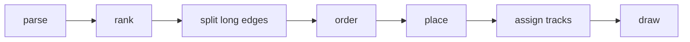

## A canvas of strokes

<!-- file: internal/mermaid/canvas.go -->
<!-- package: mermaid -->
<!-- imports: strings -->

litgo doesn't draw lines as characters directly. Each cell records which of its
four sides a stroke leaves through, and the character gets chosen at the end.
This means the right junction character shows up automatically wherever an edge
meets a box or two edges cross.

```go
// Direction bits of the line strokes leaving a cell.
const (
	up = 1 << iota
	down
	left
	right
)

type lineStyle int

const (
	solid lineStyle = iota
	dotted
	thick
	rounded
	double
)

type cell struct {
	bits  int
	style lineStyle
	r     rune // explicit content; wins over strokes
}

// canvas is a growable character grid. Lines are recorded as strokes so
// crossings and junctions resolve to the right box-drawing character.
type canvas struct {
	cells [][]cell
	w, h  int
}
```

`at` hands out pointers into slices that `grow` might reallocate, so a stroke
grows the canvas first and only then takes pointers.

```go
func (c *canvas) grow(x, y int) {
	for y >= len(c.cells) {
		c.cells = append(c.cells, nil)
	}
	for x >= len(c.cells[y]) {
		c.cells[y] = append(c.cells[y], cell{})
	}
	c.w, c.h = max(c.w, x+1), max(c.h, y+1)
}

func (c *canvas) at(x, y int) *cell {
	if x < 0 || y < 0 {
		return &cell{}
	}
	c.grow(x, y)
	return &c.cells[y][x]
}

func (c *canvas) put(x, y int, r rune) { c.at(x, y).r = r }

func (c *canvas) write(x, y int, s string) {
	for _, r := range s {
		c.put(x, y, r)
		x++
	}
}

// stroke draws a straight line between two cells in the same row or column.
func (c *canvas) stroke(x1, y1, x2, y2 int, st lineStyle) {
	dx, dy := sign(x2-x1), sign(y2-y1)
	if dx != 0 && dy != 0 {
		return
	}
	for x, y := x1, y1; x != x2 || y != y2; x, y = x+dx, y+dy {
		// Grow first: at() hands out pointers that a later grow would orphan.
		c.grow(max(x, x+dx, 0), max(y, y+dy, 0))
		a, b := c.at(x, y), c.at(x+dx, y+dy)
		// The first stroke through a cell decides its style; where styles
		// meet, the glyph lookup falls back to plain junctions.
		for _, p := range []*cell{a, b} {
			if p.bits == 0 {
				p.style = st
			}
		}
		switch {
		case dx > 0:
			a.bits |= right
			b.bits |= left
		case dx < 0:
			a.bits |= left
			b.bits |= right
		case dy > 0:
			a.bits |= down
			b.bits |= up
		default:
			a.bits |= up
			b.bits |= down
		}
	}
}

// rect outlines a box.
func (c *canvas) rect(x, y, w, h int, st lineStyle) {
	c.stroke(x, y, x+w-1, y, st)
	c.stroke(x+w-1, y, x+w-1, y+h-1, st)
	c.stroke(x+w-1, y+h-1, x, y+h-1, st)
	c.stroke(x, y+h-1, x, y, st)
}

func sign(n int) int {
	switch {
	case n > 0:
		return 1
	case n < 0:
		return -1
	}
	return 0
}
```

```go
var glyphs = map[int]rune{
	up: '│', down: '│', up | down: '│', left: '─', right: '─', left | right: '─',
	down | right: '┌', down | left: '┐', up | right: '└', up | left: '┘',
	up | down | right: '├', up | down | left: '┤', left | right | down: '┬', left | right | up: '┴',
	up | down | left | right: '┼',
}

var styled = map[lineStyle]map[int]rune{
	dotted:  {up | down: '┆', up: '┆', down: '┆', left | right: '┄', left: '┄', right: '┄'},
	thick:   {up | down: '┃', up: '┃', down: '┃', left | right: '━', left: '━', right: '━', down | right: '┏', down | left: '┓', up | right: '┗', up | left: '┛'},
	rounded: {down | right: '╭', down | left: '╮', up | right: '╰', up | left: '╯'},
	double:  {up | down: '║', left | right: '═', down | right: '╔', down | left: '╗', up | right: '╚', up | left: '╝'},
}

func (c *canvas) lines() []string {
	out := make([]string, 0, c.h)
	for _, row := range c.cells {
		var sb strings.Builder
		for _, cl := range row {
			switch {
			case cl.r != 0:
				sb.WriteRune(cl.r)
			case cl.bits != 0:
				if g, ok := styled[cl.style][cl.bits]; ok {
					sb.WriteRune(g)
				} else {
					sb.WriteRune(glyphs[cl.bits])
				}
			default:
				sb.WriteByte(' ')
			}
		}
		out = append(out, strings.TrimRight(sb.String(), " "))
	}
	for len(out) > 0 && out[len(out)-1] == "" {
		out = out[:len(out)-1]
	}
	return out
}
```

## Reading a flowchart

<!-- file: internal/mermaid/parse.go -->
<!-- package: mermaid -->
<!-- imports: fmt, regexp, strings -->

```go
type shape int

const (
	shapeRect shape = iota
	shapeRound
	shapeDiamond
	shapeDouble
	shapeBare // text only, used for state-diagram start and end markers
)

type fnode struct {
	id    string
	label []string
	shape shape
	dummy bool
	loop  bool // has an edge to itself

	rank, order  int
	sizeR, sizeO int // extent along the rank axis and the order axis
	posR, posO   int
}

func (n *fnode) centerO() int { return n.posO + n.sizeO/2 }

type fedge struct {
	from, to *fnode
	label    string
	style    lineStyle
	head     rune // '>' arrow, 'x', 'o', or 0 for an open link
	tailHead bool // <--> also points back at the source
	reversed bool // drawn against the layout direction (a back edge)
}

type graph struct {
	dir   string // TD, BT, LR, RL
	nodes []*fnode
	byID  map[string]*fnode
	edges []*fedge
}

func (g *graph) node(id string) *fnode {
	if n, ok := g.byID[id]; ok {
		return n
	}
	n := &fnode{id: id, label: []string{id}}
	g.byID[id] = n
	g.nodes = append(g.nodes, n)
	return n
}
```

```go
var (
	headerRe  = regexp.MustCompile(`^(?:graph|flowchart)\s*(TB|TD|BT|LR|RL)?\s*;?\s*$`)
	idRe      = regexp.MustCompile(`^[\p{L}\p{N}_]+`)
	ignoredRe = regexp.MustCompile(`^(style|classDef|class|click|linkStyle|accTitle|accDescr|direction|end\b|subgraph\b)`)
	brRe      = regexp.MustCompile(`(?i)<br\s*/?>|\\n`)
	tagRe     = regexp.MustCompile(`</?[a-zA-Z][^>]*>`)

	linkTextRes = []*regexp.Regexp{
		regexp.MustCompile(`^(<)?--\s*([^\s\->|][^|>]*?)\s*-{2,}([>xo]?)`),
		regexp.MustCompile(`^(<)?-\.\s*([^\s.\-][^|>]*?)\s*\.+-([>xo]?)`),
		regexp.MustCompile(`^(<)?==\s*([^\s=>|][^|>]*?)\s*={2,}([>xo]?)`),
	}
	linkRe     = regexp.MustCompile(`^(<)?(-{2,}|={2,}|-\.+-)([>xo]?)`)
	pipeTextRe = regexp.MustCompile(`^\s*\|([^|]*)\|`)
)

var shapes = []struct {
	open, close string
	shape       shape
}{
	{"(((", ")))", shapeRound}, {"((", "))", shapeRound}, {"([", "])", shapeRound},
	{"[[", "]]", shapeDouble}, {"[(", ")]", shapeRound}, {"[/", "/]", shapeRect},
	{"[/", "\\]", shapeRect}, {"[\\", "\\]", shapeRect}, {"[\\", "/]", shapeRect},
	{"{{", "}}", shapeDiamond}, {"(", ")", shapeRound}, {"[", "]", shapeRect},
	{"{", "}", shapeDiamond}, {">", "]", shapeRect},
}

func cleanLabel(s string) []string {
	s = strings.TrimSpace(s)
	if len(s) >= 2 && s[0] == '"' && s[len(s)-1] == '"' {
		s = s[1 : len(s)-1]
	}
	s = strings.Trim(s, "`")
	s = brRe.ReplaceAllString(s, "\n")
	s = tagRe.ReplaceAllString(s, "")
	s = strings.NewReplacer("#quot;", `"`, "&quot;", `"`, "&amp;", "&", "&lt;", "<", "&gt;", ">", "**", "").Replace(s)
	var out []string
	for _, l := range strings.Split(s, "\n") {
		out = append(out, strings.TrimSpace(l))
	}
	return out
}
```

A statement is a chain: a group of nodes, a link, another group, another link,
and so on. `A & B --> C` fans in, and `A --> B --> C` keeps the chain going.

```go
type stmt struct {
	g   *graph
	s   string
	pos int
}

func (p *stmt) rest() string { return p.s[p.pos:] }

func (p *stmt) skip() {
	for p.pos < len(p.s) && (p.s[p.pos] == ' ' || p.s[p.pos] == '\t') {
		p.pos++
	}
}

func (p *stmt) node() *fnode {
	p.skip()
	id := idRe.FindString(p.rest())
	if id == "" {
		return nil
	}
	p.pos += len(id)
	n := p.g.node(id)
	rest := p.rest()
	for _, sh := range shapes {
		if !strings.HasPrefix(rest, sh.open) {
			continue
		}
		// Find the closer, skipping over quoted text.
		inQuote := false
		for i := len(sh.open); i < len(rest); i++ {
			if rest[i] == '"' {
				inQuote = !inQuote
			}
			if !inQuote && strings.HasPrefix(rest[i:], sh.close) {
				n.label = cleanLabel(rest[len(sh.open):i])
				n.shape = sh.shape
				p.pos += i + len(sh.close)
				goto shaped
			}
		}
	}
shaped:
	if strings.HasPrefix(p.rest(), ":::") {
		p.pos += 3
		p.pos += len(idRe.FindString(p.rest()))
	}
	return n
}

func (p *stmt) group() []*fnode {
	var out []*fnode
	for {
		n := p.node()
		if n == nil {
			return out
		}
		out = append(out, n)
		p.skip()
		if !strings.HasPrefix(p.rest(), "&") {
			return out
		}
		p.pos++
	}
}

func (p *stmt) link() *fedge {
	p.skip()
	rest := p.rest()
	styleOf := func(s string) lineStyle {
		switch {
		case strings.HasPrefix(s, "="):
			return thick
		case strings.Contains(s, "."):
			return dotted
		}
		return solid
	}
	head := func(s string) rune {
		if s == "" {
			return 0
		}
		return rune(s[0])
	}
	for i, re := range linkTextRes {
		if m := re.FindStringSubmatch(rest); m != nil {
			p.pos += len(m[0])
			return &fedge{label: strings.Join(cleanLabel(m[2]), " "), style: []lineStyle{solid, dotted, thick}[i], head: head(m[3]), tailHead: m[1] != ""}
		}
	}
	if m := linkRe.FindStringSubmatch(rest); m != nil {
		p.pos += len(m[0])
		e := &fedge{style: styleOf(m[2]), head: head(m[3]), tailHead: m[1] != ""}
		if t := pipeTextRe.FindStringSubmatch(p.rest()); t != nil {
			p.pos += len(t[0])
			e.label = strings.Join(cleanLabel(t[1]), " ")
		}
		return e
	}
	return nil
}

func (g *graph) statement(s string) {
	p := &stmt{g: g, s: s}
	from := p.group()
	for len(from) > 0 {
		e := p.link()
		if e == nil {
			return
		}
		to := p.group()
		for _, a := range from {
			for _, b := range to {
				edge := *e
				edge.from, edge.to = a, b
				g.edges = append(g.edges, &edge)
			}
		}
		from = to
	}
}

func statements(src string) []string {
	var out []string
	for _, line := range strings.Split(src, "\n") {
		if i := strings.Index(line, "%%"); i >= 0 {
			line = line[:i]
		}
		// Semicolons separate statements, except inside quotes or brackets.
		depth, inQuote, start := 0, false, 0
		for i, r := range line {
			switch {
			case r == '"':
				inQuote = !inQuote
			case inQuote:
			case strings.ContainsRune("[({", r):
				depth++
			case strings.ContainsRune("])}", r):
				depth--
			case r == ';' && depth <= 0:
				out = append(out, strings.TrimSpace(line[start:i]))
				start = i + 1
			}
		}
		out = append(out, strings.TrimSpace(line[start:]))
	}
	var kept []string
	for _, s := range out {
		if s != "" {
			kept = append(kept, s)
		}
	}
	return kept
}

func parseFlowchart(lines []string) (*graph, error) {
	g := &graph{dir: "TD", byID: map[string]*fnode{}}
	if m := headerRe.FindStringSubmatch(lines[0]); m != nil && m[1] != "" {
		g.dir = m[1]
	}
	if g.dir == "TB" {
		g.dir = "TD"
	}
	for _, s := range lines[1:] {
		if ignoredRe.MatchString(s) {
			continue
		}
		g.statement(s)
	}
	if len(g.nodes) == 0 {
		return nil, fmt.Errorf("flowchart has no nodes")
	}
	return g, nil
}
```

A state diagram is a flowchart with different punctuation.

```go
var (
	stateEdgeRe  = regexp.MustCompile(`^(\[\*\]|[\p{L}\p{N}_]+)\s*-->\s*(\[\*\]|[\p{L}\p{N}_]+)\s*(?::\s*(.*))?$`)
	stateAliasRe = regexp.MustCompile(`^state\s+"([^"]*)"\s+as\s+([\p{L}\p{N}_]+)`)
	stateDescRe  = regexp.MustCompile(`^([\p{L}\p{N}_]+)\s*:\s*(.+)$`)
	stateDirRe   = regexp.MustCompile(`^direction\s+(TB|TD|BT|LR|RL)`)
)

func parseState(lines []string) (*graph, error) {
	g := &graph{dir: "TD", byID: map[string]*fnode{}}
	inNote := false
	for _, s := range lines[1:] {
		switch {
		case inNote:
			inNote = !strings.HasPrefix(s, "end note")
		case strings.HasPrefix(s, "note "):
			inNote = !strings.Contains(s, ":")
		case stateDirRe.MatchString(s):
			if g.dir = stateDirRe.FindStringSubmatch(s)[1]; g.dir == "TB" {
				g.dir = "TD"
			}
		case stateAliasRe.MatchString(s):
			m := stateAliasRe.FindStringSubmatch(s)
			n := g.node(m[2])
			n.label, n.shape = cleanLabel(m[1]), shapeRound
		case stateEdgeRe.MatchString(s):
			m := stateEdgeRe.FindStringSubmatch(s)
			end := func(id string, start bool) *fnode {
				if id != "[*]" {
					n := g.node(id)
					if n.shape == shapeRect {
						n.shape = shapeRound
					}
					return n
				}
				n := g.node("[*]end")
				n.label = []string{"◉"}
				if start {
					n = g.node("[*]start")
					n.label = []string{"●"}
				}
				n.shape = shapeBare
				return n
			}
			g.edges = append(g.edges, &fedge{from: end(m[1], true), to: end(m[2], false),
				label: strings.Join(cleanLabel(m[3]), " "), head: '>'})
		case stateDescRe.MatchString(s):
			m := stateDescRe.FindStringSubmatch(s)
			n := g.node(m[1])
			n.label, n.shape = cleanLabel(m[2]), shapeRound
		}
	}
	if len(g.nodes) == 0 {
		return nil, fmt.Errorf("state diagram has no states")
	}
	return g, nil
}

// Render draws Mermaid source as text.
func Render(src string) ([]string, error) {
	lines := statements(src)
	if len(lines) == 0 {
		return nil, fmt.Errorf("empty diagram")
	}
	kind := strings.Fields(lines[0])[0]
	switch {
	case kind == "graph" || kind == "flowchart" || strings.HasPrefix(kind, "flowchart"):
		g, err := parseFlowchart(lines)
		if err != nil {
			return nil, err
		}
		return g.render(), nil
	case strings.HasPrefix(kind, "stateDiagram"):
		g, err := parseState(lines)
		if err != nil {
			return nil, err
		}
		return g.render(), nil
	case kind == "sequenceDiagram":
		return renderSequence(lines[1:])
	}
	return nil, fmt.Errorf("%s diagrams are not rendered in the terminal yet (flowchart, stateDiagram and sequenceDiagram are)", kind)
}
```

## Layout

<!-- file: internal/mermaid/layout.go -->
<!-- package: mermaid -->
<!-- imports: sort, unicode/utf8 -->

The layout uses two abstract axes. The *rank* axis is the direction the graph
flows in, and the *order* axis goes across it. Top-down and left-to-right
diagrams are the same computation with the axes swapped at drawing time, and
bottom-up and right-to-left diagrams are mirror images of those two.

```go
// seg is one rank-to-rank hop of an edge; long edges become chains of
// segments through dummy nodes.
type seg struct {
	from, to    *fnode
	edge        *fedge
	first, last bool
	track       int
}

type layout struct {
	g        *graph
	vertical bool // ranks stack top-to-bottom (TD/BT) rather than left-to-right
	mirror   bool // BT and RL: flip the rank axis
	ranks    [][]*fnode
	segs     [][]*seg // by gap: segs[r] joins rank r to rank r+1
	preds    map[*fnode][]*fnode
	succs    map[*fnode][]*fnode

	rankStart, rankSize []int
	gapStub, gapTracks  []int
	gapLabel            []int
	totalR              int
}

func (g *graph) render() []string {
	l := &layout{g: g, vertical: g.dir == "TD" || g.dir == "BT", mirror: g.dir == "BT" || g.dir == "RL",
		preds: map[*fnode][]*fnode{}, succs: map[*fnode][]*fnode{}}
	l.rank()
	l.split()
	l.order()
	l.measure()
	l.placeO()
	l.tracks()
	l.placeR()
	return l.draw()
}
```

To break cycles, the layout reverses the back edges while it computes ranks.
They still get drawn with the arrowhead at the correct end. After that, a
node's rank is the length of its longest path from a source.

```go
// rank breaks cycles, then assigns each node its longest-path depth.
func (l *layout) rank() {
	g := l.g
	var edges []*fedge
	for _, e := range g.edges {
		if e.from == e.to {
			e.from.loop = true
			continue
		}
		edges = append(edges, e)
	}
	g.edges = edges

	out := map[*fnode][]*fedge{}
	for _, e := range g.edges {
		out[e.from] = append(out[e.from], e)
	}
	state := map[*fnode]int{}
	var visit func(n *fnode)
	visit = func(n *fnode) {
		state[n] = 1
		for _, e := range out[n] {
			switch state[e.to] {
			case 0:
				visit(e.to)
			case 1: // back edge: lay it out reversed, draw the arrow the right way
				e.reversed = true
			}
		}
		state[n] = 2
	}
	for _, n := range g.nodes {
		if state[n] == 0 {
			visit(n)
		}
	}
	for _, e := range g.edges {
		if e.reversed {
			e.from, e.to = e.to, e.from
		}
	}

	indeg := map[*fnode]int{}
	succ := map[*fnode][]*fnode{}
	for _, e := range g.edges {
		indeg[e.to]++
		succ[e.from] = append(succ[e.from], e.to)
	}
	var queue, topo []*fnode
	for _, n := range g.nodes {
		if indeg[n] == 0 {
			queue = append(queue, n)
		}
	}
	for len(queue) > 0 {
		n := queue[0]
		queue = queue[1:]
		topo = append(topo, n)
		for _, m := range succ[n] {
			m.rank = max(m.rank, n.rank+1)
			if indeg[m]--; indeg[m] == 0 {
				queue = append(queue, m)
			}
		}
	}
	// Pull sources down next to what they feed, so they do not float at the top.
	hasPred := map[*fnode]bool{}
	for _, e := range g.edges {
		hasPred[e.to] = true
	}
	for i := len(topo) - 1; i >= 0; i-- {
		n := topo[i]
		if hasPred[n] || len(succ[n]) == 0 {
			continue
		}
		lowest := succ[n][0].rank
		for _, m := range succ[n] {
			lowest = min(lowest, m.rank)
		}
		n.rank = lowest - 1
	}
}

// split inserts dummy nodes so every segment spans exactly one rank.
func (l *layout) split() {
	maxRank := 0
	for _, n := range l.g.nodes {
		maxRank = max(maxRank, n.rank)
	}
	l.ranks = make([][]*fnode, maxRank+1)
	l.segs = make([][]*seg, maxRank)
	for _, n := range l.g.nodes {
		l.ranks[n.rank] = append(l.ranks[n.rank], n)
	}
	for _, e := range l.g.edges {
		prev := e.from
		for r := e.from.rank + 1; r <= e.to.rank; r++ {
			next := e.to
			if r < e.to.rank {
				next = &fnode{dummy: true, rank: r}
				l.ranks[r] = append(l.ranks[r], next)
			}
			l.segs[r-1] = append(l.segs[r-1], &seg{from: prev, to: next, edge: e, first: prev == e.from, last: next == e.to})
			l.preds[next] = append(l.preds[next], prev)
			l.succs[prev] = append(l.succs[prev], next)
			prev = next
		}
	}
}
```

Within a rank, the nodes get ordered to reduce crossings. The layout repeatedly
sorts each rank by the average position of each node's neighbours in the
adjacent rank.

```go
func (l *layout) crossings() int {
	total := 0
	for _, segs := range l.segs {
		for i, a := range segs {
			for _, b := range segs[i+1:] {
				if (a.from.order-b.from.order)*(a.to.order-b.to.order) < 0 {
					total++
				}
			}
		}
	}
	return total
}

// order reduces crossings with barycenter sweeps, keeping the best result.
func (l *layout) order() {
	index := func() {
		for _, rank := range l.ranks {
			for i, n := range rank {
				n.order = i
			}
		}
	}
	index()
	best, bestCross := l.snapshot(), l.crossings()
	sweep := func(r int, neighbours map[*fnode][]*fnode) {
		rank := l.ranks[r]
		weight := map[*fnode]float64{}
		for _, n := range rank {
			weight[n] = float64(n.order)
			if ns := neighbours[n]; len(ns) > 0 {
				sum := 0
				for _, m := range ns {
					sum += m.order
				}
				weight[n] = float64(sum) / float64(len(ns))
			}
		}
		sort.SliceStable(rank, func(i, j int) bool { return weight[rank[i]] < weight[rank[j]] })
		for i, n := range rank {
			n.order = i
		}
	}
	for iter := 0; iter < 6 && bestCross > 0; iter++ {
		for r := 1; r < len(l.ranks); r++ {
			sweep(r, l.preds)
		}
		for r := len(l.ranks) - 2; r >= 0; r-- {
			sweep(r, l.succs)
		}
		if c := l.crossings(); c < bestCross {
			best, bestCross = l.snapshot(), c
		}
	}
	l.ranks = best
	index()
}

func (l *layout) snapshot() [][]*fnode {
	out := make([][]*fnode, len(l.ranks))
	for i, r := range l.ranks {
		out[i] = append([]*fnode{}, r...)
	}
	return out
}
```

```go
func (n *fnode) boxSize() (w, h int) {
	if n.dummy {
		return 1, 1
	}
	if n.loop && len(n.label) > 0 {
		n.label[len(n.label)-1] += " ↺"
		n.loop = false
	}
	for _, s := range n.label {
		w = max(w, utf8.RuneCountInString(s))
	}
	if n.shape == shapeBare {
		return max(w, 1), 1
	}
	w += 4
	if w%2 == 0 {
		w++ // odd widths give edges a true centre column
	}
	return w, len(n.label) + 2
}

func (l *layout) measure() {
	for _, rank := range l.ranks {
		for _, n := range rank {
			w, h := n.boxSize()
			if l.vertical {
				n.sizeO, n.sizeR = w, h
			} else {
				n.sizeO, n.sizeR = h, w
			}
		}
	}
}

// placeO positions nodes along the order axis: left to right in rank order,
// then nudged right toward the average of their neighbours so parents sit
// over children and chains run straight.
func (l *layout) placeO() {
	gap := 1
	if l.vertical {
		gap = 3
	}
	sep := func(a, b *fnode) int {
		if a.dummy && b.dummy {
			return max(gap-1, 1)
		}
		return gap
	}
	centre := func(ns []*fnode) int {
		sum := 0
		for _, m := range ns {
			sum += m.centerO()
		}
		return sum / len(ns)
	}
	for _, rank := range l.ranks {
		for i, n := range rank {
			at := 0
			if i > 0 {
				at = rank[i-1].posO + rank[i-1].sizeO + sep(rank[i-1], n)
			}
			if ps := l.preds[n]; len(ps) > 0 {
				want := centre(ps) - n.sizeO/2
				if i == 0 || want > at {
					at = want
				}
			}
			n.posO = at
		}
	}
	nudge := func(rank []*fnode, neighbours map[*fnode][]*fnode) {
		for i := len(rank) - 1; i >= 0; i-- {
			n := rank[i]
			ns := neighbours[n]
			if len(ns) == 0 {
				continue
			}
			want := centre(ns) - n.sizeO/2
			if i+1 < len(rank) {
				want = min(want, rank[i+1].posO-sep(n, rank[i+1])-n.sizeO)
			}
			n.posO = max(n.posO, want)
		}
	}
	for iter := 0; iter < 3; iter++ {
		for r := len(l.ranks) - 2; r >= 0; r-- {
			nudge(l.ranks[r], l.succs)
		}
		for r := 1; r < len(l.ranks); r++ {
			nudge(l.ranks[r], l.preds)
		}
	}

	// Normalise, leaving room on the left for labels centred on an edge.
	lo := 1 << 30
	for _, rank := range l.ranks {
		for _, n := range rank {
			lo = min(lo, n.posO)
		}
	}
	if l.vertical {
		for _, segs := range l.segs {
			for _, s := range segs {
				if !s.last || s.edge.label == "" {
					continue
				}
				n := utf8.RuneCountInString(s.edge.label)
				if port := l.portTo(s); !s.edge.reversed {
					lo = min(lo, port-n/2)
				} else if port < s.to.centerO() {
					lo = min(lo, port-1-n)
				}
			}
		}
	}
	for _, rank := range l.ranks {
		for _, n := range rank {
			n.posO -= lo
		}
	}
}
```

An edge leaves a node from the middle of its side, runs to a *track* in the gap
between two ranks, follows the track, and then goes on to its target. All the
edges from one source share a track, so they look like a tree. Different
sources get different tracks, so edges only merge where they really do merge.

```go
// Back edges get their own port, off-centre, so they neither share a trunk
// with forward edges nor merge into a forward edge's arrowhead.
func (l *layout) portOffset(n *fnode, toward int) int {
	if !l.vertical || n.dummy || n.shape == shapeBare {
		return 0
	}
	off := min(2, (n.sizeO-3)/2)
	if toward < n.centerO() {
		return -off // leave on the side the edge is heading for
	}
	return off
}

func (l *layout) portFrom(s *seg) int {
	if s.first && s.edge.reversed {
		return s.from.centerO() + l.portOffset(s.from, s.to.centerO())
	}
	return s.from.centerO()
}

func (l *layout) portTo(s *seg) int {
	if s.last && s.edge.reversed {
		return s.to.centerO() + l.portOffset(s.to, s.from.centerO())
	}
	return s.to.centerO()
}

// tracks gives each source in a gap its own lane for the run across the
// order axis, so edges from different sources never merge by accident.
func (l *layout) tracks() {
	n := len(l.segs)
	l.gapStub, l.gapTracks, l.gapLabel = make([]int, n), make([]int, n), make([]int, n)
	for g, segs := range l.segs {
		type group struct {
			lo, hi int
			segs   []*seg
		}
		type key struct {
			n    *fnode
			port int
		}
		bySource := map[key]*group{}
		var groups []*group
		for _, s := range segs {
			k := key{s.from, l.portFrom(s)}
			gr := bySource[k]
			if gr == nil {
				gr = &group{lo: k.port, hi: k.port}
				bySource[k] = gr
				groups = append(groups, gr)
			}
			gr.lo, gr.hi = min(gr.lo, l.portTo(s)), max(gr.hi, l.portTo(s))
			gr.segs = append(gr.segs, s)

			if s.last && s.edge.label != "" {
				if l.vertical {
					l.gapLabel[g] = 1
				} else {
					l.gapLabel[g] = max(l.gapLabel[g], utf8.RuneCountInString(s.edge.label)+2)
				}
			}
			if !l.vertical || (s.first && (s.edge.reversed || s.edge.tailHead)) {
				l.gapStub[g] = 1
			}
		}
		sort.SliceStable(groups, func(i, j int) bool { return groups[i].lo < groups[j].lo })
		var lanes [][]*group
		for _, gr := range groups {
			if gr.lo == gr.hi {
				continue // straight through: needs no lane of its own
			}
			placed := false
			for t := range lanes {
				free := true
				for _, other := range lanes[t] {
					if gr.lo <= other.hi+1 && other.lo <= gr.hi+1 {
						free = false
						break
					}
				}
				if free {
					lanes[t] = append(lanes[t], gr)
					for _, s := range gr.segs {
						s.track = t
					}
					placed = true
					break
				}
			}
			if !placed {
				lanes = append(lanes, []*group{gr})
				for _, s := range gr.segs {
					s.track = len(lanes) - 1
				}
			}
		}
		l.gapTracks[g] = max(len(lanes), 1)
	}
}

func (l *layout) trackStep() int {
	if l.vertical {
		return 1
	}
	return 2
}

func (l *layout) placeR() {
	l.rankStart, l.rankSize = make([]int, len(l.ranks)), make([]int, len(l.ranks))
	at := 0
	for r, rank := range l.ranks {
		for _, n := range rank {
			l.rankSize[r] = max(l.rankSize[r], n.sizeR)
		}
		l.rankStart[r] = at
		for _, n := range rank {
			n.posR = at
			if n.dummy {
				n.sizeR = l.rankSize[r]
			}
		}
		at += l.rankSize[r]
		if r < len(l.segs) {
			at += l.gapStub[r] + l.gapTracks[r]*l.trackStep() + l.gapLabel[r] + 1
		}
	}
	l.totalR = at
}

// trackPos is the rank-axis coordinate of a segment's lane.
func (l *layout) trackPos(gap int, s *seg) int {
	return l.rankStart[gap] + l.rankSize[gap] + l.gapStub[gap] + s.track*l.trackStep()
}
```

## Drawing

<!-- file: internal/mermaid/draw.go -->
<!-- package: mermaid -->
<!-- imports: unicode/utf8 -->

```go
// pt converts layout coordinates (rank axis, order axis) to canvas x, y.
func (l *layout) pt(r, o int) (x, y int) {
	if l.mirror {
		r = l.totalR - 1 - r
	}
	if l.vertical {
		return o, r
	}
	return r, o
}

func (l *layout) stroke(c *canvas, r1, o1, r2, o2 int, st lineStyle) {
	x1, y1 := l.pt(r1, o1)
	x2, y2 := l.pt(r2, o2)
	c.stroke(x1, y1, x2, y2, st)
}

// arrow picks the head glyph for travel from (r1,o1) toward (r2,o2).
func (l *layout) arrow(kind rune, r1, o1, r2, o2 int) rune {
	switch kind {
	case 'x':
		return '×'
	case 'o':
		return '○'
	}
	x1, y1 := l.pt(r1, o1)
	x2, y2 := l.pt(r2, o2)
	switch {
	case x2 > x1:
		return '▶'
	case x2 < x1:
		return '◀'
	case y2 < y1:
		return '▲'
	}
	return '▼'
}

func (l *layout) draw() []string {
	c := &canvas{}
	type labelAt struct {
		x, y int
		s    string
	}
	var labels []labelAt
	var heads []labelAt

	for g, segs := range l.segs {
		for _, s := range segs {
			e := s.edge
			o1, o2 := l.portFrom(s), l.portTo(s)
			start := s.from.posR + s.from.sizeR - 1
			track := l.trackPos(g, s)
			end := s.to.posR // the target's border (or the dummy's first cell)

			// An arrowhead sits just outside the box it points at; the line
			// stops there. Open ends run on into the border.
			headAtEnd := s.last && !e.reversed && e.head != 0 || s.last && e.reversed && e.tailHead
			headAtStart := s.first && e.reversed && e.head != 0 || s.first && !e.reversed && e.tailHead
			if s.to.shape == shapeBare && !s.to.dummy {
				headAtEnd = false
				end--
			}
			stop := end
			if headAtEnd {
				stop = end - 1
			}
			l.stroke(c, start, o1, track, o1, e.style)
			l.stroke(c, track, o1, track, o2, e.style)
			l.stroke(c, track, o2, stop, o2, e.style)

			if headAtEnd {
				kind := e.head
				if e.reversed {
					kind = '>'
				}
				x, y := l.pt(stop, o2)
				heads = append(heads, labelAt{x, y, string(l.arrow(kind, track, o2, end, o2))})
			}
			if headAtStart {
				kind := e.head
				if !e.reversed {
					kind = '>'
				}
				x, y := l.pt(start+1, o1)
				heads = append(heads, labelAt{x, y, string(l.arrow(kind, track, o1, start, o1))})
			}
			if s.last && e.label != "" {
				n := utf8.RuneCountInString(e.label)
				if l.vertical {
					x, y := l.pt(end-2, o2)
					if e.reversed && o2 < s.to.centerO() {
						labels = append(labels, labelAt{x - 1 - n, y, e.label})
					} else if e.reversed {
						labels = append(labels, labelAt{x + 2, y, e.label})
					} else {
						labels = append(labels, labelAt{x - n/2, y, e.label})
					}
				} else {
					zone := l.gapLabel[g]
					r := end - 1 - zone + (zone-n)/2
					if l.mirror {
						r += n - 1
					}
					x, y := l.pt(r, o2)
					labels = append(labels, labelAt{x, y, e.label})
				}
			}
		}
	}

	for _, rank := range l.ranks {
		for _, n := range rank {
			x1, y1 := l.pt(n.posR, n.posO)
			x2, y2 := l.pt(n.posR+n.sizeR-1, n.posO+n.sizeO-1)
			x, y := min(x1, x2), min(y1, y2)
			w, h := abs(x2-x1)+1, abs(y2-y1)+1
			if n.dummy {
				l.stroke(c, n.posR, n.centerO(), n.posR+n.sizeR-1, n.centerO(), solid)
				continue
			}
			if n.shape == shapeBare {
				c.write(x, y, n.label[0])
				continue
			}
			// Blank the interior so nothing shows through the box.
			for yy := y + 1; yy < y+h-1; yy++ {
				for xx := x + 1; xx < x+w-1; xx++ {
					*c.at(xx, yy) = cell{r: ' '}
				}
			}
			st := map[shape]lineStyle{shapeRound: rounded, shapeDouble: double}[n.shape]
			c.rect(x, y, w, h, st)
			if n.shape == shapeDiamond {
				for _, p := range [][2]int{{x, y}, {x + w - 1, y}, {x, y + h - 1}, {x + w - 1, y + h - 1}} {
					c.put(p[0], p[1], '◆')
				}
			}
			for i, s := range n.label {
				c.write(x+(w-utf8.RuneCountInString(s))/2, y+1+i, s)
			}
		}
	}
	for _, h := range heads {
		c.write(h.x, h.y, h.s)
	}
	for _, lb := range labels {
		c.write(lb.x, lb.y, lb.s)
	}
	return c.lines()
}

func abs(n int) int {
	if n < 0 {
		return -n
	}
	return n
}
```

## Sequence diagrams

<!-- file: internal/mermaid/sequence.go -->
<!-- package: mermaid -->
<!-- imports: fmt, regexp, strings, unicode/utf8 -->

Participants go across the top and time runs down. The columns are spaced so
that every message label fits between the lifelines it spans.

```go
type participant struct {
	id, label string
	x         int // lifeline column
	w         int // header box width
}

type seqEvent struct {
	kind     string // message, note, block
	from, to *participant
	text     string
	dotted   bool
	head     string // ">" filled, ")" async, "x" cross, "" open
	side     string // notes: over, left, right
}

var (
	participantRe = regexp.MustCompile(`^(?:participant|actor)\s+(\S+?)(?:\s+as\s+(.+))?$`)
	messageRe     = regexp.MustCompile(`^(.+?)\s*(<<-->>|<<->>|-->>|->>|--x|-x|--\)|-\)|-->|->)\s*([+-]?)\s*([^:]+?)\s*:\s*(.*)$`)
	noteRe        = regexp.MustCompile(`(?i)^note\s+(over|left of|right of)\s+([^:]+?)\s*:\s*(.*)$`)
	blockRe       = regexp.MustCompile(`^(loop|alt|opt|par|critical|break|else|and|option|rect)\b\s*(.*)$`)
)

func rlen(s string) int { return utf8.RuneCountInString(s) }

func renderSequence(lines []string) ([]string, error) {
	var parts []*participant
	byID := map[string]*participant{}
	get := func(id string) *participant {
		id = strings.TrimSpace(id)
		if p, ok := byID[id]; ok {
			return p
		}
		p := &participant{id: id, label: id}
		byID[id] = p
		parts = append(parts, p)
		return p
	}

	var events []seqEvent
	for _, s := range lines {
		switch {
		case participantRe.MatchString(s):
			m := participantRe.FindStringSubmatch(s)
			p := get(m[1])
			if m[2] != "" {
				p.label = strings.Join(cleanLabel(m[2]), " ")
			}
		case noteRe.MatchString(s):
			m := noteRe.FindStringSubmatch(s)
			ids := strings.Split(m[2], ",")
			ev := seqEvent{kind: "note", side: strings.ToLower(strings.Fields(m[1])[0]), from: get(ids[0]), text: strings.Join(cleanLabel(m[3]), " ")}
			ev.to = ev.from
			if len(ids) > 1 {
				ev.to = get(ids[1])
			}
			events = append(events, ev)
		case s == "end":
			events = append(events, seqEvent{kind: "block", text: "end"})
		case blockRe.MatchString(s):
			m := blockRe.FindStringSubmatch(s)
			label := m[1]
			if m[2] != "" && m[1] != "rect" {
				label += ": " + m[2]
			}
			events = append(events, seqEvent{kind: "block", text: label})
		case messageRe.MatchString(s):
			m := messageRe.FindStringSubmatch(s)
			ev := seqEvent{kind: "message", from: get(m[1]), to: get(m[4]), text: strings.Join(cleanLabel(m[5]), " ")}
			arrow := m[2]
			ev.dotted = strings.HasPrefix(arrow, "--") || strings.HasPrefix(arrow, "<<--")
			switch {
			case strings.HasSuffix(arrow, ">>"):
				ev.head = ">"
			case strings.HasSuffix(arrow, "x"):
				ev.head = "x"
			case strings.HasSuffix(arrow, ")"):
				ev.head = ")"
			}
			events = append(events, ev)
		}
	}
	if len(parts) == 0 {
		return nil, fmt.Errorf("sequence diagram has no participants")
	}

	// Column spacing: wide enough for headers and for every label that has to
	// fit between two lifelines.
	index := map[*participant]int{}
	for i, p := range parts {
		index[p] = i
		p.w = rlen(p.label) + 4
		if p.w%2 == 0 {
			p.w++
		}
	}
	gaps := make([]int, len(parts)) // gaps[i]: distance from lifeline i to i+1
	for i := 0; i+1 < len(parts); i++ {
		gaps[i] = parts[i].w/2 + parts[i+1].w/2 + 3
	}
	tail := 0 // room needed right of the last lifeline
	for _, ev := range events {
		if ev.from == nil {
			continue
		}
		a, b := index[ev.from], index[ev.to]
		if a > b {
			a, b = b, a
		}
		need := rlen(ev.text) + 4
		switch {
		case ev.kind == "note" && ev.side == "right", a == b && ev.kind == "message":
			need = rlen(ev.text) + 6
			if a+1 < len(parts) {
				gaps[a] = max(gaps[a], need)
			} else {
				tail = max(tail, need)
			}
		case ev.kind == "note" && ev.side == "left":
			if a > 0 {
				gaps[a-1] = max(gaps[a-1], need+2)
			}
		case a != b:
			have := 0
			for i := a; i < b; i++ {
				have += gaps[i]
			}
			if extra := need - have; extra > 0 {
				per := (extra + (b - a) - 1) / (b - a)
				for i := a; i < b; i++ {
					gaps[i] += per
				}
			}
		}
	}
	x := parts[0].w / 2
	for _, ev := range events {
		if ev.kind == "note" && ev.side == "left" && index[ev.from] == 0 {
			x = max(x, rlen(ev.text)+6)
		}
	}
	for i, p := range parts {
		p.x = x
		x += gaps[i]
	}
	last := parts[len(parts)-1]
	totalW := max(last.x+last.w/2+1, last.x+tail)

	c := &canvas{}
	for _, p := range parts {
		c.rect(p.x-p.w/2, 0, p.w, 3, solid)
		c.write(p.x-rlen(p.label)/2, 1, p.label)
	}
	y := 3
	lifelines := func(rows int) {
		for i := 0; i < rows; i++ {
			for _, p := range parts {
				c.stroke(p.x, y-1, p.x, y, solid)
			}
			y++
		}
	}
	for _, ev := range events {
		switch ev.kind {
		case "block":
			lifelines(1)
			label := "[" + ev.text + "]"
			for xx := 0; xx < totalW; xx++ {
				*c.at(xx, y-1) = cell{r: '┄'}
			}
			c.write(2, y-1, " "+label+" ")
		case "note":
			a, b := ev.from, ev.to
			if index[a] > index[b] {
				a, b = b, a
			}
			w := rlen(ev.text) + 4
			var left int
			switch ev.side {
			case "right":
				left = a.x + 2
			case "left":
				left = a.x - 1 - w
			default:
				span := b.x - a.x
				w = max(w, span+5)
				left = (a.x+b.x)/2 - w/2
			}
			left = max(left, 0)
			lifelines(3)
			for yy := y - 3; yy < y; yy++ {
				for xx := left; xx < left+w; xx++ {
					*c.at(xx, yy) = cell{}
				}
			}
			c.rect(left, y-3, w, 3, rounded)
			c.write(left+(w-rlen(ev.text))/2, y-2, ev.text)
		case "message":
			if ev.from == ev.to {
				lifelines(3)
				px := ev.from.x
				c.write(px+2, y-3, ev.text)
				c.stroke(px, y-2, px+4, y-2, solid)
				c.stroke(px+4, y-2, px+4, y-1, rounded)
				c.stroke(px+4, y-1, px+2, y-1, solid)
				c.at(px+4, y-2).style, c.at(px+4, y-1).style = rounded, rounded
				c.put(px+1, y-1, '◀')
				continue
			}
			lifelines(2)
			ax, bx := ev.from.x, ev.to.x
			dir := sign(bx - ax)
			lo, hi := min(ax, bx), max(ax, bx)
			c.write(lo+1+(hi-lo-1-rlen(ev.text))/2, y-2, ev.text)
			st := solid
			if ev.dotted {
				st = dotted
			}
			c.stroke(ax, y-1, bx-dir, y-1, st)
			head := map[string][2]rune{">": {'▶', '◀'}, ")": {'▷', '◁'}, "x": {'×', '×'}}[ev.head]
			if head[0] != 0 {
				if dir > 0 {
					c.put(bx-1, y-1, head[0])
				} else {
					c.put(bx+1, y-1, head[1])
				}
			}
		}
	}
	lifelines(1)
	return c.lines(), nil
}
```

<!-- file: internal/mermaid/mermaid_test.go -->
<!-- package: mermaid -->
<!-- imports: strings, testing -->

```go
var samples = []string{
	`graph TD
    A[Spawn n workers] --> B[Feed m jobs]
    B --> C{ctx cancelled?}
    C -->|yes| D[Return partial]
    C -->|no| E[Collect results]
    D --> F(Done)
    E --> F`,
	`flowchart LR
    jobs[(jobs chan)] --> w1[worker 1] & w2[worker 2] & w3[worker 3]
    w1 & w2 & w3 --> results[(results chan)]
    results -- collect --> main`,
	`graph TD
    A --> B --> C
    C -->|retry| A
    A --> D
    B -.-> D
    D ==> D`,
	`graph BT
    leaf --> root`,
	`stateDiagram-v2
    [*] --> Idle
    Idle --> Running: start
    Running --> Idle: stop
    Running --> [*]`,
	`sequenceDiagram
    participant M as main
    participant W as worker
    M->>W: job
    Note right of W: job * 2
    W-->>M: result
    loop until closed
      M->>M: collect
    end
    M-xW: cancel`,
}

func TestRenderSamples(t *testing.T) {
	for _, src := range samples {
		out, err := Render(src)
		if err != nil {
			t.Fatalf("%v\n%s", err, src)
		}
		t.Logf("\n%s\n\n%s", src, strings.Join(out, "\n"))
	}
}

func TestUnsupportedAndMalformed(t *testing.T) {
	if _, err := Render("gantt\n title x"); err == nil {
		t.Error("expected an error for gantt")
	}
	for _, src := range []string{"", "graph", "graph TD\n-->", "graph TD\nA -->", "sequenceDiagram", "stateDiagram-v2", "graph LR\nA[unclosed --> B"} {
		Render(src) // must not panic
	}
}
```

# Weaving

<!-- file: internal/weave/weave.go -->
<!-- package: weave -->
<!-- imports: fmt, html, os, os/exec, path/filepath, regexp, strings, github.com/tlehman/litgo/internal/lit, github.com/tlehman/litgo/internal/mermaid -->

Weaving turns the document into something you can read: a PDF typeset by
[Typst](https://typst.app), or an HTML page. pandoc does the Markdown
conversion and translates the TeX math into whatever the output format wants.
litgo adds the things the source hides. The `chunk:` and `file:` directives are
invisible as HTML comments, so they become headings over their blocks, with
links from each chunk to the places that use it and from each reference to its
chunk.

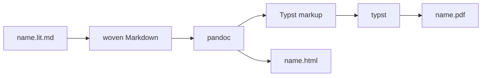

Each format has it's own `target` so that it can customize how things like escaping work.

```go
var slugRe = regexp.MustCompile(`[^a-z0-9]+`)

// slug is the anchor of a chunk, the same in every format.
func slug(name string) string {
	return "chunk-" + strings.Trim(slugRe.ReplaceAllString(strings.ToLower(name), "-"), "-")
}

// use is a place a chunk is referenced from. An empty ID is the program
// itself: an unnamed block.
type use struct{ ID, Name string }

// target is how one output format writes the things litgo adds.
type target struct {
	chunk     func(id, name, sign string, uses []use) string
	file      func(path string) string
	meta      func(text string) string // goes under the title; nil leaves it out
	literal   [2]string                // put around blocks whose references are only text
	diagrams  bool                     // draw Mermaid here: the format cannot run mermaid.js
	figure    func(svg string) string  // places a diagram that mermaid.js drew
	figures   map[int]string           // those drawings, by the line their block opens on
	dropTitle bool                     // the format sets the title itself
}
```

The woven Markdown is the source with some lines added before, after, or in
place of some of its lines.

```go
func weave(d *lit.Doc, t target) string {
	before, replace, after := map[int]string{}, map[int]string{}, map[int]string{}
	until := map[int]int{} // a replacement at line i stands for lines i to until[i]

	// <<label every chunk with its name and its uses>>
	for _, f := range d.Files[1:] {
		replace[f.Line] = t.file(f.Path)
	}
	// <<draw the diagrams if the format cannot>>
	// <<mark the blocks whose references are only text>>
	// <<put the summary under the title>>

	var sb strings.Builder
	for i := 0; i < len(d.Lines); i++ {
		sb.WriteString(before[i])
		if r, ok := replace[i]; ok {
			sb.WriteString(r)
			i = max(i, until[i])
			continue
		}
		sb.WriteString(d.Lines[i] + "\n")
		sb.WriteString(after[i])
	}
	return sb.String()
}
```

Only the first block of a chunk gets the anchor. Later blocks with the same
name continue the chunk, and the sign says so, using the notation literate
programs have used since WEB.

<!-- chunk: label every chunk with its name and its uses -->
```go
usedIn := map[string][]use{}
for _, c := range d.Chunks() {
	seen := map[string]bool{}
	for _, r := range c.Refs {
		u := use{Name: "the program"}
		if b := d.BlockAt(r.Line); b != nil && b.Chunk != "" {
			u = use{slug(b.Chunk), b.Chunk}
		}
		if !seen[u.Name] {
			seen[u.Name] = true
			usedIn[c.Name] = append(usedIn[c.Name], u)
		}
	}
}
count := map[string]int{}
for _, b := range d.Blocks {
	if b.Chunk == "" || !b.Tangled() {
		continue
	}
	count[b.Chunk]++
	id, sign := slug(b.Chunk), "≡"
	if count[b.Chunk] > 1 {
		id, sign = "", "+≡"
	}
	replace[b.ChunkLine] = t.chunk(id, b.Chunk, sign, usedIn[b.Chunk])
}
```

A web page can load mermaid.js but a PDF can't, so the diagrams have to be
drawn before Typst sees them. If mermaid.js has drawn a block, its SVG goes in
as a figure. Otherwise litgo already knows how to draw a diagram with box
characters, and in a monospaced font that still makes a decent figure. If litgo
can't draw a diagram either, it stays as source.

<!-- chunk: draw the diagrams if the format cannot -->
```go
if t.diagrams {
	for _, b := range d.Blocks {
		if b.Lang != "mermaid" || b.Strip > 0 {
			continue
		}
		if svg, ok := t.figures[b.Open]; ok {
			replace[b.Open], until[b.Open] = t.figure(svg), b.Close
			continue
		}
		lines, err := mermaid.Render(strings.Join(d.Lines[b.First():b.Last()+1], "\n"))
		if err != nil {
			continue
		}
		replace[b.Open], until[b.Open] = "```diagram\n"+strings.Join(lines, "\n")+"\n```\n", b.Close
	}
}
```

The drawing is done by [mermaid-cli](https://github.com/mermaid-js/mermaid-cli),
which runs mermaid.js in a headless browser. Starting a browser is slow, so all
the diagrams go to `mmdc` at once, as a Markdown file of nothing but Mermaid
blocks. It writes `out-1.svg`, `out-2.svg` and so on beside the name it's given.
One diagram with a mistake in it fails the whole batch, and then each diagram
gets a run of its own so that only the broken one is drawn as text. Without
`mmdc` they all are.

Typst draws SVG text itself, but not the HTML that mermaid.js likes to put in
labels, so `htmlLabels` is off.

```go
// drawn returns the SVG of each Mermaid block that mermaid-cli could draw,
// by the line the block opens on.
func drawn(d *lit.Doc) map[int]string {
	var at []int
	var srcs []string
	for _, b := range d.Blocks {
		if b.Lang == "mermaid" && b.Strip == 0 {
			at = append(at, b.Open)
			srcs = append(srcs, strings.Join(d.Lines[b.First():b.Last()+1], "\n"))
		}
	}
	if len(srcs) == 0 {
		return nil
	}
	bin, err := exec.LookPath("mmdc")
	if err != nil {
		fmt.Fprintln(os.Stderr, "litgo: mmdc is not installed (npm install -g @mermaid-js/mermaid-cli), so diagrams are drawn as text")
		return nil
	}
	svgs := mmdc(bin, srcs)
	if svgs == nil && len(srcs) > 1 {
		svgs = make([]string, len(srcs))
		for i, src := range srcs {
			if one := mmdc(bin, []string{src}); one != nil {
				svgs[i] = one[0]
			}
		}
	}
	figures := map[int]string{}
	for i, svg := range svgs {
		if svg != "" {
			figures[at[i]] = svg
		}
	}
	return figures
}

// mmdc draws every diagram in one run of mermaid-cli, or returns nil.
func mmdc(bin string, srcs []string) []string {
	dir, err := os.MkdirTemp("", "litgo-mermaid")
	if err != nil {
		return nil
	}
	defer os.RemoveAll(dir)
	var md strings.Builder
	for _, src := range srcs {
		md.WriteString("```mermaid\n" + src + "\n```\n\n")
	}
	os.WriteFile(filepath.Join(dir, "in.md"), []byte(md.String()), 0o644)
	os.WriteFile(filepath.Join(dir, "config.json"), []byte(`{"htmlLabels": false, "flowchart": {"htmlLabels": false}}`), 0o644)
	cmd := exec.Command(bin, "-i", "in.md", "-o", "out.svg", "-c", "config.json", "-b", "transparent", "-q")
	cmd.Dir = dir
	if err := cmd.Run(); err != nil {
		return nil
	}
	svgs := make([]string, len(srcs))
	for i := range srcs {
		svg, err := os.ReadFile(filepath.Join(dir, fmt.Sprintf("out-%d.svg", i+1)))
		if err != nil {
			return nil
		}
		svgs[i] = string(svg)
	}
	return svgs
}
```

References in woven code are shown as ⟨names⟩ and linked. That shouldn't happen
to text that only looks like a reference, which means `verbatim` blocks and
illustrations that aren't tangled at all.

<!-- chunk: mark the blocks whose references are only text -->
```go
if t.literal[0] != "" {
	for _, b := range d.Blocks {
		if (b.Tangled() && !b.Verbatim) || b.Strip > 0 {
			continue
		}
		if _, drawn := replace[b.Open]; drawn {
			continue
		}
		for i := b.First(); i <= b.Last(); i++ {
			if len(lit.RefsIn(d.Lines[i], i)) > 0 {
				before[b.Open] += t.literal[0]
				after[min(b.Close, len(d.Lines)-1)] += t.literal[1]
				break
			}
		}
	}
}
```

<!-- chunk: put the summary under the title -->
```go
title := titleLine(d)
if title >= 0 && t.dropTitle {
	replace[title] = ""
}
if t.meta != nil {
	if title >= 0 {
		after[title] += "\n" + t.meta(Summary(d))
	} else {
		before[0] = t.meta(Summary(d)) + "\n" + before[0]
	}
}
```

```go
// titleLine is the line of the first top-level heading, or -1.
func titleLine(d *lit.Doc) int {
	for i, l := range d.Lines {
		if strings.HasPrefix(l, "# ") && d.BlockAt(i) == nil {
			return i
		}
	}
	return -1
}

// Title is the first top-level heading, or the file name.
func Title(d *lit.Doc) string {
	if i := titleLine(d); i >= 0 {
		return strings.TrimSpace(d.Lines[i][2:])
	}
	return filepath.Base(d.Path)
}

// Summary says in a line what the document tangles to.
func Summary(d *lit.Doc) string {
	def := d.Files[0]
	if len(d.Files) > 1 {
		return fmt.Sprintf("tangles to %d files", len(d.Tangle().Files))
	}
	var parts []string
	if def.Package != "" {
		parts = append(parts, "package "+def.Package)
	}
	if len(def.Imports) > 0 {
		var names []string
		for _, imp := range def.Imports {
			names = append(names, imp.Path)
		}
		parts = append(parts, "imports "+strings.Join(names, ", "))
	}
	parts = append(parts, "tangles to "+filepath.Base(d.OutPath(def)))
	return strings.Join(parts, " · ")
}
```

Both formats go through pandoc, and pandoc reads the Markdown the same way for
both.

```go
func pandoc(markdown string, args ...string) ([]byte, error) {
	bin, err := exec.LookPath("pandoc")
	if err != nil {
		return nil, fmt.Errorf("pandoc is not installed; `litgo weave --to md` needs nothing, everything else needs pandoc")
	}
	args = append([]string{"--from", "markdown+tex_math_dollars+tex_math_single_backslash-implicit_figures"}, args...)
	cmd := exec.Command(bin, args...)
	cmd.Stdin = strings.NewReader(markdown)
	var stderr strings.Builder
	cmd.Stderr = &stderr
	out, err := cmd.Output()
	if err != nil {
		return nil, fmt.Errorf("pandoc: %v\n%s", err, stderr.String())
	}
	return out, nil
}
```

## HTML

```go
var htmlTarget = target{
	chunk: func(id, name, sign string, uses []use) string {
		if id != "" {
			id = ` id="` + id + `"`
		}
		var places []string
		for _, u := range uses {
			if u.ID == "" {
				places = append(places, u.Name)
			} else {
				places = append(places, fmt.Sprintf(`<a href="#%s">⟨%s⟩</a>`, u.ID, html.EscapeString(u.Name)))
			}
		}
		where := "never used"
		if len(places) > 0 {
			where = "used in " + strings.Join(places, ", ")
		}
		return fmt.Sprintf(`<div class="lit-chunk"%s><span class="lit-name">⟨%s⟩ %s</span> <span class="lit-uses">%s</span></div>`+"\n",
			id, html.EscapeString(name), sign, where)
	},
	file: func(path string) string {
		return `<div class="lit-file">` + html.EscapeString(path) + "</div>\n"
	},
	meta: func(text string) string {
		return `<div class="lit-meta">` + html.EscapeString(text) + "</div>\n"
	},
}

// Markdown returns the woven Markdown, with litgo's additions as HTML.
func Markdown(d *lit.Doc) string { return weave(d, htmlTarget) }
```

KaTeX typesets the math and mermaid.js draws the diagrams. Markdown can't link
references inside highlighted code, so a few lines of script turn the comments
that hold references into links after the page loads.

```go
// HTML weaves a standalone page.
func HTML(d *lit.Doc, out string) error {
	tmp, err := os.MkdirTemp("", "litgo-weave")
	if err != nil {
		return err
	}
	defer os.RemoveAll(tmp)
	header := filepath.Join(tmp, "header.html")
	if err := os.WriteFile(header, []byte(headerHTML), 0o644); err != nil {
		return err
	}
	_, err = pandoc(Markdown(d), "--to", "html5", "--standalone", "--katex",
		"--metadata", "pagetitle="+Title(d), "--include-in-header", header, "--output", out)
	return err
}

const headerHTML = `<style>
:root { --fg:#1f2328; --bg:#ffffff; --muted:#656d76; --accent:#0a58ca; --code-bg:#f6f8fa; --rule:#d0d7de; }
@media (prefers-color-scheme: dark) {
  :root { --fg:#e6edf3; --bg:#0d1117; --muted:#8b949e; --accent:#79b8ff; --code-bg:#161b22; --rule:#30363d; }
}
html { color: var(--fg); background: var(--bg); }
body { max-width: 46em; margin: 0 auto; padding: 2.5em 1em 6em; font: 17px/1.6 Georgia, "Iowan Old Style", serif; }
h1, h2, h3 { font-family: system-ui, sans-serif; line-height: 1.25; }
h2 { margin-top: 2.2em; border-bottom: 1px solid var(--rule); padding-bottom: .2em; }
a { color: var(--accent); text-decoration: none; } a:hover { text-decoration: underline; }
code { font: 0.86em/1.5 "JetBrains Mono", ui-monospace, Menlo, monospace; }
pre, div.sourceCode { background: var(--code-bg); border-radius: 6px; }
pre { padding: .8em 1em; overflow-x: auto; margin: 0; }
div.sourceCode { margin: 0 0 1.2em; }
.lit-meta { color: var(--muted); font: 14px system-ui, sans-serif; margin: -0.6em 0 2em; }
.lit-chunk { font: 15px system-ui, sans-serif; margin: 1.4em 0 .3em; display: flex; justify-content: space-between; gap: 1em; align-items: baseline; }
.lit-name { font-weight: 600; font-style: italic; }
.lit-file { font: 600 13px "JetBrains Mono", ui-monospace, monospace; color: var(--muted); border-top: 1px solid var(--rule); margin: 2.4em 0 1em; padding-top: .5em; }
.lit-file::before { content: "▸ "; }
.lit-uses { color: var(--muted); font-size: 13px; }
a.lit-ref { font-style: italic; font-family: Georgia, serif; }
:target { scroll-margin-top: 1em; } .lit-chunk:target .lit-name { background: color-mix(in srgb, var(--accent) 22%, transparent); }
pre.mermaid { background: transparent; text-align: center; }
@media (prefers-color-scheme: dark) { pre.sourceCode span { filter: brightness(1.7) saturate(.8); } }
</style>
<script type="module">
// Chunk references are ordinary Go comments in the source; here they become
// links to the definition.
const slug = s => 'chunk-' + s.toLowerCase().replace(/[^a-z0-9]+/g, '-').replace(/^-|-$/g, '');
for (const span of document.querySelectorAll('pre code span.co, pre code span.cm')) {
  const m = span.textContent.match(/^\s*(?:\/\/|\/\*|--\[\[|--|#)\s*<<\s*(.+?)\s*>>\s*(?:\*\/|\]\])?\s*$/);
  if (!m) continue;
  const a = document.createElement('a');
  a.className = 'lit-ref'; a.href = '#' + slug(m[1].replace(/\s+/g, ' ')); a.textContent = '⟨' + m[1] + '⟩';
  span.replaceChildren(a);
}
const diagrams = document.querySelectorAll('pre.mermaid');
if (diagrams.length) {
  for (const pre of diagrams) { const code = pre.querySelector('code'); if (code) pre.textContent = code.textContent; }
  const { default: mermaid } = await import('https://cdn.jsdelivr.net/npm/mermaid@11/dist/mermaid.esm.min.mjs');
  mermaid.initialize({ startOnLoad: false, theme: matchMedia('(prefers-color-scheme: dark)').matches ? 'dark' : 'default' });
  await mermaid.run({ nodes: diagrams });
}
</script>
`
```

## Typst

<!-- file: internal/weave/typst.go -->
<!-- package: weave -->
<!-- imports: _ embed, fmt, os/exec, path/filepath, strings, github.com/tlehman/litgo/internal/lit -->

For Typst, litgo's additions are calls to functions that the preamble defines,
and they pass through pandoc as raw Typst. Text is passed as string literals,
so nothing in a chunk name can be mistaken for markup.

```go
func rawTypst(code string) string { return "```{=typst}\n" + code + "\n```\n" }

// typstString writes s as a Typst string literal.
func typstString(s string) string {
	return `"` + strings.NewReplacer(`\`, `\\`, `"`, `\"`, "\n", `\n`, "\t", `\t`).Replace(s) + `"`
}

var typstTarget = target{
	chunk: func(id, name, sign string, uses []use) string {
		var pairs strings.Builder
		for _, u := range uses {
			pairs.WriteString("(" + typstString(u.ID) + ", " + typstString(u.Name) + "), ")
		}
		return rawTypst(fmt.Sprintf("#lit-chunk(%s, %s, %s, (%s))", typstString(id), typstString(name), typstString(sign), pairs.String()))
	},
	file: func(path string) string { return rawTypst("#lit-file(" + typstString(path) + ")") },
	literal: [2]string{
		rawTypst("#lit-literal.update(true)"),
		rawTypst("#lit-literal.update(false)"),
	},
	diagrams:  true,
	figure:    func(svg string) string { return rawTypst("#lit-figure(" + typstString(svg) + ")") },
	dropTitle: true,
}
```

The Typst source is made of a few definitions that describe the document, then
the preamble, then pandoc's rendering of the woven Markdown. The list of chunk
anchors is in there because Typst refuses to compile a link to a label that
doesn't exist, and one reference to an undefined chunk shouldn't cost the
reader the whole PDF.

```go
//go:embed preamble.typ
var preamble string

// Typst returns the document as Typst markup.
func Typst(d *lit.Doc) (string, error) {
	t := typstTarget
	t.figures = drawn(d)
	body, err := pandoc(weave(d, t), "--to", "typst")
	if err != nil {
		return "", err
	}
	var anchors strings.Builder
	chapters := 0
	for _, c := range d.Chunks() {
		if len(c.Blocks) > 0 {
			anchors.WriteString(typstString(slug(c.Name)) + ", ")
		}
	}
	for i, l := range d.Lines {
		if strings.HasPrefix(l, "# ") && d.BlockAt(i) == nil {
			chapters++
		}
	}
	var sb strings.Builder
	fmt.Fprintf(&sb, "#let lit-title = %s\n", typstString(Title(d)))
	fmt.Fprintf(&sb, "#let lit-summary = %s\n", typstString(Summary(d)))
	fmt.Fprintf(&sb, "#let lit-chunks = (%s)\n", anchors.String())
	fmt.Fprintf(&sb, "#let lit-contents = %t\n", chapters > 1)
	sb.WriteString(preamble)
	sb.Write(body)
	return sb.String(), nil
}

// PDF weaves through Typst. The source goes in on standard input and the
// document's directory is the root, so images it refers to are found.
func PDF(d *lit.Doc, out string) error {
	src, err := Typst(d)
	if err != nil {
		return err
	}
	bin, err := exec.LookPath("typst")
	if err != nil {
		return fmt.Errorf("typst is not installed (https://typst.app); `litgo weave --to html` needs only pandoc")
	}
	cmd := exec.Command(bin, "compile", "--root", filepath.Dir(d.Path), "-", out)
	cmd.Dir = filepath.Dir(d.Path)
	cmd.Stdin = strings.NewReader(src)
	if msg, err := cmd.CombinedOutput(); err != nil {
		return fmt.Errorf("typst: %v\n%s\n(`litgo weave --to typ` writes the source for a closer look)", err, msg)
	}
	return nil
}
```

### The preamble

<!-- file: internal/weave/preamble.typ -->

This sets up the page. Every font named here ships inside Typst, so the PDF
looks the same everywhere. A document with several top-level headings is
treated as a book, so it gets a table of contents and each chapter starts on a
new page.

```typ
#set document(title: lit-title)
#set page(paper: "a4", margin: (x: 2.3cm, top: 2.4cm, bottom: 2.6cm), numbering: "1")
#set text(font: "Libertinus Serif", size: 10.5pt)
#set par(justify: true)
#show heading: set block(above: 1.8em, below: 0.9em)
#show heading.where(level: 1): it => {
  if it.outlined { pagebreak(weak: true) } // but not before "Contents"
  set text(size: 1.3em)
  it
}
#show link: set text(fill: rgb("#0a58ca"))
#set table(stroke: none, inset: (x: 6pt, y: 4pt))
#show figure.where(kind: table): set block(breakable: true)
#show figure.where(kind: table): set par(justify: false)
```

pandoc's output expects these two names, which normally come from pandoc's own
template.

```typ
#let divider() = line(length: 100%, stroke: 0.5pt + luma(170))
#let horizontalrule = divider()
```

Code sits on a tinted block. A drawn diagram arrives as a block in the language
`diagram`, and it gets set as a figure instead: centred, untinted, and never
broken across pages.

```typ
#show raw: set text(font: "DejaVu Sans Mono")
#show raw.where(block: false): set text(size: 0.92em)
#show raw.where(block: true): it => {
  set par(justify: false)
  if it.lang == "diagram" {
    // Lines set solid, so that box-drawing characters join up.
    set par(leading: 0pt)
    set text(size: 7.5pt, top-edge: "ascender", bottom-edge: "descender")
    align(center, block(breakable: false, above: 1.4em, below: 1.4em, it))
  } else {
    block(width: 100%, fill: luma(246), radius: 3pt, inset: (x: 8pt, y: 7pt), text(size: 7.8pt, it))
  }
}
```

A diagram that mermaid.js drew arrives as SVG. mermaid.js sizes it for a screen,
with 16px text, so it's scaled down to sit beside 10.5pt prose, and further if
that's what it takes to fit the page.

```typ
#let lit-figure(svg) = layout(page => {
  let data = bytes(svg)
  let natural = measure(image(data, format: "svg"))
  let scale = calc.min(0.62, page.width / natural.width, 0.8 * page.height / natural.height)
  align(center, block(breakable: false, above: 1.4em, below: 1.4em,
    image(data, format: "svg", width: scale * natural.width)))
})
```

A reference in code is a comment that holds a name in double angle brackets.
The name gets shown the way the editor shows it, and linked to its chunk if
there is one. By the time a show rule sees the comment, the syntax highlighter
has already cut it into tokens, so the rule only looks for the brackets and
leaves the comment marker alone. The rule is switched off between
`lit-literal.update(true)` and `(false)`.

```typ
#let lit-literal = state("lit-literal", false)
#let lit-reference = regex("<<\\s*([^<>]+?)\\s*>>")
#let lit-slug(name) = "chunk-" + lower(name).replace(regex("[^a-z0-9]+"), "-").trim("-")
#let lit-name(name) = text(font: "Libertinus Serif", style: "italic", size: 1.2em)[⟨#name⟩]
#let lit-link(id, name) = if id in lit-chunks { link(label(id), lit-name(name)) } else { lit-name(name) }

#show raw.where(block: true): it => {
  show lit-reference: found => context {
    if lit-literal.get() { found } else {
      let name = found.text.match(lit-reference).captures.at(0).replace(regex("\\s+"), " ")
      lit-link(lit-slug(name), name)
    }
  }
  it
}
```

This is the heading over a chunk. It has the chunk's name and sign on the left,
its uses on the right, and the label that references link to. It sticks to the
block below it.

```typ
#let lit-chunk(id, name, sign, uses) = {
  let where = if uses.len() == 0 { [never used] } else {
    [used in ] + uses.map(u => if u.at(0) == "" { u.at(1) } else { lit-link(u.at(0), u.at(1)) }).join(", ")
  }
  let head = block(above: 1.5em, below: 0.5em, sticky: true, {
    lit-name(name) + h(0.4em) + text(size: 1.2em, sign) + h(1fr) + text(size: 8pt, fill: luma(110), where)
  })
  if id == "" { head } else [#head #label(id)]
}

#let lit-file(path) = block(above: 2.2em, below: 1em, sticky: true, {
  line(length: 100%, stroke: 0.5pt + luma(170))
  v(-0.4em)
  text(font: "DejaVu Sans Mono", size: 8.5pt, weight: "bold", fill: luma(90), "▸ " + path)
})
```

The title gets taken out of the body and set here, above the summary of the
files the document tangles to.

```typ
#block(below: 0.8em, text(size: 22pt, weight: "bold", lit-title))
#block(below: 2em, text(size: 9pt, fill: luma(110), lit-summary))

#if lit-contents {
  outline(depth: 2, indent: auto)
  pagebreak(weak: true)
}
```

<!-- file: internal/weave/weave_test.go -->
<!-- package: weave -->
<!-- imports: strings, testing, github.com/tlehman/litgo/internal/lit -->

pandoc and Typst might not be installed where the tests run, so the test stops
before them and checks what litgo hands to them.

<!-- verbatim -->
```go
const doc = "<!-- package: main -->\n\n# Title\n\n```mermaid\ngraph LR\n  a --> b\n```\n\n" +
	"```go\nfunc main() {\n\t// <<say \"hi\">>\n}\n```\n\n<!-- chunk: say \"hi\" -->\n```go\nprintln(1)\n```\n\n" +
	"<!-- notangle -->\n```go\n// <<only an illustration>>\n```\n"

func TestWeaveForTypst(t *testing.T) {
	d := lit.Parse("/x/t.lit.md", []byte(doc))
	out := weave(d, typstTarget)
	for _, want := range []string{
		`#lit-chunk("chunk-say-hi", "say \"hi\"", "≡", (("", "the program"), ))`,
		"```diagram\n┌───┐",
		"#lit-literal.update(true)\n```\n```go\n// <<only an illustration>>\n```\n```{=typst}\n#lit-literal.update(false)",
	} {
		if !strings.Contains(out, want) {
			t.Errorf("woven Markdown lacks %q:\n%s", want, out)
		}
	}
	if strings.Contains(out, "# Title") || strings.Contains(out, "```mermaid") {
		t.Errorf("the title and the diagram source should be gone:\n%s", out)
	}
	drew := typstTarget
	drew.figures = map[int]string{4: `<svg id="a"/>`}
	if out := weave(d, drew); !strings.Contains(out, `#lit-figure("<svg id=\"a\"/>")`) || strings.Contains(out, "```diagram") {
		t.Errorf("the drawn diagram should stand in for the block:\n%s", out)
	}
	if Title(d) != "Title" || Summary(d) != "package main · tangles to t.go" {
		t.Errorf("title %q, summary %q", Title(d), Summary(d))
	}
}

func TestWeaveForHTML(t *testing.T) {
	out := Markdown(lit.Parse("/x/t.lit.md", []byte(doc)))
	for _, want := range []string{
		"# Title\n\n<div class=\"lit-meta\">package main · tangles to t.go</div>",
		`<div class="lit-chunk" id="chunk-say-hi"><span class="lit-name">⟨say &#34;hi&#34;⟩ ≡</span> <span class="lit-uses">used in the program</span></div>`,
		"```mermaid",
	} {
		if !strings.Contains(out, want) {
			t.Errorf("woven Markdown lacks %q:\n%s", want, out)
		}
	}
}
```

# The command

<!-- file: main.go -->
<!-- package: main -->
<!-- imports: encoding/json, flag, fmt, go/format, io, os, path/filepath, sort, strings, github.com/tlehman/litgo/internal/check, github.com/tlehman/litgo/internal/lit, github.com/tlehman/litgo/internal/lsp, github.com/tlehman/litgo/internal/weave -->

Half of the commands are for people. The other half are the editor protocol,
where the document arrives on standard input and JSON goes out. The document
comes in on standard input because the buffer being edited is rarely the same
as the file on disk.

```go
const usage = `litgo — literate Go

  litgo tangle [--force] [--stdout] FILE.lit.md...   write the Go source
  litgo run    [--vet] [--timeout 30s] FILE [-- ARGS]  tangle, compile and run
  litgo weave  [--to pdf|html|typ|md] [-o OUT] FILE  write a PDF through Typst, or a web page
  litgo check  FILE.lit.md...                        chunk, syntax and type errors; writes nothing
  litgo cat    FILE.lit.md                           print with math and diagrams rendered
  litgo fmt    [-w] FILE.lit.md                      gofmt the code blocks

Editor protocol (document on stdin, JSON on stdout):
  litgo analyze  [--path P] [--upright]
  litgo untangle --start L --end L [--start-col C --end-col C] [--name N]
  litgo rename   --from NAME --to NAME
  litgo run --json FILE                              one JSON event per line
  litgo lsp [--gopls PATH|off]                       language server on stdin/stdout: errors as you type,
                                                     and gopls for the Go in the code blocks

Positions in the editor protocol are 0-based; columns are bytes.
`

const VERSION = "0.1.6"

func main() {
	if len(os.Args) < 2 {
		fmt.Fprint(os.Stderr, usage)
		os.Exit(2)
	}
	cmd, args := os.Args[1], os.Args[2:]
	switch cmd {
	case "tangle":
		os.Exit(cmdTangle(args))
	case "run":
		os.Exit(cmdRun(args))
	case "weave":
		os.Exit(cmdWeave(args))
	case "check":
		os.Exit(cmdCheck(args))
	case "cat":
		os.Exit(cmdCat(args))
	case "fmt":
		os.Exit(cmdFmt(args))
	case "analyze":
		os.Exit(cmdAnalyze(args))
	case "untangle":
		os.Exit(cmdUntangle(args))
  case "version":
    os.Exit(cmdVersion(args))
	case "rename":
		os.Exit(cmdRename(args))
	case "lsp":
		fs := flag.NewFlagSet("lsp", flag.ExitOnError)
		gopls := fs.String("gopls", "", "the gopls to put behind the server; found when empty, none when \"off\"")
		fs.Parse(args)
		if err := lsp.Serve(os.Stdin, os.Stdout, *gopls); err != nil {
			fmt.Fprintln(os.Stderr, "litgo lsp:", err)
			os.Exit(1)
		}
	case "help", "-h", "--help":
		fmt.Print(usage)
	default:
		fmt.Fprintf(os.Stderr, "litgo: unknown command %q\n\n%s", cmd, usage)
		os.Exit(2)
	}
}
```

```go
func load(path string) (*lit.Doc, error) {
	abs, err := filepath.Abs(path)
	if err != nil {
		return nil, err
	}
	src, err := os.ReadFile(abs)
	if err != nil {
		return nil, err
	}
	return lit.Parse(abs, src), nil
}

func stdinDoc(path string) *lit.Doc {
	src, _ := io.ReadAll(os.Stdin)
	if path == "" {
		path = "stdin.lit.md"
	}
	return lit.Parse(path, src)
}

func printJSON(v any) int {
	enc := json.NewEncoder(os.Stdout)
	enc.SetEscapeHTML(false)
	if err := enc.Encode(v); err != nil {
		fmt.Fprintln(os.Stderr, "litgo:", err)
		return 1
	}
	return 0
}

func jsonError(err error) int {
	printJSON(map[string]string{"error": err.Error()})
	return 1
}

func report(diags []lit.Diag) (errors int) {
	r := &reporter{seen: map[string]bool{}}
	for _, d := range diags {
		r.diag(d)
		if d.Severity == lit.SevError {
			errors++
		}
	}
	return errors
}
```

```go
func cmdTangle(args []string) int {
	fs := flag.NewFlagSet("tangle", flag.ExitOnError)
	force := fs.Bool("force", false, "overwrite files litgo did not generate")
	stdout := fs.Bool("stdout", false, "print instead of writing")
	fs.Parse(args)
	if fs.NArg() == 0 {
		fmt.Fprintln(os.Stderr, "litgo tangle: no input files")
		return 2
	}
	status := 0
	for _, path := range fs.Args() {
		doc, err := load(path)
		if err != nil {
			fmt.Fprintln(os.Stderr, "litgo:", err)
			status = 1
			continue
		}
		res := doc.Tangle()
		if report(res.Diags) > 0 {
			status = 1
			continue
		}
		for _, o := range res.Files {
			if *stdout {
				if len(res.Files) > 1 {
					fmt.Printf("==> %s <==\n", relPath(o.Path))
				}
				os.Stdout.Write(o.Bytes())
				continue
			}
			if err := writeTangled(o, *force); err != nil {
				fmt.Fprintln(os.Stderr, "litgo:", err)
				status = 1
				continue
			}
			fmt.Fprintf(os.Stderr, "litgo: %s → %s (%d lines)\n", relPath(doc.Path), relPath(o.Path), len(o.Lines))
		}
	}
	return status
}

func cmdRun(args []string) int {
	fs := flag.NewFlagSet("run", flag.ExitOnError)
	o := runOptions{}
	fs.BoolVar(&o.json, "json", false, "emit one JSON event per line")
	fs.BoolVar(&o.force, "force", false, "overwrite files litgo did not generate")
	fs.BoolVar(&o.vet, "vet", false, "also run go vet")
	fs.DurationVar(&o.timeout, "timeout", 0, "kill the program after this long")
	fs.Parse(args)
	if fs.NArg() == 0 {
		fmt.Fprintln(os.Stderr, "litgo run: no input file")
		return 2
	}
	o.args = fs.Args()[1:]
	if len(o.args) > 0 && o.args[0] == "--" {
		o.args = o.args[1:]
	}
	return runFile(fs.Arg(0), o)
}

func cmdWeave(args []string) int {
	fs := flag.NewFlagSet("weave", flag.ExitOnError)
	to := fs.String("to", "", "pdf, html, typ (Typst source) or md (woven Markdown); default pdf, or what -o ends in")
	out := fs.String("o", "", "output file")
	fs.Parse(args)
	if fs.NArg() != 1 {
		fmt.Fprintln(os.Stderr, "litgo weave: expected one input file")
		return 2
	}
	doc, err := load(fs.Arg(0))
	if err != nil {
		fmt.Fprintln(os.Stderr, "litgo:", err)
		return 1
	}
	format := *to
	if format == "" {
		format = strings.TrimPrefix(filepath.Ext(*out), ".")
	}
	if format == "" {
		format = "pdf"
	}
	if *out == "" {
		ext := map[string]string{"md": "woven.md"}[format]
		if ext == "" {
			ext = format
		}
		*out = strings.TrimSuffix(strings.TrimSuffix(doc.Path, ".md"), ".lit") + "." + ext
	}
	switch format {
	case "pdf":
		err = weave.PDF(doc, *out)
	case "html":
		err = weave.HTML(doc, *out)
	case "typ":
		var src string
		if src, err = weave.Typst(doc); err == nil {
			err = os.WriteFile(*out, []byte(src), 0o644)
		}
	case "md":
		err = os.WriteFile(*out, []byte(weave.Markdown(doc)), 0o644)
	default:
		err = fmt.Errorf("cannot weave to %q: pdf, html, typ and md are what there is", format)
	}
	if err != nil {
		fmt.Fprintln(os.Stderr, "litgo:", err)
		return 1
	}
	abs, _ := filepath.Abs(*out)
	fmt.Println(abs)
	return 0
}

func cmdCheck(args []string) int {
	status, cache := 0, &check.Cache{}
	for _, path := range args {
		doc, err := load(path)
		if err != nil {
			fmt.Fprintln(os.Stderr, "litgo:", err)
			status = 1
			continue
		}
		res := doc.Tangle()
		diags := append(res.Diags, res.SyntaxCheck()...)
		if len(diags) == len(res.Diags) {
			diags = append(diags, check.Types(res, cache)...)
		}
		if report(diags) > 0 {
			status = 1
		}
	}
	return status
}
```

`cat` prints a document the way the editor shows it, so it is the quickest way
to see what the renderers do.

```go
// cmdCat prints the document the way the editor shows it: math as Unicode,
// diagrams drawn, chunk syntax prettified.
func cmdCat(args []string) int {
	if len(args) != 1 {
		fmt.Fprintln(os.Stderr, "litgo cat: expected one input file")
		return 2
	}
	doc, err := load(args[0])
	if err != nil {
		fmt.Fprintln(os.Stderr, "litgo:", err)
		return 1
	}
	a := doc.Analyze(lit.AnalyzeOptions{})
	blocks := map[int]lit.Item{}
	inline := map[int][]lit.Item{}
	for _, it := range a.Items {
		if it.Kind == "table" {
			continue // lining up a table is the editor's business
		} else if len(it.Lines) > 0 {
			blocks[it.Line] = it
		} else {
			inline[it.Line] = append(inline[it.Line], it)
		}
	}
	for i := 0; i < len(doc.Lines); i++ {
		if it, ok := blocks[i]; ok {
			for _, l := range it.Lines {
				fmt.Println("    " + l)
			}
			i = it.EndLine
			continue
		}
		line := doc.Lines[i]
		items := inline[i]
		sort.Slice(items, func(a, b int) bool { return items[a].Col < items[b].Col })
		for k := len(items) - 1; k >= 0; k-- { // right to left keeps columns valid
			it := items[k]
			line = line[:it.Col] + it.Text + line[min(it.EndCol, len(line)):]
		}
		fmt.Println(line)
	}
	return 0
}
```

`go/format` accepts fragments (a list of statements as well as a whole file),
so most blocks can be formatted right where they are. A block that only parses
after its chunks are spliced in gets left alone.

```go
func cmdFmt(args []string) int {
	fs := flag.NewFlagSet("fmt", flag.ExitOnError)
	write := fs.Bool("w", false, "write the result back instead of printing it")
	fs.Parse(args)
	if fs.NArg() != 1 {
		fmt.Fprintln(os.Stderr, "litgo fmt: expected one input file")
		return 2
	}
	doc, err := load(fs.Arg(0))
	if err != nil {
		fmt.Fprintln(os.Stderr, "litgo:", err)
		return 1
	}
	lines := append([]string{}, doc.Lines...)
	for i := len(doc.Blocks) - 1; i >= 0; i-- {
		b := doc.Blocks[i]
		if !b.Tangled() || b.Lang != "go" || b.Last() < b.First() || b.Strip > 0 {
			continue
		}
		// format.Source accepts fragments; blocks that only make sense once
		// their chunks are spliced in fail to parse and are left alone. So are
		// blocks with inline references: gofmt would tidy away the comma that
		// precedes a reference standing for the rest of an argument list.
		if !b.Verbatim && inlineRefs(doc.Lines[b.First():b.Last()+1]) {
			continue
		}
		src := strings.Join(doc.Lines[b.First():b.Last()+1], "\n") + "\n"
		out, err := format.Source([]byte(src))
		if err != nil {
			continue
		}
		formatted := strings.Split(strings.TrimRight(string(out), "\n"), "\n")
		lines = append(append(append([]string{}, lines[:b.First()]...), formatted...), lines[b.Last()+1:]...)
	}
	text := strings.Join(lines, "\n") + "\n"
	if *write {
		if err := os.WriteFile(doc.Path, []byte(text), 0o644); err != nil {
			fmt.Fprintln(os.Stderr, "litgo:", err)
			return 1
		}
		return 0
	}
	fmt.Print(text)
	return 0
}
```

```go
func inlineRefs(lines []string) bool {
	for i, l := range lines {
		for _, r := range lit.RefsIn(l, i) {
			if r.Inline {
				return true
			}
		}
	}
	return false
}

func cmdAnalyze(args []string) int {
	fs := flag.NewFlagSet("analyze", flag.ExitOnError)
	path := fs.String("path", "", "the document's file name")
	upright := fs.Bool("upright", false, "do not italicise math letters")
	fs.Parse(args)
	return printJSON(stdinDoc(*path).Analyze(lit.AnalyzeOptions{Upright: *upright}))
}

func cmdUntangle(args []string) int {
	fs := flag.NewFlagSet("untangle", flag.ExitOnError)
	path := fs.String("path", "", "the document's file name")
	start := fs.Int("start", -1, "first selected line")
	end := fs.Int("end", -1, "last selected line")
	startCol := fs.Int("start-col", 0, "first selected byte (charwise)")
	endCol := fs.Int("end-col", -1, "byte after the selection (charwise)")
	name := fs.String("name", "", "chunk name; suggested when empty")
	fs.Parse(args)
	res, err := stdinDoc(*path).Untangle(lit.Selection{StartLine: *start, EndLine: *end, StartCol: *startCol, EndCol: *endCol}, *name)
	if err != nil {
		return jsonError(err)
	}
	return printJSON(res)
}

func cmdVersion(args []string) int {
  fmt.Printf("%s\n", VERSION)
  return 0
}

func cmdRename(args []string) int {
	fs := flag.NewFlagSet("rename", flag.ExitOnError)
	path := fs.String("path", "", "the document's file name")
	from := fs.String("from", "", "current chunk name")
	to := fs.String("to", "", "new chunk name")
	fs.Parse(args)
	edits, err := stdinDoc(*path).Rename(*from, *to)
	if err != nil {
		return jsonError(err)
	}
	return printJSON(map[string]any{"edits": edits, "name": lit.NormName(*to)})
}
```

# The feedback loop

<!-- file: run.go -->
<!-- package: main -->
<!-- imports: bufio, bytes, encoding/json, fmt, io, os, os/exec, path/filepath, regexp, strconv, strings, time, github.com/tlehman/litgo/internal/lit -->

`litgo run` is the reason everything above exists. It tangles, compiles and
runs the program, and reports every position in terms of the document.

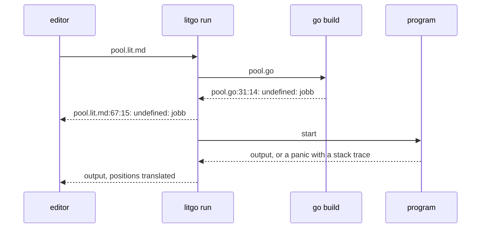

Progress goes to a person as text, or to an editor as one JSON event per line.
The events are `tangle`, `diagnostic`, `build`, `output` and `exit`.

The reporter has no lock, so only one goroutine is allowed to use it. That is
the goroutine that runs `runFile`. When a program's output has to be read from
two pipes at once, the goroutines that read the pipes send their lines to that
one goroutine over a channel, and it does all of the reporting.

```go
// reporter carries the run's progress to a person (plain text) or to an
// editor (one JSON event per line). It belongs to one goroutine.
type reporter struct {
	json bool
	seen map[string]bool
}

func (r *reporter) emit(event string, fields map[string]any) {
	if !r.json {
		return
	}
	fields["event"] = event
	b, _ := json.Marshal(fields)
	fmt.Println(string(b))
}

func (r *reporter) diag(d lit.Diag) {
	key := fmt.Sprintf("%s:%d:%d:%s", d.File, d.Line, d.Col, d.Message)
	if r.seen[key] {
		return
	}
	r.seen[key] = true
	if r.json {
		b, _ := json.Marshal(d)
		var fields map[string]any
		json.Unmarshal(b, &fields)
		r.emit("diagnostic", fields)
		return
	}
	sev := map[int]string{lit.SevError: "error", lit.SevWarning: "warning", lit.SevInfo: "note"}[d.Severity]
	fmt.Fprintf(os.Stderr, "%s:%d:%d: %s: %s\n", relPath(d.File), d.Line+1, d.Col+1, sev, d.Message)
}

func (r *reporter) output(stream, text string) {
	if r.json {
		r.emit("output", map[string]any{"stream": stream, "text": text})
		return
	}
	if stream == "stderr" {
		fmt.Fprintln(os.Stderr, text)
	} else {
		fmt.Println(text)
	}
}

func (r *reporter) status(format string, args ...any) {
	if !r.json {
		fmt.Fprintf(os.Stderr, "litgo: "+format+"\n", args...)
	}
}

func relPath(p string) string {
	if wd, err := os.Getwd(); err == nil {
		if rel, err := filepath.Rel(wd, p); err == nil && !strings.HasPrefix(rel, "..") {
			return rel
		}
	}
	return p
}
```

## Translating positions

Anything that looks like `file.go:12:5` and names a file litgo tangled gets
rewritten, wherever it shows up. That can be in a compiler error, in the middle
of an error message that mentions a second position, or in a stack trace.

```go
// remapper rewrites positions in tangled files back to the literate source.
type remapper struct {
	dir     string
	outputs map[string]*mapped // by absolute output path
}

// mapped is a tangled file together with the document it came from.
type mapped struct {
	*lit.Output
	doc *lit.Doc
}

var posRe = regexp.MustCompile(`((?:[A-Za-z]:)?[\w./\\-]*\.go):(\d+)(?::(\d+))?`)

// lookup finds the tangled file a tool is talking about. Compilers name
// files relative to where they ran; `go test` names them relative to the
// package, so a bare file name is matched if it is unambiguous.
func (m *remapper) lookup(path string) *mapped {
	abs := path
	if !filepath.IsAbs(abs) {
		abs = filepath.Join(m.dir, abs)
	}
	if o := m.outputs[filepath.Clean(abs)]; o != nil || filepath.Base(path) != path {
		return o
	}
	var found *mapped
	for p, o := range m.outputs {
		if filepath.Base(p) == path {
			if found != nil {
				return nil
			}
			found = o
		}
	}
	return found
}

// line rewrites every `file.go:line:col` in a line of tool output and returns
// the first position it translated.
func (m *remapper) line(s string) (string, *lit.Diag) {
	var first *lit.Diag
	out := posRe.ReplaceAllStringFunc(s, func(match string) string {
		g := posRe.FindStringSubmatch(match)
		res := m.lookup(g[1])
		if res == nil {
			return match
		}
		ln, _ := strconv.Atoi(g[2])
		col := 1
		if g[3] != "" {
			col, _ = strconv.Atoi(g[3])
		}
		srcLine, srcCol, _, ok := res.Map(ln-1, col-1)
		if !ok {
			return match
		}
		if first == nil {
			first = &lit.Diag{File: res.doc.Path, Line: srcLine, Col: srcCol}
		}
		if g[3] == "" {
			return fmt.Sprintf("%s:%d", relPath(res.doc.Path), srcLine+1)
		}
		return fmt.Sprintf("%s:%d:%d", relPath(res.doc.Path), srcLine+1, srcCol+1)
	})
	return out, first
}
```

```go
var compilerLineRe = regexp.MustCompile(`^(?:\./)?([^\s:]+\.go):(\d+)(?::(\d+))?:\s+(.*)$`)

// toolOutput turns compiler or vet output into diagnostics, and reports
// whatever it could not place (linker errors, package-level complaints).
func (m *remapper) toolOutput(out []byte, sev int, source string, r *reporter) {
	var last *lit.Diag
	flush := func() {
		if last != nil {
			r.diag(*last)
			last = nil
		}
	}
	for _, raw := range strings.Split(strings.TrimRight(string(out), "\n"), "\n") {
		if raw == "" || strings.HasPrefix(raw, "# ") {
			continue
		}
		if g := compilerLineRe.FindStringSubmatch(raw); g != nil {
			flush()
			if _, pos := m.line(g[1] + ":" + g[2] + ":" + firstNonEmpty(g[3], "1")); pos != nil {
				msg, _ := m.line(g[4])
				pos.Severity, pos.Message, pos.Source = sev, msg, source
				last = pos
				continue
			}
		}
		if last != nil && (strings.HasPrefix(raw, "\t") || strings.HasPrefix(raw, "  ")) {
			cont, _ := m.line(strings.TrimSpace(raw))
			last.Message += "\n" + cont
			continue
		}
		flush()
		text, _ := m.line(raw)
		r.output("stderr", text)
	}
	flush()
}

func firstNonEmpty(a, b string) string {
	if a != "" {
		return a
	}
	return b
}
```

```go
// writeTangled writes a file unless that would clobber a hand-written one.
func writeTangled(o *lit.Output, force bool) error {
	if old, err := os.ReadFile(o.Path); err == nil {
		if bytes.Equal(old, o.Bytes()) {
			return nil // leave the timestamp alone so builds stay cached
		}
		if !force && !lit.Generated(old) && len(bytes.TrimSpace(old)) > 0 && lit.CommentsFor(o.File.Lang).Line != "" {
			return fmt.Errorf("%s exists and was not generated by litgo; use --force to overwrite it, or tangle to another <!-- file: ... -->", relPath(o.Path))
		}
	}
	if err := os.MkdirAll(filepath.Dir(o.Path), 0o755); err != nil {
		return err
	}
	return os.WriteFile(o.Path, o.Bytes(), 0o644)
}
```

## The pipeline

```go
type runOptions struct {
	json    bool
	force   bool
	vet     bool
	timeout time.Duration
	args    []string
}
```

```go
// runFile is the feedback loop: tangle, compile, run, with every position in
// every message pointing at the .lit.md source.
func runFile(path string, o runOptions) int {
	r := &reporter{json: o.json, seen: map[string]bool{}}
	// <<read the document, and its siblings if it has a run command>>

	m := &remapper{dir: dir, outputs: map[string]*mapped{}}
	// <<tangle and write every document>>
	// <<let the document build itself if it knows how>>

	// <<compile the default file>>

	// <<vet it if asked, and stop here if it is a library>>
	return execute(r, m, exec.Command(bin, o.args...), dir, o.timeout, false)
}
```

<!-- chunk: read the document, and its siblings if it has a run command -->
```go
abs, err := filepath.Abs(path)
if err != nil {
	return fail(r, err)
}
dir := filepath.Dir(abs)
src, err := os.ReadFile(abs)
if err != nil {
	return fail(r, err)
}
doc := lit.Parse(abs, src)

// A custom run command may build a whole package, so tangle the siblings too.
docs := []*lit.Doc{doc}
if doc.Run != "" {
	siblings, _ := filepath.Glob(filepath.Join(dir, "*.lit.md"))
	for _, s := range siblings {
		if s == abs {
			continue
		}
		if b, err := os.ReadFile(s); err == nil {
			docs = append(docs, lit.Parse(s, b))
		}
	}
}
```

Every file that gets written is registered with the remapper. If the document's
structure has problems, the run stops here, because there is no point compiling
half a program.

<!-- chunk: tangle and write every document -->
```go
ok := true
for _, d := range docs {
	res := d.Tangle()
	for _, dg := range res.Diags {
		r.diag(dg)
	}
	if res.HasErrors() {
		ok = false
		continue
	}
	for _, out := range res.Files {
		if err := writeTangled(out, o.force); err != nil {
			r.diag(lit.Diag{File: d.Path, Line: max(out.File.Line, 0), Severity: lit.SevError, Message: err.Error(), Source: "litgo"})
			ok = false
			continue
		}
		m.outputs[filepath.Clean(out.Path)] = &mapped{out, d}
	}
	if n := len(res.Files); n == 1 {
		r.emit("tangle", map[string]any{"file": d.Path, "out": res.Files[0].Path})
		r.status("tangled %s → %s", relPath(d.Path), relPath(res.Files[0].Path))
	} else if n > 1 {
		r.emit("tangle", map[string]any{"file": d.Path, "out": fmt.Sprintf("%d files", n)})
		r.status("tangled %s → %d files", relPath(d.Path), n)
	}
}
if !ok {
	r.emit("build", map[string]any{"ok": false, "ms": 0, "stage": "tangle"})
	return 1
}
```

This document takes the first branch. Its `run:` directive vets, tests and
rebuilds litgo.

<!-- chunk: let the document build itself if it knows how -->
```go
// A document that writes several files is a package or a module, and
// only it knows how it is built
command := doc.Run
if command == "" && len(doc.Files) > 1 {
	command = "go build ./..."
}
if command != "" {
	r.status("$ %s", command)
	return execute(r, m, exec.Command("sh", "-c", command), dir, o.timeout, true)
}
def := doc.Files[0]
main := m.outputs[filepath.Clean(doc.OutPath(def))]
if def.Lang != "go" || main == nil {
	r.status("no run step for tangler %q; add <!-- run: command -->", def.Lang)
	r.emit("build", map[string]any{"ok": true, "ms": 0})
	return 0
}
```

Building and running are separate steps. That way litgo can tell a compile
error apart from a program that exits non-zero, and it can time both steps.

<!-- chunk: compile the default file -->
```go
tmp, err := os.MkdirTemp("", "litgo-run")
if err != nil {
	return fail(r, err)
}
defer os.RemoveAll(tmp)
bin := filepath.Join(tmp, "prog")

start := time.Now()
build := exec.Command("go", /*<<arguments to go build>>*/)
build.Dir = dir
out, err := build.CombinedOutput()
ms := time.Since(start).Milliseconds()
m.toolOutput(out, lit.SevError, "go build", r)
if err != nil {
	r.emit("build", map[string]any{"ok": false, "ms": ms, "stage": "compile"})
	r.status("build failed (%d ms)", ms)
	return 1
}
r.emit("build", map[string]any{"ok": true, "ms": ms})
r.status("built in %d ms", ms)
```

The compiler stops after ten errors unless you tell it not to, and in a tight
loop it is better to see all of them.

<!-- chunk: arguments to go build -->
```go
"build", "-gcflags=-e", "-o", bin, filepath.Base(main.Path)
```

<!-- chunk: vet it if asked, and stop here if it is a library -->
```go
if o.vet {
	vet := exec.Command("go", "vet", filepath.Base(main.Path))
	vet.Dir = dir
	out, _ := vet.CombinedOutput()
	m.toolOutput(out, lit.SevWarning, "go vet", r)
}
if def.Package != "main" && def.Package != "" {
	r.status("package %s compiles; nothing to run", def.Package)
	r.emit("exit", map[string]any{"code": 0, "ms": 0, "ran": false})
	return 0
}
```

## Running

Output gets streamed line by line, and positions are translated on the way
through. A panic becomes a diagnostic on the innermost stack frame that is in
the document. A failing test does too, when the document's own command runs
`go test`.

The program's stdout and stderr both have to be read while it runs, so each
pipe gets a goroutine. Those goroutines don't report anything themselves. They
send every line down one channel, and the loop in `execute` receives the lines
and does the reporting. The same loop waits for the timeout, so the reporter,
the panic bookkeeping and the `timedOut` flag all belong to one goroutine and
none of them needs a lock.

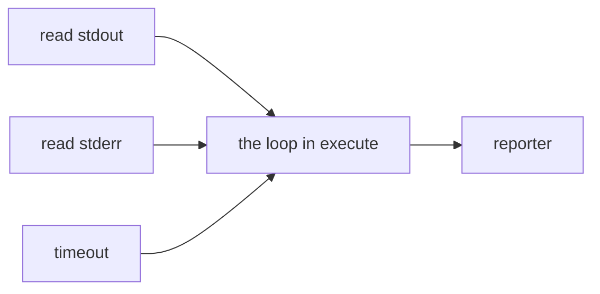

```go
func fail(r *reporter, err error) int {
	r.diag(lit.Diag{Severity: lit.SevError, Message: err.Error(), Source: "litgo"})
	return 1
}

var (
	frameRe = regexp.MustCompile(`^\s+(\S+\.go):(\d+)`)
	// reportRe is looser than compilerLineRe: `go test` indents its failures.
	reportRe = regexp.MustCompile(`^\s*(?:\./)?[^\s:]+\.go:\d+(?::\d+)?:\s+(.*)$`)
)

// outputLine is one line of a program's output, or the end of a stream.
type outputLine struct {
	stream, text string
	eof          bool
}

// pump sends the lines of one of a program's streams, and then its end.
func pump(stream string, rd io.Reader, lines chan<- outputLine) {
	sc := bufio.NewScanner(rd)
	sc.Buffer(make([]byte, 0, 64*1024), 4*1024*1024)
	for sc.Scan() {
		lines <- outputLine{stream: stream, text: sc.Text()}
	}
	lines <- outputLine{stream: stream, eof: true}
}

// execute streams a program's output, translating positions as it goes. A
// panic becomes a diagnostic on the innermost frame that lives in the
// literate source.
func execute(r *reporter, m *remapper, cmd *exec.Cmd, dir string, timeout time.Duration, parseTools bool) int {
	cmd.Dir = dir
	stdout, _ := cmd.StdoutPipe()
	stderr, _ := cmd.StderrPipe()
	ownGroup(cmd)
	start := time.Now()
	if err := cmd.Start(); err != nil {
		return fail(r, err)
	}
	defer killOnSignal(cmd)()
	var timeUp <-chan time.Time // stays nil, which never delivers, without a timeout
	if timeout > 0 {
		timer := time.NewTimer(timeout)
		defer timer.Stop()
		timeUp = timer.C
	}

	lines := make(chan outputLine)
	go pump("stdout", stdout, lines)
	go pump("stderr", stderr, lines)
	timedOut := false
	var panicMsg string
	panicPlaced := false
	for open := 2; open > 0; {
		select {
		case <-timeUp:
			timedOut = true
			killGroup(cmd)
		case l := <-lines:
			if l.eof {
				open--
				continue
			}
			raw := l.text
			text, pos := m.line(raw)
			if l.stream == "stderr" {
				switch {
				case strings.HasPrefix(raw, "panic: ") || strings.HasPrefix(raw, "fatal error: "):
					panicMsg, panicPlaced = raw, false
				case panicMsg != "" && !panicPlaced && pos != nil && frameRe.MatchString(raw):
					pos.Severity, pos.Message, pos.Source = lit.SevError, panicMsg, "runtime"
					r.diag(*pos)
					panicPlaced = true
				case parseTools && pos != nil && reportRe.MatchString(raw):
					msg, _ := m.line(reportRe.FindStringSubmatch(raw)[1])
					pos.Severity, pos.Message, pos.Source = lit.SevError, msg, "run"
					r.diag(*pos)
				}
			} else if parseTools && pos != nil && reportRe.MatchString(raw) {
				msg, _ := m.line(reportRe.FindStringSubmatch(raw)[1])
				pos.Severity, pos.Message, pos.Source = lit.SevError, msg, "run"
				r.diag(*pos)
			}
			r.output(l.stream, text)
		}
	}
	err := cmd.Wait()
	code := 0
	if err != nil {
		code = 1
		if ee, ok := err.(*exec.ExitError); ok && ee.ExitCode() >= 0 {
			code = ee.ExitCode()
		}
	}
	ms := time.Since(start).Milliseconds()
	if timedOut {
		r.output("stderr", fmt.Sprintf("litgo: killed after %s", timeout))
	}
	r.emit("exit", map[string]any{"code": code, "ms": ms, "ran": true, "timed_out": timedOut})
	r.status("exit %d (%d ms)", code, ms)
	return code
}
```

The program runs in its own process group. Stopping litgo stops the program and
anything it started, and the timeout does the same.

<!-- file: proc_unix.go -->

```go
//go:build unix

package main

import (
	"os"
	"os/exec"
	"os/signal"
	"syscall"
)

// ownGroup puts the child in its own process group so that it, and anything
// it spawns, can be killed as one.
func ownGroup(cmd *exec.Cmd) {
	cmd.SysProcAttr = &syscall.SysProcAttr{Setpgid: true}
}

func killGroup(cmd *exec.Cmd) {
	if cmd.Process != nil {
		syscall.Kill(-cmd.Process.Pid, syscall.SIGKILL)
	}
}

// killOnSignal makes stopping litgo (the editor's :LitStop) stop the program
// it is running. The returned function ends the watch.
func killOnSignal(cmd *exec.Cmd) func() {
	sigs := make(chan os.Signal, 1)
	done := make(chan struct{})
	signal.Notify(sigs, syscall.SIGTERM, syscall.SIGINT, syscall.SIGHUP)
	go func() {
		select {
		case <-sigs:
			killGroup(cmd)
		case <-done:
		}
	}()
	return func() {
		signal.Stop(sigs)
		close(done)
	}
}
```

<!-- file: proc_other.go -->

```go
//go:build !unix

package main

import "os/exec"

func ownGroup(cmd *exec.Cmd) {}

func killGroup(cmd *exec.Cmd) {
	if cmd.Process != nil {
		cmd.Process.Kill()
	}
}

func killOnSignal(cmd *exec.Cmd) func() { return func() {} }
```

# Errors as you type

`litgo run` finds every error, but only when you ask, and only after it writes
files and starts a compiler. Most errors can be found sooner than that. The Go
type checker is in the standard library. If you give it the tangled files *in
memory*, it reports what the compiler would report (an undefined name, a wrong
argument, an unused variable, an unused import) in a few milliseconds, and the
source map puts each report on the right line of the Markdown. A language
server runs that check after every change, so the errors show up under the code
that caused them before you have even thought about running anything.

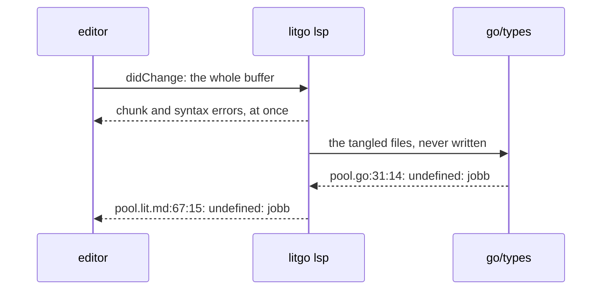

## Type-checking what is not on disk

<!-- file: internal/check/check.go -->
<!-- package: check -->
<!-- imports: bytes, fmt, go/ast, go/build, go/importer, go/parser, go/token, go/types, io, os, os/exec, path/filepath, sort, strings, github.com/tlehman/litgo/internal/lit -->

A check works on packages. A package's files are the document's outputs in one
directory. When the document writes a module or has its own `run:` command, the
other Go files already in that directory are included too. A document that is a
single program gets checked by itself, the same way `litgo run` compiles it by
itself. This matters because a directory of examples is full of `main`
functions that can't be in the same package.

```go
// pkg is one package about to be checked.
type pkg struct {
	dir, name, path string
	files           []*ast.File // what an importer of the package sees
	tests           []*ast.File // _test.go files of the same package
	types           *types.Package
	checking        bool
}

type checker struct {
	res       *lit.Result
	fset      *token.FileSet
	outputs   map[string]*lit.Output // by path
	pkgs      []*pkg
	byPath    map[string]*pkg   // packages this document writes, by import path
	exports   map[string]string // import path to export data file, for all others
	gc        types.Importer
	goVersion string
	seen      map[string]bool
	diags     []lit.Diag
}

// Cache carries what is worth keeping between checks: where the compiled
// standard library lives. It has no lock, so whoever owns a Cache runs one
// check at a time with it.
type Cache struct {
	std map[string]string
}

// Types type-checks the Go files a document tangles to, without writing
// them, and reports errors at their positions in the document. It reports
// nothing if the files do not parse (the syntax check covers that) or if
// there is no go command to ask about imports.
func Types(res *lit.Result, cache *Cache) []lit.Diag {
	if res.HasErrors() {
		return nil
	}
	c := &checker{res: res, fset: token.NewFileSet(), outputs: map[string]*lit.Output{},
		byPath: map[string]*pkg{}, exports: map[string]string{}, seen: map[string]bool{}}
	if !c.parse() {
		return nil
	}
	c.locate()
	if !c.resolve(cache) {
		return nil
	}
	c.gc = importer.ForCompiler(c.fset, "gc", c.lookup)
	for _, p := range c.pkgs {
		c.check(p, true)
	}
	return c.diags
}
```

Build constraints matter here. litgo itself has two files that define the same
functions for different operating systems. `go/build` decides which files
belong, and it gets the in-memory content through its `OpenFile` hook.

```go
// parse sorts the files into packages. It fails if an output does not parse.
func (c *checker) parse() bool {
	doc := c.res.Doc
	for _, o := range c.res.Files {
		if o.File.Lang == "go" {
			c.outputs[o.Path] = o
		}
	}
	ctx := build.Default
	ctx.OpenFile = func(path string) (io.ReadCloser, error) {
		if o := c.outputs[path]; o != nil {
			return io.NopCloser(bytes.NewReader(o.Bytes())), nil
		}
		return os.Open(path)
	}
	groups := map[string]*pkg{}
	add := func(path string, src any) error {
		dir, base := filepath.Dir(path), filepath.Base(path)
		if ok, _ := ctx.MatchFile(dir, base); !ok {
			return nil
		}
		f, err := parser.ParseFile(c.fset, path, src, parser.SkipObjectResolution)
		if err != nil {
			return err
		}
		test := strings.HasSuffix(base, "_test.go")
		name := f.Name.Name
		p := groups[dir+"\x00"+name]
		if p == nil {
			p = &pkg{dir: dir, name: name}
			groups[dir+"\x00"+name] = p
			c.pkgs = append(c.pkgs, p)
		}
		if test && !strings.HasSuffix(name, "_test") {
			p.tests = append(p.tests, f)
		} else {
			p.files = append(p.files, f)
		}
		return nil
	}

	dirs := map[string]bool{}
	for path, o := range c.outputs {
		if add(path, o.Bytes()) != nil {
			return false
		}
		dirs[filepath.Dir(path)] = true
	}
	if doc.Run != "" || len(doc.Files) > 1 {
		// <<add the files that are already in those directories>>
	}
	sort.Slice(c.pkgs, func(i, j int) bool {
		return c.pkgs[i].dir+c.pkgs[i].name < c.pkgs[j].dir+c.pkgs[j].name
	})
	return true
}
```

If a hand-written file doesn't parse, that is its author's problem and not this
document's, so the file gets left out.

<!-- chunk: add the files that are already in those directories -->
```go
for dir := range dirs {
	entries, _ := os.ReadDir(dir)
	for _, e := range entries {
		path := filepath.Join(dir, e.Name())
		if e.IsDir() || !strings.HasSuffix(path, ".go") || c.outputs[path] != nil {
			continue
		}
		add(path, nil)
	}
}
```

The packages a document writes can import each other. For example, litgo's
`main` imports its `internal/lit`. Those imports have to resolve to the version
in the buffer and not to whatever was last tangled, so each package needs its
import path, which is the module path plus the directory. The `go.mod` can be
one of the outputs too.

```go
// locate works out the import path of every package.
func (c *checker) locate() {
	modDir, mod := "", ""
	for _, o := range c.res.Files {
		if filepath.Base(o.Path) == "go.mod" {
			modDir, mod = filepath.Dir(o.Path), string(o.Bytes())
		}
	}
	for dir := filepath.Dir(c.res.Doc.Path); mod == ""; dir = filepath.Dir(dir) {
		if b, err := os.ReadFile(filepath.Join(dir, "go.mod")); err == nil {
			modDir, mod = dir, string(b)
		}
		if dir == filepath.Dir(dir) {
			break
		}
	}
	module := ""
	for _, line := range strings.Split(mod, "\n") {
		if f := strings.Fields(line); len(f) == 2 && f[0] == "module" {
			module = strings.Trim(f[1], `"`)
		} else if len(f) == 2 && f[0] == "go" {
			c.goVersion = "go" + f[1]
		}
	}
	for _, p := range c.pkgs {
		p.path = p.name
		if rel, err := filepath.Rel(modDir, p.dir); module != "" && err == nil && !strings.HasPrefix(rel, "..") {
			p.path = strings.TrimSuffix(module+"/"+filepath.ToSlash(rel), "/.")
			if strings.HasSuffix(p.name, "_test") {
				p.path += "_test"
			}
		}
		if !strings.HasSuffix(p.name, "_test") && p.name != "main" {
			c.byPath[p.path] = p
		}
	}
}
```

Everything else gets imported the way `go vet` does it, from the export data
the compiler left in the build cache. `go list -export` finds that data, and
compiles first if it has to. This is exact, and it is fast. Reading the export
data of `fmt` takes a fraction of the time it would take to type-check its
source. One `go list` call covers all the imports of a check. The standard
library gets remembered for the life of the process, because it doesn't change
while an editor is running.

```go
// resolve finds the export data of every package that is imported but not
// written by this document. It fails if the go command cannot be run.
func (c *checker) resolve(cache *Cache) bool {
	if cache.std == nil {
		cache.std = map[string]string{}
	}
	var missing []string
	for _, p := range c.pkgs {
		for _, f := range append(append([]*ast.File{}, p.files...), p.tests...) {
			for _, imp := range f.Imports {
				path := strings.Trim(imp.Path.Value, "\"`")
				if c.byPath[path] != nil || path == "C" || path == "unsafe" || c.seen[path] {
					continue
				}
				c.seen[path] = true
				if file, ok := cache.std[path]; ok && exists(file) {
					c.exports[path] = file
				} else {
					missing = append(missing, path)
				}
			}
		}
	}
	c.seen = map[string]bool{}
	if len(missing) == 0 {
		return true
	}
	args := append([]string{"list", "-e", "-export", "-deps", "-f", "{{if .Export}}{{.ImportPath}}\t{{.Export}}{{end}}", "--"}, missing...)
	cmd := exec.Command("go", args...)
	cmd.Dir = filepath.Dir(c.res.Doc.Path)
	out, err := cmd.Output()
	if _, broken := err.(*exec.Error); broken {
		return false
	}
	for _, line := range strings.Split(string(out), "\n") {
		if path, file, ok := strings.Cut(line, "\t"); ok {
			c.exports[path] = file
			if !strings.Contains(strings.Split(path, "/")[0], ".") {
				cache.std[path] = file
			}
		}
	}
	return true
}

func exists(file string) bool {
	_, err := os.Stat(file)
	return err == nil
}

func (c *checker) lookup(path string) (io.ReadCloser, error) {
	if file := c.exports[path]; file != "" {
		return os.Open(file)
	}
	return nil, os.ErrNotExist
}
```

The checker acts as its own importer. A package from this document gets checked
on demand, once, without its tests. Anything else comes from the export data.

```go
// Import implements types.Importer.
func (c *checker) Import(path string) (*types.Package, error) {
	if p := c.byPath[path]; p != nil {
		return c.check(p, false)
	}
	return c.gc.Import(path)
}

// check type-checks a package: as a root, with its tests and with its
// errors reported, or as the import of another package, silently.
func (c *checker) check(p *pkg, root bool) (*types.Package, error) {
	files := p.files
	if root {
		files = append(append([]*ast.File{}, p.files...), p.tests...)
	} else if p.types != nil {
		return p.types, nil
	} else if p.checking {
		return nil, os.ErrInvalid // an import cycle; the root check of it says so
	}
	conf := types.Config{Importer: c, GoVersion: c.goVersion, FakeImportC: true, Error: func(err error) {
		if root {
			c.report(err)
		}
	}}
	p.checking = true
	tp, _ := conf.Check(p.path, c.fset, files, nil)
	p.checking = false
	if !root {
		p.types = tp
	}
	return tp, nil
}
```

If a chunk is used twice, an error in it gets reported once, not twice.

```go
func (c *checker) report(err error) {
	te, ok := err.(types.Error)
	if !ok || len(c.diags) >= 100 {
		return
	}
	pos := c.fset.Position(te.Pos)
	o := c.outputs[pos.Filename]
	if o == nil {
		return
	}
	line, col, _, ok := o.Map(pos.Line-1, pos.Column-1)
	key := fmt.Sprintf("%d:%d:%s", line, col, te.Msg)
	if !ok || c.seen[key] {
		return
	}
	c.seen[key] = true
	c.diags = append(c.diags, lit.Diag{File: c.res.Doc.Path, Line: line, Col: col, Severity: lit.SevError, Message: te.Msg, Source: "types"})
}
```

<!-- file: internal/check/check_test.go -->
<!-- package: check -->
<!-- imports: os, path/filepath, strings, testing, github.com/tlehman/litgo/internal/lit -->

The test document writes a small module with a library, a program that uses it,
and a test. None of it exists on disk, and each error is in a different kind of
place.

<!-- verbatim -->
```go
const module = "<!-- file: go.mod -->\n```gomod\nmodule example.com/m\n\ngo 1.22\n```\n\n" +
	"<!-- file: lib/lib.go -->\n<!-- package: lib -->\n<!-- imports: os, strings -->\n" +
	"```go\nfunc Shout(s string) string {\n\t// <<upper>>\n}\n```\n\n" +
	"<!-- chunk: upper -->\n```go\nreturn strings.ToUpper(s) + suffix\n```\n\n" +
	"<!-- file: lib/lib_test.go -->\n<!-- package: lib -->\n<!-- imports: testing -->\n" +
	"```go\nfunc TestShout(t *testing.T) {\n\tif Shout(1) != \"A\" {\n\t\tt.Fail()\n\t}\n}\n```\n\n" +
	"<!-- file: main.go -->\n<!-- package: main -->\n<!-- imports: fmt, example.com/m/lib -->\n" +
	"```go\nfunc main() {\n\tn := 1\n\tfmt.Println(lib.Shout(\"a\"), lib.Whisper)\n}\n```\n"

func TestTypes(t *testing.T) {
	path := filepath.Join(t.TempDir(), "m.lit.md")
	os.WriteFile(path, []byte(module), 0o644)
	doc := lit.Parse(path, []byte(module))
	diags := Types(doc.Tangle(), &Cache{})

	var got []string
	for _, d := range diags {
		got = append(got, strings.TrimSpace(doc.Lines[d.Line][d.Col:])+" ← "+d.Message)
	}
	for _, want := range []string{
		`os, strings --> ← "os" imported and not used`, // on its entry in the directive
		"suffix ← undefined: suffix",                   // inside a chunk
		"1) != \"A\" { ← cannot use 1",                 // in a test file of the package
		"n := 1 ← declared and not used: n",
		"Whisper) ← undefined: lib.Whisper", // through an import of a package that is not on disk
	} {
		text, msg, _ := strings.Cut(want, " ← ")
		found := false
		for _, g := range got {
			found = found || strings.HasPrefix(g, text) && strings.Contains(g, msg)
		}
		if !found {
			t.Errorf("missing %q in:\n%s", want, strings.Join(got, "\n"))
		}
	}
	if len(diags) != 5 {
		t.Errorf("%d diagnostics, want 5:\n%s", len(diags), strings.Join(got, "\n"))
	}
}

func TestSingleProgramStandsAlone(t *testing.T) {
	dir := t.TempDir()
	os.WriteFile(filepath.Join(dir, "other.go"), []byte("package main\n\nfunc main() {}\n"), 0o644)
	src := "<!-- package: main -->\n```go\nfunc main() {}\n```\n"
	doc := lit.Parse(filepath.Join(dir, "one.lit.md"), []byte(src))
	if diags := Types(doc.Tangle(), &Cache{}); len(diags) != 0 {
		t.Errorf("a second main in the directory is not this program's business: %+v", diags)
	}
}
```

## The language server

<!-- file: internal/lsp/lsp.go -->
<!-- package: lsp -->
<!-- imports: bufio, encoding/json, fmt, io, net/url, strconv, strings, time, github.com/tlehman/litgo/internal/check, github.com/tlehman/litgo/internal/lit -->

The Language Server Protocol is JSON-RPC over standard input and output, with a
`Content-Length` header in front of each message. The part litgo needs for
publishing diagnostics is small enough to write out here.

```go
type message struct {
	JSONRPC string           `json:"jsonrpc"`
	ID      *json.RawMessage `json:"id,omitempty"`
	Method  string           `json:"method,omitempty"`
	Params  json.RawMessage  `json:"params,omitempty"`
	Result  any              `json:"result,omitempty"`
	Error   *rpcError        `json:"error,omitempty"`
}

type rpcError struct {
	Code    int    `json:"code"`
	Message string `json:"message"`
}

func read(r *bufio.Reader) (*message, error) {
	length := 0
	for {
		line, err := r.ReadString('\n')
		if err != nil {
			return nil, err
		}
		line = strings.TrimSpace(line)
		if line == "" {
			break
		}
		if name, value, ok := strings.Cut(line, ":"); ok && strings.EqualFold(name, "Content-Length") {
			length, _ = strconv.Atoi(strings.TrimSpace(value))
		}
	}
	body := make([]byte, length)
	if _, err := io.ReadFull(r, body); err != nil {
		return nil, err
	}
	m := &message{}
	return m, json.Unmarshal(body, m)
}

// frame spells a message the way it goes over the wire.
func frame(m *message) []byte {
	m.JSONRPC = "2.0"
	body, _ := json.Marshal(m)
	return []byte(fmt.Sprintf("Content-Length: %d\r\n\r\n%s", len(body), body))
}
```

The server has no locks. One goroutine, the loop in `Serve`, owns all of the
server's state: the open documents, the overlays, and the bookkeeping for
gopls. Every other goroutine does one job that is slow or that blocks, and
talks to the loop over a channel. One goroutine reads messages from the editor
and one writes messages to the editor. Each document that changed has a timer
that tells the loop when the typing has paused. At most one goroutine runs the
type checker. Since only the loop touches the state, nothing needs a mutex.

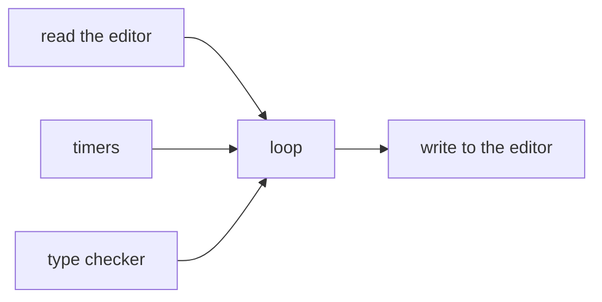

A pipe gets written by one goroutine that owns it. Messages are framed by
whoever sends them, so the writer never sees a value that someone else might
still change. The channel has a buffer, so the loop can keep going while a
reader on the other end of the pipe is slow. Closing the channel says there is
nothing more to write, and `done` closes after the last message has gone out.

```go
// writer starts the goroutine that writes to a pipe.
func writer(w io.Writer) (messages chan []byte, done chan struct{}) {
	messages, done = make(chan []byte, 64), make(chan struct{})
	go func() {
		defer close(done)
		for b := range messages {
			w.Write(b)
		}
	}()
	return messages, done
}

func (s *server) write(m *message) { s.out <- frame(m) }
```

The server keeps the text of every open document, and the whole text arrives
with each change. A change starts a short timer instead of an analysis, so a
burst of typing costs one analysis instead of one per keystroke.

```go
type document struct {
	text    string
	version int
	timer   *time.Timer
	res     *lit.Result // what the text tangles to,
	tangled int         // and the version of the text that was tangled
}

// server is the state of the loop in Serve. Only that goroutine touches it.
type server struct {
	out   chan<- []byte // to the goroutine that writes to the editor
	docs  map[string]*document
	utf8  bool // the client counts columns in bytes, as litgo does
	delay time.Duration

	due      chan due      // a document's timer went off
	checked  chan *job     // the type checker is done with a job
	quit     chan struct{} // closed when the server stops
	waiting  map[string]*job
	checking bool // the type checker is busy, and has the cache
	cache    check.Cache

	// The rest is for the chapter after this one.
	goplsBin string
	gopls    *gopls
	overlays map[string]*overlay // by path of the tangled file
}

// due says that a document has not changed for a while since this version.
type due struct {
	uri     string
	version int
}

// Serve speaks the protocol until the client says exit or hangs up. It puts
// the gopls named (or found, if none is named; "off" means none) behind it.
func Serve(in io.Reader, out io.Writer, gopls string) error {
	toEditor, written := writer(out)
	s := &server{out: toEditor, docs: map[string]*document{}, delay: 120 * time.Millisecond,
		due: make(chan due), checked: make(chan *job), quit: make(chan struct{}), waiting: map[string]*job{},
		goplsBin: gopls, overlays: map[string]*overlay{}}
	defer func() {
		close(s.quit)
		s.stop()
		close(toEditor)
		<-written
	}()
	editor, failed := make(chan *message), make(chan error, 1)
	go func() {
		r := bufio.NewReader(in)
		for {
			m, err := read(r)
			if err != nil {
				failed <- err
				return
			}
			select {
			case editor <- m:
			case <-s.quit:
				return
			}
		}
	}()
	for {
		select {
		case m := <-editor:
			if m.Method == "exit" {
				return nil
			}
			s.handle(m)
		case err := <-failed:
			if err == io.EOF {
				return nil
			}
			return err
		case d := <-s.due:
			if _, now := s.current(d.uri); now == d.version {
				s.analyze(d.uri)
			}
		case j := <-s.checked:
			s.finish(j)
		case m, ok := <-s.heard():
			if ok {
				s.gopls.hear(m, s)
			} else {
				s.gopls.hangUp()
			}
		}
	}
}
```

Every goroutine that sends to the loop also watches `quit`, so none of them is
left waiting for a loop that has gone away.

```go
func (s *server) handle(m *message) {
	switch m.Method {
	case "initialize":
		// <<agree on how columns are counted, and say what the server does>>
	case "shutdown":
		s.write(&message{ID: m.ID, Result: json.RawMessage("null")})
	case "textDocument/didOpen":
		var p struct {
			TextDocument struct {
				URI     string `json:"uri"`
				Text    string `json:"text"`
				Version int    `json:"version"`
			} `json:"textDocument"`
		}
		json.Unmarshal(m.Params, &p)
		s.change(p.TextDocument.URI, p.TextDocument.Text, p.TextDocument.Version)
	case "textDocument/didChange":
		var p struct {
			TextDocument struct {
				URI     string `json:"uri"`
				Version int    `json:"version"`
			} `json:"textDocument"`
			ContentChanges []struct {
				Text string `json:"text"`
			} `json:"contentChanges"`
		}
		json.Unmarshal(m.Params, &p)
		if n := len(p.ContentChanges); n > 0 {
			s.change(p.TextDocument.URI, p.ContentChanges[n-1].Text, p.TextDocument.Version)
		}
	case "textDocument/didClose":
		var p struct {
			TextDocument struct {
				URI string `json:"uri"`
			} `json:"textDocument"`
		}
		json.Unmarshal(m.Params, &p)
		if d := s.docs[p.TextDocument.URI]; d != nil && d.timer != nil {
			d.timer.Stop()
		}
		delete(s.docs, p.TextDocument.URI)
		delete(s.waiting, p.TextDocument.URI)
		s.forget(p.TextDocument.URI)
	default:
		if !s.proxy(m) && m.ID != nil { // a request for something this server does not do
			s.write(&message{ID: m.ID, Error: &rpcError{-32601, "litgo lsp does not implement " + m.Method}})
		}
	}
}
```

The protocol counts columns in UTF-16 code units unless both sides agree on
something else. litgo counts bytes and so does Neovim, which offers `utf-8`.
For a client that doesn't offer it, litgo converts columns on the way out.
Documents are synchronised whole (`change: 1`), because they are small and
litgo parses the whole document anyway.

<!-- chunk: agree on how columns are counted, and say what the server does -->
```go
var p struct {
	Capabilities struct {
		General struct {
			PositionEncodings []string `json:"positionEncodings"`
		} `json:"general"`
	} `json:"capabilities"`
}
json.Unmarshal(m.Params, &p)
s.start(m.Params)
encoding := "utf-16"
for _, e := range p.Capabilities.General.PositionEncodings {
	if e == "utf-8" && s.gopls == nil { // gopls counts in UTF-16, and that settles it
		encoding, s.utf8 = e, true
	}
}
capabilities := s.capabilities()
capabilities["positionEncoding"] = encoding
capabilities["textDocumentSync"] = map[string]any{"openClose": true, "change": 1}
s.write(&message{ID: m.ID, Result: map[string]any{
	"serverInfo":   map[string]any{"name": "litgo"},
	"capabilities": capabilities,
}})
```

```go
func (s *server) change(uri, text string, version int) {
	if !strings.HasSuffix(uri, ".lit.md") {
		return
	}
	d := s.docs[uri]
	if d == nil {
		d = &document{}
		s.docs[uri] = d
	}
	if d.timer != nil {
		d.timer.Stop()
	}
	d.text, d.version = text, version
	d.timer = time.AfterFunc(s.delay, func() {
		select {
		case s.due <- due{uri, version}:
		case <-s.quit:
		}
	})
}

// current returns the text and version of a document, or version -1.
func (s *server) current(uri string) (string, int) {
	if d := s.docs[uri]; d != nil {
		return d.text, d.version
	}
	return "", -1
}
```

Diagnostics go out in two rounds. Problems with the document's structure and
with Go's syntax take microseconds to find, so the loop finds them itself and
publishes them right away. If there are none, the document needs a type check.
That can take a while, because the first one in a session has to wait for
`go list`, so it runs in a goroutine of its own and the loop stays free to
answer the editor.

Only one type check runs at a time, because the cache is not locked, and
because a machine has better things to do than check five versions of one
document at once. While the checker is busy, the loop keeps the newest job for
each document in `waiting`, and a newer job replaces an older one. When the
checker sends its job back, the loop publishes the findings unless the document
has changed in the meantime, and then starts the next job.

```go
// job is a type check: what to check, and then what the check found. The
// loop and the checker pass it back and forth and never hold it together.
type job struct {
	uri     string
	version int
	res     *lit.Result
	diags   []lit.Diag // published already
	typed   []lit.Diag // what the type checker adds
}

func (s *server) analyze(uri string) {
	res, version := s.sync(uri)
	if res == nil {
		return
	}
	diags := append(append([]lit.Diag{}, res.Diags...), res.SyntaxCheck()...)
	s.publish(uri, version, res.Doc, diags)
	if res.HasErrors() || len(diags) > len(res.Diags) {
		return
	}
	s.waiting[uri] = &job{uri: uri, version: version, res: res, diags: diags}
	s.check()
}

// check gives the type checker its next job, if it is free and there is one
// that is still worth doing. The cache goes to the checker with the job and
// comes back with it.
func (s *server) check() {
	if s.checking {
		return
	}
	for uri, j := range s.waiting {
		delete(s.waiting, uri)
		if _, now := s.current(uri); now != j.version {
			continue
		}
		s.checking = true
		go func() {
			j.typed = check.Types(j.res, &s.cache)
			select {
			case s.checked <- j:
			case <-s.quit:
			}
		}()
		return
	}
}

// finish publishes what a type check found, if it is still true.
func (s *server) finish(j *job) {
	s.checking = false
	if _, now := s.current(j.uri); now == j.version && len(j.typed) > 0 {
		s.publish(j.uri, j.version, j.res.Doc, append(j.diags, j.typed...))
	}
	s.check()
}

func path(uri string) string {
	if u, err := url.Parse(uri); err == nil && u.Scheme == "file" {
		return u.Path
	}
	return uri
}
```

A diagnostic from litgo is a point, but an editor underlines a range. So litgo
stretches the range over the identifier at that point, when there is one.

```go
func (s *server) publish(uri string, version int, doc *lit.Doc, diags []lit.Diag) {
	type position struct {
		Line      int `json:"line"`
		Character int `json:"character"`
	}
	type diagnostic struct {
		Range struct {
			Start position `json:"start"`
			End   position `json:"end"`
		} `json:"range"`
		Severity int    `json:"severity"`
		Source   string `json:"source"`
		Message  string `json:"message"`
	}
	out := []diagnostic{}
	for _, d := range diags {
		line := ""
		if d.Line >= 0 && d.Line < len(doc.Lines) {
			line = doc.Lines[d.Line]
		}
		start := min(max(d.Col, 0), len(line))
		end := d.EndCol
		if end <= start {
			end = start
			for end < len(line) && (line[end] == '_' || line[end] >= '0' && line[end] <= '9' || line[end] >= 'A' && line[end] <= 'Z' || line[end] >= 'a' && line[end] <= 'z' || line[end] >= 0x80) {
				end++
			}
			if end == start {
				end = min(start+1, len(line))
			}
		}
		end = min(end, len(line))
		var ld diagnostic
		ld.Range.Start = position{d.Line, s.column(line, start)}
		ld.Range.End = position{d.Line, s.column(line, end)}
		ld.Severity, ld.Source, ld.Message = d.Severity, "litgo", d.Message
		if d.Source != "" && d.Source != "litgo" {
			ld.Source = "litgo " + d.Source
		}
		out = append(out, ld)
	}
	params, _ := json.Marshal(map[string]any{"uri": uri, "version": version, "diagnostics": out})
	s.write(&message{Method: "textDocument/publishDiagnostics", Params: params})
}

// column converts a byte offset into the client's unit.
func (s *server) column(line string, offset int) int {
	return units(s.utf8, line, offset)
}

// units converts a byte offset in a line to UTF-16 code units, unless bytes
// are what is wanted.
func units(utf8 bool, line string, offset int) int {
	offset = min(max(offset, 0), len(line))
	if utf8 {
		return offset
	}
	n := 0
	for _, r := range line[:offset] {
		n++
		if r >= 0x10000 {
			n++
		}
	}
	return n
}
```

<!-- file: internal/lsp/lsp_test.go -->
<!-- package: lsp -->
<!-- imports: bufio, encoding/json, fmt, io, strings, testing, time -->

The test acts as a client. It opens a document that has a type error in a
chunk, fixes the error, and watches the diagnostics show up and then go away.

<!-- verbatim -->
```go
const program = "<!-- package: main -->\n<!-- imports: fmt -->\n\n```go\nfunc main() {\n\t// <<greet>>\n}\n```\n\n<!-- chunk: greet -->\n```go\nfmt.Println(\"𝄞\", whom)\n```\n"

// client is the editor's end of a conversation with the server.
type client struct {
	t        *testing.T
	to       io.Writer
	incoming chan *message
}

func connect(t *testing.T, gopls string) *client {
	toServer, fromClient := io.Pipe()
	fromServer, toClient := io.Pipe()
	go Serve(toServer, toClient, gopls)
	t.Cleanup(func() { fromClient.Close() })
	c := &client{t: t, to: fromClient, incoming: make(chan *message, 64)}
	go func() {
		r := bufio.NewReader(fromServer)
		for {
			m, err := read(r)
			if err != nil {
				return
			}
			c.incoming <- m
		}
	}()
	return c
}

func (c *client) send(method string, id int, params any) {
	raw, ok := params.(string)
	if !ok {
		b, _ := json.Marshal(params)
		raw = string(b)
	}
	body := fmt.Sprintf(`{"jsonrpc":"2.0","method":%q,"params":%s}`, method, raw)
	if id > 0 {
		body = fmt.Sprintf(`{"jsonrpc":"2.0","id":%d,"method":%q,"params":%s}`, id, method, raw)
	}
	fmt.Fprintf(c.to, "Content-Length: %d\r\n\r\n%s", len(body), body)
}

func (c *client) next() *message {
	select {
	case m := <-c.incoming:
		return m
	case <-time.After(60 * time.Second):
		c.t.Fatal("the server said nothing for a minute")
		return nil
	}
}

// diagnostics waits for a publication for the given version that satisfies ok.
func (c *client) diagnostics(version int, ok func(string) bool) string {
	for {
		m := c.next()
		if m.Method == "textDocument/publishDiagnostics" && strings.Contains(string(m.Params), fmt.Sprintf(`"version":%d`, version)) && ok(string(m.Params)) {
			return string(m.Params)
		}
	}
}

func TestDiagnosticsComeAndGo(t *testing.T) {
	c := connect(t, "off")
	c.send("initialize", 1, `{"capabilities":{}}`)
	if m := c.next(); !strings.Contains(fmt.Sprint(m.Result), "utf-16") {
		t.Fatalf("a client that offers nothing gets UTF-16: %v", m.Result)
	}
	uri := "file://" + t.TempDir() + "/hello.lit.md"
	c.send("textDocument/didOpen", 0, map[string]any{"textDocument": map[string]any{"uri": uri, "version": 1, "text": program}})
	got := c.diagnostics(1, func(p string) bool { return strings.Contains(p, "undefined: whom") })
	// Line 11, after fmt.Println(" (13 bytes), a clef that is 4 bytes but 2 UTF-16 units, and `", `.
	if !strings.Contains(got, `"start":{"line":11,"character":18}`) || !strings.Contains(got, `"end":{"line":11,"character":22}`) {
		t.Errorf("the error should underline whom, in UTF-16 units: %s", got)
	}

	c.send("textDocument/didChange", 0, map[string]any{
		"textDocument":   map[string]any{"uri": uri, "version": 2},
		"contentChanges": []any{map[string]any{"text": strings.Replace(program, "whom", `"world"`, 1)}},
	})
	c.diagnostics(2, func(p string) bool { return strings.Contains(p, `"diagnostics":[]`) })

	c.send("textDocument/formatting", 2, `{}`)
	if m := c.next(); m.Error == nil || m.Error.Code != -32601 {
		t.Errorf("an unknown request should be refused politely: %+v", m)
	}
}
```

# Everything else gopls knows

<!-- file: internal/lsp/gopls.go -->
<!-- package: lsp -->
<!-- imports: bufio, encoding/json, fmt, go/parser, go/token, io, net/url, os, os/exec, path/filepath, sort, strconv, strings, time, github.com/tlehman/litgo/internal/lit -->

Showing errors is the least an editor does for a Go programmer. It also
completes names, shows documentation, jumps to definitions, lists references
and renames things. gopls, Go's language server, does all of that, and none of
it should be written twice. But gopls reads Go files, and you are in a Markdown
file where the Go is scattered around in the wrong order.

The source map works in both directions, so litgo can sit between the editor
and gopls. It starts its own gopls and shows it the tangled files as
*overlays*. An overlay is the protocol's word for the content of a file that is
open in an editor, and it takes precedence over what is on disk. Nothing gets
written. A question about a position in the document turns into the same
question about a position in a tangled file, and every position in the answer
gets translated back.

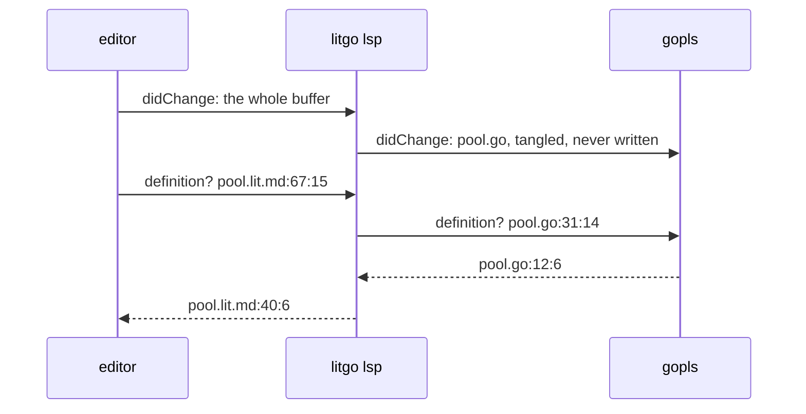

The editor only sees one server, and to the editor a `.lit.md` buffer is a Go
buffer wherever the cursor is on Go. This works in any editor, because nothing
here is specific to Neovim.

## A server of our own

litgo looks for gopls on the `$PATH` first, and then in the directory where
`go install` puts it, because not everyone has that directory on their `$PATH`.
Without gopls, litgo is just the server from the last chapter.

```go
// findGopls locates the gopls to run: the one named, or the one that can be
// found. "off" means none.
func findGopls(named string) string {
	if named == "off" {
		return ""
	}
	if named != "" {
		p, _ := exec.LookPath(named)
		return p
	}
	if p, err := exec.LookPath("gopls"); err == nil {
		return p
	}
	gopath := os.Getenv("GOPATH")
	if home, err := os.UserHomeDir(); gopath == "" && err == nil {
		gopath = filepath.Join(home, "go")
	}
	for _, dir := range []string{os.Getenv("GOBIN"), filepath.Join(gopath, "bin")} {
		if p, err := exec.LookPath(filepath.Join(dir, "gopls")); dir != "" && err == nil {
			return p
		}
	}
	return ""
}
```

From gopls's side, litgo is the client. Requests are numbered, and `pending`
holds what to do with each answer until the answer arrives. The editor might
cancel a request before then, so litgo also keeps the editor's own number for
the request.

gopls adds two goroutines to the server, and no locks. One writes to gopls's
standard input and one reads its standard output. The reader sends each message
to the server's loop over `msgs`. The loop does all the bookkeeping and runs
every `done` function, so an answer from gopls gets translated by the same
goroutine that owns the documents and the overlays.

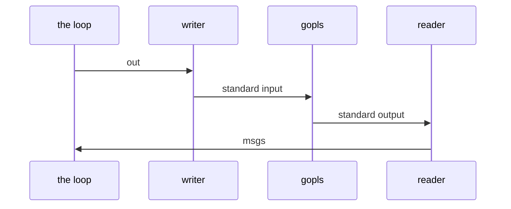

```go
// gopls is the Go language server, run as a child process. Like the rest of
// the server's state, it belongs to the loop in Serve.
type gopls struct {
	cmd     *exec.Cmd
	in      io.WriteCloser
	out     chan []byte   // to the goroutine that writes to gopls
	msgs    chan *message // from the goroutine that reads from it
	next    int
	pending map[int]call
	ids     map[string]int // the editor's id for a request in flight → ours
	dead    bool
	caps    map[string]any // what gopls said it can do
}

// call is a request in flight. done gets the answer, or nil if gopls died.
type call struct {
	done   func(*message)
	editor string
}

func (g *gopls) write(m *message) { g.out <- frame(m) }

func (g *gopls) notify(method string, params any) {
	raw, _ := json.Marshal(params)
	g.write(&message{Method: method, Params: raw})
}

// request asks gopls something on behalf of the editor's request id (nil if
// the question is litgo's own).
func (g *gopls) request(id *json.RawMessage, method string, params any, done func(*message)) {
	if g.dead {
		done(nil)
		return
	}
	raw, _ := json.Marshal(params)
	c := call{done: done}
	g.next++
	if id != nil {
		c.editor = string(*id)
		g.ids[c.editor] = g.next
	}
	g.pending[g.next] = c
	ours := json.RawMessage(strconv.Itoa(g.next))
	g.write(&message{ID: &ours, Method: method, Params: raw})
}

// cancel passes on the editor's loss of interest in one of its requests.
func (g *gopls) cancel(params json.RawMessage) {
	var p struct {
		ID json.RawMessage `json:"id"`
	}
	json.Unmarshal(params, &p)
	if n, ok := g.ids[string(p.ID)]; ok {
		g.notify("$/cancelRequest", map[string]any{"id": n})
	}
}
```

gopls sends three kinds of message. An answer goes to whoever is waiting for
it. A request of its own (to register a capability, or to read configuration)
gets `null` back, and gopls takes that to mean "use your defaults". Of its
notifications, litgo only passes error messages on. The progress reports are
about files you never see. The diagnostics would repeat the ones the type
checker from the last chapter already placed, or in the worst case contradict
them. And the one warning gopls has is that someone is editing a generated
file.

The reader drops the notifications nobody wants before they get to the loop,
because gopls sends a lot of them. It closes `msgs` when gopls hangs up. The
loop then marks gopls as dead and tells everyone who was waiting for an answer
that there won't be one.

```go
// listen reads what gopls sends until it hangs up or the server stops.
func (g *gopls) listen(out io.Reader, quit <-chan struct{}) {
	defer close(g.msgs)
	defer g.cmd.Wait()
	r := bufio.NewReader(out)
	for {
		m, err := read(r)
		if err != nil {
			return
		}
		if m.ID == nil && m.Method != "window/showMessage" {
			continue
		}
		select {
		case g.msgs <- m:
		case <-quit:
			return
		}
	}
}

// heard is where messages from gopls arrive. Without a gopls it is nil, and
// a nil channel never delivers anything.
func (s *server) heard() <-chan *message {
	if s.gopls == nil || s.gopls.dead {
		return nil
	}
	return s.gopls.msgs
}

// hear handles one message from gopls.
func (g *gopls) hear(m *message, s *server) {
	switch {
	case m.Method == "" && m.ID != nil:
		n, _ := strconv.Atoi(string(*m.ID))
		c, ok := g.pending[n]
		delete(g.pending, n)
		delete(g.ids, c.editor)
		if ok {
			c.done(m)
		}
	case m.ID != nil:
		g.write(&message{ID: m.ID, Result: json.RawMessage("null")})
	case m.Method == "window/showMessage":
		var p struct {
			Type int `json:"type"`
		}
		if json.Unmarshal(m.Params, &p); p.Type == 1 {
			s.write(&message{Method: m.Method, Params: m.Params})
		}
	}
}

// hangUp is what happens when gopls is gone: nobody gets an answer any more.
func (g *gopls) hangUp() {
	g.dead = true
	orphans := g.pending
	g.pending = map[int]call{}
	for _, c := range orphans {
		c.done(nil)
	}
}
```

litgo starts gopls while the editor is waiting for the answer to its
`initialize`, because what litgo can promise the editor depends on what gopls
promises litgo. litgo tells gopls what the editor told litgo (the workspace,
and what the editor can display, like snippets in completions and Markdown in
hovers). It leaves out the capabilities that would make gopls send requests of
its own.

The loop is the goroutine that runs `start`, so it can't be in its `select`
while it waits for gopls to answer. `start` receives from `msgs` itself until
the answer has come.

```go
// start runs gopls and introduces litgo to it the way the editor introduced
// itself to litgo. On any failure s.gopls stays nil.
func (s *server) start(initialize json.RawMessage) {
	bin := findGopls(s.goplsBin)
	if bin == "" {
		return
	}
	cmd := exec.Command(bin)
	in, _ := cmd.StdinPipe()
	out, _ := cmd.StdoutPipe()
	if cmd.Start() != nil {
		return
	}
	g := &gopls{cmd: cmd, in: in, msgs: make(chan *message), pending: map[int]call{}, ids: map[string]int{}}
	g.out, _ = writer(in)
	go g.listen(out, s.quit)

	var p map[string]any
	if json.Unmarshal(initialize, &p); p == nil {
		p = map[string]any{}
	}
	theirs, _ := p["capabilities"].(map[string]any)
	p["capabilities"] = map[string]any{"textDocument": theirs["textDocument"]}
	var reply *message
	answered := false
	g.request(nil, "initialize", p, func(m *message) { reply, answered = m, true })
	timeout := time.After(30 * time.Second)
	for !answered {
		select {
		case m, ok := <-g.msgs:
			if ok {
				g.hear(m, s)
			} else {
				g.hangUp() // which answers the request, with nil
			}
		case <-timeout:
			answered = true
		}
	}
	if result, _ := reply.result().(map[string]any); result != nil {
		g.caps, _ = result["capabilities"].(map[string]any)
		g.notify("initialized", map[string]any{})
		s.gopls = g
		return
	}
	g.kill()
}

// kill stops gopls, and the goroutine that writes to it.
func (g *gopls) kill() {
	close(g.out)
	g.in.Close()
	g.cmd.Process.Kill()
}

// result is the result of a successful answer, and nil otherwise.
func (m *message) result() any {
	if m == nil || m.Error != nil {
		return nil
	}
	return m.Result
}

func (s *server) stop() {
	if g := s.gopls; g != nil {
		g.kill()
	}
}
```

## Overlays

gopls has to see the latest text before it gets asked about it. A completion
request comes right after the keystroke that triggered it, sooner than the
delay that diagnostics wait for. So tangling doesn't wait. Whoever needs the
tangled files, whether that is the analysis or a request, calls `sync`, and
`sync` tangles at most once per version of the text. Both of them run on the
loop, so they can't get in each other's way. A document with a broken
chunk structure still gets tangled as well as it can be, because you are in the
middle of something and would still like completions.

```go
// overlay is a tangled file as gopls was last shown it.
type overlay struct {
	owner   string // URI of the document it is tangled from
	version int
	text    string
}

// sync tangles a document, unless that has been done for this version of
// its text, and shows gopls the result. It returns a nil result for a
// document that is not open.
func (s *server) sync(uri string) (*lit.Result, int) {
	d := s.docs[uri]
	if d == nil {
		return nil, -1
	}
	if d.res == nil || d.tangled != d.version {
		d.res, d.tangled = lit.Parse(path(uri), []byte(d.text)).Tangle(), d.version
		s.overlay(uri, d.res)
	}
	return d.res, d.version
}

// forget closes what a closed document tangled to.
func (s *server) forget(uri string) {
	s.overlay(uri, nil)
}
```

A document like this one tangles to dozens of files, and a keystroke only
changes one of them. litgo only sends that one.

```go
// overlay brings gopls up to date with what a document tangles to: new
// files are opened, changed ones changed, and ones no longer written closed.
func (s *server) overlay(uri string, res *lit.Result) {
	g := s.gopls
	if g == nil {
		return
	}
	live := map[string]bool{}
	for _, o := range outputs(res) {
		live[o.Path] = true
		text := string(o.Bytes())
		ov := s.overlays[o.Path]
		switch {
		case ov == nil:
			s.overlays[o.Path] = &overlay{owner: uri, version: 1, text: text}
			g.notify("textDocument/didOpen", map[string]any{
				"textDocument": map[string]any{"uri": fileURI(o.Path), "languageId": "go", "version": 1, "text": text}})
		case ov.text != text:
			ov.owner, ov.text, ov.version = uri, text, ov.version+1
			g.notify("textDocument/didChange", map[string]any{
				"textDocument":   map[string]any{"uri": fileURI(o.Path), "version": ov.version},
				"contentChanges": []any{map[string]any{"text": text}}})
		}
	}
	for p, ov := range s.overlays {
		if ov.owner == uri && !live[p] {
			delete(s.overlays, p)
			g.notify("textDocument/didClose", map[string]any{
				"textDocument": map[string]any{"uri": fileURI(p)}})
		}
	}
}

// outputs lists the Go files of a result, which may be nil.
func outputs(res *lit.Result) []*lit.Output {
	var out []*lit.Output
	if res != nil {
		for _, o := range res.Files {
			if o.File.Lang == "go" {
				out = append(out, o)
			}
		}
	}
	return out
}

func fileURI(path string) string {
	return (&url.URL{Scheme: "file", Path: filepath.ToSlash(path)}).String()
}
```

When gopls names a file in an answer, it might be one of these overlays.
`output` finds it, along with the document it came from, and prefers the
tangling that was current when the question was asked.

```go
func (s *server) output(uri string, asked *lit.Result) (o *lit.Output, doc *lit.Doc, owner string) {
	p := filepath.Clean(path(uri))
	res := asked
	if ov := s.overlays[p]; ov != nil {
		owner = ov.owner
		if d := s.docs[owner]; d != nil && (asked == nil || asked.Doc.Path != path(owner)) {
			res = d.res
		}
	}
	if owner != "" {
		for _, o := range outputs(res) {
			if filepath.Clean(o.Path) == p {
				return o, res.Doc, owner
			}
		}
	}
	return nil, nil, ""
}
```

## Questions

These are the requests that ask about a position in a document, each with the
capability that announces it. litgo offers the editor whatever gopls offers
litgo, as long as it is in this list. It always offers four of them, because it
can answer those itself when the position is on a chunk.

```go
var positional = map[string]string{
	"textDocument/hover":             "hoverProvider",
	"textDocument/definition":        "definitionProvider",
	"textDocument/typeDefinition":    "typeDefinitionProvider",
	"textDocument/implementation":    "implementationProvider",
	"textDocument/references":        "referencesProvider",
	"textDocument/documentHighlight": "documentHighlightProvider",
	"textDocument/completion":        "completionProvider",
	"textDocument/signatureHelp":     "signatureHelpProvider",
	"textDocument/prepareRename":     "renameProvider",
	"textDocument/rename":            "renameProvider",
}

func (s *server) capabilities() map[string]any {
	c := map[string]any{}
	if s.gopls != nil {
		for _, name := range positional {
			if v, ok := s.gopls.caps[name]; ok {
				c[name] = v
			}
		}
		c["workspaceSymbolProvider"] = s.gopls.caps["workspaceSymbolProvider"]
	}
	c["hoverProvider"], c["definitionProvider"], c["referencesProvider"] = true, true, true
	c["renameProvider"] = map[string]any{"prepareProvider": true}
	return c
}
```

```go
// proxy handles the requests that gopls has a say in, and reports whether
// the message was one.
func (s *server) proxy(m *message) bool {
	switch {
	case positional[m.Method] != "" && m.ID != nil:
		s.ask(m)
	case m.Method == "$/cancelRequest":
		if s.gopls != nil {
			s.gopls.cancel(m.Params)
		}
	case m.Method == "workspace/symbol" && m.ID != nil && s.gopls != nil:
		// No position to translate on the way in, but the symbols found
		// may well be in tangled files.
		var params any
		json.Unmarshal(m.Params, &params)
		s.gopls.request(m.ID, m.Method, params, func(reply *message) {
			s.relay(m, reply, &translation{s: s})
		})
	default:
		return false
	}
	return true
}
```

`Locate` translates the position in the question. If the position is in prose,
or in a Lua block, or on a line that an exclude pattern drops, then it isn't
anywhere in a Go file and the answer is `null`. Every one of these requests
allows `null`, and editors accept it silently.

```go
// position is the protocol's: a line, and a column in the agreed units.
type position struct {
	Line      int `json:"line"`
	Character int `json:"character"`
}

func (s *server) ask(m *message) {
	var p struct {
		TextDocument struct {
			URI string `json:"uri"`
		} `json:"textDocument"`
		Position position `json:"position"`
		NewName  string   `json:"newName"`
	}
	json.Unmarshal(m.Params, &p)
	uri := p.TextDocument.URI
	res, _ := s.sync(uri)
	if res == nil || p.Position.Line < 0 || p.Position.Line >= len(res.Doc.Lines) {
		s.respond(m, nil)
		return
	}
	line := p.Position.Line
	col := offset(s.utf8, res.Doc.Lines[line], p.Position.Character)
	if mention := res.Doc.MentionAt(line, col); mention != nil {
		// <<answer a question about a chunk>>
		return
	}
	o, outLine, outCol, ok := res.Locate(line, col)
	if !ok || o.File.Lang != "go" || s.gopls == nil {
		s.respond(m, nil)
		return
	}
	var params map[string]any
	json.Unmarshal(m.Params, &params)
	params["textDocument"] = map[string]any{"uri": fileURI(o.Path)}
	params["position"] = position{outLine, units(false, o.Lines[outLine].Text, outCol)}
	s.gopls.request(m.ID, m.Method, params, func(reply *message) {
		s.relay(m, reply, &translation{s: s, res: res, out: o, uri: uri})
	})
}

// respond answers a request; a nil result is the protocol's null.
func (s *server) respond(to *message, result any) {
	if result == nil {
		result = json.RawMessage("null")
	}
	s.write(&message{ID: to.ID, Result: result})
}
```

gopls counts columns in UTF-16 code units and doesn't offer anything else. That
is why litgo stops agreeing to bytes with the editor when gopls is there. It
means positions in files litgo knows nothing about (the standard library, a
dependency) can pass through untouched. litgo has the text of the documents and
the tangled files, so it converts the columns for those.

```go
// offset converts a column in UTF-16 code units (or in bytes) to a byte
// offset in the line: the inverse of units.
func offset(utf8 bool, line string, n int) int {
	if utf8 {
		return min(max(n, 0), len(line))
	}
	for i, r := range line {
		if n <= 0 {
			return i
		}
		n--
		if r >= 0x10000 {
			n--
		}
	}
	return len(line)
}
```

## Questions about chunks

A chunk reference is a comment, so gopls has nothing to say about it. But the
questions still make sense, and litgo knows the answers. A reference is
*defined* by the blocks of its chunk, hovering shows those blocks, the
*references* to a chunk are its references, and renaming it is `Rename`. If you
ask for the definition of a definition, litgo answers with the uses, so one key
takes you back and forth. All of this works with or without gopls.

<!-- chunk: answer a question about a chunk -->
```go
result, err := s.mention(m.Method, uri, res.Doc, mention, p.NewName)
if err != nil {
	s.write(&message{ID: m.ID, Error: &rpcError{requestFailed, err.Error()}})
} else {
	s.respond(m, result)
}
```

```go
const requestFailed = -32803

func (s *server) mention(method, uri string, doc *lit.Doc, m *lit.Mention, newName string) (any, error) {
	span := func(line, col, end int) map[string]any {
		line = min(line, len(doc.Lines)-1)
		text := doc.Lines[line]
		return map[string]any{"start": position{line, s.column(text, col)}, "end": position{line, s.column(text, end)}}
	}
	c := m.Chunk
	var uses, blocks []any
	for _, r := range c.Refs {
		uses = append(uses, map[string]any{"uri": uri, "range": span(r.Line, r.Col, r.EndCol)})
	}
	for _, b := range c.Blocks {
		blocks = append(blocks, map[string]any{"uri": uri, "range": span(b.First(), 0, 0)})
	}
	switch method {
	case "textDocument/definition":
		if m.Ref {
			return blocks, nil
		}
		return uses, nil
	case "textDocument/references":
		return uses, nil
	case "textDocument/hover":
		if !m.Ref || len(c.Blocks) == 0 {
			return nil, nil
		}
		text := "⟨" + c.Name + "⟩ ≡\n"
		for _, b := range c.Blocks {
			text += "```" + b.Lang + "\n" + strings.Join(doc.Lines[b.First():b.Last()+1], "\n") + "\n```\n"
		}
		return map[string]any{"contents": map[string]any{"kind": "markdown", "value": text}, "range": span(m.Line, m.Col, m.EndCol)}, nil
	case "textDocument/prepareRename":
		return map[string]any{"range": span(m.Line, m.Col, m.EndCol), "placeholder": c.Name}, nil
	case "textDocument/rename":
		edits, err := doc.Rename(c.Name, newName)
		if err != nil {
			return nil, err
		}
		var changes []any
		for _, e := range edits { // Rename replaces lines one for one
			changes = append(changes, map[string]any{"range": span(e.Start, 0, len(doc.Lines[e.Start])), "newText": e.Lines[0]})
		}
		return map[string]any{"changes": map[string]any{uri: changes}}, nil
	}
	return nil, nil
}
```

## Answers

The answers vary as much as the questions do, but the positions in them only
come in a few shapes. So litgo does the translation on the JSON, without a type
for every kind of answer:

* A *location* is a `uri` with a `range`, and a *location link* has a
  `targetUri`. If the file is a tangled one, both get rewritten to point at the
  document. Otherwise it is a file gopls found on disk, and it is left alone.
* A bare *range* anywhere else (the word a hover is about, an occurrence to
  highlight) is in the file the question was about.
* A *text edit* is a range with a `newText`, and it gets the careful treatment
  described below.

A chunk that is used twice gets tangled twice, and gopls finds a reference in
each copy. Both translate back to the same place, so litgo removes the
duplicates from lists.

```go
// translation brings the answer to one question back to the document.
type translation struct {
	s   *server
	res *lit.Result // the tangling gopls was asked about,
	out *lit.Output // the file in it that the question was about,
	uri string      // and the document
}

func (t *translation) value(v any) any {
	switch v := v.(type) {
	case []any:
		if len(v) > 0 && t.out != nil && isEdit(asMap(v[0])) {
			return t.edits(t.out, t.res.Doc, v)
		}
		out, seen := []any{}, map[string]bool{}
		for _, e := range v {
			if e = t.value(e); e == nil {
				continue
			}
			if key := positioned(e); key == "" || !seen[key] {
				out = append(out, e)
				seen[key] = true
			}
		}
		return out
	case map[string]any:
		return t.object(v)
	}
	return v
}

func (t *translation) object(v map[string]any) any {
	if uri, ok := v["uri"].(string); ok && v["range"] != nil {
		if o, doc, owner := t.s.output(uri, t.res); o != nil {
			if v["range"], ok = t.span(o, doc, v["range"], false); !ok {
				return nil
			}
			v["uri"] = owner
		}
		return v
	}
	if uri, ok := v["targetUri"].(string); ok {
		if t.out != nil && v["originSelectionRange"] != nil {
			v["originSelectionRange"], _ = t.span(t.out, t.res.Doc, v["originSelectionRange"], false)
		}
		if o, doc, owner := t.s.output(uri, t.res); o != nil {
			for _, k := range []string{"targetRange", "targetSelectionRange"} {
				if v[k], ok = t.span(o, doc, v[k], false); !ok {
					return nil
				}
			}
			v["targetUri"] = owner
		}
		return v
	}
	if t.out != nil && isEdit(v) { // on its own, as the textEdit of a completion
		if t.edit(t.out, t.res.Doc, v) {
			return v
		}
		return nil
	}
	if t.out != nil && isRange(v) {
		r, _ := t.span(t.out, t.res.Doc, v, false)
		return r
	}
	for k, e := range v {
		if e = t.value(e); e == nil {
			delete(v, k) // in the protocol, null and absent are the same
		} else {
			v[k] = e
		}
	}
	return v
}

func isRange(v map[string]any) bool {
	_, start := v["start"].(map[string]any)
	_, end := v["end"].(map[string]any)
	return start && end
}

func isEdit(v map[string]any) bool {
	_, ok := v["newText"].(string)
	return ok
}

func asMap(v any) map[string]any {
	m, _ := v.(map[string]any)
	return m
}

func asList(v any) []any {
	l, _ := v.([]any)
	return l
}

// positioned gives a location, a highlight or an edit a key to be compared
// by, and anything else none.
func positioned(v any) string {
	if m, ok := v.(map[string]any); ok && (m["range"] != nil || m["targetUri"] != nil) {
		b, _ := json.Marshal(m)
		return string(b)
	}
	return ""
}
```

A range gets translated one end at a time, exactly if possible. A range that is
only for looking at can fall back on `Map`'s approximation. For example, the
definition of a name in a generated `import` is close enough to the `imports:`
directive. A range to *replace* can't fall back like that. It also has to have
the same shape in the document as in the tangled file, and it doesn't if it
starts in a host line and ends in a chunk spliced into that line.

```go
// span translates a range in a tangled file to the document it came from.
func (t *translation) span(o *lit.Output, doc *lit.Doc, v any, edit bool) (any, bool) {
	r, _ := v.(map[string]any)
	l1, c1, ok1 := outPosition(o, r["start"])
	l2, c2, ok2 := outPosition(o, r["end"])
	if !ok1 || !ok2 && edit {
		return v, false
	}
	if !ok2 {
		l2, c2 = l1, c1
	}
	sl, sc, ok1 := o.Exact(l1, c1, false)
	el, ec, ok2 := o.Exact(l2, c2, l1 != l2 || c1 != c2)
	if edit && !(ok1 && ok2 && el-sl == l2-l1 && (l1 != l2 || ec-sc == c2-c1)) {
		return v, false
	}
	if !ok1 {
		if sl, sc, _, ok1 = o.Map(l1, c1); !ok1 {
			return v, false
		}
	}
	if !ok2 {
		el, ec, _, ok2 = o.Map(l2, c2)
	}
	if !ok2 || el < sl || el == sl && ec < sc {
		el, ec = sl, sc
	}
	return map[string]any{
		"start": position{sl, units(t.s.utf8, doc.Lines[sl], sc)},
		"end":   position{el, units(t.s.utf8, doc.Lines[el], ec)},
	}, true
}

// outPosition decodes a position in a tangled file, in bytes.
func outPosition(o *lit.Output, v any) (line, col int, ok bool) {
	p, _ := v.(map[string]any)
	l, ok1 := p["line"].(float64)
	c, ok2 := p["character"].(float64)
	if !ok1 || !ok2 || l < 0 || int(l) >= len(o.Lines) {
		return 0, 0, false
	}
	return int(l), offset(false, o.Lines[int(l)].Text, int(c)), true
}
```

An edit that can't be translated gets dropped, with one exception. Completing
`strings.ToUpper` in a file that doesn't import `strings` comes with edits to
the `import (` block, and litgo generates that block from the `imports:`
directive. The edits are useless as they are, because gopls sends the smallest
difference it can find, and between `"fmt"` and `"fmt"`, newline, `"strings"`
that is a few characters in the middle of a line. But it is easy to find out
what the edits are *for*. litgo carries them out on the tangled file and looks
at what the file imports afterwards that it didn't import before. `AddImport`
knows how to add that to a document.

```go
// edit translates a text edit in place, if it has a place in the document.
func (t *translation) edit(o *lit.Output, doc *lit.Doc, v map[string]any) bool {
	ok := true
	for _, k := range []string{"range", "insert", "replace"} { // a completion may offer both an insertion and a replacement
		if r, has := v[k]; has && ok {
			if l, _, _ := outPosition(o, asMap(r)["start"]); l < o.Header {
				return false
			}
			v[k], ok = t.span(o, doc, r, true)
		}
	}
	return ok
}

// edits translates a list of text edits. Those to the generated header
// become edits to the imports directive.
func (t *translation) edits(o *lit.Output, doc *lit.Doc, list []any) []any {
	out, header := []any{}, []map[string]any{}
	for _, e := range list {
		m := asMap(e)
		if l, _, ok := outPosition(o, asMap(m["range"])["start"]); ok && l < o.Header {
			header = append(header, m)
		} else if t.edit(o, doc, m) {
			out = append(out, m)
		}
	}
	if len(header) == 0 {
		return out
	}
	// <<carry out the edits to the header>>
	file, _ := parser.ParseFile(token.NewFileSet(), "", text, parser.ImportsOnly)
	if file == nil {
		return out
	}
	for _, spec := range file.Imports {
		alias, path := "", strings.Trim(spec.Path.Value, "\"`")
		if spec.Name != nil {
			alias = spec.Name.Name
		}
		known := false
		for _, imp := range o.File.Imports {
			known = known || imp.Path == path
		}
		if line, col, entry, ok := doc.AddImport(o.File, alias, path); ok && !known {
			at := position{line, units(t.s.utf8, doc.Lines[min(line, len(doc.Lines)-1)], col)}
			out = append(out, map[string]any{"range": map[string]any{"start": at, "end": at}, "newText": entry})
		}
	}
	return out
}
```

The edits in a list all refer to the text as it was before any of them, so they
get carried out from the bottom up.

<!-- chunk: carry out the edits to the header -->
```go
text := string(o.Bytes())
starts := []int{0}
for _, l := range o.Lines {
	starts = append(starts, starts[len(starts)-1]+len(l.Text)+1)
}
at := func(v any) int {
	l, c, ok := outPosition(o, v)
	if !ok {
		return -1
	}
	return starts[l] + c
}
sort.SliceStable(header, func(i, j int) bool {
	return at(asMap(header[i]["range"])["start"]) > at(asMap(header[j]["range"])["start"])
})
for _, m := range header {
	r := asMap(m["range"])
	if from, to := at(r["start"]), at(r["end"]); from >= 0 && to >= from {
		text = text[:from] + m["newText"].(string) + text[to:]
	}
}
```

Renaming is the one answer that is made entirely of edits, in any number of
files. It is also the one where dropping an edit is not an option, because a
rename that is only partly carried out leaves a program that doesn't compile.
So litgo refuses the whole rename if any part of it can't be done. That
includes the case where gopls wants to change a tangled file whose document
isn't open. The change would be lost at the next tangle, and the right way to
make it is to open that document and rename there.

The edits come back grouped by tangled file, and they go out grouped by
document. litgo strips the version numbers gopls put on them, because those are
versions of overlays the editor has never heard of.

```go
// workspaceEdit translates the answer to a rename.
func (t *translation) workspaceEdit(v any) (any, error) {
	w, _ := v.(map[string]any)
	if w == nil {
		return nil, nil
	}
	changes := map[string][]any{}
	seen := map[string]bool{}
	add := func(uri string, edits []any) error {
		o, doc, owner := t.s.output(uri, t.res)
		if o == nil {
			if b, err := os.ReadFile(path(uri)); err == nil && lit.Generated(b) {
				return fmt.Errorf("%s is tangled from a document that is not open: open it, and rename there", filepath.Base(path(uri)))
			}
			changes[uri] = append(changes[uri], edits...)
			return nil
		}
		for _, e := range edits {
			m := asMap(e)
			at, _ := json.Marshal(m["range"])
			if !t.edit(o, doc, m) {
				return fmt.Errorf("this would change text that litgo generates, in %s at %s", filepath.Base(o.Path), at)
			}
			if key := positioned(m); !seen[owner+key] {
				seen[owner+key] = true
				changes[owner] = append(changes[owner], m)
			}
		}
		return nil
	}
	for uri, edits := range asMap(w["changes"]) {
		if err := add(uri, asList(edits)); err != nil {
			return nil, err
		}
	}
	for _, c := range asList(w["documentChanges"]) {
		change := asMap(c)
		if change["kind"] != nil {
			return nil, fmt.Errorf("this would %s a file, which a document's file directives decide", change["kind"])
		}
		uri, _ := asMap(change["textDocument"])["uri"].(string)
		if err := add(uri, asList(change["edits"])); err != nil {
			return nil, err
		}
	}
	return map[string]any{"changes": changes}, nil
}
```

```go
// relay passes gopls's answer to a request on to the editor.
func (s *server) relay(to *message, reply *message, t *translation) {
	switch {
	case reply != nil && reply.Error != nil:
		s.write(&message{ID: to.ID, Error: reply.Error})
	case to.Method == "textDocument/rename":
		edit, err := t.workspaceEdit(reply.result())
		if err != nil {
			s.write(&message{ID: to.ID, Error: &rpcError{requestFailed, err.Error()}})
			return
		}
		s.respond(to, edit)
	default:
		s.respond(to, t.value(reply.result()))
	}
}
```

<!-- file: internal/lsp/gopls_test.go -->
<!-- package: lsp -->
<!-- imports: encoding/json, fmt, os, strconv, strings, testing, time -->

The test needs gopls and gets skipped without it. Its document has a function
in one block, a call to that function in a chunk, and a clef character in front
of the call, which is two UTF-16 units and four bytes. Every position in the
test gets translated twice on the way in and twice on the way out.

<!-- verbatim -->
```go
const greeter = "<!-- package: main -->\n<!-- imports: fmt -->\n\n```go\nfunc greet(whom string) string {\n\treturn \"hello, \" + whom\n}\n\nfunc main() {\n\t// <<say it>>\n}\n```\n\n<!-- chunk: say it -->\n```go\nfmt.Println(\"𝄞\", greet(\"world\"))\n```\n"

// ask sends a request about a position and returns the result as JSON.
func (c *client) ask(id int, method, uri string, line, character int, more map[string]any) string {
	params := map[string]any{"textDocument": map[string]any{"uri": uri}, "position": map[string]any{"line": line, "character": character}}
	for k, v := range more {
		params[k] = v
	}
	c.send("textDocument/"+method, id, params)
	return c.result(id)
}

// result waits for the answer to a request.
func (c *client) result(id int) string {
	for {
		if m := c.next(); m.ID != nil && string(*m.ID) == strconv.Itoa(id) {
			if m.Error != nil {
				return "error: " + m.Error.Message
			}
			var sb strings.Builder
			enc := json.NewEncoder(&sb)
			enc.SetEscapeHTML(false)
			enc.Encode(m.Result)
			return strings.TrimSpace(sb.String())
		}
	}
}

// start spells the start of a range the way encoding/json does: keys sorted.
func start(line, character int) string {
	return fmt.Sprintf(`"start":{"character":%d,"line":%d}`, character, line)
}

func TestGoplsThroughTheDocument(t *testing.T) {
	if findGopls("") == "" {
		t.Skip("no gopls")
	}
	dir := t.TempDir()
	os.WriteFile(dir+"/go.mod", []byte("module example.com/greeter\n\ngo 1.22\n"), 0o644)
	uri := "file://" + dir + "/greeter.lit.md"
	c := connect(t, "")
	c.send("initialize", 1, map[string]any{"rootUri": "file://" + dir, "capabilities": map[string]any{
		"general": map[string]any{"positionEncodings": []string{"utf-8", "utf-16"}}}})
	if got := c.result(1); !strings.Contains(got, "completionProvider") || !strings.Contains(got, `"utf-16"`) {
		t.Fatalf("with gopls behind it the server completes, and counts as gopls does: %s", got)
	}
	c.send("initialized", 0, `{}`)
	c.send("textDocument/didOpen", 0, map[string]any{"textDocument": map[string]any{"uri": uri, "version": 1, "text": greeter}})

	// Println, in the chunk. gopls may still be loading the first time.
	hover := ""
	for i := 0; i < 50 && !strings.Contains(hover, "func fmt.Println"); i++ {
		if hover = c.ask(10+i, "hover", uri, 15, 5, nil); hover == "null" {
			time.Sleep(200 * time.Millisecond)
		}
	}
	if !strings.Contains(hover, "func fmt.Println") || !strings.Contains(hover, start(15, 4)) {
		t.Errorf("hover in a chunk: %s", hover)
	}
	// greet, after the clef: from the chunk to the block that defines it.
	if got := c.ask(2, "definition", uri, 15, 19, nil); !strings.Contains(got, uri) || !strings.Contains(got, start(4, 5)) {
		t.Errorf("definition across blocks: %s", got)
	}
	if got := c.ask(3, "references", uri, 4, 6, map[string]any{"context": map[string]any{"includeDeclaration": true}}); strings.Count(got, uri) != 2 || !strings.Contains(got, start(15, 18)) {
		t.Errorf("references, in UTF-16 units: %s", got)
	}
	if got := c.ask(4, "rename", uri, 4, 6, map[string]any{"newName": "hail"}); strings.Count(got, `"newText":"hail"`) != 2 ||
		!strings.Contains(got, start(15, 18)) || strings.Contains(got, "greeter.go") {
		t.Errorf("rename edits the document, not the tangled file: %s", got)
	}
	if got := c.ask(5, "hover", uri, 0, 3, nil); got != "null" {
		t.Errorf("prose is not Go: %s", got)
	}

	// The chunk reference is litgo's own business.
	if got := c.ask(6, "definition", uri, 9, 6, nil); !strings.Contains(got, start(15, 0)) {
		t.Errorf("a reference is defined by its chunk: %s", got)
	}
	if got := c.ask(7, "hover", uri, 9, 6, nil); !strings.Contains(got, "⟨say it⟩") || !strings.Contains(got, "greet(") {
		t.Errorf("hovering over a reference shows the chunk: %s", got)
	}
	if got := c.ask(8, "rename", uri, 13, 14, map[string]any{"newName": "speak"}); !strings.Contains(got, "<!-- chunk: speak -->") || !strings.Contains(got, "// <<speak>>") {
		t.Errorf("renaming a chunk: %s", got)
	}

	// Completing from a package that is not imported adds it to the directive.
	c.send("textDocument/didChange", 0, map[string]any{
		"textDocument":   map[string]any{"uri": uri, "version": 2},
		"contentChanges": []any{map[string]any{"text": strings.Replace(greeter, `greet("world")`, "strings.", 1)}},
	})
	got := c.ask(9, "completion", uri, 15, 26, nil)
	if !strings.Contains(got, `"label":"ToUpper"`) {
		t.Fatalf("completion: %.300s", got)
	}
	if !strings.Contains(got, `"newText":", strings"`) || !strings.Contains(got, start(1, 17)) {
		i := strings.Index(got, `"label":"ToUpper"`)
		t.Errorf("the import belongs in the imports directive: %.600s", got[max(i-300, 0):])
	}
}
```

# The Neovim plugin

The plugin lives in this repository, at the root, where plugin managers look
for `plugin/` and `lua/`. It is a client of the protocol above, so the two have
to change together. With lazy.nvim:

```lua
{
  "tlehman/litgo",
  build = "go build -o bin/litgo .",
  event = { "BufReadPre *.lit.md", "BufNewFile *.lit.md" },
  opts = {},
}
```

The plugin is thin on purpose. Everything that knows about the format is in the
binary, and the Lua just turns answers into extmarks, edits and diagnostics.
Another editor would need the same four calls and nothing else.

| Command | Key | |
|---|---|---|
| *(nothing)* | | Chunk, syntax and type errors show up under the offending line as you type, from `litgo lsp`. |
| *(what Neovim has for any language server)* | `K`, `grr`, `grn`, `<C-x><C-o>`, `<C-s>` | In a Go block the buffer acts like a Go buffer. You get gopls's completion, documentation, references, rename and signature help, through `litgo lsp`. |
| `:TangleCompileAndRun [args]` | `\r` | Saves, tangles, compiles and runs. Panics and failing tests land in the Markdown too, and the cursor goes to the first error. |
| `:'<,'>Untangle [name]` | `\u` | Moves the selection into a chunk at the bottom and leaves a reference. |
| `:RenameChunk [name]` | `\n` | Renames the chunk under the cursor, everywhere. |
| `:Tangle[!]`, `:Weave [html]` | `\t`, `\w` | `:Tangle` writes the sources. `:Weave` writes and opens the PDF, or the web page. |
| `gd`, `K` | | On a chunk, `gd` goes from a reference to the definition and from a definition to the uses, and `K` previews the chunk. On Go they do what they do in Go. |
| `:LitWatch`, `:LitStop`, `:LitClear`, `:LitRender` | | Run on save, kill the program, clear diagnostics, toggle rendering. |

<!-- file: plugin/litgo.lua -->

```lua
-- Loaded automatically when this directory is on the runtimepath. Calling
-- require("litgo").setup({...}) yourself (before or after) overrides options.
if vim.g.loaded_litgo then
  return
end

vim.g.loaded_litgo = true

if vim.fn.has("nvim-0.11") == 0 then
  vim.notify("litgo needs Neovim 0.11 or newer (inline virtual text, conceal_lines)", vim.log.levels.WARN)
  return
end

require("litgo").setup()
```

## Setup

<!-- file: lua/litgo/init.lua -->

```lua
-- litgo.nvim: a tight loop for literate Go in .lit.md files.
--
-- The plugin is deliberately thin. Everything that knows about the format
-- lives in the `litgo` binary; Lua asks it questions (document on stdin, JSON
-- back) and turns the answers into extmarks, edits and diagnostics.
local M = {}

M.config = {
  bin = nil, -- path to the litgo binary; found on $PATH when nil
  render = {
    enabled = true,
    math = true,
    mermaid = true,
    tables = true, -- line up the columns of Markdown tables
    chunks = true, -- show `// <<name>>` as ⟨name⟩ and chunk directives as ⟨name⟩ ≡
    conceal_source = true, -- hide diagram/display-math source while the cursor is elsewhere
    upright = false, -- true: keep math letters upright instead of 𝑖𝑡𝑎𝑙𝑖𝑐
    indent = 4,
    debounce_ms = 150,
  },
  run = {
    vet = false, -- also report `go vet` findings as warnings
    timeout = "60s", -- kill runaway programs; "" to disable
    jump = true, -- move the cursor to the first error
    focus = true, -- put the cursor in the output panel when the run ends, so q closes it
    on_save = false, -- :TangleCompileAndRun after every write (toggle with :LitWatch)
    panel_height = 12,
  },
  lsp = {
    enabled = true, -- run `litgo lsp`: chunk, syntax and type errors as you type
    virtual_lines = true, -- show them under the offending line rather than beside it
    gopls = true, -- completion, hover, definitions, references, rename in Go blocks; or a path, or false
    settings = nil, -- gopls settings, e.g. { buildFlags = { "-tags=integration" } }
    completion = "auto", -- "auto": Neovim's own completion popup as you type, unless a
    -- completion plugin is loaded. true forces it on, false off.
  },
  weave = { open = true },
  untangle = { jump = false }, -- true: go to the new chunk to document it right away
  keymaps = {
    run = "<localleader>r",
    stop = "<localleader>s",
    tangle = "<localleader>t",
    weave = "<localleader>w",
    untangle = "<localleader>u", -- visual mode
    rename = "<localleader>n",
    toggle_render = "<localleader>v",
    goto_chunk = "gd",
    hover = "K",
  },
}
```

The plugin looks for the binary in its own checkout first. That is where a
plugin manager's build step puts it, and a binary from there is sure to match
the Lua.

```lua
local function plugin_root()
  local src = debug.getinfo(1, "S").source:sub(2)
  return vim.fn.fnamemodify(src, ":p:h:h:h")
end

local warned = false

--- Locate the litgo binary: explicit config, a build inside the plugin's own
--- checkout (what a plugin manager's build step produces), then $PATH.
function M.bin()
  if M._bin then
    return M._bin
  end
  local candidates = { plugin_root() .. "/bin/litgo", "litgo" }
  if M.config.bin then
    table.insert(candidates, 1, vim.fn.expand(M.config.bin))
  end
  for _, c in ipairs(candidates) do
    if c and vim.fn.executable(c) == 1 then
      M._bin = c
      return c
    end
  end
  if not warned then
    warned = true
    vim.notify(
      "litgo: binary not found. Run `go build -o bin/litgo .` in " .. plugin_root() .. ", or set `bin` in setup().",
      vim.log.levels.ERROR
    )
  end
end
```

The plugin sees the protocol as two halves: ask a question about the buffer,
then apply the edits that come back. Several `nvim_buf_set_lines` calls made
from one command count as a single undo step.

```lua
--- Run litgo synchronously with the buffer on stdin; returns decoded JSON.
function M.query(buf, args)
  local bin = M.bin()
  if not bin then
    return nil, "litgo binary not found"
  end
  local cmd = vim.list_extend({ bin }, args)
  local text = table.concat(vim.api.nvim_buf_get_lines(buf, 0, -1, false), "\n") .. "\n"
  local res = vim.system(cmd, { stdin = text, text = true }):wait(5000)
  local ok, decoded = pcall(vim.json.decode, res.stdout or "")
  if not ok or type(decoded) ~= "table" then
    return nil, (res.stderr ~= "" and res.stderr) or "litgo returned no JSON"
  end
  if decoded.error then
    return nil, decoded.error
  end
  return decoded
end

--- Apply bottom-up line edits as a single undo step.
function M.apply_edits(buf, edits)
  for _, e in ipairs(edits) do
    vim.api.nvim_buf_set_lines(buf, e.start, e["end"], false, e.lines)
  end
end

function M.is_lit(buf)
  return vim.api.nvim_buf_get_name(buf):match("%.lit%.md$") ~= nil
end

local function define_highlights()
  local links = {
    LitgoMath = "Special",
    LitgoDiagram = "Function",
    LitgoTableRule = "Comment",
    LitgoChunk = "Title",
    LitgoFile = "Directory",
    LitgoInfo = "Comment",
    LitgoError = "DiagnosticError",
    LitgoOk = "DiagnosticOk",
  }
  for name, target in pairs(links) do
    vim.api.nvim_set_hl(0, name, { link = target, default = true })
  end
end
```

A completion plugin offers the same sources everywhere in the buffer, which in
a Go block means Markdown snippets and words from the prose alongside what
gopls has to say. The plugin can't reach into someone else's configuration, so
it answers the question instead: is this line inside a Go block? Counting
fences from the top is enough, and cheap, because a completion menu only asks
about the line the cursor is on.

```lua
--- Is a line (0-based; the cursor's by default) inside a Go block?
function M.in_go_block(buf, line)
  buf = buf or 0
  if not M.is_lit(buf) then
    return false
  end
  line = line or (vim.api.nvim_win_get_cursor(0)[1] - 1)
  local lang, fence = nil, nil
  for _, l in ipairs(vim.api.nvim_buf_get_lines(buf, 0, line, false)) do
    local marks, rest = l:match("^%s*(``+`)%s*(.*)$")
    if marks then
      if not fence then
        fence, lang = marks, rest:match("^[%w_+-]*")
      elseif #marks >= #fence then
        fence, lang = nil, nil
      end
    end
  end
  return lang == "go"
end
```

The filetype stays `markdown`, so treesitter highlighting and everything else
that works for Markdown keeps working. The commands are local to the buffer.

```lua
--- Set up one .lit.md buffer: commands, keymaps, rendering.
function M.attach(buf)
  if vim.b[buf].litgo_attached or not M.is_lit(buf) then
    return
  end
  vim.b[buf].litgo_attached = true

  local run = require("litgo.run")
  local chunks = require("litgo.chunks")
  local render = require("litgo.render")

  local function command(name, fn, opts)
    vim.api.nvim_buf_create_user_command(buf, name, fn, opts or {})
  end
  command("Tangle", function(o)
    run.tangle(buf, o.bang)
  end, { bang = true, desc = "Write the Go source (! overwrites files litgo did not generate)" })
  command("Weave", function(o)
    run.weave(buf, o.args)
  end, { nargs = "?", desc = "Write and open the woven PDF (or :Weave html)" })
  command("TangleCompileAndRun", function(o)
    run.run(buf, o.fargs)
  end, { nargs = "*", desc = "Tangle, compile and run; errors appear inline" })
  command("LitStop", function()
    run.stop()
  end, { desc = "Kill the running program" })
  command("LitWatch", function()
    M.config.run.on_save = not M.config.run.on_save
    vim.notify("litgo: run on save " .. (M.config.run.on_save and "on" or "off"))
  end, { desc = "Toggle :TangleCompileAndRun on every write" })
  command("LitClear", function()
    run.clear(buf)
  end, { desc = "Clear compile and run diagnostics" })
  command("Untangle", function(o)
    chunks.untangle(buf, o)
  end, { range = true, nargs = "*", desc = "Move the selection into a named chunk at the bottom" })
  command("RenameChunk", function(o)
    chunks.rename(buf, o.args)
  end, { nargs = "*", desc = "Rename the chunk under the cursor everywhere" })
  command("LitRender", function()
    render.toggle(buf)
  end, { desc = "Toggle math, diagram and chunk rendering" })

  local keys = M.config.keymaps or {}
  local function map(mode, lhs, rhs, desc)
    if lhs and lhs ~= "" then
      vim.keymap.set(mode, lhs, rhs, { buffer = buf, silent = true, desc = "litgo: " .. desc })
    end
  end
  map("n", keys.run, "<cmd>TangleCompileAndRun<cr>", "tangle, compile and run")
  map("n", keys.stop, "<cmd>LitStop<cr>", "stop the program")
  map("n", keys.tangle, "<cmd>Tangle<cr>", "tangle")
  map("n", keys.weave, "<cmd>Weave<cr>", "weave")
  map("x", keys.untangle, ":Untangle<cr>", "untangle selection into a chunk")
  map("n", keys.rename, "<cmd>RenameChunk<cr>", "rename chunk")
  map("n", keys.toggle_render, "<cmd>LitRender<cr>", "toggle rendering")
  map("n", keys.goto_chunk, chunks.goto_chunk, "go to chunk definition / uses")
  map("n", keys.hover, chunks.hover, "preview chunk")

  vim.api.nvim_create_autocmd("BufWritePost", {
    buffer = buf,
    callback = function()
      if M.config.run.on_save then
        run.run(buf, {})
      end
    end,
  })

  run.attach(buf)
  render.attach(buf)
  require("litgo.lsp").start(buf)
end

function M.setup(opts)
  M.config = vim.tbl_deep_extend("force", M.config, opts or {})
  M._bin = nil
  define_highlights()
  local group = vim.api.nvim_create_augroup("litgo", { clear = true })
  vim.api.nvim_create_autocmd({ "BufReadPost", "BufNewFile", "BufWinEnter" }, {
    group = group,
    pattern = "*.lit.md",
    callback = function(ev)
      M.attach(ev.buf)
    end,
  })
  vim.api.nvim_create_autocmd("ColorScheme", { group = group, callback = define_highlights })
  for _, buf in ipairs(vim.api.nvim_list_bufs()) do
    if vim.api.nvim_buf_is_loaded(buf) then
      M.attach(buf)
    end
  end
end

return M
```

## Rendering

<!-- file: lua/litgo/render.lua -->

```lua
-- In-buffer rendering: LaTeX as Unicode, Mermaid as box drawings, and chunk
-- syntax as ⟨names⟩. Whatever the cursor touches falls back to its source,
-- with block renderings kept underneath as a live preview.
local M = {}

local ns = vim.api.nvim_create_namespace("litgo-render")

local check_ns = vim.api.nvim_create_namespace("litgo-check")

M.check_ns = check_ns

-- bufnr -> { items, chunks, enabled, dirty, timer, cursor_row }
local state = {}

local function litgo()
  return require("litgo")
end

function M.get(buf)
  return state[buf]
end

local function virt_lines(lines, hl, indent)
  local pad = string.rep(" ", indent)
  local out = {}
  for _, l in ipairs(lines) do
    out[#out + 1] = { { pad .. l, hl } }
  end
  return out
end

local function mark(buf, row, col, opts)
  opts.strict = false
  pcall(vim.api.nvim_buf_set_extmark, buf, ns, row, col, opts)
end

local function wanted(item, cfg)
  if item.kind == "math" or item.kind == "math-block" then
    return cfg.math
  elseif item.kind == "mermaid" then
    return cfg.mermaid
  elseif item.kind == "table" then
    return cfg.tables
  end
  return cfg.chunks
end
```

Everything is drawn with extmarks, and whatever the cursor is on doesn't get
drawn, so the source is always one keystroke away from its rendering.

```lua
--- Redraw every extmark. Cheap enough (one pass over the items) to run on
--- each cursor-line change, which keeps the reveal logic trivial.
function M.draw(buf)
  local st = state[buf]
  if not st or not vim.api.nvim_buf_is_valid(buf) then
    return
  end
  vim.api.nvim_buf_clear_namespace(buf, ns, 0, -1)
  if not st.enabled or not st.items then
    return
  end
  local cfg = litgo().config.render
  local cursor = -1
  if vim.api.nvim_get_current_buf() == buf then
    cursor = vim.api.nvim_win_get_cursor(0)[1] - 1
  end
  st.cursor_row = cursor
  local last = vim.api.nvim_buf_line_count(buf) - 1

  for _, it in ipairs(st.items) do
    if wanted(it, cfg) then
      local under_cursor = cursor >= it.line and cursor <= it.end_line
      if it.lines then
        -- <<draw a diagram or a displayed formula>>
      elseif it.table then
        -- <<line up the columns of a table>>
      else
        -- <<draw inline math or a chunk name>>
      end
    end
  end
end
```

A block rendering replaces its source. The source lines get concealed, and the
drawing hangs off a neighbouring line as virtual lines. While the cursor is
inside the block, the source shows and the drawing stays underneath as a live
preview.

<!-- chunk: draw a diagram or a displayed formula -->
```lua
local hl = it.kind == "mermaid" and "LitgoDiagram" or "LitgoMath"
if it.error then
  hl = "LitgoError"
end
local vl = virt_lines(it.lines, hl, cfg.indent)
if under_cursor or not cfg.conceal_source then
  -- Editing: keep the source visible and preview underneath. Anchor to
  -- the line after the block: treesitter conceals fence lines, and
  -- virtual lines hanging off a concealed line disappear with it.
  if it.end_line < last then
    mark(buf, it.end_line + 1, 0, { virt_lines = vl, virt_lines_above = true })
  else
    mark(buf, it.end_line, 0, { virt_lines = vl })
  end
elseif it.end_line < last then
  mark(buf, it.line, 0, { end_row = it.end_line, conceal_lines = "" })
  mark(buf, it.end_line + 1, 0, { virt_lines = vl, virt_lines_above = true })
elseif it.line > 0 then
  mark(buf, it.line, 0, { end_row = it.end_line, conceal_lines = "" })
  mark(buf, it.line - 1, 0, { virt_lines = vl })
else
  mark(buf, it.end_line, 0, { virt_lines = vl })
end
```

A table stays where it is, and its lines stay lines of the buffer. The only
things added are spaces, as inline virtual text, so that the pipes of every row
end up under the pipes of the header. A column is as wide as its widest cell
looks. A cell that looks narrower gets the difference as spaces: after its text
if the column is aligned left, before its text if it is aligned right, and half
on each side if it is centred. The rule under the header is the one thing that
gets replaced, by dashes that are as wide as the column. The row the cursor is
on is left exactly as it was typed, like everything else the cursor is on.

The widths get measured with `strdisplaywidth`, because that is the editor's
own answer to how many screen cells a string takes up. They are kept with the
item, so moving the cursor doesn't measure every table again.

<!-- chunk: line up the columns of a table -->
```lua
local t = it.table
local function looks(cell)
  return (cell.col - cell.from) + vim.fn.strdisplaywidth(cell.text) + (cell.to - cell.end_col)
end
if not it.widths then
  it.widths = {}
  for _, row in ipairs(t.rows) do
    for c, cell in ipairs(row.cells) do
      it.widths[c] = math.max(it.widths[c] or 3, looks(cell))
    end
  end
end
local function spaces(row, col, n)
  if n > 0 then
    mark(buf, row, col, { virt_text = { { string.rep(" ", n) } }, virt_text_pos = "inline" })
  end
end
for _, row in ipairs(t.rows) do
  if row.line ~= cursor then
    for _, h in ipairs(row.hide or {}) do
      mark(buf, row.line, h[1], { end_col = h[2], conceal = "" })
    end
    for c, cell in ipairs(row.cells) do
      local gap = (it.widths[c] or 0) - looks(cell)
      local before = ({ right = gap, center = math.floor(gap / 2) })[t.align[c]] or 0
      spaces(row.line, cell.from, before)
      spaces(row.line, cell.to, gap - before)
    end
  end
end
if it.line + 1 ~= cursor then
  for c, cell in ipairs(t.rule) do
    local w, a = it.widths[c] or 3, t.align[c]
    local dashes = (a == "center" and ":" or "-") .. string.rep("-", w - 2) .. (a == "left" and "-" or ":")
    mark(buf, it.line + 1, cell.from, { end_col = cell.to, conceal = "" })
    mark(buf, it.line + 1, cell.from, { virt_text = { { dashes, "LitgoTableRule" } }, virt_text_pos = "inline" })
  end
end
```

<!-- chunk: draw inline math or a chunk name -->
```lua
local hl = ({ math = "LitgoMath", file = "LitgoFile" })[it.kind] or "LitgoChunk"
if it.info == "undefined" then
  hl = "LitgoError"
end
if not under_cursor and it.text then
  mark(buf, it.line, it.col, { end_col = it.end_col, conceal = "" })
  mark(buf, it.line, it.col, { virt_text = { { it.text, hl } }, virt_text_pos = "inline" })
end
if it.info and it.info ~= "" then
  mark(buf, it.line, 0, { virt_text = { { "  " .. it.info, "LitgoInfo" } }, virt_text_pos = "eol" })
end
```

Analysis is asynchronous and debounced. An answer only gets used if the buffer
hasn't changed since the question was asked.

```lua
local function to_diagnostics(list, buf)
  local name = vim.api.nvim_buf_get_name(buf)
  local count = vim.api.nvim_buf_line_count(buf)
  local out = {}
  for _, d in ipairs(list or {}) do
    if not d.file or d.file == "" or d.file == name then
      out[#out + 1] = {
        lnum = math.min(d.line, count - 1),
        col = d.col or 0,
        end_col = (d.end_col and d.end_col > 0) and d.end_col or nil,
        severity = d.severity,
        message = d.message,
        source = d.source,
      }
    end
  end
  return out
end

M.to_diagnostics = to_diagnostics

--- Ask litgo about the buffer and redraw when the answer is still current.
function M.refresh(buf)
  local st = state[buf]
  local bin = litgo().bin()
  if not st or not bin or not vim.api.nvim_buf_is_valid(buf) then
    return
  end
  local tick = vim.api.nvim_buf_get_changedtick(buf)
  local cmd = { bin, "analyze", "--path", vim.api.nvim_buf_get_name(buf) }
  if litgo().config.render.upright then
    cmd[#cmd + 1] = "--upright"
  end
  local text = table.concat(vim.api.nvim_buf_get_lines(buf, 0, -1, false), "\n") .. "\n"
  vim.system(cmd, { stdin = text, text = true }, function(res)
    vim.schedule(function()
      if not vim.api.nvim_buf_is_valid(buf) then
        return
      end
      if vim.api.nvim_buf_get_changedtick(buf) ~= tick then
        -- The buffer moved on. Usually a debounced request is already queued;
        -- if not (the tick also bumps while a file finishes loading), ask again.
        if not st.dirty then
          M.refresh(buf)
        end
        return
      end
      local ok, decoded = pcall(vim.json.decode, res.stdout or "")
      if not ok or type(decoded) ~= "table" then
        return
      end
      st.items, st.chunks, st.dirty = decoded.items, decoded.chunks, false
      M.draw(buf)
      -- Reporting problems is the language server's job. Without it, the
      -- ones this analysis found are better than none; syntax errors while
      -- typing are noise, so they wait until insert mode ends.
      if require("litgo.lsp").active(buf) then
        vim.diagnostic.reset(check_ns, buf)
      elseif vim.api.nvim_get_mode().mode:sub(1, 1) ~= "i" then
        vim.diagnostic.set(check_ns, buf, to_diagnostics(decoded.diagnostics, buf))
      end
    end)
  end)
end

function M.schedule(buf)
  local st = state[buf]
  if not st then
    return
  end
  st.dirty = true
  if st.timer then
    st.timer:stop()
  else
    st.timer = vim.uv.new_timer()
  end
  st.timer:start(litgo().config.render.debounce_ms, 0, function()
    vim.schedule(function()
      M.refresh(buf)
    end)
  end)
end

function M.toggle(buf)
  local st = state[buf]
  if st then
    st.enabled = not st.enabled
    M.draw(buf)
  end
end

local function window_options(buf)
  for _, win in ipairs(vim.fn.win_findbuf(buf)) do
    vim.wo[win][0].conceallevel = 2
    vim.wo[win][0].concealcursor = ""
  end
end

function M.attach(buf)
  state[buf] = { enabled = litgo().config.render.enabled }
  local group = vim.api.nvim_create_augroup("litgo-render-" .. buf, { clear = true })
  vim.api.nvim_create_autocmd({ "TextChanged", "TextChangedI", "TextChangedP" }, {
    group = group,
    buffer = buf,
    callback = function()
      M.schedule(buf)
    end,
  })
  vim.api.nvim_create_autocmd("InsertLeave", {
    group = group,
    buffer = buf,
    callback = function()
      M.refresh(buf)
    end,
  })
  vim.api.nvim_create_autocmd({ "CursorMoved", "CursorMovedI", "BufEnter", "WinEnter" }, {
    group = group,
    buffer = buf,
    callback = function()
      local st = state[buf]
      -- While an analysis is pending the item positions are stale; the
      -- refresh that follows will redraw.
      if st and not st.dirty and st.cursor_row ~= vim.api.nvim_win_get_cursor(0)[1] - 1 then
        M.draw(buf)
      end
    end,
  })
  vim.api.nvim_create_autocmd("BufWinEnter", {
    group = group,
    buffer = buf,
    callback = function()
      window_options(buf)
    end,
  })
  vim.api.nvim_create_autocmd("BufWipeout", {
    group = group,
    buffer = buf,
    callback = function()
      local st = state[buf]
      if st and st.timer then
        st.timer:stop()
        st.timer:close()
      end
      state[buf] = nil
    end,
  })
  vim.diagnostic.config({ virtual_text = true, signs = true, underline = true }, check_ns)
  window_options(buf)
  M.refresh(buf)
end

return M
```

## Tangle, weave, run

<!-- file: lua/litgo/run.lua -->

```lua
-- :Tangle, :Weave and :TangleCompileAndRun. The run loop streams JSON events
-- from `litgo run --json`; diagnostics arrive already translated to .lit.md
-- positions, so they can be placed in the buffer the programmer is editing.
local M = {}

local run_ns = vim.api.nvim_create_namespace("litgo-run")

M.ns = run_ns

local job -- the running vim.system object

local panel = { buf = nil }

local function litgo()
  return require("litgo")
end
```

Program output streams into a panel at the bottom. The positions in it are
already in terms of the document, and pressing `<CR>` on one jumps there, as
`q` closes it again.

While the program is running the cursor stays where the typing was, because a
panel that steals the cursor mid-run is a panel that eats keystrokes. So the
panel opens beside the work and gives the window back, and takes the cursor
only once the run is over — unless the run ended at an error, where the cursor
has somewhere better to be.

```lua
local function panel_buf()
  if panel.buf and vim.api.nvim_buf_is_valid(panel.buf) then
    return panel.buf
  end
  local buf = vim.api.nvim_create_buf(false, true)
  vim.api.nvim_buf_set_name(buf, "litgo://output")
  vim.bo[buf].buftype = "nofile"
  vim.bo[buf].bufhidden = "hide"
  vim.bo[buf].swapfile = false
  vim.bo[buf].filetype = "litgo-output"
  vim.keymap.set("n", "q", "<cmd>close<cr>", { buffer = buf, silent = true })
  -- <CR> on a `file.lit.md:12:3` reference jumps there.
  vim.keymap.set("n", "<cr>", function()
    local file, lnum, col = vim.api.nvim_get_current_line():match("([^%s:]+%.lit%.md):(%d+):?(%d*)")
    if not file then
      return
    end
    if vim.fn.filereadable(file) == 0 and panel.dir then
      file = panel.dir .. "/" .. file
    end
    local target = vim.fn.bufnr(file)
    for _, win in ipairs(vim.api.nvim_list_wins()) do
      if vim.api.nvim_win_get_buf(win) == target then
        vim.api.nvim_set_current_win(win)
        vim.api.nvim_win_set_cursor(win, { tonumber(lnum), math.max((tonumber(col) or 1) - 1, 0) })
        return
      end
    end
    vim.cmd("wincmd p | edit +" .. lnum .. " " .. vim.fn.fnameescape(file))
  end, { buffer = buf, silent = true })
  panel.buf = buf
  return buf
end

local function panel_win()
  local buf = panel_buf()
  for _, win in ipairs(vim.api.nvim_list_wins()) do
    if vim.api.nvim_win_get_buf(win) == buf then
      return win
    end
  end
  local current = vim.api.nvim_get_current_win()
  vim.cmd("botright " .. litgo().config.run.panel_height .. "split")
  local win = vim.api.nvim_get_current_win()
  vim.api.nvim_win_set_buf(win, buf)
  vim.wo[win].number = false
  vim.wo[win].relativenumber = false
  vim.wo[win].signcolumn = "no"
  vim.wo[win].winfixheight = true
  vim.wo[win].wrap = true
  vim.api.nvim_set_current_win(current)
  return win
end

--- Put the cursor in the panel, if it is on screen.
local function panel_focus()
  local buf = panel.buf
  if not (buf and vim.api.nvim_buf_is_valid(buf)) then
    return
  end
  for _, win in ipairs(vim.api.nvim_list_wins()) do
    if vim.api.nvim_win_get_buf(win) == buf then
      vim.api.nvim_set_current_win(win)
      return
    end
  end
end

local function panel_clear()
  local buf = panel_buf()
  vim.api.nvim_buf_set_lines(buf, 0, -1, false, {})
  vim.api.nvim_buf_clear_namespace(buf, run_ns, 0, -1)
end

local function panel_add(text, hl)
  local buf = panel_buf()
  if panel.dir then
    text = text:gsub(vim.pesc(panel.dir .. "/"), "") -- positions read better without the directory
  end
  local lines = vim.split(text, "\n", { plain = true })
  local count = vim.api.nvim_buf_line_count(buf)
  local empty = count == 1 and vim.api.nvim_buf_get_lines(buf, 0, 1, false)[1] == ""
  local first = empty and 0 or count
  vim.api.nvim_buf_set_lines(buf, first, -1, false, lines)
  if hl then
    for i = 0, #lines - 1 do
      vim.api.nvim_buf_set_extmark(buf, run_ns, first + i, 0, { line_hl_group = hl })
    end
  end
  local win = panel_win()
  vim.api.nvim_win_set_cursor(win, { vim.api.nvim_buf_line_count(buf), 0 })
end
```

Diagnostics from a run are shown as virtual lines, right under the code that
caused them. They stay accurate while you edit. Changing a line dismisses the
error on it, and errors below an edit move with their text.

```lua
--- Place diagnostics in every file they mention and mirror them in quickfix.
local function publish(diags, origin)
  local by_file, qf = {}, {}
  for _, d in ipairs(diags) do
    local file = (d.file and d.file ~= "") and d.file or vim.api.nvim_buf_get_name(origin)
    by_file[file] = by_file[file] or {}
    table.insert(by_file[file], d)
    qf[#qf + 1] = {
      filename = file,
      lnum = d.line + 1,
      col = d.col + 1,
      text = d.message,
      type = d.severity == 1 and "E" or "W",
    }
  end
  for file, list in pairs(by_file) do
    local buf = vim.fn.bufadd(file)
    vim.fn.bufload(buf)
    -- What the compiler says, the language server has usually said already.
    if require("litgo.lsp").reporting(buf) then
      list = vim.tbl_filter(function(d)
        return d.source ~= "go build"
      end, list)
    end
    vim.diagnostic.set(run_ns, buf, require("litgo.render").to_diagnostics(list, buf))
  end
  vim.fn.setqflist({}, " ", { title = "litgo", items = qf })
end

function M.clear(buf)
  vim.diagnostic.reset(run_ns)
  if buf then
    vim.diagnostic.reset(run_ns, buf)
  end
end

--- Keep run diagnostics accurate while editing: fixing a line dismisses its
--- error, and errors below an edit move with their text.
function M.attach(buf)
  vim.diagnostic.config({
    virtual_lines = true, -- the message sits under the offending line
    virtual_text = false,
    signs = true,
    underline = true,
    severity_sort = true,
  }, run_ns)
  -- Several edits can arrive before the scheduled update runs (a macro, a
  -- :global command), so each works on the result of the one before.
  local pending
  vim.api.nvim_buf_attach(buf, false, {
    on_lines = function(_, _, _, first, last_old, last_new)
      local diags = pending or vim.diagnostic.get(buf, { namespace = run_ns })
      if #diags == 0 then
        return
      end
      local kept, changed = {}, false
      for _, d in ipairs(diags) do
        if d.lnum >= first and d.lnum < math.max(last_old, first + 1) then
          changed = true
        else
          if d.lnum >= last_old and last_new ~= last_old then
            d.lnum = d.lnum + last_new - last_old
            d.end_lnum = d.end_lnum and d.end_lnum + last_new - last_old
            changed = true
          end
          kept[#kept + 1] = d
        end
      end
      if changed and not pending then
        vim.schedule(function()
          if vim.api.nvim_buf_is_valid(buf) then
            vim.diagnostic.set(run_ns, buf, pending)
          end
          pending = nil
        end)
      end
      if changed then
        pending = kept
      end
    end,
  })
end
```

```lua
local function save(buf)
  if vim.bo[buf].modified then
    vim.api.nvim_buf_call(buf, function()
      vim.cmd("silent update")
    end)
  end
end

function M.tangle(buf, force)
  local bin = litgo().bin()
  if not bin then
    return
  end
  save(buf)
  local cmd = { bin, "tangle" }
  if force then
    cmd[#cmd + 1] = "--force"
  end
  cmd[#cmd + 1] = vim.api.nvim_buf_get_name(buf)
  vim.system(cmd, { text = true }, function(res)
    vim.schedule(function()
      local msg = vim.trim(res.stderr or "")
      vim.notify(msg ~= "" and msg or "litgo: tangled", res.code == 0 and vim.log.levels.INFO or vim.log.levels.ERROR)
    end)
  end)
end

function M.weave(buf, format)
  local bin = litgo().bin()
  if not bin then
    return
  end
  save(buf)
  local cmd = { bin, "weave" }
  if format and format ~= "" then
    vim.list_extend(cmd, { "--to", format })
  end
  cmd[#cmd + 1] = vim.api.nvim_buf_get_name(buf)
  vim.system(cmd, { text = true }, function(res)
    vim.schedule(function()
      if res.code ~= 0 then
        vim.notify(vim.trim(res.stderr or "litgo: weave failed"), vim.log.levels.ERROR)
        return
      end
      local out = vim.trim(res.stdout)
      vim.notify("litgo: wove " .. vim.fn.fnamemodify(out, ":~:."))
      if litgo().config.weave.open then
        vim.ui.open(out)
      end
    end)
  end)
end

function M.stop()
  if job then
    job:kill("sigterm")
    job = nil
    panel_add("■ stopped", "LitgoError")
  end
end

function M.run(buf, args)
  local bin = litgo().bin()
  if not bin then
    return
  end
  if job then
    job:kill("sigterm")
    job = nil
  end
  save(buf)
  M.clear(buf)
  panel_clear()
  panel.dir = vim.fn.fnamemodify(vim.api.nvim_buf_get_name(buf), ":p:h")

  local cfg = litgo().config.run
  local cmd = { bin, "run", "--json" }
  if cfg.vet then
    cmd[#cmd + 1] = "--vet"
  end
  if cfg.timeout and cfg.timeout ~= "" then
    vim.list_extend(cmd, { "--timeout", cfg.timeout })
  end
  cmd[#cmd + 1] = vim.api.nvim_buf_get_name(buf)
  if args and #args > 0 then
    cmd[#cmd + 1] = "--"
    vim.list_extend(cmd, args)
  end

  local diags, pending = {}, ""
  local function handle(ev)
    if ev.event == "tangle" then
      panel_add("⟫ tangled → " .. ev.out, "LitgoInfo")
    elseif ev.event == "diagnostic" then
      diags[#diags + 1] = ev
      local where = ev.file and (ev.file .. ":" .. (ev.line + 1) .. ":" .. (ev.col + 1) .. ": ") or ""
      panel_add(where .. ev.message, ev.severity == 1 and "LitgoError" or "DiagnosticWarn")
    elseif ev.event == "build" then
      if ev.ok then
        panel_add(("✓ built in %d ms"):format(ev.ms), "LitgoOk")
      else
        panel_add("✗ " .. (ev.stage == "tangle" and "tangle failed" or "build failed"), "LitgoError")
      end
    elseif ev.event == "output" then
      panel_add(ev.text, ev.stream == "stderr" and "DiagnosticWarn" or nil)
    elseif ev.event == "exit" and ev.ran then
      local note = ev.timed_out and " (timed out)" or ""
      panel_add(("%s exit %d in %d ms%s"):format(ev.code == 0 and "✓" or "✗", ev.code, ev.ms, note), ev.code == 0 and "LitgoOk" or "LitgoError")
    end
  end

  local this
  this = vim.system(cmd, {
    text = true,
    stdout = function(_, data)
      if not data then
        return
      end
      vim.schedule(function()
        if job ~= this then
          return -- a newer run replaced this one
        end
        pending = pending .. data
        while true do
          local nl = pending:find("\n", 1, true)
          if not nl then
            break
          end
          local line = pending:sub(1, nl - 1)
          pending = pending:sub(nl + 1)
          local ok, ev = pcall(vim.json.decode, line)
          if ok and type(ev) == "table" then
            handle(ev)
          end
        end
      end)
    end,
  }, function()
    vim.schedule(function()
      if job ~= this then
        return
      end
      job = nil
      publish(diags, buf)
      local jumped = false
      if cfg.jump and vim.api.nvim_get_current_buf() == buf then
        local name = vim.api.nvim_buf_get_name(buf)
        for _, d in ipairs(diags) do
          if d.severity == 1 and (not d.file or d.file == name) then
            local row = math.min(d.line + 1, vim.api.nvim_buf_line_count(buf))
            vim.api.nvim_win_set_cursor(0, { row, d.col })
            vim.cmd("normal! zv")
            jumped = true
            break
          end
        end
      end
      if cfg.focus and not jumped and vim.api.nvim_get_current_buf() == buf then
        panel_focus()
      end
    end)
  end)
  job = this
end

return M
```

## Errors as you type

<!-- file: lua/litgo/lsp.lua -->

The language server gets started for each `.lit.md` buffer, and buffers under
the same root share one server. Neovim shows what the server publishes like any
other diagnostics, except that the plugin asks for them to be shown in place,
as virtual lines under the code, the same way the diagnostics of a run are
shown.

The server brings gopls with it, and the only thing it needs from the plugin is
help finding gopls. Most Neovim users get gopls from Mason, and Mason installs
it in a place where only Neovim looks. After that, everything Neovim does for a
buffer with a language server works here too: `K`, `grr`, `grn`, `<C-x><C-o>`,
signature help on `<C-s>`, and whatever a completion plugin or a distribution
adds.

Completion is the exception, because nothing switches it on by itself.
nvim-cmp and blink.cmp find the server through the buffer it is attached to, so
they need nothing from the plugin; plain Neovim completes only when asked, on
`<C-x><C-o>`. So the plugin turns Neovim's own popup on when no completion
plugin is loaded, and stays out of the way when one is. A completion plugin is
usually loaded on the first insert, which is later than the server attaches, so
the question is asked on the first insert too — and then answered once.

```lua
local M = {}

--- The completion plugins that drive completion themselves.
local engines = { "blink.cmp", "cmp", "coq" }

local function engine_loaded()
  for _, name in ipairs(engines) do
    if package.loaded[name] then
      return true
    end
  end
  return false
end

--- Turn Neovim's own completion on for this buffer, unless something else
--- is doing the job. Deferred to the first insert, because that is when a
--- lazily loaded completion plugin arrives.
local function complete_with(id, buf)
  vim.api.nvim_create_autocmd("InsertEnter", {
    buffer = buf,
    once = true,
    callback = function()
      vim.schedule(function()
        if not engine_loaded() and vim.api.nvim_buf_is_valid(buf) then
          vim.lsp.completion.enable(true, id, buf, { autotrigger = true })
        end
      end)
    end,
  })
end

local function litgo()
  return require("litgo")
end

--- What to tell the server about gopls: where it is, to do without ("off"),
--- or to look for itself ("").
local function gopls(want)
  if want == false then
    return "off"
  elseif type(want) == "string" then
    return vim.fn.expand(want)
  end
  local mason = vim.fn.stdpath("data") .. "/mason/bin/gopls"
  if vim.fn.executable("gopls") == 0 and vim.fn.executable(mason) == 1 then
    return mason
  end
  return ""
end

function M.start(buf)
  local cfg = litgo().config.lsp
  local bin = cfg.enabled and litgo().bin()
  if not bin then
    return
  end
  local name = vim.api.nvim_buf_get_name(buf)
  vim.lsp.start({
    name = "litgo",
    cmd = { bin, "lsp", "--gopls", gopls(cfg.gopls) },
    init_options = cfg.settings,
    root_dir = vim.fs.root(name, { "go.mod", ".git" }) or vim.fs.dirname(name),
    on_attach = function(client, bufnr)
      vim.diagnostic.config({
        virtual_lines = cfg.virtual_lines,
        virtual_text = not cfg.virtual_lines,
        severity_sort = true,
      }, vim.lsp.diagnostic.get_namespace(client.id))
      if cfg.completion == "auto" then
        complete_with(client.id, bufnr)
      elseif cfg.completion then
        vim.lsp.completion.enable(true, client.id, bufnr, { autotrigger = true })
      end
    end,
  }, { bufnr = buf })
end

local function client(buf)
  return vim.lsp.get_clients({ bufnr = buf, name = "litgo" })[1]
end

--- Is the server attached to this buffer?
function M.active(buf)
  return client(buf) ~= nil
end

--- Is the server reporting errors in this buffer right now? If it is, a
--- run's compile errors would only repeat them.
function M.reporting(buf)
  local c = client(buf)
  return c ~= nil
    and #vim.diagnostic.get(buf, {
        namespace = vim.lsp.diagnostic.get_namespace(c.id),
        severity = vim.diagnostic.severity.ERROR,
      })
      > 0
end

return M
```

## Chunks

<!-- file: lua/litgo/chunks.lua -->

```lua
-- Chunk editing and navigation: :Untangle, :RenameChunk, gd and K.
local M = {}

local function litgo()
  return require("litgo")
end

local function refresh(buf)
  require("litgo.render").refresh(buf)
end

--- The chunk the cursor is on: a reference, a chunk directive, or the body of
--- a chunk block. Asks litgo afresh so it is right even mid-edit.
local function chunk_at_cursor(buf)
  local analysis, err = litgo().query(buf, { "analyze", "--path", vim.api.nvim_buf_get_name(buf) })
  if not analysis then
    return nil, err
  end
  local pos = vim.api.nvim_win_get_cursor(0)
  local row, col = pos[1] - 1, pos[2]
  local on_line
  for _, c in ipairs(analysis.chunks or {}) do
    for _, r in ipairs(c.refs) do
      if r.line == row then
        if col >= r.col and col < r.end_col then
          return c, "ref"
        end
        on_line = on_line or c
      end
    end
  end
  if on_line then
    return on_line, "ref"
  end
  for _, c in ipairs(analysis.chunks or {}) do
    for _, d in ipairs(c.defs) do
      if row == d.directive or (row >= d.first - 1 and row <= d.last + 1) then
        return c, "def"
      end
    end
  end
  return nil, "the cursor is not on a chunk or a chunk reference"
end

--- :[range]Untangle [name]
--- A charwise visual selection that stops short of whole lines becomes an
--- inline reference (a block comment); anything else a whole-line one.
function M.untangle(buf, o)
  local args = {
    "untangle",
    "--path", vim.api.nvim_buf_get_name(buf),
    "--start", tostring(o.line1 - 1),
    "--end", tostring(o.line2 - 1),
  }
  local s, e = vim.api.nvim_buf_get_mark(buf, "<"), vim.api.nvim_buf_get_mark(buf, ">")
  local from_visual = o.range == 2 and s[1] == o.line1 and e[1] == o.line2
  if from_visual and vim.fn.visualmode() == "v" then
    local last = vim.api.nvim_buf_get_lines(buf, e[1] - 1, e[1], false)[1] or ""
    local end_col = math.min(e[2], math.max(#last - 1, 0))
    -- '> is the first byte of the last selected character; step past it.
    end_col = end_col + #vim.fn.strcharpart(last:sub(end_col + 1), 0, 1)
    if vim.o.selection == "exclusive" then
      end_col = math.min(e[2], #last)
    end
    vim.list_extend(args, { "--start-col", tostring(s[2]), "--end-col", tostring(end_col) })
  end
  if o.args and o.args ~= "" then
    vim.list_extend(args, { "--name", o.args })
  end

  local res, err = litgo().query(buf, args)
  if not res then
    vim.notify("litgo: " .. err, vim.log.levels.ERROR)
    return
  end
  litgo().apply_edits(buf, res.edits)
  local target = litgo().config.untangle.jump and res.def_line or res.ref_line
  vim.api.nvim_win_set_cursor(0, { target + 1, 0 })
  vim.cmd("normal! ^")
  refresh(buf)
  vim.notify(("litgo: ⟨%s⟩ → line %d   (:RenameChunk to rename)"):format(res.name, res.def_line + 1))
end

--- :RenameChunk [new name] — renames every definition and every reference.
function M.rename(buf, new_name)
  local chunk, err = chunk_at_cursor(buf)
  if not chunk then
    vim.notify("litgo: " .. err, vim.log.levels.WARN)
    return
  end
  local function apply(name)
    if not name or vim.trim(name) == "" or name == chunk.name then
      return
    end
    local res, rename_err = litgo().query(buf, {
      "rename", "--path", vim.api.nvim_buf_get_name(buf), "--from", chunk.name, "--to", name,
    })
    if not res then
      vim.notify("litgo: " .. rename_err, vim.log.levels.ERROR)
      return
    end
    litgo().apply_edits(buf, res.edits)
    refresh(buf)
    vim.notify(("litgo: ⟨%s⟩ → ⟨%s⟩ (%d place%s)"):format(chunk.name, res.name, #res.edits, #res.edits == 1 and "" or "s"))
  end
  if new_name and new_name ~= "" then
    apply(new_name)
  else
    vim.ui.input({ prompt = "Rename ⟨" .. chunk.name .. "⟩ to: ", default = chunk.name }, apply)
  end
end

--- gd: from a reference to its definition; from a definition to its uses.
--- The language server does this better, because it does it for Go as well:
--- on a chunk it answers for itself, and anywhere else in a block, for gopls.
function M.goto_chunk()
  local buf = vim.api.nvim_get_current_buf()
  if require("litgo.lsp").active(buf) then
    vim.lsp.buf.definition()
    return
  end
  local chunk, where = chunk_at_cursor(buf)
  if not chunk then
    pcall(vim.cmd, "normal! gd")
    return
  end
  vim.cmd("normal! m'")
  if where == "ref" then
    if #chunk.defs == 0 then
      vim.notify("litgo: ⟨" .. chunk.name .. "⟩ is not defined", vim.log.levels.WARN)
      return
    end
    vim.api.nvim_win_set_cursor(0, { chunk.defs[1].first + 1, 0 })
  elseif #chunk.refs == 1 then
    vim.api.nvim_win_set_cursor(0, { chunk.refs[1].line + 1, chunk.refs[1].col })
  elseif #chunk.refs == 0 then
    vim.notify("litgo: ⟨" .. chunk.name .. "⟩ is never used", vim.log.levels.WARN)
  else
    local items = {}
    for _, r in ipairs(chunk.refs) do
      items[#items + 1] = {
        bufnr = buf,
        lnum = r.line + 1,
        col = r.col + 1,
        text = vim.trim(vim.api.nvim_buf_get_lines(buf, r.line, r.line + 1, false)[1] or ""),
      }
    end
    vim.fn.setloclist(0, {}, " ", { title = "uses of ⟨" .. chunk.name .. "⟩", items = items })
    vim.cmd("lopen")
  end
  vim.cmd("normal! zvzz")
end

--- K: preview the chunk behind a reference without leaving the host block.
--- This too is the language server's if it is there: a chunk on a reference,
--- gopls's documentation on a name.
function M.hover()
  local buf = vim.api.nvim_get_current_buf()
  if require("litgo.lsp").active(buf) then
    vim.lsp.buf.hover()
    return
  end
  local chunk, where = chunk_at_cursor(buf)
  if not chunk or where ~= "ref" or #chunk.defs == 0 then
    pcall(vim.cmd, "normal! K")
    return
  end
  local lines = { "⟨" .. chunk.name .. "⟩ ≡", "```go" }
  for _, d in ipairs(chunk.defs) do
    vim.list_extend(lines, vim.api.nvim_buf_get_lines(buf, d.first, d.last + 1, false))
  end
  lines[#lines + 1] = "```"
  vim.lsp.util.open_floating_preview(lines, "markdown", { border = "rounded", focus_id = "litgo-chunk" })
end

return M
```

## Testing the plugin

Headless Neovim drives the real plugin against the real binary. The test covers
rendering, both kinds of untangling, renaming, a run that succeeds, a run with
an error inside a chunk, diagnostics that follow edits, and a table whose
columns get lined up.

```sh
go build -o bin/litgo . && nvim --headless -u NONE -l test/plugin.lua
```

<!-- file: test/plugin.lua -->
<!-- verbatim -->
```lua
-- Headless test of the plugin: nvim --headless -u NONE -l test/plugin.lua
local root = vim.fn.fnamemodify(debug.getinfo(1, "S").source:sub(2), ":p:h:h")
vim.opt.rtp:prepend(root)
local litgo = root .. "/bin/litgo"
assert(vim.fn.executable(litgo) == 1, "build bin/litgo first: go build -o bin/litgo .")
vim.o.swapfile = false

local failures = 0
local function check(cond, msg)
  if cond then
    print("ok   " .. msg)
  else
    failures = failures + 1
    print("FAIL " .. msg)
  end
end
local function wait(ms, cond, what)
  if not vim.wait(ms, cond, 20) then
    check(false, "timed out waiting for " .. what)
  end
end
local function find(buf, pattern)
  for i, l in ipairs(vim.api.nvim_buf_get_lines(buf, 0, -1, false)) do
    if l:find(pattern, 1, true) then
      return i
    end
  end
end

local dir = vim.fn.tempname()
vim.fn.mkdir(dir, "p")
local file = dir .. "/pool.lit.md"
vim.fn.writefile(vim.fn.readfile(root .. "/examples/worker_pool.lit.md"), file)

require("litgo").setup({ bin = litgo, weave = { open = false }, run = { jump = true } })
vim.cmd.edit(file)
local buf = vim.api.nvim_get_current_buf()
local render = require("litgo.render")
local run = require("litgo.run")

-- Rendering ------------------------------------------------------------------
wait(3000, function()
  local st = render.get(buf)
  return st and st.items ~= nil
end, "analysis")
local ns = vim.api.nvim_get_namespaces()["litgo-render"]
local marks = vim.api.nvim_buf_get_extmarks(buf, ns, 0, -1, { details = true })
local inline, blocks, concealed = 0, 0, 0
for _, m in ipairs(marks) do
  local d = m[4]
  if d.virt_text_pos == "inline" then inline = inline + 1 end
  if d.virt_lines then blocks = blocks + 1 end
  if d.conceal_lines then concealed = concealed + 1 end
end
check(inline >= 12, "inline math and chunk names are rendered (" .. inline .. ")")
check(blocks == 3, "two diagrams and one display formula are drawn (" .. blocks .. ")")
check(concealed == 3, "their source is concealed while the cursor is elsewhere")
check(#vim.diagnostic.get(buf) == 0, "a correct document has no diagnostics")

-- Moving onto a diagram reveals its source.
vim.api.nvim_win_set_cursor(0, { find(buf, "```mermaid") + 1, 0 })
vim.cmd("doautocmd CursorMoved")
concealed = 0
for _, m in ipairs(vim.api.nvim_buf_get_extmarks(buf, ns, 0, -1, { details = true })) do
  if m[4].conceal_lines then concealed = concealed + 1 end
end
check(concealed == 2, "the block under the cursor shows its source")

-- :Untangle, linewise ----------------------------------------------------------
local before = vim.fn.system({ litgo, "tangle", "--stdout", file })
local l1 = find(buf, "for job := range jobs")
vim.cmd(("%d,%dUntangle"):format(l1, l1 + 9))
check(vim.api.nvim_buf_get_lines(buf, l1 - 1, l1, false)[1] == "\t// <<for each job in jobs>>", "the selection became a reference")
check(find(buf, "<!-- chunk: for each job in jobs -->") ~= nil, "the chunk landed at the bottom")
vim.cmd("silent write")
check(vim.fn.system({ litgo, "tangle", "--stdout", file }) == before, "untangling leaves the program unchanged")

-- :Untangle, charwise (an expression) ------------------------------------------
local l2 = find(buf, "jobs := make(chan int, m)")
local line = vim.api.nvim_buf_get_lines(buf, l2 - 1, l2, false)[1]
local s = line:find("make", 1, true)
vim.api.nvim_win_set_cursor(0, { l2, s - 1 })
vim.cmd("normal! v$h")
vim.cmd("normal! \27")
vim.cmd("'<,'>Untangle")
check(vim.api.nvim_buf_get_lines(buf, l2 - 1, l2, false)[1] == "\tjobs := /*<<make call>>*/", "a charwise selection became an inline reference")
vim.cmd("silent write")
check(vim.fn.system({ litgo, "tangle", "--stdout", file }) == before, "inline untangling leaves the program unchanged")

-- :RenameChunk -------------------------------------------------------------------
vim.api.nvim_win_set_cursor(0, { l2, s + 5 })
vim.cmd("let &undolevels = &undolevels") -- scripts never pause for input, so close the undo block by hand
vim.cmd("RenameChunk the jobs channel")
check(find(buf, "/*<<the jobs channel>>*/") ~= nil and find(buf, "<!-- chunk: the jobs channel -->") ~= nil, "rename updates reference and definition")
check(find(buf, "make call") == nil, "no trace of the old name")
vim.cmd("normal u")
check(find(buf, "/*<<make call>>*/") ~= nil and find(buf, "<!-- chunk: make call -->") ~= nil, "rename is a single undo step")
vim.cmd("normal! \18") -- redo

-- gd ---------------------------------------------------------------------------
wait(30000, function() return require("litgo.lsp").active(buf) end, "the language server")
vim.api.nvim_win_set_cursor(0, { find(buf, "// <<feed the jobs>>"), 3 })
require("litgo.chunks").goto_chunk()
wait(10000, function() return vim.api.nvim_get_current_line() == "for i := 0; i < m; i++ {" end, "gd")
check(vim.api.nvim_get_current_line() == "for i := 0; i < m; i++ {", "gd jumps from a reference to the chunk")

-- Go in a Markdown buffer: gopls, behind the language server --------------------
local server = vim.lsp.get_clients({ bufnr = buf, name = "litgo" })[1]
if server and server.server_capabilities.completionProvider then
  local function ask(method, row, col)
    local params = { textDocument = vim.lsp.util.make_text_document_params(buf), position = { line = row - 1, character = col } }
    local answer = server:request_sync("textDocument/" .. method, params, 30000, buf)
    return answer and answer.result
  end
  -- wg is declared in main and used in a chunk: only the tangled program knows what it is.
  local l5 = find(buf, "wg.Add(1)")
  local hover
  wait(60000, function()
    hover = ask("hover", l5, 1)
    return hover ~= nil
  end, "gopls to load the program")
  check(hover and hover.contents.value:find("var wg sync.WaitGroup", 1, true) ~= nil, "hover in a chunk knows a variable of the block it is spliced into")
  check(hover and hover.range.start.line == l5 - 1 and hover.range.start.character == 1, "and answers about the Markdown")
  check(ask("hover", find(buf, "## The worker"), 4) == nil, "prose is not Go")

  vim.api.nvim_buf_set_lines(buf, l5, l5, false, { "\twg." })
  local items = ask("completion", l5 + 1, 4)
  local labels = {}
  for _, item in ipairs(items and (items.items or items) or {}) do
    labels[item.label] = item
  end
  check(labels.Wait ~= nil and labels.Done ~= nil, "completion in a chunk offers the methods of wg")
  local edit = labels.Wait and labels.Wait.textEdit or {}
  check((edit.insert or edit.range or { start = {} }).start.line == l5, "with edits that are edits of the Markdown")
  vim.api.nvim_buf_set_lines(buf, l5, l5 + 1, false, {})

  local l6 = find(buf, "go worker(ctx")
  vim.api.nvim_win_set_cursor(0, { l6, 4 })
  require("litgo.chunks").goto_chunk()
  wait(10000, function() return vim.api.nvim_get_current_line():find("^func worker%(") ~= nil end, "gd on a Go name")
  check(vim.api.nvim_get_current_line():find("^func worker%(") ~= nil, "gd on a Go name jumps to its definition, in another chunk")
else
  print("skip gopls is not installed")
end

-- :TangleCompileAndRun, success ------------------------------------------------
vim.cmd("silent write")
vim.cmd("TangleCompileAndRun")
local function panel_text()
  local pb = vim.fn.bufnr("litgo://output")
  return pb > 0 and table.concat(vim.api.nvim_buf_get_lines(pb, 0, -1, false), "\n") or ""
end
wait(60000, function() return panel_text():find("exit %d+ in") ~= nil end, "the program to finish")
check(panel_text():find("jobs finished") ~= nil, "program output reaches the panel")
check(panel_text():find("✓ built") ~= nil, "the build is reported")
check(#vim.diagnostic.get(buf, { namespace = run.ns }) == 0, "a clean run leaves no diagnostics")

-- The panel has the cursor when the run is over, and q gives it back.
local function panel_win()
  local pb = vim.fn.bufnr("litgo://output")
  for _, w in ipairs(vim.api.nvim_list_wins()) do
    if vim.api.nvim_win_get_buf(w) == pb then
      return w
    end
  end
end
wait(10000, function() return vim.api.nvim_get_current_win() == panel_win() end, "the panel to take the cursor")
check(vim.api.nvim_get_current_win() == panel_win(), "the output panel takes the cursor when the run ends")
vim.api.nvim_feedkeys("q", "x", false)
check(panel_win() == nil, "q closes it")
check(vim.api.nvim_get_current_buf() == buf, "and the cursor is back in the document")

-- Errors as you type: the language server, nothing run -------------------------
local function diag(pattern, ns)
  for _, x in ipairs(vim.diagnostic.get(buf, { namespace = ns })) do
    if x.message:find(pattern, 1, true) then
      return x
    end
  end
end
check(require("litgo.lsp").active(buf), "the language server is attached")

-- What a completion plugin needs to keep Markdown snippets out of Go blocks.
local blocks = require("litgo")
check(blocks.in_go_block(buf, find(buf, "fmt.Println(r)") - 1), "a line of Go is in a Go block")
check(not blocks.in_go_block(buf, find(buf, "# Worker pool") - 1), "a heading is not")
check(not blocks.in_go_block(buf, find(buf, "flowchart LR") - 1), "and neither is a diagram")

local l3 = find(buf, "fmt.Println(r)")
vim.api.nvim_buf_set_lines(buf, l3 - 1, l3, false, { "\tfmt.Println(rr)" })
wait(60000, function() return diag("undefined: rr") ~= nil end, "the language server to find the type error")
local d = diag("undefined: rr")
check(d and d.lnum == l3 - 1 and d.col == 13 and d.end_col == 15, "a type error inside a chunk is underlined where it is, unsaved and unrun")
local first = diag("declared and not used: r")
check(first ~= nil, "and so is the variable that is now unused")

-- A run adds nothing the server has said, but still jumps and fills quickfix.
vim.api.nvim_win_set_cursor(0, { 1, 0 })
vim.cmd("TangleCompileAndRun")
wait(60000, function() return panel_text():find("build failed") ~= nil end, "the build to fail")
wait(2000, function() return #vim.fn.getqflist() == 2 end, "the quickfix list")
check(vim.api.nvim_get_current_win() ~= panel_win(), "a run that fails leaves the cursor in the document")
check(first and vim.api.nvim_win_get_cursor(0)[1] == first.lnum + 1, "the cursor jumped to the first error")
check(#vim.fn.getqflist() == 2, "the quickfix list mirrors the compiler")
check(diag("undefined: rr", run.ns) == nil, "the run does not repeat what the server reports")

vim.api.nvim_buf_set_lines(buf, l3 - 1, l3, false, { "\tfmt.Println(r)" })
wait(20000, function() return diag("undefined: rr") == nil and diag("declared and not used") == nil end, "the errors to clear")
check(#vim.diagnostic.get(buf) == 0, "fixing the line clears the errors")

-- Diagnostics from a run (a panic, a failing test) stay accurate between runs.
vim.diagnostic.set(run.ns, buf, {
  { lnum = l3 - 1, col = 0, message = "panic: one", severity = 1 },
  { lnum = l3 + 1, col = 0, message = "panic: two", severity = 1 },
})
vim.api.nvim_buf_set_lines(buf, l3 - 1, l3, false, { "\tfmt.Println(r) " })
vim.api.nvim_buf_set_lines(buf, 0, 0, false, { "", "" })
wait(2000, function() local x = diag("panic: two", run.ns) return x and x.lnum == l3 + 3 end, "run diagnostics to move")
check(diag("panic: one", run.ns) == nil, "editing a line dismisses the run diagnostic on it")
check(diag("panic: two", run.ns).lnum == l3 + 3, "and the ones below follow their lines")
vim.api.nvim_buf_set_lines(buf, 0, 2, false, {})
run.clear(buf)

-- Structure is the server's business too.
local l4 = find(buf, "// <<spawn the workers>>")
vim.api.nvim_buf_set_lines(buf, l4 - 1, l4, false, { "\t// <<spawn teh workers>>" })
wait(20000, function() return diag("is not defined") ~= nil and diag("is never used") ~= nil end, "the structural diagnostics")
check(diag("spawn teh workers⟩ is not defined") and diag("spawn the workers⟩ is never used"), "a misspelt reference is flagged at both ends")
vim.cmd("normal u")

-- :Weave ------------------------------------------------------------------------
if vim.fn.executable("pandoc") == 1 then
  vim.cmd("silent write")
  vim.cmd("Weave html")
  wait(20000, function() return vim.uv.fs_stat(dir .. "/pool.html") ~= nil end, "the woven page")
  check(vim.uv.fs_stat(dir .. "/pool.html") ~= nil, ":Weave html writes pool.html")
  if vim.fn.executable("typst") == 1 and vim.system({ "typst", "--version" }):wait().code == 0 then
    vim.cmd("Weave")
    wait(30000, function() return vim.uv.fs_stat(dir .. "/pool.pdf") ~= nil end, "the woven PDF")
    check(vim.uv.fs_stat(dir .. "/pool.pdf") ~= nil, ":Weave writes pool.pdf")
  end
end

-- Tables ---------------------------------------------------------------------------
vim.cmd("enew!")
local tbuf = vim.api.nvim_get_current_buf()
vim.api.nvim_buf_set_name(tbuf, dir .. "/table.lit.md")
vim.api.nvim_buf_set_lines(tbuf, 0, -1, false, {
  "# Keys",
  "",
  "| Key | What it does | Cost |",
  "|:-:|---|--:|",
  "| `K` | shows the *documentation* | $x^2$ |",
  "| `<C-x><C-o>` | completes | 10 |",
  "",
  "The end.",
})
require("litgo").attach(tbuf)
wait(3000, function()
  local st = render.get(tbuf)
  return st and st.items ~= nil
end, "the analysis of the table")

-- What a row looks like: the text that is not concealed, and the virtual
-- text where it is put in.
local function shown(row)
  local text = vim.api.nvim_buf_get_lines(tbuf, row, row + 1, false)[1]
  local hidden, put = {}, {}
  for _, m in ipairs(vim.api.nvim_buf_get_extmarks(tbuf, ns, { row, 0 }, { row, -1 }, { details = true })) do
    local d = m[4]
    if d.conceal then
      for i = m[3] + 1, d.end_col do hidden[i] = true end
    elseif d.virt_text_pos == "inline" then
      put[m[3]] = (put[m[3]] or "") .. d.virt_text[1][1]
    end
  end
  local out = ""
  for i = 1, #text + 1 do
    out = out .. (put[i - 1] or "")
    if i <= #text and not hidden[i] then out = out .. text:sub(i, i) end
  end
  return out
end
check(vim.api.nvim_buf_line_count(tbuf) == 8 and #vim.api.nvim_buf_get_extmarks(tbuf, ns, 0, -1, { details = true }) > 0,
  "a table stays where it is")
check(shown(2) == "|    Key     | What it does            | Cost |", "the header is padded, and its first column is centred: " .. shown(2))
check(shown(3) == "|:----------:|-------------------------|-----:|", "the rule is as wide as the columns: " .. shown(3))
check(shown(4) == "|     K      | shows the documentation |   𝑥² |", "cells are as wide as they look, not as their source: " .. shown(4))
check(shown(5) == "| <C-x><C-o> | completes               |   10 |", "the widest cell decides: " .. shown(5))

-- The same thing as the screen shows it, which is what counts.
vim.cmd("redraw")
local screen = {}
for r = 3, 6 do
  local s = ""
  for c = 1, 60 do s = s .. vim.fn.screenstring(r, c) end
  screen[#screen + 1] = vim.trim(s)
end
check(screen[3] == shown(4) and screen[4] == shown(5), "and that is what is on the screen: " .. screen[3])
vim.api.nvim_win_set_cursor(0, { 5, 0 })
vim.cmd("doautocmd CursorMoved")
check(shown(4) == "| `K` | shows the *documentation* | $x^2$ |", "the row under the cursor is left as it was typed")
check(shown(5):find("completes               |", 1, true) ~= nil, "and the other rows stay lined up")
vim.cmd("bwipeout!")

vim.fn.delete(dir, "rf")
print(failures == 0 and "\nall passed" or ("\n" .. failures .. " failed"))
os.exit(failures == 0 and 0 or 1)
```

# An example

This is a complete literate program. The tests above use it, and it is a good
first file to open in the editor. It is a document inside a document, so its
fence is one backtick longer than the fences it contains. It is also
`verbatim`, because its references belong to it and not to this document.

<!-- file: examples/worker_pool.lit.md -->
<!-- verbatim -->
````markdown
<!-- tangler: go -->
<!-- package: main -->
<!-- imports: context, fmt, sync, time -->
<!-- tangler-exclude: ^\s*// NOTE.*$ -->

# Worker pool in Go

A pool of $n$ workers processes $m$ jobs concurrently. The jobs travel through
a channel, and the context is cancellable, so we can stop early and still keep
the partial results.

If every job costs $t$ seconds, the pool finishes in about

$$
T(n, m) = \left\lceil \frac{m}{n} \right\rceil \cdot t
$$

instead of the $m \cdot t$ a single goroutine would need: a speed-up of
$\frac{m t}{T} \approx n$ for as long as $n \le m$.

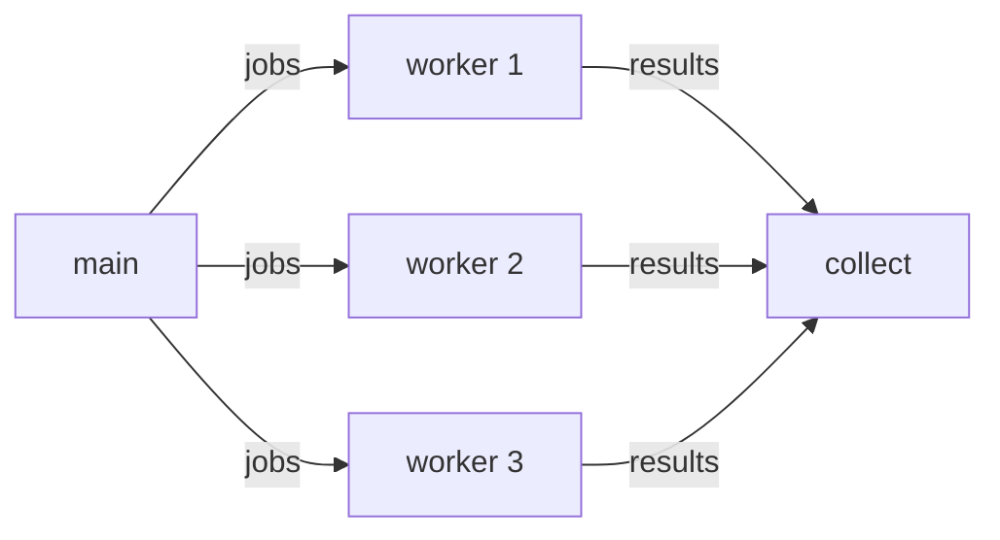

## The shape of the program

The whole program fits on one screen, because each step is a named chunk that
is explained further down. Chunks are spliced in *textually*, so they see
`ctx`, `jobs`, `results` and `wg` exactly as if they had been written here.

```go
// <<the worker>>

func main() {
	// <<set up a cancellable context>>

	n, m := 3, 10
	jobs := make(chan int, m)
	results := make(chan int, m)
	var wg sync.WaitGroup

	// <<spawn the workers>>
	// <<feed the jobs>>
	// <<close results once the workers are done>>
	// <<collect the results>>
}
```

## The worker

A worker drains `jobs` until the channel closes or the context is cancelled,
whichever comes first. Doubling stands in for real work.

<!-- chunk: the worker -->
```go
func worker(ctx context.Context, id int, jobs <-chan int, results chan<- int, wg *sync.WaitGroup) {
	defer wg.Done()
	for job := range jobs {
		select {
		case <-ctx.Done():
			return
		default:
			// NOTE: this line is dropped by the tangler-exclude directive.
			time.Sleep(20 * time.Millisecond)
			results <- job * 2
		}
	}
}
```

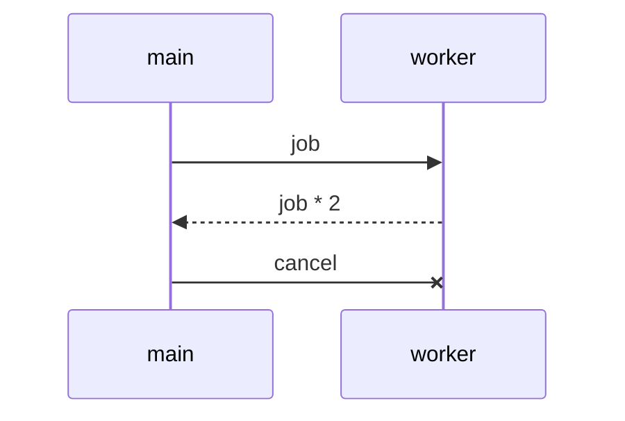

## Cancellation

The deadline is a tiny chunk of its own: an expression, interpolated inline.

<!-- chunk: set up a cancellable context -->
```go
ctx, cancel := context.WithCancel(context.Background())
defer cancel()
time.AfterFunc(/*<<the deadline>>*/, cancel)
```

Long enough for roughly half of the jobs.

<!-- chunk: the deadline -->
```go
50 * time.Millisecond
```

## Spawn, feed, collect

<!-- chunk: spawn the workers -->
```go
for i := 0; i < n; i++ {
	wg.Add(1)
	go worker(ctx, i, jobs, results, &wg)
}
```

The channel is buffered with room for all $m$ jobs, so feeding never blocks.

<!-- chunk: feed the jobs -->
```go
for i := 0; i < m; i++ {
	jobs <- i
}
close(jobs)
```

<!-- chunk: close results once the workers are done -->
```go
go func() {
	wg.Wait()
	close(results)
}()
```

Ranging over `results` ends when the channel closes, which happens after the
last worker returns — whether it ran out of jobs or was cancelled.

<!-- chunk: collect the results -->
```go
done := 0
for r := range results {
	fmt.Println(r)
	done++
}
fmt.Printf("%d of %d jobs finished\n", done, m)
```
````


# Publishing

The last two files aren't part of litgo. They are what GitHub does with it
after a push: one publishes this document as a web page, the other publishes
the binaries.

<!-- file: .github/workflows/pages.yml -->

This document is also the project's web page. Every push to `master` builds
litgo from the committed sources, weaves this file to HTML with the binary it
just built, and publishes the result to GitHub Pages. The tests run first, so a
push that breaks litgo doesn't replace a page that works. The HTML needs only
pandoc, because the browser runs mermaid.js and KaTeX for itself. pandoc is
pinned to a release, since what Ubuntu packages is years older and the page
should look the way it does when woven at home.

```yaml
name: pages

on:
  push:
    branches: [master]
  workflow_dispatch:

permissions:
  contents: read
  pages: write
  id-token: write

concurrency:
  group: pages
  cancel-in-progress: true

env:
  PANDOC: 3.10.2

jobs:
  build:
    runs-on: ubuntu-latest
    steps:
      - uses: actions/checkout@v4
      - uses: actions/setup-go@v5
        with:
          go-version-file: go.mod
      - name: Install pandoc
        run: |
          curl -fsSL -o pandoc.deb "https://github.com/jgm/pandoc/releases/download/$PANDOC/pandoc-$PANDOC-1-amd64.deb"
          sudo dpkg -i pandoc.deb
      - name: Build and test
        run: |
          go vet ./...
          go test ./...
          go build -o bin/litgo .
      - name: Weave
        run: |
          mkdir _site
          bin/litgo weave --to html -o _site/index.html litgo.lit.md
      - uses: actions/upload-pages-artifact@v3
        with:
          path: _site

  deploy:
    needs: build
    runs-on: ubuntu-latest
    environment:
      name: github-pages
      url: ${{ steps.deployment.outputs.page_url }}
    steps:
      - id: deployment
        uses: actions/deploy-pages@v4
```

<!-- file: .github/workflows/release.yml -->

Releases follow the `VERSION` constant in the command. Every push to `master`
reads it, and if no release is tagged `v` plus that version yet, the push
becomes that release. So publishing a version is changing one string, and a
push that leaves the string alone publishes nothing. litgo depends on nothing
but the standard library, which makes cross-compiling a matter of setting two
variables, and one Linux machine builds for all four targets. The tests run
first here too.

```yaml
name: release

on:
  push:
    branches: [master]
  workflow_dispatch:

permissions:
  contents: write

concurrency:
  group: release

jobs:
  release:
    runs-on: ubuntu-latest
    env:
      GH_TOKEN: ${{ github.token }}
    steps:
      - uses: actions/checkout@v4
      - name: Is this version released?
        id: version
        run: |
          version=$(sed -n 's/^const VERSION = "\(.*\)"$/\1/p' main.go)
          test -n "$version"
          echo "tag=v$version" >> "$GITHUB_OUTPUT"
          if gh release view "v$version" > /dev/null 2>&1; then
            echo "v$version is already released"
          else
            echo "new=true" >> "$GITHUB_OUTPUT"
          fi
      - uses: actions/setup-go@v5
        if: steps.version.outputs.new
        with:
          go-version-file: go.mod
      - name: Test
        if: steps.version.outputs.new
        run: |
          go vet ./...
          go test ./...
      - name: Build
        if: steps.version.outputs.new
        run: |
          tag=${{ steps.version.outputs.tag }}
          mkdir dist
          for target in linux/amd64 linux/arm64 darwin/amd64 darwin/arm64; do
            os=${target%/*} arch=${target#*/}
            dir=litgo_${tag#v}_${os}_${arch}
            mkdir "$dir"
            CGO_ENABLED=0 GOOS=$os GOARCH=$arch go build -trimpath -ldflags "-s -w" -o "$dir/litgo" .
            cp LICENSE README.md "$dir"
            tar -czf "dist/$dir.tar.gz" "$dir"
          done
          (cd dist && sha256sum *.tar.gz > checksums.txt)
      - name: Publish
        if: steps.version.outputs.new
        run: |
          gh release create ${{ steps.version.outputs.tag }} dist/* \
            --target "$GITHUB_SHA" --title ${{ steps.version.outputs.tag }} --generate-notes
```
